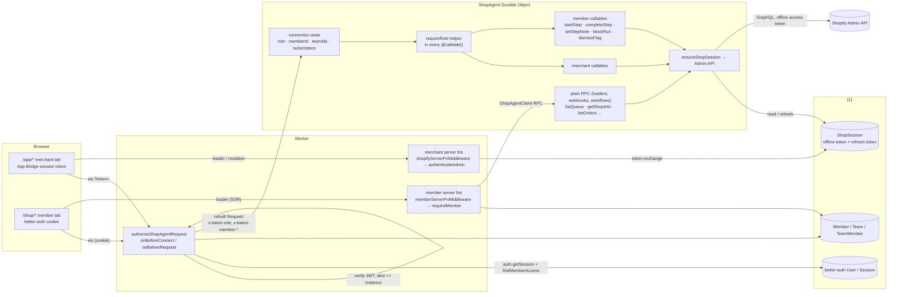

# Member access: how a signed-in member reaches the shop's object and the Admin API

Research date: 2026-09-12, revised 2026-09-14. Written for a fresh session to take up.
Scope: the trust boundary on the member side of Baton (`/login`, `/shop/*`): what a
member's request carries, what checks it, what it may call on the `ShopAgent` Durable
Object, how the Admin API gets called on a member's behalf, and the design of the
member WebSocket. Ends with an implementation plan another session can execute and
the questions still open. The member UI work in `docs/member-ux-research.md` is
parked on this.

Every claim below about the codebase is from the code as of this date; every claim
about Shopify is from `refs/shopify-docs/` and `refs/shopify-app-js/`, cited by path.
Where the refs were silent it says so.

## The short version

1. **Members already call the Admin API today, and it is already the offline token.**
   The member shop page (`src/routes/shop.$shop.index.tsx`) calls
   `ShopAgentClient.getShopInfo`, which runs `ShopAgent.getShopInfo`, which does
   `ensureShopSession(shop)` and a GraphQL `shop { name myshopifyDomain }` with the
   shop's stored offline session. No App Bridge, no merchant in the loop. That is the
   whole model, and it is the same one webhooks and the orders sync use. Any future
   member-triggered Admin call is done the same way, from the object.
2. **There are two tokens with two jobs, and the member side only ever sees one.** The
   App Bridge _session token_ (a 60-second JWT) proves "this request comes from this
   shop's admin, from this staff user, right now". The _offline access token_ (the row
   in D1 `ShopSession`) proves "this app is installed on this shop" and is what calls
   the Admin API. The session token is only ever exchanged for the access token; it is
   never itself sent to the Admin API by this app. Members have no session token and
   cannot get one. They do not need one: the access token is the shop's, not the
   user's.
3. **What members lack is a way onto the socket, and the object lacks any notion of
   who is on a connection.** The Durable Object's WebSocket is gated once, at connect,
   by verifying an App Bridge session token in the Worker (`authorizeShopAgentRequest`
   in `src/worker.ts`). After that, every `@callable()` trusts the connection
   completely. So the work is "give connections a role and make the object enforce
   it", then let members connect.
4. **Decision: members get the socket, callables included.** The Worker's
   `onBeforeConnect` verifies the better-auth cookie, resolves membership and teams,
   and forwards a rewritten request whose headers carry the member's identity. The
   object copies them into `connection.state` in `onConnect`; every callable checks
   the role and reads identity from the connection, never from the message. Member
   mutations (`startStep`, `completeStep`, `setStepNote`, `blockRun`, `dismissFlag`)
   become `@callable()` behind that check; loaders keep the plain-RPC path through
   `ShopAgentClient`. Nothing about Shopify tokens changes.

## Vocabulary

- **Merchant**: a Shopify staff user inside the embedded admin (`/app/*`). Authenticated
  by App Bridge session tokens.
- **Member**: a person with a Baton login and no Shopify account (`/shop/*`).
  Authenticated by a better-auth session cookie obtained through a magic link.
- **Operator**: Baton's own admin (`/admin/*`, `ADMIN_EMAILS`). Out of scope here.
- **Session token / id token**: the JWT App Bridge mints in the browser
  (`shopify.idToken()`); ~60 s lifetime, signed with the app's API secret, `dest` is the
  shop, `sub` is the staff user id. Sent as `Authorization: Bearer` on server-function
  requests and as `?token=` on the socket URL.
- **Access token**: what the Admin API accepts. Obtained by _token exchange_ from a
  session token. Online tokens are per staff user and short lived; offline tokens are
  per shop, and in this app they are the expiring kind with a refresh token.
- **ShopSession**: the D1 row per shop (`migrations/0001_init.sql`): `accessToken`,
  `accessTokenExpiresAt`, `refreshToken`, `refreshTokenExpiresAt`, scope, plan. One row,
  offline only. `Member` and `Team` FK to it.

## What the code does today

### Merchant side (`/app/*`), for contrast

- Document requests: `isShopifyAppDocumentRequest` (`src/worker.ts`) →
  `shopify.authenticateAdmin` (`src/lib/Shopify.ts`). It reads the session token
  (header or `id_token` param), verifies it, and if D1 has no stored offline session,
  or the stored access token is within 30 s of expiry
  (`EMBEDDED_SESSION_REEXCHANGE_BUFFER_MS`), performs a **token exchange** with
  `RequestedTokenType.OfflineAccessToken`, `expiring: true` (`exchangeAndStore`,
  `src/lib/Shopify.ts:1325`) and stores the result in `ShopSession` via
  `storeShopSession`. There is no scope comparison: `isActive` is called with
  `undefined` scopes, so a scope change alone does not force an exchange. The offline
  session is the only kind ever requested; the app never asks for an online token.
  Note the asymmetry with the background path below: a merchant visit **re-exchanges**
  a near-expiry token, it never refreshes it. That matches Shopify's guidance (acquire
  during an active merchant session, refresh only when none is active) and is the
  race `recoverRefreshRace` adjudicates when a merchant tab and a background caller
  renew the same shop at once.
- Server functions: `shopifyServerFnMiddleware` runs the same memoized
  `authenticateAdmin` per call, so it verifies the bearer session token and can
  exchange too. Admin calls made by the Worker for a merchant go through the same
  stored offline session.
- Socket: `src/routes/app.tsx` mounts `useAgent` with `query: () => shopify.idToken()`.
  The Worker's `routeAgentRequest` hooks (`onBeforeConnect`, `onBeforeRequest`) run
  `authorizeShopAgentRequest`: decode the token, check the URL's instance name equals
  the token's `dest` host, check the subscription, and let the request through. The
  object sees nothing about the user; `getCurrentAgent().connection` is used only to
  store subscription state (`connection.setState({ subscriberId, orderId })`).

### Member side (`/shop/*`)

- `/login` → `auth.signInMagicLink` (better-auth). The link is only issued if
  `repository.listMemberShops(email)` is non-empty (or the email is an operator). The
  better-auth `user.create.before` hook in `src/lib/Auth.ts` re-checks the same
  condition, so a `User` row cannot be created for a non-member by any other path.
- Every member server function uses `memberServerFnMiddleware` (validates the cookie,
  bounces admins) and then `requireMember({ shop, email })`, which returns
  `MemberAccess = { shop, memberId, teams }` from D1 or `notFound`.
- The handler then calls the object over plain RPC through `ShopAgentClient`
  (`env.SHOP_AGENT.getByName(shop)`), passing `teamIds`, `memberId`, `memberEmail` as
  arguments. The object's member methods (`listQueue`, `startStep`, `completeStep`,
  `setStepNote`, `blockRun`, `dismissFlag`) are deliberately **not** `@callable()`; the
  comment above `listQueue` in `src/lib/ShopAgent.ts` says why: "the member area has no
  socket, and `teamIds` / `memberId` are privileged inputs the Worker resolves from the
  session". The object trusts these arguments because only the Worker can make RPC
  calls.
- Admin API from a member path: `getShopInfo`, as above. It works because the object
  resolves the shop's offline session itself (`ensureShopSession`), refreshing it if
  the access token is within five minutes of expiry
  (`BACKGROUND_ACCESS_TOKEN_REFRESH_BUFFER_MS`) with the `refresh_token` grant
  (`refreshShopSession`, via `refreshShopSessionIfExpired`). If the refresh token
  itself has lapsed (about 90 days idle), the call fails with
  `RefreshTokenExpiredError`: proactively when the stored `refreshTokenExpiresAt` is
  within 60 s (`REFRESH_TOKEN_EXPIRY_BUFFER_MS`), reactively when Shopify answers
  `401 invalid_request` and `recoverRefreshRace` finds no concurrent winner in D1.
  Nothing on the member side can fix it: a merchant has to open the app so
  `authenticateAdmin` performs a new token exchange.

So the answer to "when the server calls the Admin API for a member, is it the offline
token?" is yes, and it is already the case, and it is the same path a webhook or the
orders sync takes. The member is a reason to make the call, not a party to it.

## The Shopify token model, grounded

See the "Shopify facts" section at the end for the refs-cited details. The conceptual
picture:

```
browser (embedded admin)                 Worker                         D1 ShopSession
  App Bridge mints session token  ───►  verify JWT (API secret)
  (60 s, per staff user, per shop)        │
                                          ├── have a valid offline session?  ──► read row
                                          │     yes: use it
                                          │     no / within 30 s of expiry: token exchange
                                          │            session token ──► Shopify ──► offline access token
                                          │                                          + refresh token
                                          └── store ───────────────────────────────► write row

anything else (webhook, sync, DO alarm, MEMBER request)
  no session token; only the shop name  ───►  ensureShopSession(shop) ──► read row
                                                 access token near expiry? refresh_token grant, rotate, write
                                                 refresh token lapsed?    fail; a merchant visit re-exchanges
```

Three consequences:

- A member can never trigger a token exchange. The exchange needs a session token,
  and only App Bridge inside the admin iframe can mint one. Members are therefore
  always downstream of some merchant visit having installed the app and filled the
  row. That is already guaranteed structurally: `Member.shop` FKs to `ShopSession`.
- A member can trigger a **refresh**. `ensureShopSession` runs from the object
  regardless of who caused the call, and refreshes rotate both tokens forward. A shop
  whose merchant never opens the admin but whose members work every day keeps its
  offline session alive through member activity. (The refresh race handling in
  `recoverRefreshRace` already covers a member call and a webhook refreshing at once.)
- A shop idle for ~90 days with no merchant visit loses its refresh token, and the
  next call that needs the Admin API fails until a merchant opens the app. Only
  `getShopInfo` on the member shop page touches Shopify today; the queue and step
  actions never do.

## Target architecture



Two properties to keep in view:

- **The Worker is the only party that knows who anyone is.** The object never sees a
  cookie or a session token; it sees a `Request` the Worker built. `routeAgentRequest`
  forwards whatever `Request` `onBeforeConnect` returns
  (`refs/partykit/packages/partyserver/src/index.ts`, ~line 390 for the types, ~550
  for the `instanceof Request` branch), so the gate must construct fresh `Headers`
  rather than copy the incoming ones. Browsers cannot set custom headers on a
  WebSocket upgrade, but non-browser clients can, so the rebuild is not optional.
- **Identity is a connect-time snapshot.** `connection.state` is persisted with the
  hibernatable socket (`serializeAttachment`,
  `refs/partykit/packages/partyserver/src/connection.ts`), so it survives the object
  hibernating; the existing subscription state already relies on that. It does not
  follow team edits, so those edits close the affected member connections
  (`revokeMemberConnections`, below) and the reconnect re-runs the gate. Cloudflare's
  ~300 s idle close is the backstop, as it is for the merchant subscription check.

### What the agents SDK gives and does not give

- `onConnect(connection, ctx)` receives `ctx.request`, so Worker-set headers are
  readable at connect. `getConnectionTags(connection, ctx)` returns tags persisted
  with the socket; `this.getConnections(tag)` filters by them (partyserver
  `index.ts` ~1122). Up to 9 tags per connection.
- RPC dispatch (`refs/agents/packages/agents/src/index.ts` ~2490) checks only
  `_isCallable(method)` and runs the method inside
  `runInInvocation({ agent, connection, request: undefined })`. So
  `getCurrentAgent().connection` is available in a callable, `request` is not, and
  there is **no per-callable authorization hook**: the check has to be the first
  line of each method. `setConnectionReadonly` gates only client `setState`
  messages, not RPC, so it does not help.
- `useAgent` takes `query` for the URL (`?token=` today) and connects same-origin, so
  the browser sends the better-auth cookie on the upgrade with no client change.

## Implementation plan

Written so a session with no other context can execute it. Steps are ordered so that
the tree typechecks and tests pass after each one. Run `pnpm typecheck`, `pnpm lint`,
`pnpm test`, and `pnpm fmt` after every step.

### Step 1: connection identity in the object

- `src/lib/Domain.ts`: add

  ```ts
  export const ConnectionRole = Schema.Literals(["merchant", "member"]);
  export const ConnectionState = Schema.Union([
    Schema.Struct({
      role: Schema.Literal("merchant"),
      subscription: SubscriptionState,
    }),
    Schema.Struct({
      role: Schema.Literal("member"),
      memberId: MemberId,
      memberEmail: Email,
      teamIds: Schema.Array(TeamId),
      subscription: SubscriptionState,
    }),
  ]);
  ```

  `Subscription` and `SubscriptionState` stay; `subscription` moves inside the
  connection state so the existing `subscribeOrders` / `subscribeOrder` /
  `unsubscribe` writes become `setState({ ...state, subscription })` instead of
  replacing the whole object.

- `src/lib/ShopAgent.ts`: override `onConnect(connection, ctx)`. Decode
  `x-baton-role`, `x-baton-member-id`, `x-baton-member-email`, `x-baton-team-ids`
  (comma-separated) from `ctx.request.headers` into `Domain.ConnectionState` and
  `connection.setState(...)`. A decode failure closes the connection with code 4403;
  it means the gate forwarded something malformed and must not be tolerated. Override
  `getConnectionTags` to return `["merchant"]` or `["member", `member:${memberId}`]`.
- Replace the private `subscription(connection)` decoder with
  `connectionState(connection): Option<Domain.ConnectionState>` and update the three
  `setState` sites and the `publish` fan-out to read `.subscription`.
- Test: `test/integration/shop-agent-connections.test.ts`. Open a socket against the
  object with headers set directly (the test bypasses the Worker gate) and assert
  `connection.state` and tags; assert a malformed header set closes with 4403.

### Step 2: the gate

- `src/worker.ts`, `authorizeShopAgentRequest`: keep the token branch as is, but on
  success return `rebuildRequest(request, { "x-baton-role": "merchant" })` instead
  of `request`. Add the cookie branch: when there is no `token` param and no bearer
  header, run `Auth.getSession(request.headers)`; none → 401; admin role → 403 (the
  operator is never a member, mirroring `memberServerFnMiddleware`); otherwise
  `requireMember({ shop: <instance name from the URL>, email })` (move `requireMember`
  from `src/lib/MemberServerFnMiddleware.ts` into a module both can import, or export
  it from there); `notFound` → 404 so a non-member cannot distinguish "no such shop"
  from "not yours", the same rule the middleware's JSDoc states; success →
  `rebuildRequest` with the four member headers.
- `rebuildRequest` constructs `new Request(url, { method, headers: new Headers({...only
baton headers, plus Upgrade / Connection / Sec-WebSocket-* copied from the original
}) })`. Never spread the incoming headers.
- The same branch applies to `onBeforeRequest` (HTTP to the object), even though
  nothing member-side uses it yet.
- Test: extend `test/integration/member-area.test.ts` (or a new
  `worker-agent-gate.test.ts`) with: token path forwards `role=merchant` and no
  member headers; cookie path for a member forwards all four; cookie for a non-member
  of that shop → 404; admin cookie → 403; a request that already carries
  `x-baton-role: merchant` and a valid member cookie comes out `role=member` (spoof
  stripped).

### Step 3: role gating on every existing callable

- `src/lib/ShopAgent.ts`: add two helpers next to `callableEffect`:

  ```ts
  const requireMerchant: Effect.Effect<void, ShopAgentForbiddenError>;
  const requireMemberConnection: Effect.Effect<
    MemberIdentity,
    ShopAgentForbiddenError
  >;
  ```

  Both read `getCurrentAgent<ShopAgent>().connection`, decode its state, and fail
  `ShopAgentForbiddenError` (a new `Schema.TaggedError`) when the role is wrong or the
  connection is absent (plain RPC callers have no connection and must not reach a
  callable). `callableEffect` gains a `role` parameter so the check cannot be
  forgotten: `callableEffect("ShopAgent.createWorkflow", Domain.CreateWorkflowInput,
{ role: "merchant" })`.

- Apply to every current `@callable()` (all are merchant-only today).
- Test: `test/integration/shop-agent-callables.test.ts` walks
  `Object.getOwnPropertyNames(ShopAgent.prototype)`, filters by the SDK's
  `callableMetadata` (exported as `isCallable` or via the decorator's WeakMap; if not
  reachable, keep an explicit `MERCHANT_CALLABLES` / `MEMBER_CALLABLES` list in the
  test and assert the union equals the set of decorated names), and for each invokes
  it over a member-role connection expecting `ShopAgentForbiddenError`. This test is
  what makes adding an ungated callable a failing build.

### Step 4: member callables

- `src/lib/Domain.ts`: the wire inputs lose their privileged fields:
  `StartStepInput` / `CompleteStepInput` → `{ runStepId }`, `SetStepNoteInput` →
  `{ runStepId, note }`, `BlockRunInput` → `{ runId, reason }`, `DismissFlagInput` →
  `{ runId }`. The current full-argument shapes become internal
  `StartStepCommand` etc. used by the repository layer.
- `src/lib/ShopAgent.ts`: decorate `startStep`, `completeStep`, `setStepNote`,
  `blockRun`, `dismissFlag` with `@callable()` and `{ role: "member" }`; build the
  command from the wire input plus `requireMemberConnection`'s identity. Rewrite the
  JSDoc above `listQueue`: `listQueue` stays plain RPC for the loader; the five
  mutations are now callables whose privileged inputs come from the connection.
- `src/lib/ShopAgentClient.ts`: remove the five mutation entries (the loader entries
  `listQueue` and `getShopInfo` stay).
- `src/routes/shop.$shop.queue.tsx`: delete the five server functions; the page calls
  `agent.stub.startStep({ runStepId })` etc. through `withSocketRecovery`, gated on
  `identified`, exactly as `app.teams.$teamId.tsx` does for `deleteTeam`.
- Test: `test/integration/member-area.test.ts` currently exercises the server
  functions; move those cases to the callable surface: a member on the right team
  can start and complete; a member on another team gets the existing scope error; a
  merchant connection calling `startStep` gets `ShopAgentForbiddenError`.

### Step 5: revocation on team and member edits

- `src/lib/ShopAgent.ts`: `revokeMemberConnections(memberIds)`, plain RPC. For each
  id, `getConnections(`member:${id}`)` and `close(4401, "membership changed")`.
- `src/lib/ShopAgentClient.ts`: expose it.
- Call it after the D1 write in `setTeamMemberFn` and `addTeamMembersFn`
  (`src/routes/app.teams.$teamId.tsx`), `deleteMemberFn` (`src/routes/app.members*.tsx`),
  and inside `deleteTeam` on the object for that team's members (the object needs the
  member ids: have the Worker pass them, since `Repository.deleteTeam` runs first and
  can return them).
- Client: on close code 4401 the member socket host reconnects immediately (the
  default reconnect does this) and the queue loader refetches; if the reconnect is
  refused with 404 the page navigates to `/shop`.
- Test: open a member connection, remove the member from the team, assert the socket
  closed with 4401.

### Step 6: the member socket host and push subscription

- Lift `ShopAgentSocketHost` and the provider wiring out of `src/routes/app.tsx`
  into `src/lib/ShopAgentSocketHost.tsx`, parameterised on `query` (merchant: the
  `idToken` query; member: `undefined`) and on `enabled`. Everything else in that
  component (identified flip, watchdog, keepalive, `cacheTtl`, `defaultCallTimeout`)
  applies unchanged; keep its JSDoc with the file.
- `src/routes/shop.$shop.tsx`: mount the provider and host for members, `enabled:
hydrated` as in `/app`.
- `src/lib/ShopAgent.ts`: a member-role `subscribeQueue` callable that sets
  `subscription = { subscriberId, orderId: null }` on the connection, and extend
  `publish` so a run-state change reaches member connections whose `teamIds`
  intersect the run's teams. Reuse the existing subscriber-id plumbing from the
  orders index (`subscribeOrders` in `src/routes/app.orders.index.tsx` ~line 299 is
  the client pattern).
- `src/routes/shop.$shop.queue.tsx`: subscribe on mount, refetch the loader on push.
- Test: two member connections on the same team; `completeStep` from one; the other
  receives the push. A member on a different team does not.

### Step 7: shop page cleanup

- Drop `getShopInfo` from `src/routes/shop.$shop.index.tsx` and render `shop`
  (decision 1). `ShopAgent.getShopInfo` and `ShopAgentClient.getShopInfo` then have
  no callers on the member side and can go.

## Decisions (2026-09-14)

1. **The member area shows the domain, not the display name.** `ShopSession.shop`,
   the primary key, the URL segment, and `Member.shop` are all the shop's
   `myshopify.com` domain (`acme-candles.myshopify.com`), which the session token's
   `dest` carries and Shopify guarantees unique. The Admin API's `shop { name }`
   (`Acme Candles`) is not stored anywhere in Baton and was the only reason the member
   index page called Shopify. Members see the domain, already in `MemberAccess.shop`,
   and `getShopInfo` leaves the member path (Step 7).
2. **Loaders stay on the Worker path.** The queue's first paint is SSR, so `listQueue`
   remains plain RPC through `ShopAgentClient`, and `requireMember` runs once per page
   load plus once per socket connect. Do not try to make a loader a callable; there is
   no socket during SSR.
3. **Callable timeout stays at 20 s** on the member socket host, the same as the
   merchant one. Revisit only if a bench sees false timeouts.
4. **Revocation is one RPC per team or member edit**, unbatched. These are merchant
   actions and rare, so cost is not a concern.
5. **The operator (`/admin`) gets no connection role.** The gate returns 403 for an
   admin cookie.

## Shopify facts, with sources

Paths are under `refs/`.

**Token kinds** (`shopify-docs/docs/apps/build/authentication-authorization/access-tokens.md`)

- Online: tied to the staff member; expires after 24 hours or when that user logs out
  of the admin. No refresh token; renewed only by another token exchange. Baton never
  requests one.
- Non-expiring offline: no expiry; new public apps cannot use them for the Admin API
  and existing ones are cut off on 2027-01-01
  (`…/migrate-to-expiring-offline-access-tokens.md`).
- Expiring offline, which is what Baton stores: access token lives 1 hour
  (`expires_in: 3600`), refresh token lives 90 days (`refresh_token_expires_in:
7776000`). Requested by `expiring=1` on the exchange.

**Refresh** (`shopify-docs/…/access-tokens.md`, "Token refresh" and "How refresh
token rotation works"; the request itself is
`shopify-app-js/packages/apps/shopify-api/lib/auth/oauth/refresh-token.ts`)

- `POST /admin/oauth/access_token` with `grant_type=refresh_token`, client id, client
  secret, and the refresh token. Every refresh returns a new pair (rotation). The
  presented refresh token stays usable until the newer one is used, a new token is
  obtained by exchange, 30 days after first use, or its own 90-day expiry. Shopify
  keeps one current expiring offline token per app and store. The docs say to use
  refresh when no merchant session is active and to re-exchange when one is, and not
  to do both at once for the same store because each retires the other's result
  (Baton's `recoverRefreshRace` exists for this).
- Expired, replaced, revoked, or unknown refresh token →
  `401 {"error":"invalid_request"}`, the same body for every terminal case
  (`…/implement-token-exchange.md`, "Refresh an expiring offline token"); the
  merchant must open the app so a new exchange can happen.

**Token exchange** (`shopify-docs/…/implement-token-exchange.md`,
`shopify-api/lib/auth/oauth/token-exchange.ts`,
`shopify-app-react-router/src/server/authenticate/admin/strategies/token-exchange.ts`)

- The browser sends the App Bridge ID token as `Authorization: Bearer`; the backend
  verifies it and POSTs `grant_type=urn:ietf:params:oauth:grant-type:token-exchange`
  with `subject_token=<id token>` and
  `requested_token_type=…:offline-access-token`, `expiring=1`.
- A stale ID token gets `400` from Shopify; the app answers `401` with
  `X-Shopify-Retry-Invalid-Session-Request` and App Bridge retries once with a fresh
  token.
- The resulting offline token is explicitly for use with no browser present:
  "background jobs, webhooks, and scheduled work". The tutorial's own background
  `/refresh` route authenticates its caller with a shared secret and passes `shop`
  directly. That is the shape Baton's member path already has, with the better-auth
  cookie in place of the shared secret.

**The ID token** (`shopify-docs/…/id-tokens.md`,
`docs/api/app-home/latest/apis/authentication-and-data/id-token-api.md`)

- An OpenID Connect ID token (the docs' new name for "session token"): HS256 JWT
  signed with the client secret; `aud` is the client id, `dest`/`iss` name the shop,
  `sub` is the staff user, `sid` a per-user-per-app session id. Expires one minute
  after issue; fetch per request, never cache.
- Only App Bridge mints one (`shopify.idToken()` in App Home, `auth.idToken()` in admin
  UI extensions). Standalone apps outside the admin cannot get one and use the
  authorization-code grant instead. Nothing Baton's member area could do produces an
  ID token, which is why the member socket cannot reuse the merchant gate.

**Requests that do not come from Shopify**
(`shopify-app-react-router/src/server/unauthenticated/admin/factory.ts`,
`src/server/helpers/ensure-valid-offline-session.ts`,
`src/server/helpers/ensure-offline-token-is-not-expired.ts`,
`src/server/types.ts` around line 401)

- `authenticate.admin` with no token on a document request redirects to the App
  Bridge bounce page; on an XHR it returns `401` with the retry header.
- `unauthenticated.admin(shop)` does no request authentication at all: it loads the
  stored offline session for the shop, refreshes it when within five minutes of expiry
  (`WITHIN_MILLISECONDS_OF_EXPIRY`), a refresh token exists, and the
  `expiringOfflineAccessTokens` future flag is on, and throws `SessionNotFoundError`
  if there is none. The
  library documents it as the way to serve "requests that do not originate from
  Shopify" after the app has authenticated the caller itself. Baton's
  `ensureShopSession` is the same function in Effect form.

**Apps with their own users.** Not found. No doc in the refs discusses a separate,
non-Shopify login for merchant-facing apps; the only sanctioned path for a request
Shopify did not originate is the one above. Rate limits (`shopify-docs/docs/api/usage/limits.md`)
are per app and store, leaky bucket by query cost; nothing is per end user, so member
traffic shares the shop's bucket with webhooks and the sync.
