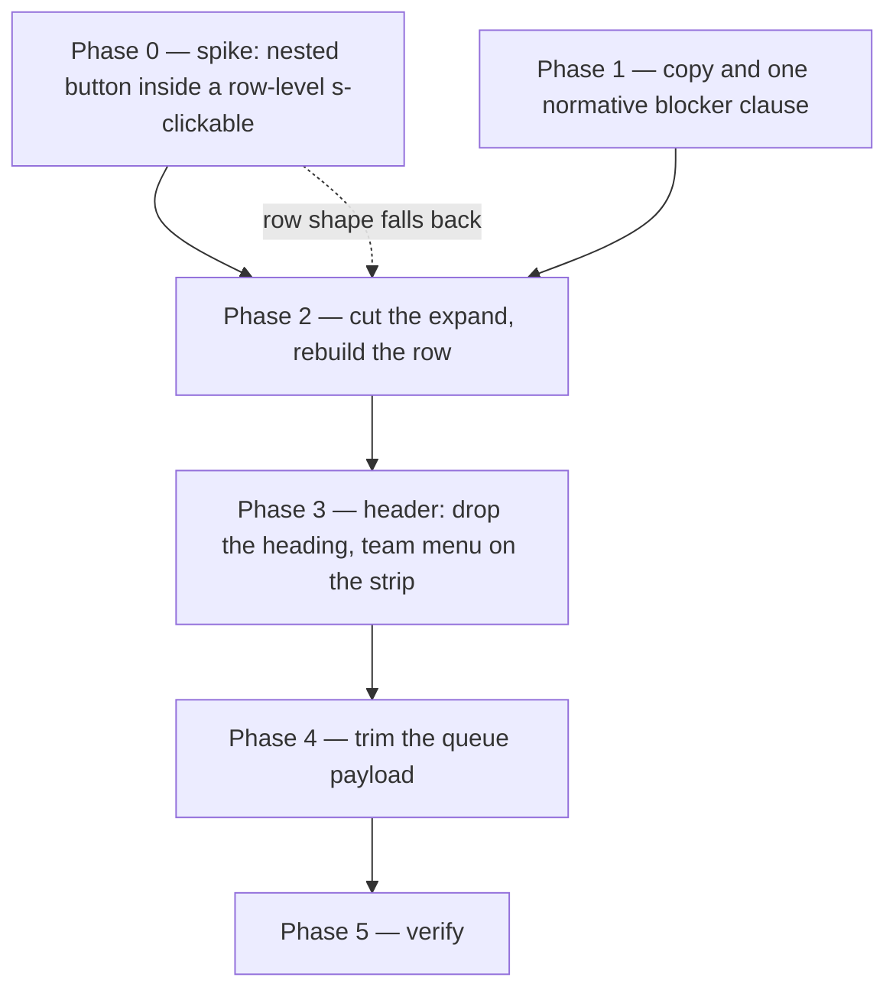

# Member queue redesign — implementation plan

Handoff plan for the decisions in `docs/member-queue-design-research.md` (D1–D10, A1–A7). That document holds the reasoning; this one holds the work. Read §1 and §2 of this plan before touching anything, then execute phases in order. Line numbers are as of 2026-09-21 and will drift as you edit — re-grep rather than trusting them.

Record everything unexpected in §10 **Deviations and issues**. That section is the point of the handoff: the next reader needs to know what the code turned out to be, not what this plan guessed.

## 1. Repo rules that govern this work

From `CLAUDE.md`, restated because every phase below trips one of them:

- **JSDoc carries reasoning inline, and never cites a path under `docs/`.** This plan is going to be deleted one day; a JSDoc that points at it goes stale. State the reason in the JSDoc itself. `refs/` paths are citable (they are pinned), with a file and a heading or symbol name, never a line number.
- **A rule that more than one site must agree on is stated once**, normatively, on the symbol that enforces it, and other sites `{@link}` it. §4.1 exists entirely because of this rule.
- **Status, flag and role predicates are `Domain` functions**, never inline comparisons in a route. `scripts/rules-lint.ts` (run by `pnpm lint`) refuses them.
- **Each rule has a test whose title is the rule.** Test titles are given per phase below; use them verbatim.
- **Run `pnpm typecheck` and `pnpm lint` after generating code.** Run `pnpm fmt` repo-wide and **keep every file it touches**, including files this work never went near.
- **Do not commit unless explicitly instructed.** Work on `main`; do not create branches.
- **Do not edit** `src/routeTree.gen.ts` or `worker-configuration.d.ts`.

Environment:

- Dev server: `pnpm app:dev`. The port is `pnpm port`; use it via substitution, e.g. `http://localhost:$(pnpm port)`.
- Seed data: `pnpm seed` (posts `e2e/fixture.ts` to `/api/dev/seed`). `lead@m.com` is on **every** team — the persona for the team-menu work; `m1@m.com` is on two; `m2@m.com` on one (so the team control is hidden for them, which is its own case to check).
- Member sign-in is a magic link: `/login`, enter the email, then the "Open your magic link" link on the confirmation screen (demo mode). `e2e/member.ts` does exactly this.
- Tests: `pnpm test` (Vitest), `npm run test:e2e --` (headless, all three projects), `npm run test:e2e:headed --` when you need to watch.
- **Chrome MCP is available and is the right tool for Phase 0** and for any "does this actually behave that way" question. `pnpm playwright-cli --session="$(pnpm port)-localdev" …` is the alternative. Either way, default to headless unless you need to sign in by hand.
- Member pages are **not** embedded in the Shopify admin: `/shop/*` is a plain document, no App Bridge, no iframe. You can point a browser straight at it.

## 2. What changes, in one picture



Phase 1 is independent of Phase 0 and can run first or in parallel. Phase 2 cannot start until Phase 0 has an answer, because the answer decides how the row is built. Phase 4 is last because it deletes fields the earlier phases must not still be rendering.

Files touched, by phase:

| File                                               | P1  | P2  | P3  | P4  |
| -------------------------------------------------- | --- | --- | --- | --- |
| `src/lib/Domain.ts`                                | ✓   |     |     | ✓   |
| `src/lib/queueTiers.ts`                            | ✓   |     |     |     |
| `src/routes/shop.$shop.index.tsx`                  | ✓   | ✓   | ✓   | ✓   |
| `src/routes/shop.$shop.work.$runId.tsx`            | ✓   |     |     |     |
| `src/routes/app.orders.$orderId.tsx`               | ✓   |     |     |     |
| `src/styles.css`                                   |     | ✓   | ✓   |     |
| `src/lib/WorkflowRunRepository.ts`                 |     |     |     | ✓   |
| `e2e/member-queue.member.spec.ts`                  | ✓   | ✓   | ✓   |     |
| `e2e/orders.spec.ts`                               | ✓   |     |     |     |
| `test/integration/workflow-run-repository.test.ts` | ✓   |     |     | ✓   |
| `test/integration/domain.test.ts`                  | ✓   |     |     | ✓   |

## 3. Phase 0 — spike: can the row be one `s-clickable` with a button inside it?

**Why this is first.** The decision (D3 + A1) is a row that is entirely a link to the work page _and_ carries one action button. The current JSDoc at `shop.$shop.index.tsx:323-331` asserts that is impossible ("a button inside a button is neither valid nor operable"), which is why the row is split into three targets today. Shopify's own documented pattern contradicts it: `refs/shopify-docs/docs/api/app-home/latest/patterns/compositions/resource-list.md` renders one `s-clickable` per row wrapping an `s-grid` with a trailing `s-button` inside it, and `s-clickable` takes `href` (`refs/shopify-docs/docs/api/admin-extensions/latest/web-components/actions/clickable.md`). One of the two is wrong about this codebase's Polaris version, and a spike is cheaper than finding out during Phase 2.

**Do this.** Build a throwaway page or edit one row in place behind a local-only condition — do not commit the scaffold — with this shape:

```tsx
<s-clickable href={href} onClick={interceptIntoRouterNavigate}>
  <s-grid gridTemplateColumns="1fr auto" gap="small-300" alignItems="center">
    <s-stack>…row text…</s-stack>
    <s-button variant="primary" onClick={…}>Done</s-button>
  </s-grid>
</s-clickable>
```

Answer all four questions and write each answer into §10:

1. Does a click on the inner `s-button` fire **only** the button's handler, or does the clickable's `href`/handler fire too?
2. If both fire, does `event.stopPropagation()` in the button's handler stop it? (The click may be re-dispatched from inside the clickable's shadow root, in which case it will not.)
3. Keyboard: is the tab order row → button, and does Enter on the row navigate without pressing the button?
4. Screen-reader shape: does the row announce as a link with a button inside, or as one control?

**Fallback ladder**, in order — take the first that works:

1. `s-clickable href` wrapping the grid, button inside, `stopPropagation` on the button.
2. `s-clickable href` wrapping only the text columns (grid stays outside it), button as a sibling grid cell. The row is then "mostly" a link — everything except the button's own cell — which still fixes F1 and F2, since the dead zone is the button's own area.
3. Today's grid with the `Link` widened to span the text columns and the `s-clickable` deleted. Weakest, but still one target per result.

Whichever rung you land on, **rewrite the JSDoc at `:323-331`** to say what you found, with the `refs/` citation if it supports you. Do not leave the old claim standing.

## 4. Phase 1 — copy, and one normative blocker clause

### 4.1 `Domain.undoBlockerLine` (D5, D6, F5, F11)

Today the same sentence is built in three places with two endings:

- `src/routes/shop.$shop.index.tsx:569` — `` `${teamName} started ${stepName} · ask them` ``
- `src/routes/shop.$shop.work.$runId.tsx:318` — the same string
- `src/routes/app.orders.$orderId.tsx:1115` — `` `${teamName} started ${stepName} · reopen it first` ``

Add to `src/lib/Domain.ts`, next to `UndoBlocker` and `undoBlockedBy` (around `:3156-3190`), one function that names the blocker and nothing else:

```ts
/**
 * How every screen names the step that stands between a finished step and
 * Undo. The step comes first and the team is parenthetical because the other
 * order — "Finishing started Fit movement" — reads as a sentence whose subject
 * is a verb, and a reader who does not already know the team names cannot
 * parse it. The caller supplies the verb ("Can't undo", "Can't reopen"),
 * because a member and a merchant do different things about it; the clause
 * itself is one sentence so the three screens cannot drift.
 *
 * See {@link undoBlockedBy} for what qualifies as a blocker.
 */
export const undoBlockerLine = (blocker: UndoBlocker) =>
  `${blocker.stepName} (${blocker.teamName}) already started`;
```

Call sites:

| Site                                    | New text                                                                   |
| --------------------------------------- | -------------------------------------------------------------------------- |
| `shop.$shop.index.tsx` Done-tier row    | `` `Can't undo: ${Domain.undoBlockerLine(blocker)}` ``                     |
| `shop.$shop.work.$runId.tsx` step row   | `` `Can't undo: ${Domain.undoBlockerLine(blocker)}` ``                     |
| `app.orders.$orderId.tsx` merchant step | `` `Can't reopen: ${Domain.undoBlockerLine(blocker)} — reopen it first` `` |

On the two member screens the clause moves **out of the action column**: keep a `disabled` `Undo` button where the enabled one would be, and put the clause on the row's second line (queue) or under the step's state line (work page). The merchant page already renders its clause as text beside the step; leave that placement alone.

Rule test, in `test/integration/domain.test.ts`, title verbatim:

> `the undo blocker is named the same way on every screen`

Assert `undoBlockerLine` against a fixture blocker, and that it contains no verb — the three verbs are the callers'.

### 4.2 Tab words (D10, A4)

In `src/lib/queueTiers.ts`:

- `TAB_LABEL.inProgress`: `"In progress"` → `"Teammates"`. The `QueueTier`/`QueueTab` key stays `inProgress`; only the label moves.
- `TAB_EMPTY.inProgress.text`: `"Nobody on your teams has work in progress."` → `"Nobody else on your teams has work in hand."`
- Extend the `TAB_LABEL` JSDoc (it currently explains only why `attention` reads "Blocked") with why `inProgress` reads "Teammates": "In progress" is already a row state on the member's own rows (`In progress · you`) and an item badge (`ITEM_STATUS.active` in `MemberRun.tsx`), so as a tab word it would name the wrong thing twice.
- `TAB_LABEL.done` stays `"Done today"`. The window is `Domain.DONE_WINDOW_MS` (24h), not a calendar day; the empty state already says "in the last day" and that is where the precision belongs.

Test updates:

| Site                                                    | Change                                                              |
| ------------------------------------------------------- | ------------------------------------------------------------------- |
| `e2e/member-queue.member.spec.ts:66` `IN_PROGRESS`      | constant value → `"Teammates"`                                      |
| `e2e/member-queue.member.spec.ts:461` test title        | "…and In progress for a teammate" → "…and Teammates for a teammate" |
| `e2e/member-queue.member.spec.ts:455` JSDoc             | retitle with it                                                     |
| `test/integration/workflow-run-repository.test.ts:1692` | title says "a teammate's is In progress" → the new word             |
| `e2e/member-queue.member.spec.ts:674`                   | expects the old `ask them` string → the new clause                  |
| `e2e/orders.spec.ts:292` JSDoc + assertions             | the merchant's `reopen it first` string → the new clause            |

**Do not** rename `STARTED = "In progress since"` (`spec.ts:47`) or `ITEM_STATUS.active` (`MemberRun.tsx:117`). Those are the _state_, which keeps its words; only the tab changes.

## 5. Phase 2 — cut the expand, rebuild the row

All in `src/routes/shop.$shop.index.tsx` unless noted.

### 5.1 Delete

| Delete                                                                                 | Roughly at                 |
| -------------------------------------------------------------------------------------- | -------------------------- |
| `const [open, setOpen]` and its JSDoc                                                  | `:130-139`                 |
| `shownIds` memo, `prunedFor` state, the adjust-during-render block and its comment     | `:176-194`                 |
| `toggle`                                                                               | `:196-203`                 |
| `setOpen(new Set())` in `selectTab` and `selectTeam`                                   | `:212`, `:220`             |
| `renderStep` in full, and its two JSDoc blocks (`flagged` / `offered`)                 | `:230-320`                 |
| the `expanded` const, the `s-clickable` wrapper, and the whole `{expanded && …}` block | `:333`, `:455`, `:481-523` |
| the two `setOpen((current) => new Set(current).add(run.id))` calls after Start         | `:352`, `:420`             |
| now-unused imports: `RunItem`, `FlagBanner`, `Prose`                                   | `:11-17`                   |

Keep `flagBody`, `flagHeading`, `flagTone`, `liftFlagLabel` — the row still uses all four. Keep `LocalDateTime`: the Done-tier row still renders `completedAt`.

### 5.2 Rebuild `renderItem`

Target shape (phone width; the box is the link, the button is the one thing that is not):

```
┌────────────────────────────────────────────────┐
│ #1002  Stitch spine              [   Done    ] │
│ Leather journal · In progress · you            │
└────────────────────────────────────────────────┘
```

- **Line 1**: `#1002` (subdued, no longer a separate blue link — the row is the link), the step name (`type="strong"`), `+N` when `rest.length > 0`, and the flag badge when flagged.
- **Line 2**: the item title, then `·`, then today's `detailLine()` result unchanged. Moving the item title here settles F9 — the run-together `Stitch spineLeather journal`.
- **Action column**: exactly as today (`action()` — Unblock/Dismiss when flagged, the Actions menu when several steps are ready, else Start or Done). Do not change which button appears; that rule is `Domain.stepActions` and its tier logic, and this phase is not touching it.
- **Remove** the `<LocalDateTime value={run.orderProcessedAt} format="relative" />` cell entirely (D4, A3, F6). Nothing replaces it.
- **Remove** the `background={!flagged && tab === "mine" ? "subdued" : "base"}` tint (D7, F10). Keep the flag's inline-start rule and its `borderColor`; that mark still means something. Replace the tint's comment with one sentence saying why only the flag mark survived: on the Mine tab every row qualified, so the tint separated nothing.
- Row separators (`borderWidth` with `first`) stay as they are.

The `href` comes from the router, the way `QueueBreadcrumb` builds one in `shop.$shop.work.$runId.tsx:135-152`: `router.buildLocation({ to: "/shop/$shop/work/$runId", params: { shop, runId: run.id } }).href`, with the click intercepted into `router.navigate`. The real `href` is what keeps middle-click and open-in-new-tab working — the current expand toggle has neither, and losing them would be a regression, not a simplification.

Apply the Phase 0 rung. If rung 1 or 2, add `accessibilityLabel` naming the destination (`Open ${run.orderName}`), and **delete** the old `Expand ${orderName}` / `aria-expanded` attributes.

### 5.3 Done-tier row (`renderDone`)

- Line 2 becomes: item title `·` actor `·` time, then, when `entry.undoBlockedBy !== null`, `· Can't undo: …` from Phase 1.
- The action column always renders `Undo`; it is `disabled` when `doneUndo(entry)?.blockedBy !== null`. The clause that used to sit in that column is now on line 2.
- Keep reading the verdict through `Domain.stepActions` (`:519-525`). Do not reimplement it.

### 5.4 CSS

`.queue-detail-line` (`src/styles.css:194-206`) clamps line 2 to two lines and its comment says the expanded row shows the whole thing in its banner. That is no longer true: the whole reason is now the work page. Keep the clamp, fix the comment to say so.

### 5.5 Tests

- Delete `expandRow` (`e2e/member-queue.member.spec.ts:274`) and its three callers at `:343`, `:402`, `:658`. Each of those tests either acts from the row's own button or navigates to the work page — read each one and pick whichever keeps the test's stated subject intact. Their JSDoc headers describe the subject; do not change what a test proves, only how it reaches it.
- New E2E, title verbatim: > `a queue row opens the work page and its action button does not`

  Click the row body → assert `/shop/$shop/work/$runId`. Go back, click the action button → assert the write happened and the URL did not change. This is the regression test for whatever Phase 0 found.

- New E2E, title verbatim: > `a blocked undo names the step that stands in the way instead of offering a button`

## 6. Phase 3 — the header

### 6.1 Drop the page heading (D1, F8)

`<s-page heading="Queue" inlineSize="small">` (`:700`) → `<s-page inlineSize="small">`. Keep `head: () => ({ meta: [{ title: "Queue — Baton" }] })` (`:698`) — that is the browser tab, and it is the one place the word does work. Keep `s-section accessibilityLabel="Queue"`, which is what names the landmark now.

Check the result in a browser: if `s-page` without a heading collapses its top spacing oddly or leaves the sticky strip flush against the member bar, fix it in `.queue-strip` (a little `padding-block-start`) rather than by putting the heading back. Record what you saw in §10.

### 6.2 Team select → menu button (D2, F7)

Replace `teamSelect` (`:605-630`) with a button-plus-menu, following the pattern the row's own Actions menu already uses (`:358-393`): an `s-button` with `commandFor={menuId}` and an `s-menu id={menuId}` whose children are `s-button`s.

- Button label: the selected team's name, or `All teams` when `team === null`. **No count on the button** — it would be `counts.total` over every team while the tab counts beside it are team-narrowed, so the two numbers would count different things.
- Menu options keep their counts: `All teams · ${total}` and `${name} · ${teamCount(id)}`, which is what the select shows today. Keep the existing JSDoc's point that these counts are over every team whatever is selected, so the option just chosen does not renumber itself.
- Still rendered only when `teams.length > 1`, exactly as now.
- `accessibilityLabel` on the menu: `Team`.

Then put it **inside** the strip's scroller rather than above it: one `s-stack direction="inline"` holding the team button and the five tab buttons, all inside `.queue-strip-tabs`. The two-row `s-stack` at `:713-718` collapses to one row.

CSS in `src/styles.css`, beside `.queue-strip-tabs` (`:189-192`):

```css
/*
 * The team button leads the strip and stays put while the tabs scroll past it:
 * five tabs plus a team name are wider than a phone, and a filter that scrolls
 * out of sight is one a member cannot tell is on. Sticky inside the scroller,
 * not the viewport, so it pins to the strip's own start edge.
 */
.queue-team-pin {
  position: sticky;
  inset-inline-start: 0;
  z-index: 1;
  background: var(--s-color-bg-surface, #fff);
}
```

A background is required or the tabs will scroll visibly underneath it.

Check all three personas: `lead@m.com` (every team — the crowded case), `m1@m.com` (two teams), `m2@m.com` (one team, so no button at all and the strip must not shift).

New E2E, title verbatim:

> `the team menu stays at the start of the strip while the tabs scroll`

If asserting sticky position in Playwright proves brittle, assert the DOM contract instead (the button is the first child of the scroller and carries the class) and say so in §10.

## 7. Phase 4 — trim the queue payload (D8, F12, F13)

Do this only after Phases 2 and 3 are green: it deletes fields, and a still-rendering site will fail the typecheck in a way that is confusing if the UI work is half done.

`listQueue` ships every field whether or not anything renders it (`Domain.QueueItem`, `Domain.ts:3026`). After Phase 2 most of them render nowhere.

### 7.1 `QueueStep`

In `src/lib/Domain.ts:2992-3001`, extend the existing `Struct.omit` — which already drops the four `completed*` fields and explains why — to also drop `instructions`, `note`, `noteByRole`, `reopenedAt`, `reopenedByRole`, `reopenedByEmail`. **Delete `siblings` outright**: it is computed in `WorkflowRunRepository.ts:842`, asserted in `test/integration/workflow-run-repository.test.ts:1890-1900`, and rendered by nothing — it was dead before this plan (F12).

Keep: `id`, `runId`, `position`, `stage`, `name`, `teamId`, `teamName`, `startedAt`, `startedBy`, `startedByEmail`, `startedByRole`. `startedByEmail` in particular is load-bearing — `Domain.tierOf` decides "Mine" with it.

Update the JSDoc to say what the queue row needs and why the rest belongs to the work page only. Do not reference this plan.

### 7.2 `QueueRun`

The row needs: `id`, `orderName`, `orderProcessedAt` (still the sort key even though it is no longer displayed — `Domain.byAge`), `lineItemId` (also `byAge`), `lineItemTitle`, `status`, `flag`, `flagAt`, `flagDetail`. It does not need `workflowId`, `workflowName`, `orderId`, `variantTitle`, `sku`, `quantity`, `customAttributes`, `source`, `createdAt`, `updatedAt`, `cancelledAt`.

`customAttributes` is the one worth the trouble: it is a JSON blob on every run.

Add `QueueRun` beside `QueueStep` as a `Struct.omit` over `WorkflowRun.fields`, point `QueueItem.run` at it, and drop `QueueItem.note` (the order note, work-page-only). Check every consumer of `QueueItem` before you do — `Domain.tierOf`, `Domain.byAge`, `Domain.runIsFlagged`, `Domain.stepActions` — and confirm each one's `Pick`/parameter type still accepts the trimmed shape. `stepActions` takes `{ status, flag }` structurally, so it should; verify rather than assume.

**Leave `DoneItem` alone** in this pass. It carries a full `WorkflowRun` and a full `WorkflowRunStep`, and the Done row genuinely reads more of them. If you want it trimmed, that is a separate change with its own reasoning; note the idea in §10 rather than doing it here.

### 7.3 Repository

`src/lib/WorkflowRunRepository.ts`:

- `queueItems` (`:794-857`): extend the `Struct.omit`, delete the `siblings` map, drop `note` from the returned item. The JSDoc at `:785-794` and the `listQueue` JSDoc at `:1628-1639` both describe siblings as a feature — rewrite both; the "so siblings owned by other teams are in hand" clause in the SQL comment is still true of the _query_ (it reads every ready step of the run to decide the team filter) but no longer describes anything shipped.
- The `select r.*, o.note` statement can drop the `ShopOrder` join if nothing else in the row needs the note. Check `stageCount` is unaffected.
- `test/integration/workflow-run-repository.test.ts:1877-1900`: the test titled "listQueue returns every ready step per run with stageCount and cross-team siblings" loses its siblings half. Retitle it to what it still proves.

### 7.4 Measure

Record in §10: the SSR HTML size of `/shop/$shop` (Mine tab, seeded shop) before Phase 2 and after Phase 4. The 100 KB target named in the JSDoc at `:130-139` is the figure to hold to — and that JSDoc has to be corrected regardless, because it attributes the cost to shipped bytes when collapsing only ever saved rendered HTML (F13).

## 8. Phase 5 — verification

In order:

1. `pnpm typecheck`
2. `pnpm lint`
3. `pnpm fmt` — keep every file it touches.
4. `pnpm test`
5. `npm run test:e2e --` (embedded, admin and member projects)
6. Manual pass with Chrome MCP or `pnpm playwright-cli`, signed in as `lead@m.com` and again as `m2@m.com`:
   - every tab paints, including an empty one and its "Go to" button;
   - a row opens the work page; the action button does not navigate;
   - the strip and team menu behave at phone width (375 px) and tablet width;
   - a blocked row shows its badge and reason and its Unblock button;
   - Done today shows Undo, and a blocked undo shows the disabled button with the clause.
7. `pnpm graphql-codegen` is **not** needed: no `#graphql` template literal changes in any phase.

## 9. Acceptance

- The queue row has one link target and one button; nothing expands.
- No `s-page` heading on `/shop/$shop`; one sticky row holds the team menu and the five tabs.
- No relative time on a tier row; no Mine-tab tint.
- The `inProgress` tab reads `Teammates`; the tier key is unchanged.
- `Domain.undoBlockerLine` is the only place the blocker sentence is built, and all three screens call it.
- `QueueStep.siblings` is gone from the schema, the repository and the tests.
- `pnpm typecheck`, `pnpm lint`, `pnpm test` and the E2E suite pass; the repo is `pnpm fmt`-clean.

## 10. Deviations and issues

Record here as you go. Anything that contradicts this plan or the research doc, anything the code turned out to be, and any decision you had to make yourself. Append; do not rewrite earlier entries.

Format:

```
### <phase> — <one line>
**Expected:** what this plan said.
**Found:** what the code or the browser actually did.
**Did:** the call you made, and why.
**Follow-up:** what is now owed, or "none".
```

Entries required whether or not anything went wrong:

- **Phase 0 spike result** — the four answers from §3, the rung of the fallback ladder taken, and whether the `refs/` pattern held for this Polaris version.
- **Phase 3 heading removal** — what `s-page` without a heading looks like, and any spacing fix.
- **Phase 4 measurement** — SSR HTML size before and after.

### (entries start here)

### Phase 0 — a button inside a row-level `s-clickable` works, on rung 1, with `preventDefault` **and** `stopPropagation`

**Expected:** a spike answering four questions, with `stopPropagation` as the fallback if both handlers fire.
**Found:** run against the CDN `polaris.js` in a throwaway page. `s-clickable` renders `<a role="link" aria-label="…" href="…"><slot></slot></a>` in its shadow root, so the row's content — button included — is slotted inside the anchor.

1. **Both fire.** A click on the inner `s-button` runs the button's handler and then the clickable's, and the anchor navigates.
2. **`stopPropagation` alone does not stop it.** It silences the ancestor's _listeners_; the anchor's default activation still runs and the page navigates. `preventDefault` is what cancels the navigation. A button inside a row therefore needs **both**: `preventDefault` for the anchor, `stopPropagation` for the row's own `onClick`.
3. **Keyboard is the same shape.** Tab order is row → button. Enter on the row navigates. Enter on the button fires the button's handler, and the two calls cover it exactly as a mouse click.
4. **Screen readers announce a link with a button inside it** — the accessibility tree is `link "Open #1002"` containing `button "Done"`, which is the shape wanted.

**Did:** took **rung 1**. The `refs/` pattern held for this Polaris version; the JSDoc that claimed the row could not be one `s-clickable` is gone with the expand, and `insideRow` in `shop.$shop.index.tsx` carries the reasoning now.
**Follow-up:** none.

### Phase 0 — `s-menu` is the one thing the two calls cannot cover

**Expected:** the ladder's rung 1 covers every control on the row.
**Found:** with the row's Actions `s-menu` rendered **inside** the clickable, clicking a menu item reached the row's handler even with `preventDefault` and `stopPropagation` on the item — the menu puts the activation on the row by a route an item's own handler cannot stop. Moving the `s-menu` to be a **sibling** of the `s-clickable` fixes it outright, and the menu items then need no defensive handlers at all. `commandFor` is by id, so the trigger button stays in the row.
**Did:** the row is `s-box > (s-clickable, s-menu)`. Stated on `insideRow`.
**Follow-up:** none.

### Phase 2 — the Done-tier row became a link too

**Expected:** §5.3 lists only line two and the action column for `renderDone`.
**Found:** leaving `renderDone`'s small blue order link in place would have put two row shapes in one list, and the acceptance criterion ("the queue row has one link target and one button") reads as being about rows, not about one tier.
**Did:** `renderDone` got the same `s-clickable` treatment as `renderItem`, with `Undo` as its one button.
**Follow-up:** none.

### Phase 2 — the flag's mark was on the wrong edge, and now is not

**Expected:** "Keep the flag's inline-start rule" (§5.2).
**Found:** it was not an inline-start rule. `borderWidth` takes block-start, inline-end, block-end, inline-start, and `large-100` sat in the **third** slot, so a flagged row rendered a thick rule _under_ itself — reading as a heavy separator belonging to the next row. Confirmed in the browser (`border-width: 0 0 0.125rem 0`).
**Did:** moved it to the fourth slot. A flagged row now has a rule down its leading edge, which is what every comment about it has always said. The slot order is written on the prop.
**Follow-up:** none.

### Phase 2 — line one's gap, and the Done row's blocker clause

**Expected:** line one keeps today's `gap="small-500"`; line two carries the clause after the actor and time (§5.3).
**Found:** `small-500` is 2 px. With the order number moved onto line one it read as `#1001Cut and sand`. And the Done row's line two is clamped to two lines (`.queue-detail-line`), which on a phone cut the clause to `Can't undo: Fit moveme…` — the refusal without the reason, which is the whole of D5.
**Did:** line one is `gap="small-300"` (6 px, the strip's own gap). The blocker clause is its own line under the clamped one, so it wraps instead of truncating — the shape the research doc's own Done-tier mock-up draws.
**Follow-up:** none.

### Phase 2 — the second new E2E title contradicts D5, so the existing test took the rule instead

**Expected:** a new test titled `a blocked undo names the step that stands in the way instead of offering a button`.
**Found:** the design **does** offer a button — a disabled one (D5, §4.1) — so that title would be a false statement sitting in the suite, and the existing `undo is refused once downstream started` already drives exactly this path with two browsers.
**Did:** retitled that test to the rule it now proves: `a blocked undo names the step that stands in the way and keeps a disabled button`. It asserts the clause and that Undo is present and disabled. No duplicate test added.
**Follow-up:** none.

### Phase 2 — the E2E suite's row locators all moved

**Expected:** delete `expandRow` and its three callers (§5.5).
**Found:** more than that changed, because the order number is no longer a link. `getByRole("link", { name: "#9401" })` — used by the `card()` filter, by `ORDER_LINK`'s row count, and by four navigations to the work page — now matches nothing; the row announces its `accessibilityLabel`.
**Did:** added a `rowLink(page, orderName)` helper on `Open ${orderName}`, pointed `card()` and every navigation at it, and changed `ORDER_LINK` to `/^Open #94\d\d$/u`. `awaitDisabled` was added to `e2e/member.ts` beside `awaitEnabled`, because Playwright's own enabled check cannot see an `s-button`'s `disabled`.
**Follow-up:** none.

### Phase 3 — `s-page` without a heading needs no spacing fix

**Expected:** check whether the top spacing collapses oddly, and if so pad `.queue-strip` (§6.1).
**Found:** it does not. `s-page` keeps its own block padding, so the strip sits about 34 px under the member bar — a normal gap, not a collapse and not a control flush against the bar. Checked at 375 px and at desktop width.
**Did:** nothing. `.queue-strip` is unchanged.
**Follow-up:** none.

### Phase 3 — the strip never scrolled, and the team filter does not belong on it

**Expected:** put the team button inside `.queue-strip-tabs` and pin it sticky at the scroller's start edge (§6.2, D2).
**Found:** two things, one after the other.

First, `.queue-strip-tabs` has `overflow-x: auto`, but its child was `s-stack direction="inline"`, which **wraps by contract** (the Polaris prop documents it) and whose flex container is inside its shadow root, so no outside rule can stop it. Five tabs fitted at `inlineSize="small"`, so nobody had seen it; adding the team button pushed `Done today` onto a second row, and a row that wraps inside a horizontal scroller never scrolls — it grows taller.

Then, with the row made to scroll properly, the arrangement was rejected on sight and the reason is the one the plan did not weigh: **a team name is merchant-typed and unbounded.** On the strip it makes the strip's width a function of how long somebody called a team — one long name and the tabs are pushed off the end of a scroller on a screen that had room for all five. The scrollbar under the row made it worse: a permanent grey track is the loudest thing on a screen whose subject is the list below it.

**Did:**

- The strip is a plain flex div, `flex-wrap: nowrap`, `0.375rem` gap (Polaris's `small-300`, what the stack was giving it) — so it scrolls as its comment always claimed.
- The scrollbar is hidden (`scrollbar-width: none` plus the WebKit pseudo-element). The tabs cut mid-button at the edge, which is the affordance every horizontal strip uses, and the bench is a touch surface where the gesture needs no chrome.
- **The team filter is back on its own line above the strip**, as a menu button — so D2's "compact menu button, not a full-width select" stands and D2's "on the strip row" does not. `.queue-team-pin` and its sticky rule are deleted.
- The E2E test `the team menu stays at the start of the strip while the tabs scroll` is gone with the rule it tested. In its place: `the tabs scroll in one row and the team filter is not one of them`, which asserts `flex-wrap: nowrap`, a hidden scrollbar, real overflow, and that the strip does not contain the filter — plus the one-team case, where no filter renders at all.

**Follow-up:** the research doc's §5 mock-up (`[Leather ▾][Mine·4][Up next·17]…` as one sticky row) no longer describes the screen. D1 (no page heading) and the menu-button shape survive; the single-row claim does not.

### Phase 3 — the E2E suite's "am I on the queue?" assertion

**Expected:** not mentioned.
**Found:** eight assertions across two member specs waited on `s-page[heading="Queue"]`, which no longer exists.
**Did:** they wait on `s-section[accessibilityLabel="Queue"]` — the landmark that names the page now. The team-select assertions in `member-area.member.spec.ts` and `member-queue.member.spec.ts` moved from `combobox`/`option` to the menu button and its `menuitem`s.
**Follow-up:** none.

### Phase 4 — `quantity` stays on `QueueRun`

**Expected:** `quantity` among the fields the row does not need (§7.2).
**Found:** it does need it. `flagBody` falls back to `run.quantity` when a `quantity_changed` flag carries no `to`, and `flagBody` is line two of every flagged row.
**Did:** kept `quantity`; dropped the other ten. `flagHeading`, `flagBody` and `flagTone` had their parameter types narrowed from `Domain.WorkflowRun` to the fields they actually read, the way `liftFlagLabel` already was — which is what lets a `QueueRun` reach them at all.
**Follow-up:** none.

### Phase 4 — what the trimmed fields were still being asserted through

**Expected:** one repository test loses its siblings half (§7.3).
**Found:** four more assertions read fields that left the queue read: `item.note` twice, `run.customAttributes` once (in a test whose title advertised it — "with the run's own personalization"), and `steps[0].note` in `shop-agent-workflows.test.ts`.
**Did:** the two `item.note` assertions went with the field. The personalization assertion moved onto the run itself (`runsForOrder()`), where the field still lives, and that test's title lost the clause. The step-note assertion reads `getRunForMember` — the work page's own read — instead of the queue. Two titles were rewritten to what their tests now prove.
**Follow-up:** none.

### Phase 4 — measurement

SSR HTML for `/shop/$shop?tab=mine`, seeded shop, 16 rows, as served:

| Point            | Bytes  |
| ---------------- | ------ |
| before Phase 2   | 58,791 |
| after Phases 2–3 | 51,968 |
| after Phase 4    | 43,629 |

26% off the paint, and well under the 100 KB target the old JSDoc named. That JSDoc went with the `open` state it was explaining, so there is nothing left to correct — the claim it got wrong (that collapsing saved shipped bytes rather than rendered HTML) no longer has a home.

**`DoneItem`** was left alone as §7.2 directs. Worth revisiting: it carries a whole `WorkflowRun` and a whole `WorkflowRunStep`, and after this pass the Done row reads nine fields of the first and five of the second — a `QueueRun`-shaped projection would fit it now, which was less obviously true before the row was rebuilt.

## 11. Out of scope

Named so the implementer does not drift into them:

- The work page (`shop.$shop.work.$runId.tsx`) beyond the Phase 1 copy change. Its own redesign is a later phase (research §10 A7).
- `DoneItem`'s payload (§7.2).
- Any aging or lateness indicator (research A3 — dropped, not deferred into this work).
- A shop switcher in `MemberBar` (research A5 — multi-shop is permitted, not served).
- Member display names (research A6 — email is the member's name).
- Grouping consecutive rows of the same order.
