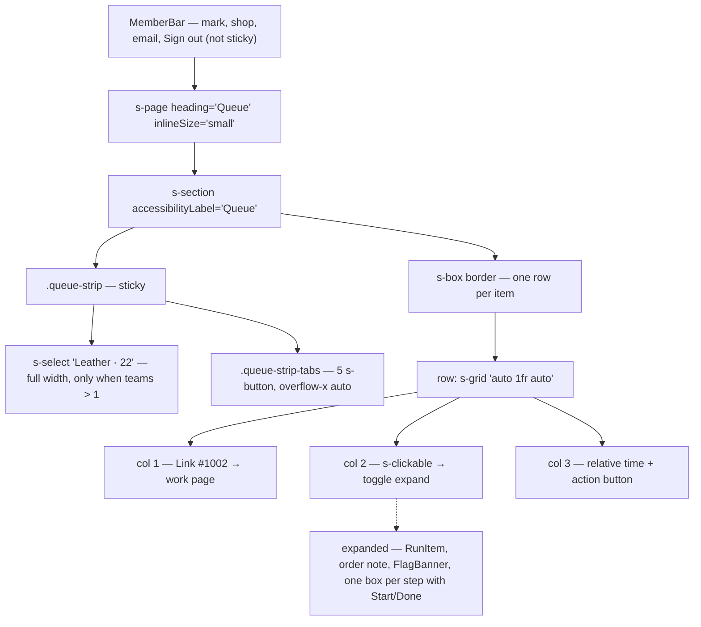
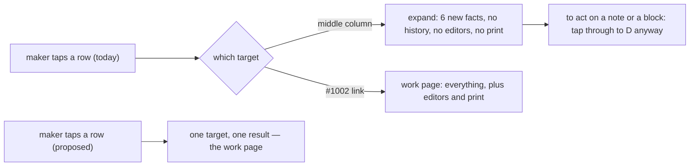
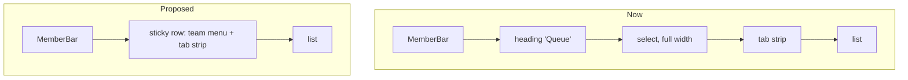

# Member queue design research

The member index (`/shop/$shop`, `src/routes/shop.$shop.index.tsx`) and the pieces it shares with the work page (`shop.$shop.work.$runId.tsx`, `src/components/MemberRun.tsx`, `src/components/MemberBar.tsx`, `src/lib/queueTiers.ts`). What is on the screen, what is wrong with it, and one proposed design. Line numbers are as of 2026-09-20.

Decisions are numbered **D1–D10**. Findings are **F1–F14**. §10 holds the answers to the questions this document was opened with, as **A1–A7**.

## 1. Summary

Recommendations, in the order they change the screen top to bottom:

- **D1 — Drop the `s-page heading="Queue"`.** The tab strip is already the heading and says more (`Mine · 4`). "Queue" names the app's internal noun, not the member's task, and it costs a heading block above the fold on a bench tablet.
- **D2 — Put the team filter on the strip row as a compact menu button, not a full-width select.** One sticky row: `[Leather ▾] [Mine·4] [Up next·17] …`, scrolling horizontally, with the team button pinned to the start of the scroller. Drop the count from the team button; the tab counts already carry it.
- **D3 — Cut the expanding row.** Make the whole row one link to the work page, with the action button as the only other target. The expand costs the same tap as navigating, shows less than the page it competes with, repeats two facts already on the row, and is the reason the row has three different targets with no affordance on the one that matters. The action button stays on the row (§10 A1), so the row does carry one nested interactive element and §4's spike is on the critical path. Personalization does not come with it (§10 A2): it is needed to make a piece, not to choose one.
- **D4 — Drop the relative-time column outright.** It is `run.orderProcessedAt` — order age, the sort key — and unlabelled beside a Done button it reads as "finished 19m ago". No aging badge replaces it (§10 A3); if lateness needs saying later it is a new thing to design, not a rescue of this column.
- **D5 — Rewrite the undo-blocked line.** `Finishing started Fit movement · ask them` garden-paths on the team name and gives an instruction with no mechanism. Proposed: keep a disabled `Undo` in the action column and put `Can't undo: Fit movement (Finishing) already started` on line 2.
- **D6 — State the undo-blocker clause once.** The same sentence is built in three places with two endings (F11).
- **D7 — Drop the Mine-tab row tint.** It fires on `tab === "mine"`, where every row qualifies, so it tints the whole list and distinguishes nothing.
- **D8 — Trim the queue wire payload** once the expand is gone: `siblings` (dead already, F12), step `instructions`/`note`, the order `note`, and `run.customAttributes` leave the queue read.
- **D9 — No multi-shop switcher.** Multi-shop is an edge case Baton permits rather than serves (§10 A5). `/shop` lists a member's shops and that is the whole feature; nothing on this screen changes for it.
- **D10 — Rename the `inProgress` tab to `Teammates`.** "In progress" is already a _row state_ on the member's own rows (`In progress · you`) and an item badge (`MemberRun.tsx:117`), so as a tab word it names the wrong thing twice over. `Teammates` says who is holding the work, which is what the tab is for. Only `TAB_LABEL` changes; the `QueueTier` key stays `inProgress`.

## 2. What is on the screen now



The top of the page, phone width:

```
┌──────────────────────────────────────────────┐
│ ▣ shop.myshopify.com        m@m.com  Sign out│  MemberBar
└──────────────────────────────────────────────┘
  Queue                                           s-page heading
 ┌ card ────────────────────────────────────────┐
 │ ┌──────────────────────────────────────────┐ │
 │ │ Leather · 22                           ▾ │ │  full-width select
 │ └──────────────────────────────────────────┘ │
 │ [Mine·4][Up next·17][In progress·0][Block…▸  │  scrolls
 │ ┌ list ────────────────────────────────────┐ │
 │ │ #1002  Stitch spineLeather journal       │ │
 │ │        In progress · you   19m ago [Done]│ │
```

## 3. Findings

| #   | Finding                                                                                                                                                                                            | Where                                                         | Severity |
| --- | -------------------------------------------------------------------------------------------------------------------------------------------------------------------------------------------------- | ------------------------------------------------------------- | -------- |
| F1  | Three interactive targets per row with three results: order link → work page, middle column → expand, button → write. Only the link looks interactive.                                             | `shop.$shop.index.tsx:437-500`                                | high     |
| F2  | The expand has no affordance — no chevron, no icon, no rule. On a touch tablet there is no hover to discover it with.                                                                              | `shop.$shop.index.tsx:455-476`                                | high     |
| F3  | The expanded row repeats the step name and the state line already on the collapsed row two lines above (`Stitch spine` / `In progress since 10:58 PM`).                                            | `renderStep :243-320` vs `renderItem :455-476`                | high     |
| F4  | The expanded row is a second copy of the work page's step UI, with its own `offered` rule so it does not double a button the row already shows. Two sites that must agree on Start/Done placement. | `:243-320` and `work.$runId.tsx:199-330`                      | high     |
| F5  | `ask them` — the reader is told to ask, with nobody named beyond a team and no mechanism in the app. `Finishing started Fit movement` also garden-paths: the team name reads as a gerund.          | `:569`, `work.$runId.tsx:318`                                 | high     |
| F6  | The relative-time column is `run.orderProcessedAt` (order age) with no label, next to a Done/Undo button, where it reads as work recency. Done-today rows also carry `at 10:58 PM` on line 2.      | `:476-480`                                                    | high     |
| F7  | The team select is full width and visually the most important control on the page, while it is a filter that only exists for multi-team members.                                                   | `:605-630`                                                    | medium   |
| F8  | `s-page heading="Queue"` duplicates what the strip says, and "Queue" is the app's noun rather than the member's task.                                                                              | `:700`                                                        | medium   |
| F9  | Line 1 runs the step name and item title together with `gap="small-500"` and no separator: `Stitch spineLeather journal`.                                                                          | `:461-469`                                                    | medium   |
| F10 | The Mine-tab tint fires on `tab === "mine"`, where every row is the member's, so the whole list is grey and the mark carries no information.                                                       | `:437`                                                        | medium   |
| F11 | `${teamName} started ${stepName}` is built in three places, with `· ask them` twice and `· reopen it first` once. CLAUDE.md requires one normative site.                                           | `:569`, `work.$runId.tsx:318`, `app.orders.$orderId.tsx:1115` | medium   |
| F12 | `QueueStep.siblings` is computed, tested and shipped on every row — and rendered by nothing. Dead payload today.                                                                                   | `Domain.ts:2999`, `WorkflowRunRepository.ts:842`              | medium   |
| F13 | Collapsing a row saves rendered HTML, not bytes: `QueueItem` ships the attributes, instructions and order note whether or not the row is open. The JSDoc at `:139` implies otherwise.              | `Domain.ts:3026-3032`                                         | medium   |
| F14 | A member is labelled by raw email everywhere (`lead@m.com`), the only identity `Member` carries. On a phone row it is the widest token on line 2.                                                  | `Domain.ts:373`, `Domain.ts:2507`, `:544-550`                 | low      |

## 4. The row

The row does three jobs. The middle column's job — expand — is the one with no affordance and the weakest payoff.

What the expand adds over the collapsed row, per `:481-523`:

| Revealed                                       | New?                                                        |
| ---------------------------------------------- | ----------------------------------------------------------- |
| `RunItem`: title — variant ×qty                | qty and variant are new; the title is already on the row    |
| `RunItem`: SKU                                 | new                                                         |
| `RunItem`: personalization (`Initials J.R.M.`) | new — and the one thing a maker needs at the bench          |
| Order note                                     | new                                                         |
| `FlagBanner` + Unblock/Dismiss                 | the badge, the reason and the button are all on the row     |
| Per-step box: step name                        | **repeat of line 1**                                        |
| Per-step box: instructions                     | new                                                         |
| `In progress since 10:58 PM`                   | **repeat of line 2** (`In progress · you`)                  |
| Per-step Start/Done                            | repeat of the row's own button unless the stage is parallel |

Three of nine are repeats, and the flag block repeats a fourth. The work page shows all of it plus the run history, the note editor, the block editor, "Also on this order", and prints as a job ticket.



Cutting the expand removes:

| Removed                                                                                                    | Site                                  |
| ---------------------------------------------------------------------------------------------------------- | ------------------------------------- |
| `open` / `setOpen`, `toggle`, and the two `setOpen` calls after Start                                      | `:139`, `:196-203`, `:352`, `:420`    |
| the prune-during-render block (`shownIds`, `prunedFor`) and its resets in `selectTab` / `selectTeam`       | `:182-194`, `:212`, `:220`            |
| `renderStep` — the queue's copy of the step UI — and the `offered` rule that exists only to deduplicate it | `:230-320` (~90 lines)                |
| the queue's second `FlagBanner`, `RunItem` and `Prose` render                                              | `:481-523`                            |
| `expandRow` and its three uses in the E2E suite                                                            | `e2e/member-queue.member.spec.ts:274` |
| the `s-clickable` / `Link` split in the grid, and with it F1 and F2                                        | `:455-476`                            |
| wire: `siblings`, step `instructions` / `note`, item `note`, `run.customAttributes` (D8)                   | `Domain.ts:2992-3032`                 |

Cost of the cut: personalization, SKU, instructions and the order note leave the list screen. A maker sees them one tap away, on a page that also prints. The tap count is unchanged — expanding was a tap too.

Proposed row, phone width. The whole box is one link; only the action button is not.

```
┌────────────────────────────────────────────────┐
│ #1002  Stitch spine              [   Done    ] │
│ Leather journal · In progress · you            │
├────────────────────────────────────────────────┤
│ #2107  Cut face  +1              [  Actions ▾] │
│ Wall clock · Step 2 of 4 · Cut                 │
├────────────────────────────────────────────────┤
│ #2041  Engrave numerals  ⬤Blocked [  Unblock ] │
│ Wall clock · Waiting on brass stock from supp… │
└────────────────────────────────────────────────┘
```

Line 2 keeps today's `detailLine()` rule — one clause, the most important thing — with the item title moved in front of it, which also settles F9. Done-today:

```
┌────────────────────────────────────────────────┐
│ #2041  Fit movement              [   Undo    ] │
│ Wall clock · lead@m.com · 10:58 PM             │
├────────────────────────────────────────────────┤
│ #2041  Engrave numerals          [ Undo — off] │
│ Wall clock · Can't undo: Fit movement          │
│ (Finishing) already started                    │
└────────────────────────────────────────────────┘
```

Polaris supports the whole-row-clickable shape directly: the documented resource-list composition is an `s-clickable` per row wrapping an `s-grid` with a trailing `s-button` inside it (`refs/shopify-docs/docs/api/app-home/latest/patterns/compositions/resource-list.md`), and `s-clickable` takes `href` (`refs/shopify-docs/docs/api/admin-extensions/latest/web-components/actions/clickable.md`). That contradicts the constraint asserted in the JSDoc at `:323-331` ("a button inside a button is neither valid nor operable").

**Spike before committing the design**: confirm in the browser that a click on the nested `s-button` does not also fire the clickable's navigation and that focus order is row → button. If it does fire, the fallback is `stopPropagation` on the button; failing that the row stays a grid with the link spanning columns 1–2.

Keeping `href` on the row (built through the router, as `QueueBreadcrumb` does at `work.$runId.tsx:135-152`) is what preserves middle-click and open-in-new-tab, which today's `s-clickable` toggle does not have.

## 5. The header



Proposed, phone width:

```
┌──────────────────────────────────────────────┐
│ ▣ shop.myshopify.com        m@m.com  Sign out│
└──────────────────────────────────────────────┘
 ┌ card ────────────────────────────────────────┐
 │ [Leather ▾][Mine·4][Up next·17][In progr…▸   │  one sticky row
 │ ┌ list ────────────────────────────────────┐ │
```

Two heading blocks and a full-width control become one row. The team button is `position: sticky; inset-inline-start: 0` **inside** `.queue-strip-tabs`, so it stays put while the tabs scroll under it.

Considered and not recommended:

| Option                                                                 | Why not                                                                                                                              |
| ---------------------------------------------------------------------- | ------------------------------------------------------------------------------------------------------------------------------------ |
| Team select below the tab buttons                                      | A filter that follows what it filters reads as a footer, and the sticky block still changes shape.                                   |
| Team select in `MemberBar`                                             | The bar is shared with the work page, where team means nothing — either a dead control or chrome that changes shape between screens. |
| Keep the select, shrink to content, one line on tablet, stack on phone | The phone is the bench. Responsive stacking leaves exactly the cramped case cramped.                                                 |

The count on the team button (`Leather · 22`) goes: it is `counts.total` over every team while the tab counts beside it are team-narrowed, so two numbers on one row would count different things. Per-team counts stay inside the menu, where they are what is being chosen between.

## 6. Copy

| Now                                                           | Proposed                                                                   | Why                                                                                                                             |
| ------------------------------------------------------------- | -------------------------------------------------------------------------- | ------------------------------------------------------------------------------------------------------------------------------- |
| `Finishing started Fit movement · ask them`                   | disabled `Undo` + `Can't undo: Fit movement (Finishing) already started`   | Names the step first so the team name cannot be read as a verb; states a fact rather than an instruction with no mechanism.     |
| `Finishing started Fit movement · reopen it first` (merchant) | `Can't reopen: Fit movement (Finishing) already started — reopen it first` | Same clause, one verb per audience (D6).                                                                                        |
| `19m ago` (bare, right column)                                | removed (D4)                                                               | Unlabelled order age next to a Done button reads as work recency.                                                               |
| `Stitch spine` `Leather journal` (no separator)               | `Stitch spine` on line 1, `Leather journal · …` on line 2                  | F9.                                                                                                                             |
| page heading `Queue`                                          | removed (D1)                                                               | The strip says it, with counts.                                                                                                 |
| `Leather · 22` on the select                                  | `Leather` on the menu button; counts inside the menu                       | Two numbers counting different scopes on one row.                                                                               |
| tab `In progress · 0`                                         | `Teammates · 0` (D10)                                                      | "In progress" is a row state on the member's own rows and an item badge; as a tab word it names the wrong thing.                |
| empty `Nobody on your teams has work in progress.`            | `Nobody else on your teams has work in hand.`                              | Follows `Teammates`: the tab excludes the reader and the empty state should say so.                                             |
| tab `Done today · 128`                                        | unchanged                                                                  | The window is 24 hours rather than a calendar day, but the empty state already says "in the last day" and the label reads well. |

The document title (`head`, `:698`) stays `Queue — Baton`: it is the browser tab, not the page, and it is the one place the noun does work.

## 7. Wire payload

`listQueue` returns full `QueueItem`s regardless of what is expanded (`Domain.ts:3026`), so the expand never cost bytes — only rendered HTML (F13). Cutting it makes a trim possible:

| Field                                                                       | Used by, after D3                                        |
| --------------------------------------------------------------------------- | -------------------------------------------------------- |
| `QueueStep.siblings`                                                        | nothing — dead already (F12)                             |
| `QueueStep.instructions`, `note`, `noteByRole`, `reopened*`                 | work page only                                           |
| `QueueItem.note` (order note)                                               | work page only                                           |
| `WorkflowRun.customAttributes`                                              | work page only — the biggest per-row field (a JSON blob) |
| `WorkflowRun.workflowId`, `source`, `createdAt`, `updatedAt`, `cancelledAt` | nothing on the queue                                     |

Shape: a `QueueRun` projection beside `QueueStep`, the same way `QueueStep` already omits the four `completed*` columns and says why. Measure the SSR paint before and after; the 100 KB target named at `:139` is the number to hold it to.

## 8. Rules and JSDoc to change

- `:323-331` asserts a row cannot be one `s-clickable` because of the nested button. Polaris's own resource-list pattern does exactly that. The JSDoc either goes with the expand or is corrected with what the spike finds.
- `:139` explains the collapsed default in terms of bytes shipped. Per F13 that is HTML, not payload. Correct or delete.
- `queueTiers.ts:14` — "The strip is the heading" becomes literally true under D1; the comment at `:626-631` already says it.
- One normative site for the blocker clause (D6): a `Domain` function returning `Fit movement (Finishing) already started`, each screen supplying its own verb. Rule test title: "the undo blocker is named the same way on every screen".
- `Domain.stepActions` is unaffected: the Done-tier row already reads its verdict through it (`:519-525`).

## 9. Tests

| Test                                                                | Change                                                                      |
| ------------------------------------------------------------------- | --------------------------------------------------------------------------- |
| `e2e/member-queue.member.spec.ts:274` `expandRow` and its 3 callers | delete; those tests act from the row button or navigate to the work page    |
| `:674` expects `${PACK_TEAM} started Polish · ask them`             | retitle to the new clause                                                   |
| `e2e/orders.spec.ts:292` merchant reopen-blocked                    | retitle to the new clause                                                   |
| new                                                                 | "a queue row navigates to the work page and its action button does not"     |
| new                                                                 | "the team menu stays on screen while the tab strip scrolls"                 |
| `e2e/member-queue.member.spec.ts:66` `IN_PROGRESS = "In progress"`  | becomes `Teammates` (D10); `:461` and the `:455` JSDoc are retitled with it |
| `test/integration/workflow-run-repository.test.ts:1692`             | title says "is In progress" for the tier — retitle to the tab's new word    |

## 10. Decisions

Answered 2026-09-21.

- **A1 — The row keeps its action button.** Kept to see how it feels in use. The consequence is that the row has one nested interactive element, so the §4 spike (does a tap on the button also fire the row's navigation) has to run before the row is rebuilt, and the fallback ladder there is live.
- **A2 — Personalization stays off the list.** Recommendation and decision agree: `Initials J.R.M.` is needed to make a piece, not to choose one, so it belongs on the work page. Line 2 keeps the state clause.
- **A3 — Order age is dropped, with no aging badge.** The column goes and nothing takes its place. Lateness stays unsaid on the queue for now.
- **A4 — `In progress` → `Teammates`** (D10). `On the bench` was rejected as not saying anything a reader can decode, and `Teammates` was chosen over `Theirs`: it names who holds the work outright rather than leaning on the contrast with `Mine`. `Done today` stays as it is.
- **A5 — Multi-shop is permitted, not served.** Few members if any will be on more than one shop; the `/shop` list exists so the case is not forbidden, and that is the whole of it. No switcher in the bar.
- **A6 — Email is the member's name.** `Member` carries an email and nothing else, and that is not changing in this phase, so every attribution line on these screens is an address. F14 is a known cost, not a task.
- **A7 — The work page is a later phase.** Acknowledged as needing the same treatment; out of scope here.

## 11. Deferred

- The work page's own version of these problems (A7): the block editor is a whole section at the bottom, and the step boxes carry four different controls in one inline stack.
- Grouping consecutive rows of the same order (`#2041` three times in the Done-today screenshot).
- A print view for the queue itself; the work page prints as a ticket and the queue need not.
- Saying a piece is late, if it is ever wanted (A3).
- Member display names (A6).
