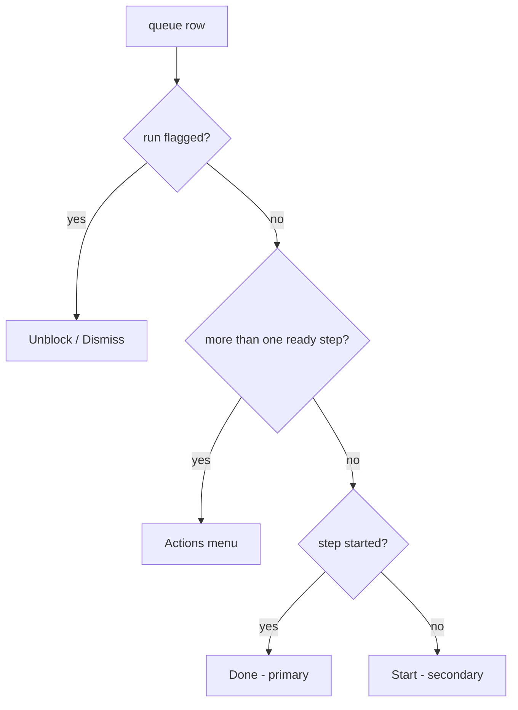

# Member Queue Refinements Research

Research date: 2026-09-21. Reviewed and decided the same day.

Subject: the member queue screen (`src/routes/shop.$shop.index.tsx`), as it stands after `ed4fa99 Redesign member queue`. Eight review notes taken from screenshots of the five tabs, each weighed, reviewed, and decided. Every item below carries a **Decision**; nothing here is open.

## Scope

Only the queue screen and the chrome above it. The work page (`shop.$shop.work.$runId.tsx`) is unchanged except where a fact is moved off a row and onto it.

## The screen now

```
+--------------------------------------------------------------+
| [B] sandbox-shop-01.myshopify.com        m1@m.com  [Sign out] |  MemberBar
+--------------------------------------------------------------+
| [All teams v]                                                 |  team filter row   \
| [Mine 19][Up next 73][Teammates 0][Blocked 7][Done today 128] |  tab strip         / sticky
+--------------------------------------------------------------+
| #1002  Engrave crest                              [  Done  ]  |
| Signet ring - In progress - you                               |
|--------------------------------------------------------------|
| #1002  Stamp monogram  +1                        [Actions v]  |
| Leather journal - In progress - you                           |
+--------------------------------------------------------------+
```

Code map:

| Piece                        | Where                                                                   |
| ---------------------------- | ----------------------------------------------------------------------- |
| team filter button and menu  | `shop.$shop.index.tsx:514` (`teamMenu`)                                 |
| tab strip                    | `shop.$shop.index.tsx:559` (`strip`), labels in `src/lib/queueTiers.ts` |
| waiting row                  | `shop.$shop.index.tsx:242` (`renderItem`)                               |
| row line two                 | `shop.$shop.index.tsx:250` (`detailLine`)                               |
| row action                   | `shop.$shop.index.tsx:266` (`action`)                                   |
| flagged row's leading rule   | `shop.$shop.index.tsx:336`                                              |
| flag badge                   | `shop.$shop.index.tsx:360`                                              |
| Done today row               | `shop.$shop.index.tsx:419` (`renderDone`)                               |
| empty states                 | `src/lib/queueTiers.ts` (`TAB_EMPTY`)                                   |
| sticky strip, two-line clamp | `src/styles.css` (`.queue-strip`, `.queue-detail-line`)                 |

Which button a waiting row gets is a three-way decision, and it explains most of what follows:



Because a flag puts a row in the Blocked tier (`Domain.tierOf`) and the tier is the tab, the verb is nearly a function of the open tab: Mine gives Done, Up next gives Start, Teammates gives Done, Blocked gives Unblock or Dismiss, Done today gives Undo. That redundancy is the thread running through items 2, 4 and 6.

## What Polaris actually does

Scanned `refs/shopify-docs/docs/api/app-home/latest/` for the two places this review asked what is idiomatic. Three findings, and they decide items 1 and 4.

**A row's actions are a three-dot kebab inside the row.** The resource-list composition ("Provide search, filtering, and row selection for a resource list", `patterns/compositions/resource-list.md`) writes every row as an `s-clickable` holding a `1fr auto` grid whose `auto` cell is:

```tsx
<s-button
  icon="menu-horizontal"
  variant="tertiary"
  accessibilityLabel="Actions for Mae Jemison"
/>
```

No labelled verb, no primary button, one fixed-size tertiary icon button per row. Polaris's primary/secondary hierarchy is about a page's actions, which live in `s-page`'s `primary-action` and `secondary-actions` slots; it is not a thing a list row does. That settles item 4 against the labelled-button reading.

**There is no tabs component.** App Home v1 ships `actions`, `feedback-and-status-indicators`, `forms`, `layout-and-structure`, `media-and-visuals`, `overlays`, `typography-and-content`, and nothing in any of them is a tab set. The index patterns filter with a `slot="filters"` grid (`1fr auto`), an `s-text-field icon="search"`, a button opening an `s-popover` of options, an `s-select` for sort, and `s-clickable-chip` for the filters already applied.

**Chips cannot carry the strip.** `s-clickable-chip` has `color`, `removable`, `disabled`, `href` — no selected or pressed state. A five-way exclusive choice needs a pressed look, which only `s-button variant="primary"` gives. So the strip stays buttons; what changes is how they are laid out (item 1b).

---

## 1. The team filter's own row

**Now.** A secondary button reading `All teams` on its own line above the strip, rendered only for a member on more than one team (`teams.length > 1`).

**If it were deleted.** A member on two or more teams loses the only way to narrow the queue to one bench. The tabs narrow by state, never by team, and the list is oldest-order-first, so a person covering Engraving would scroll past Woodshop rows to find theirs. Worth keeping. The audience is small: a single-team member never sees the control.

**Decision: move it into `MemberBar`, beside the shop name, rendered only on the queue.**

The objection raised in research was that `MemberBar` is on every `/shop/$shop/*` screen including the work page, so the bar would either carry a dead control or change shape per route. Reviewed and overruled: a bar that changes shape per route is acceptable. It is one optional slot, the work page passes nothing, and the bar's fixed part (mark, shop, email, Sign out) does not move.

Shape: `MemberBar` takes an optional `filter?: React.ReactNode` and renders it in the left group after the shop link. The queue passes `teamMenu`; every other member screen passes nothing, so nothing changes there. The filter stays client state on the route, so the bar is rendering the queue's control, not owning it.

Cost: the bar is not sticky (`.member-bar` has no `position`) while the strip is, so the filter scrolls away and the tabs stay. Acceptable for a set-once control.

## 1b. The strip's overflow

**Now.** `.queue-strip-tabs` is `display: flex; flex-wrap: nowrap; overflow-x: auto` with the scrollbar hidden (`scrollbar-width: none`, `::-webkit-scrollbar { display: none }`). Five tabs do not fit a phone, so the row scrolls. Wrapping was rejected because a wrap that moves when a count grows a digit shifts the list under a reader's finger.

**The note.** A scrollbar appearing over the tabs looks bad, and hiding it is a patch, not a design.

**Decision: drop the scroller. Lay the tabs out as a grid that wraps on width alone.**

```css
.queue-strip-tabs {
  display: grid;
  grid-template-columns: repeat(3, 1fr);
  gap: 0.375rem;
}

@media (max-width: 27rem) {
  .queue-strip-tabs {
    grid-template-columns: repeat(2, 1fr);
  }
}
```

Three columns wrap three and two; two columns on a phone wrap two, two and one. Both are balanced, neither can overflow, so no scrollbar can appear in any browser or under any scrollbar setting and no tab is ever cut in half at the edge. The original wrap objection is answered too: the break is on the container's width and nothing else, so a count going from 9 to 10 changes a label and never the layout.

The phone breakpoint is measured rather than guessed. `1fr` is `minmax(auto, 1fr)`, so a cell will not shrink below its own button's width; at 390px, three columns of `Done today · 128` spill the strip, and a strip that spills is the scrollbar this layout exists to remove. Checked with three-digit counts at 320, 360, 375, 390, 430 and 600: two columns up to 27rem, three above it, nothing overflowing at any of them.

`auto-fit` with a minimum was tried first and dropped: inside `s-page inlineSize="small"` the container lands near 600px, which fits four tabs and leaves the fifth alone on a line of its own.

It stays a plain `div` with CSS rather than `s-grid`: `gridTemplateColumns` there takes track sizing values or Polaris's own responsive-value syntax, and `repeat(auto-fit, minmax(...))` is neither. `styles.css` already owns this row and says why it is not an `s-stack`.

Vertical cost is about even: item 1 takes the filter's row off the queue, and the phone's third row of tabs puts one back.

---

## 2. `In progress - you` on Mine rows

**Now.** Line two of a waiting row is `<item title> - <detail>`, where detail is the block reason, or `In progress - <who>`, or `Step N of M - <team>` (`shop.$shop.index.tsx:250`).

**The note.** On the Mine tab every row says `In progress - you`, which the tab already said.

**Decision: accepted. Cut it on Mine; line two falls back to the step line.**

`Domain.tierOf` puts a row in `mine` exactly when some step carries the viewer's email in `startedByEmail`. The words are therefore true of every row under a pressed `Mine`, and a fact true of every row is not a fact about any row.

Two things the cut must not touch:

- **Teammates.** There `In progress - lead@m.com` is the whole point of the tab. Keep.
- **The mixed row.** A run can have several ready steps on the member's teams. `steps[0]` is the lowest-position one, not necessarily the one the viewer started, so a Mine row can legitimately be showing an unstarted first step. Today such a row already falls through to `Step N of M`, so scoping the cut to the Mine tab is safe as written.

```
before:  Signet ring - In progress - you
after:   Signet ring - Step 2 of 3
```

Not a bare item title: stage position is what a maker holding two jobs uses to choose between them.

**Cost.** `detailLine` takes the tab; `MINE_STATE` in `e2e/member-queue.member.spec.ts:56` and its assertions at 346, 364, 541 change to the step line. The Teammates assertions at 456 and 550 stay as they are, which is the point.

---

## 3. The team name on Up next rows

**Now.** `Step 1 of 3 - Woodshop` on every waiting row.

**If it were deleted outright.** A member on three teams scanning All teams loses which bench a job belongs to, which is what tells them whether to walk over to it. The work page still carries it, but that is a tap away and the scan is the point of the list.

**Decision: accepted. Show the team only when it discriminates.**

```ts
const showTeam = teams.length > 1 && team === null;
```

One predicate governs both controls: the member who has the filter is the member who gets the team name, and choosing a team removes the column it just made redundant. The single-team member never sees either.

```
all teams:       Engraved cutting board - Step 1 of 3 - Woodshop
Woodshop:        Engraved cutting board - Step 1 of 3
one-team member: Engraved cutting board - Step 1 of 3
```

Line two is a sentence, not a column, so nothing shifts under the reader's finger when the word goes.

---

## 4. The action column

**Now.** `Done` is `variant="primary"`, so Mine is a column of black pills. `Start`, `Unblock`, `Dismiss`, `Undo` and `Actions v` are secondary. The grid is `1fr auto`, so the column is as wide as whatever verb the row drew and the text column's right edge moves row to row.

**Decision: every row gets the three-dot kebab. No labelled row buttons, no primary, no secondary.**

Research recommended a hybrid — labelled button for a single verb, kebab only for the multi-step row — on the argument that a menu costs a second tap on the bench's core loop. Reviewed and overruled on both halves:

- **Polaris.** The resource-list composition does exactly this: one `s-button icon="menu-horizontal" variant="tertiary"` per row, no verb, no primary. Primary and secondary belong to a page's action slots, not to a row. The research had the wrong read.
- **Velocity.** Made-to-order items do not move fast enough for a second tap on Done to cost anything. A worker finishing a signet ring is not pressing Done every few seconds.

The second tap also buys something real: a Teammates row currently offers a bare `Done` on work somebody else is holding, one tap from a scrolling list.

Shape, per Polaris:

```tsx
<s-button
  icon="menu-horizontal"
  variant="tertiary"
  accessibilityLabel={`Actions for ${run.orderName}`}
  disabled={actions.pending}
  commandFor={menuId}
  onClick={insideRow}
/>
```

Menu contents, which is where the verb now lives:

| Row                         | Items                                            |
| --------------------------- | ------------------------------------------------ |
| one ready step, not started | `Start`                                          |
| one ready step, started     | `Done`                                           |
| several ready steps         | `Start · <step>` / `Done · <step>`, one per step |
| blocked                     | `Unblock`                                        |
| reconcile flag              | `Dismiss`                                        |
| Done today, undo allowed    | `Undo`                                           |
| Done today, undo blocked    | no kebab at all (item 8)                         |

A single-step row's item is the bare verb: the step is named on line one of the row the menu belongs to, so repeating it there is the row arguing with itself.

The kebab trigger sits inside the `s-clickable` with `insideRow`, as Polaris nests it. The `s-menu` itself stays a sibling: an item's activation lands on the row otherwise (`insideRow` JSDoc, `shop.$shop.index.tsx:110`).

`disabled={actions.pending}` moves onto the kebab, which keeps the socket gate the e2e helpers rely on: `pending` is true until the connection identifies, so the row offers nothing clickable before the handshake.

Geometry falls out for free: one fixed-size control per row, so the action column stops changing width and the text column's right edge stops moving.

---

## 5. The Teammates empty line, and disabling zero tabs

**Now.** `Nobody else on your teams has work in hand.` (`queueTiers.ts`, `TAB_EMPTY.inProgress`). The other four are already short.

**Decision: accepted. Shorten to `Nobody else has work.`** It keeps the one distinction that matters (else, meaning not you) and drops the scope clause, which the strip and the filter already established.

**Decision: keep the text. Blank is not an option.** The empty panel sits where rows were, and the screen has a real `Loading...` state one line up, so blank would be ambiguous rather than quiet.

**Decision: zero tabs stay enabled. Accepted, and not to be revisited.**

- The counts move over the socket. A tab that disables under a finger already travelling toward it is a misfire, and Teammates crosses zero constantly.
- A disabled button leaves the tab order (Polaris button docs, Limitations), so a keyboard or screen-reader user loses the tab rather than hearing it is empty.
- The count already says zero. Disabling says it again, more weakly.
- `Nothing is blocked.` is good news somebody went looking for.
- The default tab is Mine, and Mine is zero for a member who has started nothing, so the landing screen would open on a pressed disabled button.

This is the written rule at `shop.$shop.index.tsx:559`, and `renderEmpty`'s `Go to` button is the better answer to a dead end because it points somewhere.

---

## 6. The `Blocked` badge on Blocked rows

**Now.** A flagged row carries `<s-badge tone={flagTone}>{flagHeading}</s-badge>` (`shop.$shop.index.tsx:360`), and `flagHeading` for a `blocked` flag is the word `Blocked`.

**Decision: accepted, and the cut is precise.** A flag always wins the tier (`Domain.tierOf`), so flagged rows appear on the Blocked tab and nowhere else. On that tab:

- `Blocked` badge: repeats the pressed tab, repeats the `Unblock` item in the menu beside it, and repeats the reason on line two. Three sayings of one fact. Cut.
- `Order cancelled`, `Already shipped`, `Quantity changed`, `No longer needed`, `Order deleted`: the content of the tab. Each names a different thing that happened. Keep, with the `warning` tone that separates "somebody put a hold on this" from "Shopify moved under you".

The predicate exists and satisfies `scripts/rules-lint.ts`:

```tsx
{
  flagged && !Domain.runIsBlocked(run) && (
    <s-badge tone={flagTone(run) ?? "critical"}>
      {flagHeading(run) ?? ""}
    </s-badge>
  );
}
```

`flagBody` for a blocked run is already the reason as typed with no prefix, so line two survives intact. A blocked run with no reason typed falls back to the step line; the `Unblock` item is what marks it.

---

## 7. The rule down the left of a flagged row

**Now.** A flagged row draws a vertical rule on its leading edge, and the same prop draws the separator above every row but the first (`shop.$shop.index.tsx:336`):

```tsx
borderWidth={`${first ? "none" : "base"} none none ${flagged ? "large-100" : "none"}`}
borderColor={flagged ? "strong" : "base"}
```

**Decision: delete the flag rule.** Confirmed in review that this vertical left edge is the thing that looked wrong. Two reasons to cut it rather than tune it:

1. **It marks every row on the only tab it appears on.** Same failure the subdued in-hand surface was deleted for, recorded in the comment above it: it fired on a tab where every row qualified, so it tinted the whole list and separated nothing. Flagged rows exist only in the Blocked tier, so this rule is always 100% of the list.
2. **It collides with the container's corners.** `renderList` wraps rows in `<s-box borderWidth="base" borderRadius="base">`, and a box with a radius does not clip children unless something sets `overflow: hidden`. The first and last row's square rule therefore runs past the rounded corner.

Rows keep only the separator above them. Nothing is lost: the tab, the badge for reconcile flags, the reason line and the menu all say the row has stopped.

---

## 8. Done today

**Now.** Every step the member's _teams_ finished inside `Domain.DONE_WINDOW_MS`, newest first, 124 rows in the screenshot. Each row carries an `Undo` button, disabled when a later step has started, plus a third line: `Can't undo: Fit movement (Finishing) already started.`

**Why it reads heavy.** Undo is blocked as soon as anything downstream starts, and in a running shop that is the normal case, so the tab is mostly disabled buttons each explaining itself. The reasoning on `renderDone` was that a missing control reads as a row that was never undoable while a disabled one beside its reason reads as the refusal it is. That holds when refusal is the exception. Here it is the rule, so the argument inverts: the button's absence becomes the norm a reader learns in two rows, and its presence becomes the signal.

**If the tab were deleted.** Two things go. First, the only route from the member area back to a finished step whose run has left the queue: a run whose last step is done sits in no tier, so no waiting row links to it. Second, the shop's record of what it finished today. The first is load-bearing. The tab stays.

**Decision: accepted.**

1. Offer `Undo` only where it is allowed. No disabled control, no `Can't undo:` line.
2. A row with no undo has no kebab at all, and stays clickable through to the work page, which states the refusal in full in its own banner.
3. Say `by you` where the actor is the viewer, matching the waiting rows.

```
before:
  #2041  Engrave numerals                             [ Undo ]  (disabled)
  Wall clock - by lead@m.com at 1:02 AM
  Can't undo: Fit movement (Finishing) already started

after:
  #2041  Engrave numerals
  Wall clock - by you at 1:02 AM
```

Not done: narrowing the tab to the viewer's own finished steps. Undo is deliberately the team's, because a colleague notices a mistake as readily as its author (`WorkflowRunRepository.listDone`), and undo-blocking is about downstream steps, not authorship. Narrowing would shrink the list without making more of it undoable.

**Cost.** `renderDone` and `doneActorLabel`. The test at `e2e/member-queue.member.spec.ts:756`, "a blocked undo names the step that stands in the way and keeps a disabled button", is the rule being reversed: it becomes a test that a blocked undo offers nothing on the list and states the reason on the work page. Its title and JSDoc are the rule, so both are rewritten.

---

## The screen after all of it

```
+--------------------------------------------------------------+
| [B] sandbox-shop-01.myshopify.com [All teams v]  m1@m.com [X] |
+--------------------------------------------------------------+
| [  Mine 19  ][ Up next 73  ][ Teammates 0 ]                   |  grid, no scroller
| [ Blocked 7 ][Done today 128]                                 |
+--------------------------------------------------------------+
| #1002  Engrave crest                                   [...]  |
| Signet ring - Step 2 of 3                                     |
|--------------------------------------------------------------|
| #1002  Stamp monogram  +1                              [...]  |
| Leather journal - Step 1 of 3                                 |
+--------------------------------------------------------------+

Blocked:
| #1008  Engrave crest                                   [...]  |
| Signet ring - Crest file missing from the order - asked...    |
|--------------------------------------------------------------|
| #1020  Stamp monogram  +1  [Already shipped]           [...]  |
| Leather journal - Fulfilled in Shopify.                       |
+--------------------------------------------------------------+
```

## Change summary

Nothing is parked; all of it is built in one pass.

| #   | Change                                                  | Files                  | Rule tests touched                                                               |
| --- | ------------------------------------------------------- | ---------------------- | -------------------------------------------------------------------------------- |
| 1   | Team filter into `MemberBar` via an optional slot       | `MemberBar.tsx`, route | `...the team filter is not one of them` is rewritten                             |
| 1b  | Tab strip becomes a wrapping grid, scroller deleted     | `styles.css`, route    | same test                                                                        |
| 2   | No `In progress - you` on Mine                          | route                  | `MINE_STATE` assertions                                                          |
| 3   | Team name only when `teams.length > 1 && team === null` | route                  | step-line assertions                                                             |
| 4   | Kebab on every row, verbs move into the menu            | route                  | every `Start` / `Done` / `Unblock` / `Dismiss` click grows an open-the-menu step |
| 5   | Shorter Teammates empty line; zero tabs stay enabled    | `queueTiers.ts`        | empty-state constant                                                             |
| 6   | No `Blocked` badge on a blocked row                     | route                  | none                                                                             |
| 7   | Delete the flagged leading rule                         | route                  | none                                                                             |
| 8   | Undo only where allowed; `by you`                       | route                  | `a blocked undo...` is reversed                                                  |

None of it touches `Domain`, the object, or the socket. Every change is presentation, and the predicates it needs (`Domain.runIsBlocked`, `Domain.tierOf`, the local `showTeam`) exist or are presentation-only.
