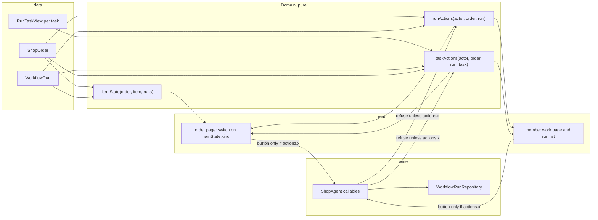
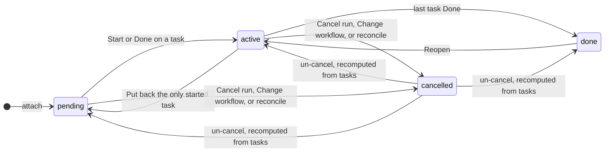
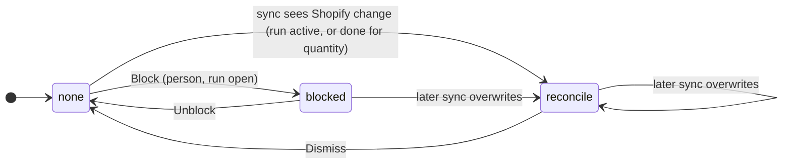
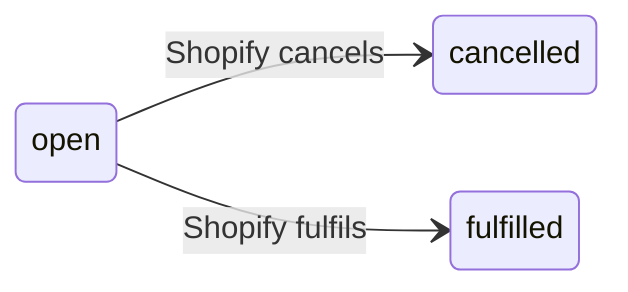
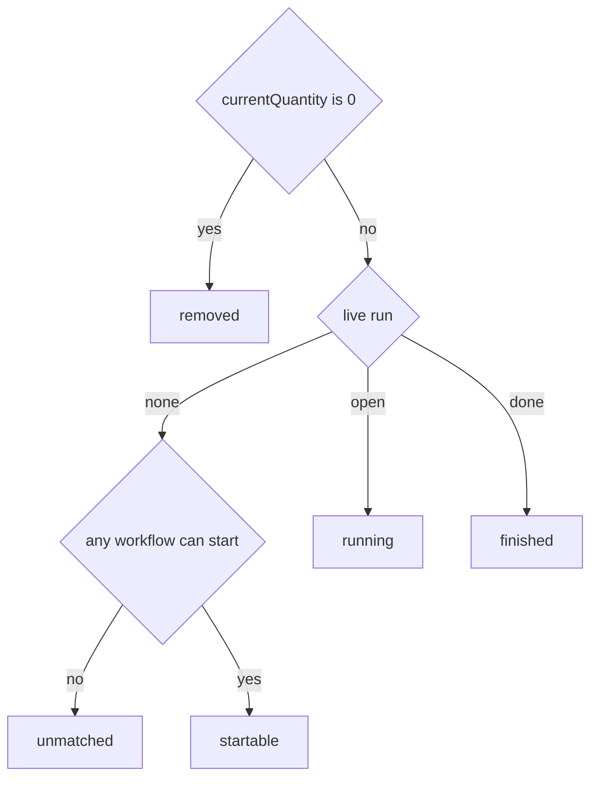
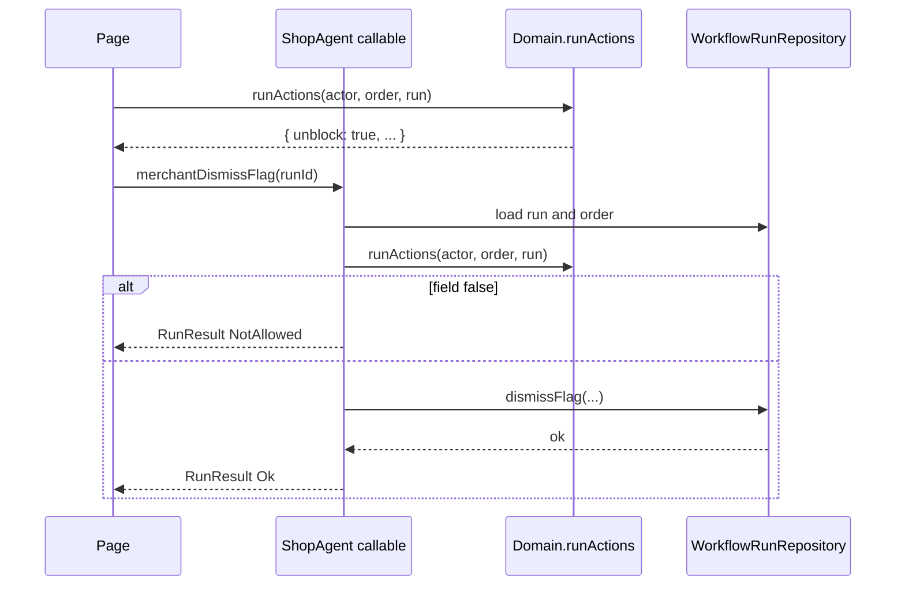

# Order detail: state model and write surfaces research

Why the order page (`/app/orders/$orderId`) keeps coming out wrong, what the state model actually is, the rules that should derive every control from it, and the questions that remain. Written 2026-09-24 from the code as it stands after the blocked-and-manage and clarity rounds, plus two screenshots: order #1026 with a run that is both Cancelled and Blocked and still offers Choose workflow, and a Manage drawer with an inline Reassign picker open.

## 1. Why this keeps going wrong

The page has no single statement of what a run can be and what each state permits. Every control carries its own render condition, written when that control was added, against whichever predicate the author had in mind:

| Control         | Condition today                                 | What it ignores                            |
| --------------- | ----------------------------------------------- | ------------------------------------------ |
| Blocked banner  | `runIsBlocked`                                  | run status, so it shows on a cancelled run |
| Undo cancel     | `!runIsLive`                                    | order state, other live runs on the item   |
| Choose workflow | `live === undefined && !removed`                | order state, the cancelled run beside it   |
| Change workflow | `changeable && options.length > 0`              | order state                                |
| Block           | `open && !runIsBlocked`                         | reconcile flags, which it overwrites       |
| Reopen          | `task.completedAt !== null && blocker === null` | order state, flags                         |
| Dismiss         | `runIsDone && runIsFlagged`                     | open flagged runs, which get no Dismiss    |

Each condition is locally reasonable. Together they let the page render Cancelled, Blocked, Unblock, Edit reason, Choose workflow and Start on one card, which is what screenshot 1 shows. The fix is not another pass over the copy. It is one table that says, for every state, what the card shows, and JSDoc rules that every render site links to. The Domain already does this for the server side (`RunStatus` and `RunFlag` each carry a gate table). The page does not, and the server guards are looser than the Domain tables claim (section 4).

The same is true of write surfaces. Four shapes are in use, with no stated rule for which applies: modal (note, block reason, change workflow), one-tap (unblock, cancel run, mark done, reopen, put back), inline select revealed by a button (reassign), and inline select at rest (start, the deleted-team attention row). Reassign was made inline in the clarity round (5c option 1) two days before Change workflow was made a modal (blocked-and-manage Q6) for the reason that "every other write on this page is a modal". Both decisions were right locally and contradict each other.

## 2. The model

Three independent axes. Everything on the card is a function of them.

**Order state** (`ShopOrder`): open, cancelled in Shopify (`cancelledAt`), or fulfilled (`fulfillmentStatus === FULFILLED`). `Domain.canAttachRun` is "open" for the purpose of starting or changing work. Cancelled and fulfilled are both closed; the page treats them the same except for the word.

**Run status** (`RunStatus`): `pending`, `active`, `done`, `cancelled`. Derived from the tasks except `cancelled`, which a person or reconcile sets. `runIsOpen` is pending or active. `runIsLive` is anything but cancelled.

**Run flag** (`RunFlag`): `null`, `blocked` (set by a person), or one of four reconcile flags (`item_removed`, `quantity_changed`, `order_cancelled`, `order_fulfilled`), set by sync when Shopify changed something under the run. One column, so a run has at most one flag and a later one overwrites.

Legal combinations and how each arises:

| Status    | Flag             | How it happens                                                                                                     |
| --------- | ---------------- | ------------------------------------------------------------------------------------------------------------------ |
| pending   | null             | Attached, nothing started.                                                                                         |
| pending   | blocked          | Merchant or member blocked before anyone started.                                                                  |
| pending   | reconcile        | Should not happen: reconcile cancels or silently adjusts a pending run instead of flagging it.                     |
| active    | null             | Work in progress.                                                                                                  |
| active    | blocked          | Held mid-run.                                                                                                      |
| active    | reconcile        | Shopify changed the item, quantity or order while work was underway. Work stops until Dismiss.                     |
| done      | null             | Finished.                                                                                                          |
| done      | quantity_changed | Finished, then the quantity changed. Dismiss accepts the new quantity.                                             |
| done      | other flags      | Should not happen: reconcile only flags a done run for quantity.                                                   |
| cancelled | anything         | Cancel run keeps whatever flag was set, so a cancelled run can carry `blocked` (screenshot 1) or a reconcile flag. |

The last row is the source of screenshot 1. It is legal in the data and meaningless on the page: a cancelled run is not stopped by a block, it is stopped by being cancelled. Section 3 R2 decides what to do with it.

An item has at most one live run (partial unique index) and any number of cancelled ones. "Item has no run" on the page means "no live run", so an item whose only run is cancelled is treated as free, which is why the picker appears beside the cancelled row.

## 3. Proposed rules

Each rule is one JSDoc on the symbol that owns it, with a test whose title is the rule, and every render site links to it. Names are proposals.

**R1. Order closed: read only.** When `!Domain.canAttachRun(order)` the page shows the order's state once, as a banner at the top ("Cancelled in Shopify" or "Fulfilled in Shopify"), and offers no write on any item: no picker, no Change workflow, no Undo cancel, no Reopen, no Reassign, no Block. Notes stay editable (a note is a record, not work). Dismiss stays (it acknowledges the change; see R5). Today none of the picker, Change workflow, Undo cancel or Reopen check the order, so on a Shopify-cancelled order the picker renders and the server answers OrderClosed; Undo cancel and Reopen succeed and resurrect work on a dead order until the next reconcile notices. R1 closes both the UI and the server holes: `uncancelRun` and `uncompleteTask` gain an order check in `ShopAgent` where the order is in scope.

**R2. Cancelled run: history, not a card.** A cancelled run renders as one subdued line, "Cancelled · <workflow name> · <when>", and nothing else: no flag badge, no banner, no Unblock, no Edit reason, no note edit, no Manage. Its flag is kept in the data (so an un-cancel restores it) but not drawn. Today the page comment says exactly this ("nothing on a cancelled run but Undo cancel") and the render does not follow it because the banner condition is `runIsBlocked` alone. Whether Undo cancel survives is Q1.

**R3. One resting control per item without a live run.** An item with no live run and an open order shows the workflow picker at rest (select plus Start), as decided in the clarity round. That is the item's empty state, not an edit, which is why it is the one inline select that is not behind a button (see R7). If the item has cancelled runs, they sit as R2 lines under the picker; the picker is the way to start again, and picking the cancelled run's workflow resumes it (`setRun` un-cancels a matching cancelled run, keeping its tasks and flag).

**R4. Flagged run: the banner is the control surface.** Any flag on a live run draws `FlagBanner` with the flag's heading and, in its action slot, Edit reason (blocked only) and the lift verb (Unblock for blocked, Dismiss for reconcile). While flagged: Mark done and Put back are hidden (already so), Block is hidden (today only hidden while `blocked`, so Block overwrites a reconcile flag and Unblock then erases the record that Shopify changed something), Reassign and Reopen stay (neither performs work). Today the order page draws the banner only for `blocked` and offers Dismiss only on a done run, so an active run with `item_removed` has no way to lift the flag on this page, although the `changed` need on the index says "accept the change on the order page". This is the member work page's rule already (`FlagBanner` for any flag; Block gated on `!runIsFlagged`), so R4 is "make the order page do what the member page does".

**R5. Dismiss means acknowledge, not resume.** Dismiss on `order_cancelled` or `order_fulfilled` clears the flag but R1 still holds, so the run stays read-only; the merchant's next act is Cancel run, or nothing. Dismiss on `item_removed` or `quantity_changed` on an open order returns the run to plain open. This is what `dismissFlag` does today; the rule only needs stating so the banner copy can say it ("Dismiss" is the right verb; "Resume" would be wrong for two of the four).

**R6. Cancel run clears nothing but status.** Keep `cancelRun` as is (status only). R2 makes the retained flag invisible, and un-cancel brings it back, which is the honest outcome: a run cancelled while blocked is still blocked if revived. The alternative, clearing the flag on cancel, would lose the block reason with no way back.

**R7. Write surfaces.** Three shapes, chosen by what the write needs from the merchant:

| The write needs                | Shape                                      | Instances                                                                            |
| ------------------------------ | ------------------------------------------ | ------------------------------------------------------------------------------------ |
| Nothing, and is reversible     | One tap, plain tone, toast                 | Unblock, Dismiss, Mark done, Put back, Reopen, Cancel run                            |
| Input, or is not reversible    | Modal, red submit when destructive         | Edit note, Block, Edit reason, Change workflow, **Reassign** (moves here)            |
| Filling an empty required slot | Inline select at rest, Start/Assign button | Workflow picker on an item with no run; team picker on a task whose team was deleted |

The third row is the only inline select, and it is the resting state of something that must be filled before anything else can happen. Reassign is a change to a filled slot, so under R7 it is a modal: "Reassign <task>", select defaulted to the current team, Assign. This reverses clarity 5c option 1, and the reason is the one the user gave: it is the only edit on the page that is not a modal, and the Manage drawer with a picker open (screenshot 2) reads as a half-finished form next to two disabled buttons. Cost of reversing: one modal component; the inline reveal state (`reassigning`) and its Cancel go away, which is less code, not more.

**R8. Badges say status and flag, nothing else.** The badge row is `[status] [flag]` and holds no buttons. Undo cancel next to the badges (screenshot 1) violates this; under Q1 it either moves into the R2 line or is cut.

## 4. The card, state by state

With the rules above, per line item on an open order:

| State                     | Badges                                  | Banner                        | Now line       | Note             | Manage                                                            | Resting control               |
| ------------------------- | --------------------------------------- | ----------------------------- | -------------- | ---------------- | ----------------------------------------------------------------- | ----------------------------- |
| No run, no match          | none                                    | none                          | none           | none             | none                                                              | "No workflows can start"      |
| No run, one or more match | none                                    | none                          | none           | none             | none                                                              | Picker + Start                |
| pending / active, no flag | In progress / Not started               | none                          | Step n of m    | Edit             | yes: tasks, Block, Cancel run, Change workflow                    | none                          |
| pending / active, blocked | + Blocked (red)                         | Blocked, Edit reason, Unblock | Step n of m    | Edit             | yes: tasks (no Mark done / Put back), Cancel run, Change workflow | none                          |
| active, reconcile flag    | + flag (amber, red for order_cancelled) | flag heading, Dismiss         | Step n of m    | Edit             | yes: tasks (no Mark done / Put back), Cancel run, Change workflow | none                          |
| done, no flag             | Done                                    | none                          | Done · m steps | Edit             | yes: tasks with Reopen only                                       | none                          |
| done, quantity_changed    | Done + Quantity changed                 | heading, Dismiss              | Done · m steps | Edit             | yes: Reopen only                                                  | none                          |
| cancelled (any flag)      | one subdued line per R2                 | none                          | none           | read-only if set | none                                                              | Picker + Start (item is free) |

On a closed order, every row loses its writes except note and Dismiss, and the picker is replaced by nothing (R1). The "No workflows can start" sentence is not shown either; the order banner already says why.

Screenshot 1 under this table: `[Cancelled · Engraved cutting board workflow · 21m ago]`, then the picker. No red, no Unblock, no Edit reason, no Undo cancel unless Q1 keeps it.

## 5. What the server must also enforce

The Domain gate tables promise more than the repository checks. Each gap is a state the UI can be fixed to hide, but a stale tab or a second admin still reaches it:

| Write                  | Domain table says       | Repository checks                | Gap                                                                                                             |
| ---------------------- | ----------------------- | -------------------------------- | --------------------------------------------------------------------------------------------------------------- |
| Unblock / Dismiss      | flag's one action       | run exists                       | Succeeds on a cancelled run. Add `runIsLive`.                                                                   |
| Edit reason            | `runIsBlocked`          | `runIsBlocked`                   | Succeeds on a cancelled blocked run. Add `runIsLive`.                                                           |
| Block                  | `runIsOpen`, ready task | `runIsOpen`                      | Overwrites a reconcile flag. Add `!runIsFlagged`.                                                               |
| Undo cancel            | only `cancelled`        | cancelled, no other live run     | No order check. Add `canAttachRun(order)` in ShopAgent.                                                         |
| Reopen                 | `runIsLive`             | `runIsLive`, undo not blocked    | No order check; revives a done run on a closed order. Add the same.                                             |
| Member readiness (SQL) | `runIsOpen`             | completed and earlier steps only | A cancelled run's tasks read as Ready on the member work page. Add status to `readyWhere` or gate `getRunView`. |

None of these need a schema change. All are one predicate each, and each becomes a test titled with the rule.

## 6. Questions

**Q1. Keep Undo cancel?** What cutting it removes: a one-tap revival of a cancelled run in place. What replaces it: the picker (R3) already lists the cancelled run's workflow, and picking it revives the same run with its tasks via `setRun`'s un-cancel branch, so the only loss is the label. What keeping it costs: two controls on one card that do the same thing, and a button that has to live somewhere on the R2 line, where it is the only button on a history row. Recommendation: cut it, and have the picker default to the most recently cancelled run's workflow so the revival is select-already-filled plus Start. If you want to keep an explicit undo, the place is the R2 line as a tertiary "Undo" at its end, never in the badge row.

**Q2. Cancelled runs: show all, show the latest, or hide?** An item can accumulate cancelled runs (each Change workflow leaves one). Recommendation: show only the most recent cancelled run as the R2 line, and only while the item has no live run. Once a live run exists the history is noise on a card meant to be glanced at. If history matters later it belongs in an order timeline, not here.

**Q3. Reassign as a modal (R7)?** This reverses last round's 5c. Recommendation: yes, for the consistency argument in R7. The alternative that keeps it inline is to also make Change workflow inline again, which was rejected for good reasons two days ago. One shape for "change a filled slot" is the rule worth having.

**Q4. Does the deleted-team attention row stay inline?** It is a required empty slot (the task cannot proceed without a team) and it is the one thing the merchant must act on, so R7 row three applies. Recommendation: keep it inline, at rest, above Manage, as today. It is the same shape as the workflow picker for the same reason.

**Q5. Order-level banner on a closed order (R1)?** Today a Shopify-cancelled order shows only "Cancelled" in the aside facts, and every item still offers its controls. Recommendation: one `s-banner` at the top of the page, tone critical for cancelled and info for fulfilled, heading "Cancelled in Shopify" / "Fulfilled in Shopify", one sentence: "Work on this order is read-only. Dismiss the flags to clear them from the team views." No per-item copy.

**Q6. Should Block be allowed on a reconcile-flagged run?** R4 says no because it overwrites the record. The case for yes: the merchant dismisses, then blocks, in two taps anyway. Recommendation: no; Dismiss then Block is two deliberate acts and the flag column stays honest. Matches the member page.

**Q7. Confirm on Cancel run?** Decided no last round because Undo cancel was on the card. If Q1 cuts Undo cancel, the safety net becomes "pick the workflow again", which is less obvious. Recommendation: still no confirmation, but the toast after Cancel run says "Run cancelled. Pick the workflow again to resume it." so the way back is stated at the moment it matters.

## 7. What this reverses from earlier rounds

| Earlier decision                                                                         | Change here                                              |
| ---------------------------------------------------------------------------------------- | -------------------------------------------------------- |
| Clarity 5c: Reassign is a tertiary that reveals an inline picker                         | Reassign opens a modal (R7, Q3)                          |
| Blocked-and-manage Q4a: no confirmation on Cancel run because Undo cancel is on the card | Still no confirmation; the toast names the way back (Q7) |
| Cancelled run shows badge plus Undo cancel                                               | One subdued line, no buttons unless Q1 keeps Undo (R2)   |

Everything else from those rounds stands. The banner, the note block, the step cards inside Manage, the Change workflow modal and the picker at rest are all unchanged by this doc; they are placed inside a table that says when they appear.

## 8. Implementation shape, if accepted

1. Add the rule JSDocs: `Domain.canAttachRun` gains the R1 sentence; `RunStatus` JSDoc gains R2 and R6; `RunFlag` JSDoc gains R4 and R5; a new `Domain.runWriteSurface` comment or a JSDoc on the page's `renderLineItem` states R7 with the table. Each gets a test titled with the rule.
2. Server guards from section 5, one predicate each, with tests.
3. Page: one `itemState(order, item, runs)` function returning the row of the section 4 table, and `renderLineItem` switching on it. Every existing per-control condition is deleted in favour of that switch. This is the step that stops the next regression: a new control has to be added to the table before it can be rendered.
4. Reassign modal; delete `reassigning` state and the inline Cancel.
5. Cancelled run line; delete Undo cancel per Q1.
6. Closed-order banner per Q5.
7. E2E: `orders.spec.ts` assertions on Undo cancel, Reassign's inline Cancel, and the blocked-then-cancelled card change; the seed should include a cancelled blocked run and a Shopify-cancelled order with an active run so both rows of the table are looked at, not reasoned about.

## 9. The design: one state, one action set, both actors

Section 3 wrote rules on predicates. Predicates guard writes; they do not say what a card shows, and no predicate owns a combination. What is missing is a derived value the page switches on and a derived action set the page and the server both read. The member side already has half of this in `Domain.taskActions`, which is why the member pages have been stable while the merchant page has not. This section generalises that one function into a pattern for both actors and gives everything a name.

### 9a. Shape



Three pure functions in `Domain`, one type each:

- **`itemState`** answers "what is this line item's card". It returns a discriminated union and the page does an exhaustive `switch`. The compiler refuses a page that forgets a variant. This replaces the seven independent render conditions in section 1.
- **`runActions`** answers "what may this actor do to this run right now" as an object of booleans (or small records where the button needs a payload). The page renders a run-level button only when its field is true. The `ShopAgent` callable for that write computes the same object and refuses when the field is false. UI and server cannot disagree because there is one function.
- **`taskActions`** is the same for one task. It exists today for the member; it gains the actor and the order and grows the merchant's verbs.

The actor is the existing `Domain.Actor` union (`{ role: "merchant" }` or `{ role: "member", memberId, email }`) extended with what the gate needs: the member's team ids. The gates stay one table with an actor column instead of two tables that drift.

### 9b. The run, as a state machine

Run status and flag are independent columns, so the machine is a product. Drawn separately because each has a small, closed set of transitions.



`done` never goes to `cancelled`: Cancel run and Change workflow are refused on a done run, and reconcile leaves done runs alone.



The one transition to forbid is `reconcile --> blocked` via Block (section 3 R4). The one to hide is the flag on a cancelled run (R2).

Order state is a third axis with no transitions the app makes:



Both closed states make every run on the order read-only except note and Dismiss (R1).

### 9c. `itemState`: the union the page switches on

```ts
type LineItemState =
  | { kind: "removed" } // currentQuantity 0, nothing to do
  | { kind: "unmatched" } // no live run, no workflow can start
  | { kind: "startable"; options; matched } // no live run; picker at rest; matched first
  | { kind: "running"; run; tasks } // live run, pending or active
  | { kind: "finished"; run; tasks }; // live run, done
```

with `history: WorkflowRun | null` on every variant (the latest cancelled run, for the R2 line, shown only on the first three kinds per Q2), and the flag read off `run` by the renderer, because a flag changes what the banner says, not which card is drawn.

Why not a `blocked` kind: blocked is orthogonal to running versus finished (a done run can carry `quantity_changed`), and making it a kind would double the variants. The union has one kind per _layout_; the flag is a banner inside two of them.

Why the closed order is not a kind: it is a page-level fact drawn once at the top (Q5). The item kinds are the same on a closed order; the difference is that every action in `runActions` is false. Putting order state into the union would multiply it by three for no new layout.



### 9d. `runActions` and `taskActions`: the matrix

The matrix is the spec. It is the JSDoc on `runActions`, and one table-driven test walks every row against both the function and the server refusal.

Run-level, per actor. "M" is merchant, "m" is a member whose team holds a ready task (the member's existing team gate). Blank means never.

| State \ action       | note | block | editReason | unblock | dismiss | cancel | uncancel | changeWorkflow |
| -------------------- | ---- | ----- | ---------- | ------- | ------- | ------ | -------- | -------------- |
| open, no flag        | M m  | M m   |            |         |         | M      |          | M              |
| open, blocked        | M m  |       | M m        | M m     |         | M      |          | M              |
| open, reconcile flag | M m  |       |            |         | M m     | M      |          | M              |
| done, no flag        | M m  |       |            |         |         |        |          |                |
| done, quantity flag  | M m  |       |            |         | M m     |        |          |                |
| cancelled, any flag  |      |       |            |         |         |        | M        |                |
| any, order closed    | M m  |       |            |         | M m     | M      |          |                |

Cells that change from today: `block` on a reconcile-flagged run (was M, now blank); `editReason` and `unblock` on cancelled (were allowed by the server, now blank); `uncancel` and `changeWorkflow` on a closed order (were rendered, now blank); `dismiss` on an open reconcile-flagged run for the merchant (was missing from the page, now M). `cancel` stays allowed on a closed order because it is how a merchant clears an `order_cancelled` run out of the team views.

Task-level:

| State \ action                                        | start | done | putBack | reopen    | reassign |
| ----------------------------------------------------- | ----- | ---- | ------- | --------- | -------- |
| run open, no flag, task ready, not started            | m     | M m  |         |           | M        |
| run open, no flag, task ready, started                |       | M m  | M m     |           | M        |
| run open, no flag, task waiting                       |       |      |         |           | M        |
| run open, flagged, any open task                      |       |      |         |           | M        |
| run open or done, task completed, no downstream start |       |      |         | M m       |          |
| run open or done, task completed, downstream started  |       |      |         | (blocker) |          |
| run cancelled                                         |       |      |         |           |          |
| order closed                                          |       |      |         |           |          |

`reopen` carries the blocker the way `undo` does today, so the merchant page can print the "Can't reopen" sentence and the member pages can stay silent. `start` is member-only because there is no merchant Start (existing rule on `Domain.ts` near `taskActions`).

### 9e. Where enforcement lives



The repository keeps its own guards (they protect the write from any caller, including reconcile and tests). The new check is in `ShopAgent`, which is the one layer that has the actor, the order and the run together. Six of the section 5 gaps close in one place because every callable calls the same function before it writes.

### 9f. Tests

One test file, `test/integration/run-actions.test.ts`, with a fixture builder per row of each matrix and two assertions per cell: the function returns what the table says, and the corresponding callable refuses when the cell is blank. The test titles are the row labels, which makes the matrix greppable from the test output. When a rule changes, the table, the JSDoc and the test change in one diff, and a reviewer sees all three.

## 10. Naming

The pattern now has two actors and two subjects, so names have to say both without becoming `merchantRunActionsForOrderPage`. Current names, and what is wrong with them:

| Today                                                        | Problem                                                                                                           |
| ------------------------------------------------------------ | ----------------------------------------------------------------------------------------------------------------- |
| `Domain.taskActions(run, task, teamIds)`                     | Member-only, but the name does not say so; the merchant page cannot call it.                                      |
| `ShopAgent.merchantCompleteTask` vs `ShopAgent.completeTask` | Merchant callables carry a prefix, member callables carry none. Bare means member by convention nobody stated.    |
| `interveneMutation` / `kind: "unblock"` on the order page    | "Intervene" is the merchant's word for every run write; the kinds are verbs with no link to a Domain action name. |
| `Domain.Actor`                                               | Good: `{ role }` union already used for attribution. Reuse it for gating.                                         |
| `RunTaskView`, `RunView`                                     | Good: "View" means "row plus derived facts the page needs".                                                       |
| `orderNeeds`, `OrderNeed`                                    | Good: index-level derivation, keep.                                                                               |

Proposal:

**Actor.** Keep `Domain.Actor`. Add `Domain.Viewer = Actor & { teamIds }` for the member case only if the gate needs teams (it does, for `taskActions`); merchant has none. Name: `Viewer` is the actor reading a page; `Actor` is the actor recorded on a row. If that split feels like two words for one thing, fold `teamIds` into `MemberActor` as optional and keep one name. Recommendation: one name, `Actor`, with `teamIds` on the member variant, since every member callable already receives the member's teams.

**Derivations.** Three Domain functions, named subject-first with `Actions`/`State` suffix, actor as the first argument:

| Function                                      | Returns         | Replaces                                                                                                         |
| --------------------------------------------- | --------------- | ---------------------------------------------------------------------------------------------------------------- |
| `Domain.lineItemState(order, item, runs)`     | `LineItemState` | the seven conditions in `renderLineItem`                                                                         |
| `Domain.runActions(actor, order, run)`        | `RunActions`    | per-button conditions in `manageRows`, `runBadges`, the member work page's `Block` gate and `FlagBanner` actions |
| `Domain.taskActions(actor, order, run, task)` | `TaskActions`   | today's `taskActions` (renamed in place, signature widened) and `renderActions` on the order page                |

No actor prefix in the function names. The actor is an argument, so the one table holds both columns and the reviewer sees the difference between M and m in one cell. `memberTaskActions` and `merchantTaskActions` as two functions would recreate the drift this design exists to remove.

**Action field names** are the Domain verbs, one word, camelCase, and they are the same string the page uses as its mutation kind and the `ShopAgent` uses in its callable name:

| Field                | Merchant callable        | Member callable  | Repository          |
| -------------------- | ------------------------ | ---------------- | ------------------- |
| `note`               | `merchantSetRunNote`     | `setRunNote`     | `setRunNote`        |
| `block`              | `merchantBlockRun`       | `blockRun`       | `blockRun`          |
| `editReason`         | `merchantSetBlockReason` | `setBlockReason` | `setBlockReason`    |
| `unblock`, `dismiss` | `merchantDismissFlag`    | `dismissFlag`    | `dismissFlag`       |
| `cancel`             | `cancelRun`              |                  | `cancelRun`         |
| `uncancel`           | `uncancelRun`            |                  | `uncancelRun`       |
| `changeWorkflow`     | `attachWorkflow`         |                  | `setRun`            |
| `start`              |                          | `startTask`      | `startTask`         |
| `done`               | `merchantCompleteTask`   | `completeTask`   | `completeTask`      |
| `putBack`            | `merchantUnstartTask`    | `unstartTask`    | `unstartTask`       |
| `reopen`             | `merchantUncompleteTask` | `uncompleteTask` | `uncompleteTask`    |
| `reassign`           | `assignRunTaskTeam`      |                  | `assignRunTaskTeam` |

Two things stand out. `unblock` and `dismiss` are one write with two labels; keep one field, `liftFlag`, and let the page pick the word with the existing `liftFlagLabel`. And `reopen` versus `undo`: the member pages say Undo, the merchant page says Reopen, for the same write (`uncompleteTask`). The field should have one name. Recommendation: `reopen` in the Domain, because the write is "reopen a finished task" and the repository verb (`uncomplete`) is closest to it; the member button can keep saying Undo as a label if that research stands, but the label is not the field.

**Callable prefixes.** Three options:

1. Keep the current asymmetry (merchant prefixed, member bare). Cheapest. Leaves the rule unstated.
2. Prefix both: `merchantCompleteTask` / `memberCompleteTask`. Symmetric, every name says its actor, and the `ShopAgent` groups by prefix. Cost: a rename of about ten member callables and their client wrappers and tests.
3. One callable per verb taking the actor, with the connection role checked inside. Fewer callables, but the member and merchant paths differ in what they load (teams, session) and merging them puts a role switch inside every method.

Recommendation: option 2, done as its own commit before the feature work, so the diff that introduces `runActions` is not also a rename. The rule to write on `ShopAgent`: "every run-write callable is named `<role><Verb>`; the role is the `ConnectionRole` that may call it."

**Page-side names.** On the order page, `interveneMutation` and its `kind` strings go away; the page calls one client wrapper per action field, named after the field (`actions.liftFlag` renders a button whose handler is `liftFlag.mutate`). `Manage` stays as the disclosure's label. `FlagBanner`, `RunNote`, `RunSteps` stay as component names; they are layouts, not rules.

**Types.** `LineItemState`, `RunActions`, `TaskActions` in `Domain`, exported as Schema structs like `RunView` so the derived objects can cross the socket if a page ever wants the server to compute them. Today they are computed on the client from `RunView` and `ShopOrder`, which both pages already receive.

## 11. Questions, second set

**Q8. One `taskActions` with an actor argument, or two functions?** Recommendation: one, per section 10. The only cost is a signature change on the member call sites (two files).

**Q9. Rename member callables to `member*` now?** Recommendation: yes, as a separate commit, before any of this. It is mechanical and it makes the `ShopAgent` self-describing.

**Q10. `liftFlag` as one field, or `unblock` and `dismiss` as two?** Recommendation: one field. The write is one repository method and the difference is a label the page already derives.

**Q11. `reopen` or `undo` as the field name for `uncompleteTask`?** Recommendation: `reopen`. Labels can differ per page; the Domain word should be the one that describes the write.

**Q12. Should `runActions` and `taskActions` also be enforced in the repository, or only in `ShopAgent`?** Recommendation: `ShopAgent` only, on top of the repository's existing guards. The repository has no actor and no order; giving it both would drag order loading into every run write for a check the layer above already made.

## 12. Order of work

1. Rename member callables to `member*` (Q9). Commit.
2. Add `Actor.teamIds`, `lineItemState`, `runActions`, `taskActions` with the matrix JSDoc and the table-driven test. No page changes yet; the test pins today's intended behaviour, and the cells that differ from today are the first failures.
3. Wire `ShopAgent` callables to refuse on the action set. Section 5 gaps close here.
4. Rewrite `renderLineItem` as a switch on `lineItemState`, and every button as a read of an action field. Reassign modal, cancelled-run line, closed-order banner come in with this step.
5. Member work page and run list read `runActions` and `taskActions` with the member actor. Behaviour should not change; the diff is deleting local conditions.
6. E2E: seed the section 4 rows that do not exist yet (cancelled blocked run, Shopify-cancelled order with an active run, done run with a quantity flag) and look at each.

## 13. Cancelled runs from first principles

Asked before deciding Q1, Q2 and Q7: do cancelled runs need to exist at all, and does a merchant expect to undo a cancel?

### What a cancelled run is for today

Four things write `status = cancelled`, and two things read it back:

| Writer                     | Why the row is kept instead of deleted                                                                                                                                    |
| -------------------------- | ------------------------------------------------------------------------------------------------------------------------------------------------------------------------- |
| Cancel run (merchant)      | So Undo cancel can restore it. Added in the first runs commit with `uncancelRun`.                                                                                         |
| Change workflow (`setRun`) | "A run is the record of a decision, and the merchant should see the one they undid" (e2e comment). Also so a switch back to that workflow resumes it with its done tasks. |
| Reconcile `cancelPending`  | Shopify cancelled the order or removed the line; the pending run is dropped. Kept only because the column exists; nobody reads it.                                        |
| Reconcile counts           | `cancelled: n` in the reconcile summary, for logs.                                                                                                                        |

| Reader                    | What it does                                                            |
| ------------------------- | ----------------------------------------------------------------------- |
| Order page                | Draws every cancelled run as a badge row with Undo cancel.              |
| `setRun` un-cancel branch | Picking a workflow the item ran before revives that row, tasks and all. |

Everything else already treats a cancelled run as absent: the orders index (`status <> 'cancelled'` in every count), the member run list, the open-run ceiling, `orderNeeds`, `productionState`. The member work page can still be opened on one by URL and shows a read-only Cancelled badge.

So the cancelled status exists to serve two merchant features, Undo cancel and resume-on-reattach, and one principle, "keep the record". No report, export or timeline reads the history.

### What a merchant expects

The nearest thing in the merchant's daily tool is Shopify itself. Shopify has no un-cancel for an order: cancelling is final, the admin asks for confirmation and a reason, and the way back is a new order. Fulfillments can be cancelled and redone, but a redone fulfillment is a new fulfillment, not the old one revived. Draft orders are deleted, not archived. In all of these the model is: cancel means it is gone; if you want it again, make it again.

Applied to Baton: "Cancel run" reads as "stop making this in Baton". The natural expectation on changing one's mind is to start the run again from the beginning. What is not natural is the current behaviour, where picking the same workflow silently resumes a run with two of three steps already done, or where a card keeps a red Cancelled row with an Undo button under a live run. Neither is something a merchant would predict or could be told in one sentence.

The one case where revive beats restart is a cancel by mistake on a run with real progress. That case is better served by a confirmation that names the loss than by keeping a row forever so it can be undone. A confirmation is one sentence at the moment of the decision; undo is a second concept, a second control, a status value, an index condition and a set of rules about what the revived run carries.

### Options

**A. Delete on cancel.** Cancel run, Change workflow and reconcile all delete the row and its tasks. There is no `cancelled` status, no `cancelledAt` on the run, no `runIsLive` (every run is live), no partial index (a plain unique index on `lineItemId`), no `uncancelRun`, no un-cancel branch in `setRun`, no `ItemHasRun` result, no Undo cancel, no cancelled row on the card, and the cancelled-plus-flag combination in section 2 cannot exist. `RunStatus` becomes `pending | active | done`, and `runIsOpen` is the only status gate besides `runIsDone`. Rules R2 and R6, questions Q1 and Q2, the `history` field on `LineItemState`, and the cancelled rows of both matrices are deleted from this document.

What it costs:

- Cancel run gets a confirmation modal (reverses blocked-and-manage Q4a and today's Q7), because there is no way back. The modal names the loss when there is one: "Cancel this run? 2 of 3 steps are done. That work will be lost." A pending run's modal says only "Cancel this run?". Change workflow already has this modal.
- A member with the work page open on a deleted run needs a "This run was cancelled" state instead of a read-only page. Today `getRunForMember` returns the cancelled row; after the change it returns none, and the page renders the same not-found copy the run list already uses for a run that left the member's teams.
- History is gone. Nothing reads it today. If a timeline or report is ever wanted, that is an event log written at the time of each write, not a tombstone row, and it is a feature to research on its own.
- Reconcile's summary count renames from `cancelled` to `removed`.

**B. Keep the status, drop undo.** Rows stay as tombstones but the page never draws them, `uncancelRun` and the un-cancel branch go, Undo cancel goes. Simpler UI, same schema. Accumulation stays and now serves nothing visible, so a cleanup would be needed to justify keeping the column, which is more code to keep a feature nobody sees.

**C. Keep everything.** Today, plus the R2 line. Two revive paths (Undo cancel, resume on reattach), rows accumulate per Change workflow, and the model needs the explanation this document spent two sections on.

### Recommendation

A. Delete on cancel, with a confirmation that names the loss. It removes a status value, an index condition, two repository methods, one result variant, one page control and two rules, and it matches the model the merchant already has from Shopify. The single feature lost, reviving a mistakenly cancelled run with its progress, is replaced by a sentence at the moment of cancelling.

Two things to check in the plan, not decide here: that `insertRun` on a fresh attach after a delete does not hit `on conflict do nothing` (it cannot, the row is gone), and that the open-run ceiling releases on delete the way `cancelRun` releases it today.

### Consequences for earlier sections

| Item                                        | Under option A                                                          |
| ------------------------------------------- | ----------------------------------------------------------------------- |
| Section 2 last row (cancelled, any flag)    | Cannot exist.                                                           |
| R2 (cancelled run as history line)          | Deleted.                                                                |
| R6 (cancel clears nothing but status)       | Deleted; cancel deletes.                                                |
| Section 4 last row                          | Deleted; an item whose run was cancelled is `startable` or `unmatched`. |
| Section 5 Unblock, Edit reason on cancelled | Cannot happen.                                                          |
| Q1 Undo cancel                              | Moot; deleted with the status.                                          |
| Q2 which cancelled runs to show             | Moot; none exist.                                                       |
| Q7 confirm on Cancel run                    | Yes, a modal naming the loss. Reverses Q4a.                             |
| 9b status diagram                           | Three states; `cancel` is an exit to `[*]` from pending and active.     |
| 9c `LineItemState.history`                  | Deleted.                                                                |
| 9d matrices                                 | `uncancel` column and both `cancelled` rows deleted.                    |
| 10 callables                                | `uncancelRun` deleted; `cancelRun` stays and deletes.                   |
| Member work page                            | Gains a not-found state for a run that no longer exists.                |

## 14. Decisions so far (2026-09-24)

| #      | Decision                                                                                                                                  |
| ------ | ----------------------------------------------------------------------------------------------------------------------------------------- |
| Q1, Q2 | Moot: cancelled runs no longer exist (Q13).                                                                                               |
| Q3     | Reassign becomes a modal.                                                                                                                 |
| Q4     | Deleted-team attention picker stays inline at rest.                                                                                       |
| Q5     | One page-level banner on a Shopify-cancelled or fulfilled order.                                                                          |
| Q6     | Block is not offered on a reconcile-flagged run.                                                                                          |
| Q7     | Cancel run gets a confirmation modal that names the loss (Q13).                                                                           |
| Q8     | One `taskActions` with an actor argument.                                                                                                 |
| Q9     | Rename member callables to `member*` first, as its own commit.                                                                            |
| Q10    | One field, `liftFlag`.                                                                                                                    |
| Q11    | Field name `reopen`.                                                                                                                      |
| Q12    | Action sets enforced in `ShopAgent` only.                                                                                                 |
| Q13    | Delete runs on cancel (option A). Cancel run, Change workflow and reconcile delete the row and its tasks; `cancelled` leaves `RunStatus`. |
