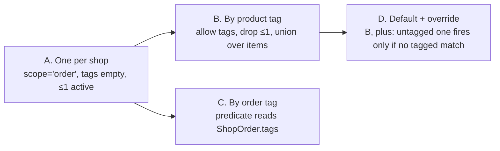

# Order-level workflows — research

Research date: 2026-09-04. Research only, not a spec. The last section lists the decisions this doc asks for.

Scope: Baton runs workflows on order line items (`WorkflowRun`, one per line item × workflow). Nothing runs on the order itself. `workflow-step-model-research.md` → Part 3 parked the idea of an order-level workflow ("revisit after stages and instructions have been used by a real shop"). This doc un-parks it far enough to answer three questions:

1. **Do we need it?** At the product level, is "work that happens once per order" a real gap, or is the order page's rollup enough?
2. **How should it behave?** Trigger, selection (one per shop, per tag, default plus override), multiplicity, late edits.
3. **What would it cost?** Schema, repository, UI, tests, in Baton as it stands after `workflow-stages-spec.md`.

Inputs: a 2026-09-04 live inspection of Route to Ship (`sandbox-shop-01`) plus its shipped client bundle, which carries the complete Help and tooltip text; `route-to-ship-departments-research.md` (amended 2026-09-04 with the same findings); the current code in `WorkflowRunRepository.ts`, `ShopAgent.ts`, and the order and queue routes. Answers from mw on 2026-09-04 are folded in and marked.

## Short answer

Yes, but small. Recommend an **order workflow** that is an ordinary workflow with `scope = 'order'`, at most one active per shop, no tags, that starts when every line-item run on an order is finished and at least one is done. It reuses the run, step, stage, queue, and flag machinery unchanged. Selection by tag, multiple order workflows, and default-plus-override are all expressible later by relaxing one invariant and one predicate, so choosing the small shape now loses nothing.

```text
Line-item runs (per item × workflow)              Order run (per order × order workflow)

  Necklace ×2 · Engraving   ──► done ─┐
  Ring ×1     · Engraving   ──► done ─┼─► all finished, ≥ 1 done ─► Pack & ship: QC ─► Pack ─► Label
  Gift box ×1 · (no match)             │        (order eligible)         (Packing team)
                                       ┘
```

## Part 1 — Do we need it?

### What the boundary decision left open

`workflow-step-model-research.md` → Decisions 6 fixed the line-item workflow's end at "made" and said no pack or ship steps. That is right for the item, but it leaves the handoff after "made" unmodelled: someone has to notice that every item on #1042 is done, collect them, check them together, and pack one box. Today that person watches the order page. The queue, the only surface a floor worker uses, never shows it, and nothing records who packed what or when.

### What Route to Ship says the need is

Route to Ship's per-order department tooltip _(live 2026-09-04, verbatim)_:

> ON: workers complete the whole order in one action (good for Dispatch, Quality Control, Picking — the work is per-order, not per-item). OFF (default): each line item is tracked separately, so workers tick off items one by one (good for Engraving, Assembly — work happens per item).

Three named stations, and one of them (Picking) is upstream of production. So the competitor's own framing is that per-order work is a normal station kind, not an edge case. The rest of their product confirms the pressure from the other side: because items move independently and there is no join, they built dashboard copy for the friction instead of a mechanism to remove it: "{items} finished items are waiting for the rest of their orders", "{done} of {total} items finished, waiting behind siblings", "Some items on this order have finished production and are held back by their siblings."

### Where the value is for Baton's target

Small and medium made-to-order shops (`shopify-production-workflow-deep-dive.md` → Final synthesis) are exactly the ones with one or two people packing everything. The value is not "ship"; Shopify's fulfillment UI does that and Route to Ship never writes fulfillments either. The value is:

- **A queue entry for the pack step.** The packing person sees "#1042 ready to pack" the moment the last item is done, in the same queue they already use, instead of polling the order list.
- **Whole-order QC before packing**, owned by a specific team, with the same Start / Done / note / blocked actions as any step.
- **A record.** Who packed, when, with what note. The order page gets a fourth status beyond "all items made".

What it is _not_ for: pre-production order work (print the order sheet, confirm artwork with the customer). mw decided 2026-09-04: **after-production only**. A pre-production order workflow would start at paid and run alongside item runs; it is a second trigger with a different late-edit story, and no one has asked for it.

### Verdict

Needed, at the level of "one queue entry per order after the items are made". Not needed: anything that models shipping, partial shipment, or per-order units. Route to Ship's code confirms the last point: an order-level task never counts units and never shows the partial-shipping banner (`isOrderLevel === true` short-circuits both), so even the richest competitor keeps the order-level unit a plain checklist.

## Part 2 — What Route to Ship actually has

Summary of the 2026-09-04 inspection; details and quotes are in `route-to-ship-departments-research.md` → Amendments, 2026-09-04.

| Question                         | Finding                                                                                                                                                                                                                                    | Confidence         |
| -------------------------------- | ------------------------------------------------------------------------------------------------------------------------------------------------------------------------------------------------------------------------------------------ | ------------------ |
| Where does per-order work live?  | One department switch, `Complete once per order`. Nothing per task, nothing per pipeline. A department reused in several pipelines is per-order in all of them.                                                                            | High               |
| Is it terminal only?             | No. The pipeline builder does not know the flag exists; a per-order department can sit anywhere. Tooltip names Picking (upstream) and QC (mid).                                                                                            | High               |
| Does it wait for every item?     | **Unknown.** No help text, tooltip, or client code states a join rule. The client completes an order-level task by `(orderId, departmentId, stepOrder)`, which reads like an aggregation view over per-item step runs, not a join.         | Medium-low         |
| Mixed pipelines, untagged items? | **Unknown.** Routing is per item; the Orders board shows "{n} of {m} items — no pipeline" and "Sold from stock", so the state is known, but the grouping rule is not documented.                                                           | Low                |
| Late edits?                      | **Unknown.** `ORDERS_EDITED` is subscribed; behaviour on a grouped task is undocumented. A "production incomplete" badge ("Fulfilled while production steps were still incomplete") shows divergence is tolerated rather than prevented.   | None               |
| Units and partial shipping?      | An order-level task never counts units. The partial-shipping banner ("3 of 4 — ship these 3") is about units of **one line item** and fires only in the final department; a per-order Dispatch gets neither.                               | High (client code) |
| Order tags?                      | None. All routing and the `rts-no-production` escape are product tags.                                                                                                                                                                     | High               |
| Other whole-order mechanisms?    | Escalation scope (whole order / item / unit), rework send-back scope (whole order / item), order notes trail, order status rollup (`Ready for production` → `In production` → `Ready to ship` → `Shipped`). Pipeline selector is per item. | High               |
| Pipelines internally             | Saved as stages: `{stages:[{stageOrder, departmentIds}]}`. Sequential = one department per stage; Parallel = one stage. Same shape as Baton's stages, one level up.                                                                        | High               |

Two things follow for Baton:

- **The competitor never solved the join.** Their per-order task is a grouping of per-item work at one station, and the copy about "waiting behind siblings" is the evidence. Baton's runs are already per item, so a real join ("all item runs finished") is a small query, not a new model. That is the one place Baton can be simpler and better at once.
- **The right unit is the order, not "the step every item reaches".** `workflow-step-model-research.md` → Part 3 already noted that a per-step "once per order" flag is ill-defined when items are on different workflows. Route to Ship's undocumented mixed-pipeline behaviour is the same problem from their side. An order run with no line item avoids it entirely.

The four experiments that would settle Route to Ship's unknowns all need a Shopify order with two or more line items, which the sandbox lacks. None of them changes the recommendation below, because Baton would not copy the aggregation-view design either way.

## Part 3 — How it should behave

### Vocabulary

- **Order workflow**: a `Workflow` with `scope = 'order'`. Merchant copy: "order workflow" or, better, the merchant's own name ("Pack & ship"). Line-item workflows are the default and keep the plain word "workflow".
- **Order run**: a `WorkflowRun` with `lineItemId = null`. Merchant copy: "Pack & ship on #1042". Same steps, stages, ready rule, Start / Done / note / blocked, flags, cancel, un-cancel.
- **Finished**: a run whose status is `done` or `cancelled`. Used only for the trigger.

### Trigger

```text
ready(order) =
  eligible(order)                                            (fullyPaid, not cancelled — unchanged)
  and every line-item run on the order is finished
  and at least one line-item run on the order is done
  and no order run exists for (orderId, orderWorkflowId)     (any status; same idempotency as item runs)
  and (order.processedAt >= orderWorkflow.createdAt          (age rule, unchanged)
       or any line-item run on the order is source = 'manual')  (manual attach opts in; added 2026-09-04)
```

Decisions folded in (mw, 2026-09-04):

- **After production only.** No order run starts at paid.
- **Stock-only orders get nothing.** An order with zero line-item runs never triggers. Shopify handles pure stock orders; Baton is not the pack queue for everything. This also keeps the bulk backfill quiet: thirty days of history creates no order runs unless it created item runs, and the age rule already prevents that.
- **"At least one done"** so an order whose only runs were all cancelled does not start packing. If a merchant cancels every run on purpose, they did not want production on it.

Where it fires: any transition that can make the last open run on an order finished. That is `completeStep` (via `recomputeStatus` reaching `done`), `cancelRun`, and the reconcile pass (which cancels pending runs). `uncancelRun` cannot make an order ready, only un-ready (see late edits). Manual attach creates a new open run and so also cannot. All of these already run inside one DO transaction per action, so the check is one extra query at the end of each.

Items that match no workflow are ignored by the trigger. They are visible on the order page and can be listed on the order run's card ("also on this order: Gift box ×1, no workflow") so the packer knows the box needs it. That is the same "Also on this order" hint Route to Ship shows in Focus view.

### Selection: how many, and which

The four shapes discussed 2026-09-03/04, compared on what a merchant has to understand and what Baton has to build:

| Shape                                   | Merchant rule                                                                        | Selection input                   | Runs per order | Complexity                                                                  |
| --------------------------------------- | ------------------------------------------------------------------------------------ | --------------------------------- | -------------- | --------------------------------------------------------------------------- |
| **A. One per shop**                     | "After all items are made, this workflow runs."                                      | none                              | 0 or 1         | One invariant: at most one active order workflow.                           |
| **B. By product tag, union over items** | "Order workflows have tags too; every order workflow whose tag is on any item runs." | items' product tags               | 0..n, parallel | Reuses item routing; several parallel order runs need a queue story.        |
| **C. By order tag**                     | "Tag the order in Shopify, or let Flow do it, to pick the order workflow."           | `ShopOrder.tags` (already stored) | 0..n           | New tag source; merchants must tag orders, which nobody does by hand.       |
| **D. Default plus override**            | "One default. If any item carries tag X, workflow X runs instead."                   | items' product tags, first match  | exactly 0 or 1 | B's predicate plus a priority rule plus an "instead of" that must be shown. |

Assessment:

- **A is enough for the stated target.** One packing team, one process. The merchant's whole mental model is a single sentence, and there is no selection UI at all. mw: "I would be happy to have the restriction of you can only have one order workflow."
- **B is the natural expansion** because it reuses the tag predicate that already exists for items, and product tags are the thing merchants already maintain for routing. The worry "and or or" resolves the same way as for items: OR, any matching tag, because that is what `matchesLineItem` does and a second rule would be a second thing to learn. The real cost of B is not selection but **multiplicity**: two order runs on one order means two packing queues for one box, which is the case D exists to prevent.
- **C is cheap to build and hard to use.** Order tags are already on `ShopOrder`, but a merchant would need Shopify Flow or manual tagging to drive it. Keep as an option for an integration-minded shop, not as the default path.
- **D is A plus B with a precedence rule.** It answers the "fragile items get packed by a different team" scenario, which is plausible in a larger shop and has no evidence in a small one. It also forces the question "what if two override tags match", which is where the complexity the 2026-09-04 discussion wanted to avoid actually lives.

**Recommendation: A now, with the schema laid out so B and D are additive.** Concretely, an order workflow has the same `tags` column as any workflow and it is simply required to be empty while the "at most one active order workflow" invariant holds. Lifting to B later means: allow tags on order workflows, drop the invariant, and change the trigger's "the order workflow" to "every order workflow whose tags meet the union of the order's item product tags". Lifting to D later means: an order workflow with no tags is the default, and it fires only when no tagged one matches. Neither changes a run row, a step row, or the queue.

Route to Ship is the ceiling here and it has **no order-level selection at all**: the per-order station is a property of a department and applies to every pipeline it sits in. Shape A already matches that. B would exceed it.

### Late edits and other lifecycle events

The order run needs its own answers because its premise ("all items made") can be broken after it starts. Consistent with the item-run policy ("flag and keep", `workflow-instantiation-research.md` → Decisions 3) and with mw's 2026-09-04 answer ("flag it, let a person decide"):

| Event after the order run exists                      | Order run is `pending`                                          | Order run is `active`  | Order run is `done` |
| ----------------------------------------------------- | --------------------------------------------------------------- | ---------------------- | ------------------- |
| New line-item run created (item added, manual attach) | flag `item_added` (keep; premise broken but nobody has started) | flag `item_added`      | untouched           |
| Line-item run un-cancelled                            | flag `item_added`                                               | flag `item_added`      | untouched           |
| Line item removed / qty 0 (its item run gets flagged) | flag `item_removed` (mirrors the item run)                      | flag `item_removed`    | untouched           |
| Quantity changed on an item                           | nothing; the item run carries the flag                          | nothing                | untouched           |
| Order cancelled                                       | cancelled (same as item runs)                                   | flag `order_cancelled` | untouched           |
| Order deleted                                         | cancelled                                                       | flag `order_deleted`   | untouched           |
| Order fulfilled in Shopify before the run is done     | nothing in v1                                                   | nothing in v1          | untouched           |

Two notes:

- **Why flag rather than cancel a pending order run when an item is added.** Cancelling and re-triggering would be automatic and tidy, but the run key `(orderId, workflowId)` is single-use (a cancelled run keeps the key, like item runs), so re-triggering needs un-cancel, and the queue would show the entry disappear and reappear. A flag with the item's name is what the packer needs anyway: "one more item is coming". When the new item's run is done, the flag stays until dismissed; that is the same manual dismiss every other flag uses.
- **Fulfilled before done.** Route to Ship shows a "production incomplete" badge for this. `ShopOrder.fulfillmentStatus` is already stored, so an `order_fulfilled` flag is a two-line addition to reconcile. Deferred because Shopify fulfillment is the merchant's own action and they know they did it; revisit if a shop ships from Shopify before packing in Baton and loses track.

The flag list grows by one value, `item_added`, and `item_removed` gains a second producer. `flagDetail` carries the line item title.

### Queue and order page

- **Queue.** An order run's ready steps appear in the owning team's queue like any other, sorted by the same rule. The card differs only in header and body: "#1042 · Pack & ship" instead of "#1042 · Necklace ×2 · Engraving", and the body lists the order's line items with quantity and, for each, whether it had a run (read live from `OrderLineItem`, not snapshotted, so a late-added item shows up on the card as soon as it exists). Personalization is per item; the card shows each item's `customAttributes` under its row, since the packer is the last person to check the engraving text against the box.
- **Order page.** A section after the line items: the order run with its stages and steps, the same component the item runs use. Before the run exists, one line: "Pack & ship starts when all items are made" so the merchant knows the hook is armed. No new statuses on the order.
- **Editor.** Creating a workflow asks one question: "What is this workflow for?" with two answers, "Making one item" (default) and "The whole order, after every item is made". Order scope hides the tags field and shows a one-sentence explanation of the trigger. The workflows index shows the order workflow in its own short section so the "at most one" rule is visible rather than enforced by an error nobody expected. Archiving it is allowed; existing order runs continue, new ones stop, same as item workflows.

### Things deliberately not modelled

- **Per-order steps inside an item workflow** (Route to Ship's flag). Rejected in `workflow-step-model-research.md` → Part 3 and confirmed here: undefined when items are on different workflows, and the competitor never documented the mixed case.
- **Shipping.** No fulfillment write, no carrier, no partial-shipment policy. Route to Ship's partial policy is per-unit and per-line; nothing at the order level.
- **Order workflow before production.** See Part 1.
- **Blocking the order run on items without a workflow.** A stock item on a made-to-order order does not need making; the packer just needs to know it exists, which the card shows.

## Part 4 — What Baton would need

Everything below is additive to `workflow-stages-spec.md`. No existing row changes shape.

### Schema (`initializeSchema`, edited in place; prototype, reset local state)

```sql
-- Workflow
scope text not null default 'item' check (scope in ('item', 'order'))
-- at most one active order workflow, enforced in the repository (SQLite partial unique
-- index on a constant is possible but the error is unfriendly; do it in code with a select)

-- WorkflowRun
lineItemId text                       -- was not null
lineItemTitle text                    -- was not null
quantity integer                      -- was not null
customAttributes text                 -- was not null
-- unique (lineItemId, workflowId) keeps item runs single-use; nulls are distinct in SQLite, so:
create unique index if not exists WorkflowRun_order_uidx
  on WorkflowRun (orderId, workflowId) where lineItemId is null;

-- flag check gains 'item_added'
```

Keeping the four line-item columns nullable rather than moving them to a second table keeps every existing query, decoder, and the queue join untouched; the order run simply has nulls there. `Domain.WorkflowRun` becomes a union or gains `NullOr` on those four fields; a `scope` derived from `lineItemId === null` avoids a second stored discriminator.

### Repository

- `WorkflowRepository`: `createWorkflow` takes `scope`; refuse a second active order workflow (`OrderWorkflowExistsError`); `setTags` refuses tags on order scope; `archive` unchanged. `WorkflowDetail` carries `scope`.
- `WorkflowRunRepository`:
  - `startOrderRunIfReady({ orderId, orderWorkflow, activeTeams })`: the trigger predicate above as one query plus `insertRun` with `lineItemId null`. `isRoutable` applies unchanged (archived, no steps, inactive team all mean no run).
  - Called at the end of `completeStep` (after `recomputeStatus`), `cancelRun`, and `reconcileOrder`. Each already has the transaction; add the call, not a new transaction. `RoutingContext` already carries all workflows, so the order workflow is `workflows.find(w => w.workflow.scope === 'order')`.
  - `reconcileOrder` step 5 gains: for each open order run, if any line item now has an open run that did not exist when the order run was created, flag `item_added`; if an item run got `item_removed`, mirror it. The simplest "did not exist" test is `run.createdAt > orderRun.createdAt`.
  - `uncancelRun` on an item run: flag the order run `item_added` if one is open.
  - `listQueue`: no change to the ready rule; the row already joins `ShopOrder` for `orderName`, and the card needs the order's line items, which is a second query keyed by the order runs in the page (bounded by the queue page size).
  - `listRunsForOrder`: `order by lineItemId nulls last`.
- Trigger idempotency is the partial unique index plus `on conflict do nothing`, same as item runs.

### ShopAgent and client

- Embedded callables: `createWorkflow` gains `scope`; no new callable for order runs, `listRunsForOrder` already returns them.
- Member RPC: unchanged; `startStep`, `completeStep`, `setStepNote`, `blockRun`, `dismissFlag` take a run step id and never look at `lineItemId`.
- Logging: `WorkflowRunRepository.startOrderRun: shop=… orderId=… workflowId=…` with annotations, one line per trigger.

### Browser

- `app.workflows.index.tsx`: order workflow section; "Add order workflow" hidden when one is active.
- `app.workflows.$workflowId.tsx`: scope shown read-only after creation; tags field hidden for order scope; trigger sentence.
- `app.orders.$orderId.tsx`: order run section; "starts when all items are made" placeholder.
- `shop.$shop.queue.tsx`: order card variant.

### Seed and tests

- `scripts/seed.ts` / `api.dev.seed.ts`: one order workflow ("Pack & ship": QC → Pack, one Packing team).
- `workflow-run-repository.test.ts`: trigger matrix — all done; one cancelled + one done; all cancelled (no run); stock-only order (no run); duplicate trigger (one run); item added after pending / after active (flag); un-cancel after active (flag); order cancelled with pending / active order run; order workflow archived before trigger (no run); age rule.
- `workflow-repository.test.ts`: second active order workflow refused; tags refused on order scope; archive then create allowed.
- `shop-agent-workflows.test.ts`: complete the last item step through the member seam and see the order run appear in the packing team's queue.

### Rough size

About the size of the stages work minus the editor invariants: schema and Domain half a day, repository and trigger one day, UI one day, tests half a day. The trigger is the only new logic; everything else is plumbing nulls through.

## Part 5 — Expansion paths, so nothing decided now is lost



Each arrow is a predicate change and an invariant change. No arrow touches `WorkflowRun`, `WorkflowRunStep`, the queue, or the flags. B introduces the only real product question, several parallel order runs on one order, and D is the answer to it if it ever comes up.

## Decisions (2026-09-04, mw)

1. **Shape A, locked.** One active order workflow per shop, `scope = 'order'`, no tags on it, no product-tag or order-tag selection. Archive and re-create is the only way to change it. Rationale: Route to Ship, the ceiling, has no order-level selection either; packing is decided by the shop not the product; multiple order workflows create the precedence problem rather than solve it; the additive path (tags column stays, invariant lifts) keeps B and D reachable without touching runs.
2. **After production only.** No order run starts at paid.
3. **Stock-only orders never trigger.** Trigger needs at least one line-item run done.
4. **Late items flag, never auto-cancel.** New flag value `item_added`; un-cancel of an item run and manual attach flag the same way.

5. **Fulfilled-before-done: no flag.** `ShopOrder.fulfillmentStatus` is stored, so an `order_fulfilled` flag is two lines in reconcile when wanted; the merchant did the fulfilling and knows.
6. **Nullable line-item columns on `WorkflowRun`**, not a second table, so the queue, order page, decoders, and every action stay shared.
7. **Cancel counts as finished for the trigger.** Cancelling the last open item run starts the order run immediately if another run is done.
8. **Dismissing `item_added` has no precondition.** A person's judgement, as for every other flag; the card shows the new item's run status live.
9. **Order-run queue card**: order name, workflow name, every line item with quantity and live run status, each item's `customAttributes`, the order note. No snapshot of the item list on the run.
10. **Order page placeholder** "Pack & ship starts when all items are made" shows whenever an order workflow is active and the order has at least one item run.
11. **Manual attach opts an old order in** (found in the first browser smoke, 2026-09-04). The age rule blocked the order run on a Sep 1 order whose item run had been attached by hand and worked to done, which read as a dead end. Manual attach is already the documented override of the age rule for the item, so the same signal now overrides it for the order: if any item run on the order is `source = 'manual'`, the order workflow starts regardless of `processedAt`. Bulk history stays quiet because tag routing never creates a run on an order older than its workflow. Alternatives considered: dropping the age rule for order workflows entirely (simpler, but a backfill plus a stray old item run would start packing), or leaving it (correct by the letter, surprising in practice).
12. **Scope is fixed at creation**, shown read-only afterwards.
13. **Cancel / un-cancel of an order run**: admin on the order page, same as item runs. No new authorisation.
14. **No orders-index column** for the order run yet.

## Next

An `order-workflow-spec.md` covering: `scope` on `Workflow` and its invariant in `WorkflowRepository`; the four nullable columns and partial unique index on `WorkflowRun`; `startOrderRunIfReady` and its three call sites; `item_added` in reconcile and `uncancelRun`; the editor's scope question; the queue and order page variants; seed; and the trigger test matrix above.
