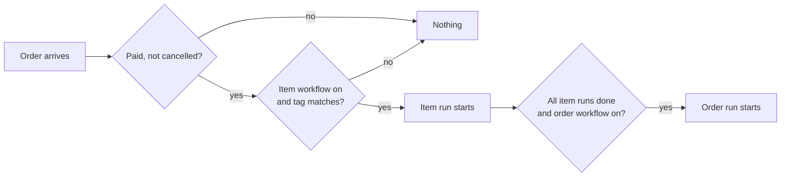
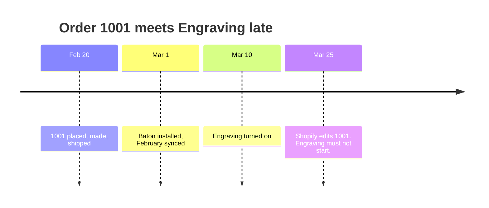
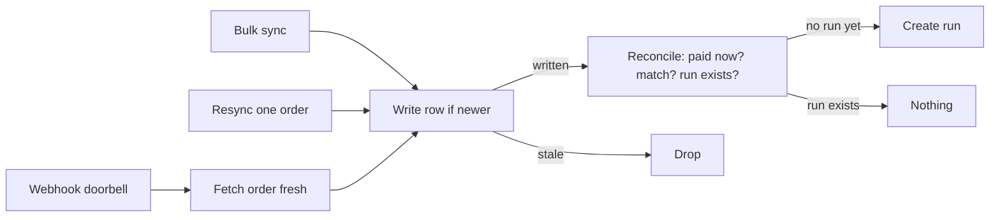
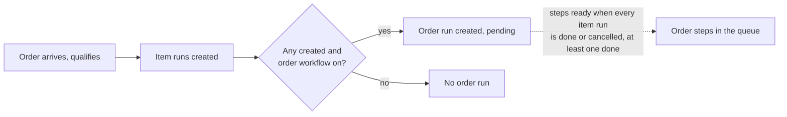

# The order workflow as a singleton, its own route, and how orders come into scope — research

Research date: 2026-09-07, revised the same day after review. Starts from `184bbf9`. Reverses one decision in `workflow-naming-research.md` §3 (the fold of the order workflow into `/app/workflows`, shipped in `5cfab98`) on new evidence: the combined page is too cluttered and does not work. Everything else in that document stands.

Non-goal, settled: no second SQLite migration. Nothing is deployed, `pnpm d1:reset` wipes local Durable Object storage, and every schema change here is an edit to `1_initialize schema`.

## Decisions taken, 2026-09-07

1. **Nav shape:** a sibling entry `Order workflow` immediately after `Workflows`. The App Bridge nav cannot nest (§5).
2. **Apply of an empty draft:** refused, on or off (§2).
3. **Name:** the fixed `Order workflow`, not renamable (§3).
4. **Id:** the fixed `"order"`, exported as `Domain.ORDER_WORKFLOW_ID`.
5. **The `Item workflows` heading** on `/app/workflows`: removed. The page heading is enough.

## 1. The order workflow is a singleton

### What delete does today

`removeWorkflow` deletes the `Workflow` row and lets `on delete cascade` take its steps, draft, and draft steps. Runs stay on their orders. For the order workflow, delete also frees the one-per-shop slot (`Workflow_order_uidx`), which is why `OrderWorkflowExistsError` says "Delete it first to create another" and why the index carries a second create modal that appears only while the slot is empty.

That whole apparatus exists to manage a slot that holds at most one row: `requireOrderWorkflowSlot`, `OrderWorkflowExistsError` and its `WorkflowResult` tag, the `CreateWorkflowInput` order variant, the `Create order workflow` modal and its empty state, the order guard in `duplicateWorkflow`, the "at most one" check in `replaceWorkflows`, and every `orderWorkflow === null` branch downstream (`OrderDetailView.orderWorkflow` is `NullOr`, `getOrderWorkflow` is an `Option`, `startOrderRunIfReady` and `startReadyOrderRuns` early-return on `undefined`).

### Trade-offs

|                                          | Deletable (today)                                                                                     | Singleton, never deleted                                                                                  |
| ---------------------------------------- | ----------------------------------------------------------------------------------------------------- | --------------------------------------------------------------------------------------------------------- |
| **What "I don't want this" means**       | Delete, or turn off. Two verbs for one intent, and delete is the destructive one.                     | Turn off. One verb, reversible, and the one Flow uses for the same intent.                                |
| **Getting it back**                      | Create again: a name prompt, then an empty editor.                                                    | Turn on. Steps are still there.                                                                           |
| **Empty state on the index**             | Needed: "No order workflow yet" plus a create button.                                                 | None. The page always has the one thing it is about.                                                      |
| **Code**                                 | Slot pre-check, named error, second create path, null branches everywhere the order workflow is read. | Slot is a schema fact, not a runtime check. `getOrderWorkflow` stops being an `Option`.                   |
| **The merchant who wants a clean slate** | Delete and recreate.                                                                                  | Edit, remove every step, Apply (§2).                                                                      |
| **Mental model**                         | "One of my workflows, which happens to be special."                                                   | "The shop's order workflow." Matches how it is named in copy already: _the_ order workflow, one per shop. |

The one thing delete does that turn-off does not is reset the age rule, because the rule keys on `createdAt` today. §4 replaces that rule for both kinds, so this stops being a reason to delete.

### Recommendation

**Make it a singleton.** The merchant never creates it and cannot delete it.

- `initializeSchema` inserts the row once, right after the `Workflow` table, the way `SyncState` already does (`insert or ignore into SyncState (id) values (1)`). The migration is Effect code with a `SqlClient`, so `Clock.currentTimeMillis` is available for the timestamps. Id `Domain.ORDER_WORKFLOW_ID = "order"`: links, stub calls, seeds and tests name it directly, `getOrderWorkflow` is a plain lookup by id, and no UUID can collide with it. `WorkflowId` is a string brand, so nothing changes shape. Off, zero steps, `tags = '[]'`, name **Order workflow**. `insert or ignore` on the primary key makes it idempotent.
- `CreateWorkflowInput` loses its order variant; create is item-only. `requireOrderWorkflowSlot`, `OrderWorkflowExistsError`, the `OrderWorkflowExists` result tag, and the second create modal go. `Workflow_order_uidx` stays as the backstop it always was.
- `deleteWorkflow` refuses `ORDER_WORKFLOW_ID` with a named error, so a stale client that still sends it gets a message. The UI never offers the control: the order workflow's page has no **Delete**, matching how **Duplicate** was hidden in `184bbf9`.
- `getOrderWorkflow` returns the workflow, not an `Option`; `OrderDetailView.orderWorkflow` stops being nullable; the `undefined` early-returns in the run repository become unreachable and go.
- `WorkflowLimits.maxWorkflows` (50) counts the singleton. Not worth a special case.

## 2. Zero steps

### The invariants

1. **A run is never created from a workflow with zero steps.** An empty run would be `done` the instant it exists, which lies about work nobody did, and for an item workflow it would also satisfy the order-workflow trigger. Item and order alike.
2. **Every workflow starts life with zero steps and off.** There is no credible default step: the schema seeds the order workflow that way, and Create makes an item workflow that way.
3. **Turn on requires steps** (every one assigned to a team). Turning on a zero-step workflow would violate invariant 1, so it is refused. Unchanged: `NoStepsError`, and the button is disabled with its reason.
4. **Apply requires steps.** An empty draft cannot be applied. Unchanged: `NoStepsError` from `applyDraft`, "Add at least one step before you can apply."

Together: **zero steps is the state before the first Apply, and only that.** Once a workflow has been applied it always has at least one step. The path for both kinds is the same four verbs: Edit, add steps, Apply, Turn on.

### Why keep refusing Apply of an empty draft

The earlier draft proposed allowing it while the workflow is off, so the order workflow could be emptied without being deleted. Trade-off:

|                                          | Refuse (today)                                                                                                                                                     | Allow while off                                                                              |
| ---------------------------------------- | ------------------------------------------------------------------------------------------------------------------------------------------------------------------ | -------------------------------------------------------------------------------------------- |
| Rules                                    | One: applied means has steps.                                                                                                                                      | Two: applied means has steps, unless off. Plus a new `EmptyWhileOn` result and blocker copy. |
| "I want to clear the order workflow out" | Turn it off. Its steps stay, unused. To rebuild, edit the draft: every step can be removed and new ones added before Apply, so the old steps never block anything. | Empty it, then it shows **Off · No steps** again.                                            |
| What the merchant loses by refusing      | Only the ability to make a workflow look brand new. Nothing they can do with it changes.                                                                           | —                                                                                            |

**Recommendation: refuse, as today.** The draft already lets a merchant replace every step in one Apply, so emptying as a separate state buys nothing. `EmptyWhileOn` is dropped. Delete stays the way to make an **item** workflow disappear; the order workflow never disappears, it is off.

### Gaps around the invariants

- **A team delete can leave an on workflow unable to start.** `deleteTeam` nulls `teamId` on workflow steps, but `active` stays 1, so "on" and "can start" are not the same thing today: `canStart` re-checks steps and assignment on every start, and the index shows **Needs attention**. That is by design (the object refuses nothing on a team delete; the fix is assign a team) but it means the honest statement is _on and startable_, not just _on_. The order page already says "cannot start: it has a step with no team". No change proposed; noted so nobody assumes `active = 1` alone means runs will start.
- **Discard on a never-applied workflow** leaves it with zero steps and no draft. Correct: that is the state before the first Apply.
- **The seed** (`replaceWorkflows`) may create a workflow with zero steps only when it is off. It already checks this.
- **Duplicate** copies steps into an off workflow. Fine under the invariants.

### The merchant copy on `Domain.Workflow`

- delete an **item** workflow and its runs stay on their orders; the order workflow is never deleted, only turned off;
- turn off stops new runs and open ones finish (unchanged);
- **a workflow needs at least one step before it can be applied or turned on** (unchanged in substance, now stated);
- any open step on a run can be assigned to another team (unchanged);
- deleting configuration never deletes work (unchanged).

## 3. Rename

What a workflow's name is for: telling many apart on the index, naming the run on the order page and the queue (`workflowName` is snapshotted on every run), and naming the owner on the Teams page's owned-steps list. For the order workflow the first purpose does not exist, and for the other two the word that carries meaning is the **step** name: a worker's queue row reads "Order workflow · Pack" and "Pack and ship · Pack" equally well, because "Pack" is the work.

What a fixed name buys: every surface can say "the order workflow" and be quoting its heading exactly; the nav label, the page heading, the run card, the queue, the trigger copy on the order page and the Teams page all agree without a lookup; there is no rename modal, no `NameTaken` path for it, and `Workflow_name_uidx` never has to arbitrate between it and an item workflow named the same. It also matches what the thing is: not a workflow the merchant authored and titled, but a fixed part of the shop that they fill in.

What it costs: a merchant who thinks of it as "Packing" or "Dispatch" cannot say so in the name. They can say so in the stage and step names, which is where the floor reads it anyway.

**Recommendation: not renamable.** `updateWorkflow` refuses `ORDER_WORKFLOW_ID`; the page has no Rename, so **More actions** disappears from it entirely (Rename was the only item left after Duplicate and Delete went). The nav label and the page heading are the literal string `Order workflow`.

## 4. Which orders a workflow starts on

### What Turn on and Turn off do to runs: nothing

A run copies the workflow when it starts and never reads it again. Turn off stops new runs; open ones finish. Turn on starts new ones. Neither touches anything already running. That is already true and stays true.

### The normal case needs no rule

An order comes in by webhook. Baton checks the workflows that are on: item workflows whose tags match a line item start a run for it; when all of those runs are done, the order workflow starts a run for the order.

### The problem: Baton meets old orders late

Baton also sees orders **after** they were placed: **Sync last 30 days** loads a month at once, and Shopify sends an **edit webhook** whenever it touches an old order (a note, a refund, a tag). Each time, an order placed before a workflow was turned on meets that workflow.

Example. Install March 1, sync February. On March 10 the merchant builds "Engraving" and turns it on. Order #1001 from February 20 is engraved and shipped. On March 25 a customer's email is corrected; Shopify sends an edit webhook; with no rule, Baton starts an engraving run on a ring that left a month ago.

So each workflow needs a date, and orders placed before it are not that workflow's business.

### Today's date is the wrong one, and it needed a patch

Today the date is `createdAt`. For an item workflow that is nearly right. For the order workflow it breaks once the schema creates it: the date becomes install day, so nothing is ever too old, and the first Turn on would find a month of finished orders. `7b7ab34` added a catch-up on Turn on (`sweepOrderRuns`) because with `createdAt` as the date, orders arriving between Create and Turn on were eligible but had missed their trigger moment. The catch-up is a patch for the date being in the wrong place.

### The rule: from this point forward

One column, **`activatedAt`**. Null means off. **Turn on** sets it to now. **Turn off** sets it to null. It replaces the `active` boolean, so "is it on" and "since when" are the same fact and cannot disagree. There is no first, second or last: only the current one, and null when off.

**A workflow starts a run on an order only if the order was placed on or after the workflow's `activatedAt`.** Same rule for item and order workflows, on every path: new-order webhook, edit webhook, sync, resync. Nothing placed before that date is ever touched, however Baton learns about it later. No catch-up code.

**Apply does not touch `activatedAt`.** Only Turn on and Turn off do. `activatedAt` means "this workflow has been responsible for orders placed since this moment", and editing the workflow does not change what it is responsible for. Every workflow page carries one sentence: "Applies to orders placed since April 15, 2:03 pm." A workflow that is off says "Off." The merchant can move the date (next section).

Why Apply must not reset it (raised 2026-09-07, and it reversed an earlier decision): pay-later is common (draft orders and invoices, bank transfer, B2B terms, pre-orders). An order placed unpaid on the 5th while the workflow is on, a small edit applied on the 8th, payment landing on the 12th: if Apply had moved the date to the 8th, the order would be silently disowned by a workflow that was on the whole time. Silent omission is the worst failure here. With the date untouched, the observation that shows the order paid reconciles it, its date is after the Turn on, and the runs start.

**Apply while on reconciles every stored order once, immediately.** A tag added on Apply can match paid, unfulfilled orders already in Baton, and without this they would start at whatever random moment Shopify next edited them. Reconcile is an idempotent state check, so running it over all stored orders at Apply is safe and makes the timing deterministic: anything that now qualifies starts at Apply, and the Apply dialog can say how many. Orders placed before the Turn on are still excluded by the date rule. This is not the old catch-up: there is no trigger to miss and no special query, only the same reconcile run now rather than later.

Same shop with the rule: Engraving's `activatedAt` is March 10. Order 1001 is before it and is never touched. The order workflow, turned on April 1, applies to orders placed from April 1; March's shipped orders are never touched.

### The date the merchant can change

Decided 2026-09-07. `activatedAt` is the merchant's to see and to move, but the merchant should almost never have to think about it.

**What the merchant decides is a count, not a date.** The one question Turn on raises is "should the orders already waiting be included?" On a fresh shop the answer is no: they were handled before Baton. The exception is the shop that turned a workflow on with unpaid or unfulfilled orders already placed that it wants covered. So the Turn on dialog asks that question, and only when it applies:

> Turn on Engraving? It starts on orders placed from now.
> 4 earlier orders are unfulfilled and would match. **Include them**

The default is exclude. When the count is zero the second line is absent and the dialog is a plain confirm. **Include them** sets `activatedAt` to the placed date of the earliest of those orders and reconciles every stored order once, so they start right there. The count is computed by the same reconcile predicate, unfulfilled and not cancelled and matching by tag, over orders placed before now, paid or not: an unpaid one counts because it will qualify the day it pays.

**Where the date lives afterwards.** The workflow page carries one sentence with one control: "Applies to orders placed since April 15, 2:03 pm · Change". Changing it is the escape hatch for the rare correction (turned off by mistake and turned back on, or a cut-off chosen too late) and reconciles every stored order once. Moving it later never touches an existing run.

The date is the mechanism and the count is the decision. On the common path the merchant clicks Turn on and reads nothing about dates. When they do read the sentence it is about orders, which they already think in, and "placed" is the date under the order number in the admin.

### Off is off

A workflow is on or off. Off means no run is ever created from it, for any order, on any path. On means runs are created for orders placed from the moment it was turned on. There is no third state and no notion of holding a place while off: turning a workflow off and on again is two independent acts, and an order placed while it was off is never that workflow's business.

Example. Engraving is turned off April 12. Order 1042 is placed April 13. Engraving is turned on April 15. Order 1042 does not start, because it was placed before April 15. Its order page says: "Engraving was turned on after this order was placed, so it will not start here. Attach it to an item to start it." The same sentence covers an order placed before the order workflow was turned on. Every skipped order says why, and attach is the override.

### How Baton knows an order is paid

It does not detect the flip, and it does not need to.

Every way an order reaches Baton ends in the same two steps inside one transaction: write the order row, then run `reconcileOrder` on it. The webhook is a doorbell only: Baton fetches the order fresh and goes through the same two steps. Bulk sync, single-order resync and the dev seed do the same. An observation older than the stored row (`updatedAt` guard) is dropped before either step, so a retried webhook can never overwrite fresh data or reconcile against stale data.

Reconcile is a **state check**, not an event handler. It asks, right now: is the order paid and not cancelled; which on workflows match its line items by tag and date; and for each match, does a run for `(workflowId, lineItemId)` already exist? If not, it creates one. `WorkflowRun` has a unique key on that pair, so reconciling the same order a hundred times creates nothing twice. That key is Baton's memory that it already acted; no separate "seen paid" flag is needed, because the run's existence says it.

So a run starts **the first time Baton observes the order in a paid state**, whichever path delivers that observation. Only `processedAt` is compared, against the workflow's `activatedAt`. The moment of the paid flip is never known and never needed.

**Which date "placed" is.** Shopify's order has two: `createdAt`, the row timestamp, and `processedAt`, which Shopify's own docs describe as "the date and time that appears on your orders and that's used in the analytic reports" and which importers set to the past to match the original order. The date under the order number in the admin ("September 4, 2026 at 8:57 pm") is `processedAt`. For a normal storefront order the two are identical; they differ only for imported or backdated orders, where `processedAt` is the one the merchant meant. So Baton's date for an order is `processedAt`, and the reason is the merchant's: **the date under the order number is the date Baton uses.** Merchant copy never names either field; the word is "placed": "Applies to orders placed since April 15."

Payment has no date on the order. The admin timeline entry "manually marked as paid" is a transaction, which is why `fullyPaid` is a boolean. Two notes from checking: there is an `orders/paid` webhook topic, which Baton deliberately does not subscribe to because `orders/updated` already fires on payment (`shopify.app.toml`); and the transaction carries its own timestamp, which Baton could fetch but should not, because a workflow's coverage must be predictable from the date the merchant sees.

**Order `createdAt` is dropped** (decided 2026-09-07). Today it is fetched by both sync queries, stored on `ShopOrder`, and read by nothing: no page renders it and no decision compares it. Baton's one date for an order is `processedAt`, the moment the order became concrete in Shopify. Storing a second date that nobody uses invites the next reader to wonder which one matters. The implementation removes it from the `ShopOrder` table, `Domain.ShopOrder`, `OrderSync`'s GraphQL selection and decoder, `OrdersBulkRepository`'s bulk query, and the seed, with a JSDoc on `Domain.ShopOrder.processedAt` saying that `createdAt` is deliberately not persisted because `processedAt` is the order's date everywhere in Baton.

Where it can go wrong, and why tracking a paid flag would not help:

- The observation that would show "paid" never arrives (a missed webhook). Nothing starts until the next observation, which is what resync with its 15 minute overlap is for. A flag cannot fix not seeing the order.
- Paid, refunded to unpaid, paid again: runs from the first paid observation persist. Intended: a payment wobble never cancels work.
- An order placed before `activatedAt` and paid after it is skipped. Attach covers it.

### The order run is created with the item runs

Today the order run is created lazily: when the last item run on an order finishes, `startOrderRunIfReady` checks five conditions and inserts it. That is a write-time trigger, and a trigger can be missed (the workflow was off at that moment), which is what needed the catch-up. It also leaves the merchant guessing while items are in progress: nothing on the order says packing is coming.

**Decided 2026-09-07: create the order run at the same time as the item runs.** On reconcile, when an order qualifies (paid, not cancelled, placed on or after the workflow's `activatedAt`), Baton creates every matching item run and, if at least one was created and the order workflow is on and qualifies by the same date rule, the order run too, in the same transaction. Manual attach does the same: if it creates an item run and the order has no order run, it creates one. Everything an order will go through is decided when it arrives.

"The order run waits for the items" becomes a **read-time readiness rule** instead: an order-run step is ready only when no item run on the order is open and at least one is done. That is the queue's existing rule ("no open step in an earlier stage") with the item runs as stage zero, one extra condition in the readiness query. Because it is evaluated live, a line item added by a later order edit, or an item workflow attached by hand, simply makes the order run wait longer. If every item run ends cancelled, reconcile cancels the pending order run; the existing order-run flags (`item_removed`, `order_cancelled`, `order_fulfilled`) stay.

What it removes: `startOrderRunIfReady`, `startReadyOrderRuns`, `sweepOrderRuns`, the `anyDone / anyOpen / started / optedIn` query, and the five-condition trigger JSDoc on `WorkflowType`, which becomes one sentence: the order run is created with the item runs and its steps become ready when they finish.

Trade-offs accepted: editing the order workflow does not affect orders already in progress (already true of item runs, and what "applies to orders placed since" promises); an order with no matching items gets no order run until an item workflow is attached by hand; the queue and the orders index need a "waiting for items" presentation for a pending order run whose items are open, derived from data already in hand.

### The manual override stays

Attaching a workflow to a line item by hand ignores the date, and an order with an attached item is opted in for the order workflow. That is how the merchant pulls one old order onto the floor on purpose, including the month of history after a fresh install: none of it starts on its own, and the merchant attaches what is still on the bench. Every competitor researched behaves this way.

### What changes in code

- `Workflow.active` (integer 0/1) becomes `Workflow.activatedAt` (integer, nullable). `Domain.Workflow` exposes `activatedAt`; every `active` read becomes `activatedAt !== null`. `setWorkflowActive` writes now, or the earliest waiting order's placed date when the merchant chose Include them, or null; a new `setWorkflowActivatedAt` changes it on an on workflow. Both reconcile every stored order afterwards. `applyDraft` never touches it; on an on workflow it reconciles every stored order after the write.
- `matchesLineItem` and `startOrderRunIfReady` compare `processedAt` to `activatedAt` instead of `createdAt`. An off workflow never reaches the comparison, so it never sees null.
- `startOrderRunIfReady`, `startReadyOrderRuns` and `sweepOrderRuns` go. `reconcileOrder` and `attachWorkflow` create the order run alongside item runs; the readiness query gains the item-runs-done condition for order-run steps; reconcile cancels a pending order run whose item runs all ended cancelled.
- The order page's `tooOld` line and the trigger copy say "turned on" instead of "created". The workflow page shows "Applies to orders placed since <date>".
- The seed sets `activatedAt = createdAt` on fixtures marked active, so seeded orders qualify.

## 5. The route

### The sidebar cannot nest

The App Bridge `s-app-nav` reference: "You can't nest navigation items inside other navigation items. Structure your app with a single level of navigation." (`refs/shopify-docs/docs/api/app-home/latest/app-bridge-web-components/app-nav.md`, Limitations.) The nav becomes `Orders`, `Workflows`, `Order workflow`, `Teams`, `Members`. The singular next to the plural is the taxonomy in two words. Naming research §3 chose the fold over this on grounds of weight; the evidence since is that the fold makes the list page worse on every visit, and adjacency plus the trigger line on its own page teach the relationship well enough.

### Routes

| Route                                    | What it is                                                                                                                                                                                                                                                                                                                                                             |
| ---------------------------------------- | ---------------------------------------------------------------------------------------------------------------------------------------------------------------------------------------------------------------------------------------------------------------------------------------------------------------------------------------------------------------------- |
| `/app/order-workflow`                    | The order workflow's read-only page: heading `Order workflow`, Active/Off accessory badge, **Edit**, **Turn on / Turn off**; the Live / Draft tabs; the "When it runs" trigger box; `StageFlow`. No More actions (nothing left in it), no breadcrumb (top-level). Loader reads by `ORDER_WORKFLOW_ID`; no `$workflowId` in the URL because there is nothing to choose. |
| `/app/order-workflow/edit`               | The editor, the current `app.workflows.$workflowId_.edit.tsx` for `type === "order"`: no tag editor, no Rename, no Delete. Breadcrumb back to `/app/order-workflow`.                                                                                                                                                                                                   |
| `/app/workflows`                         | Item workflows only. The order section, `CREATE_ORDER_MODAL`, `renderOrderWorkflow`, `orderName` state, the `One per shop` badge, and the `Item workflows` heading go. The section keeps its one-line description.                                                                                                                                                     |
| `/app/workflows/$workflowId` and `/edit` | Item workflows only. `ORDER_WORKFLOW_ID` here redirects to `/app/order-workflow` (loader `redirect`), so no stale link 404s. The `workflow.type === "order"` branches in both files are deleted rather than left dead.                                                                                                                                                 |

Copy the two route files rather than extracting a shared page component: the type branches come out of both sides, which removes more code than the copy adds, and the pairs are allowed to drift because they are about different things. `StageFlow`, `AttentionBanner`, the mutations, the modals and `workflowShared.ts` are already shared.

### Links that move

- `app.orders.$orderId.tsx`: the `orderWorkflowLine` messages link to `/app/order-workflow`. The `orderWorkflow === null` case goes.
- `app.teams.$teamId.tsx:204`: the owned-steps link chooses by `type`.
- `app.tsx`: the nav entry.
- `e2e/workflows.spec.ts` "the order workflow is created from its own section": rewritten as "the order workflow exists from the start and opens from the nav".
- `e2e/seed.ts`, `e2e/fixture.ts:179`: order fixtures describe the singleton rather than create it.

### Seed

`replaceWorkflows` deletes every `Workflow` row and re-inserts the fixture. With a singleton it instead deletes every item workflow, then updates the singleton in place from the fixture's `type: "order"` entry (active, steps, draft, `since`) or, when the fixture has none, resets it to off and empty. The "at most one order workflow" check stays as a fixture-validity rule.

## Summary

| Question                           | Answer                                                                                                                                                        |
| ---------------------------------- | ------------------------------------------------------------------------------------------------------------------------------------------------------------- |
| Delete the order workflow          | Never. Seeded in `initializeSchema` with id `order`, off and empty. The order create path, slot check and null branches go.                                   |
| Rename the order workflow          | No. The name is the literal `Order workflow` everywhere; More actions disappears from its page.                                                               |
| Zero steps                         | The state before the first Apply, and only that. Turn on and Apply both require steps. No empty runs, ever.                                                   |
| Order `createdAt`                  | Not stored. `processedAt` is the order's only date; the schema and both sync queries drop `createdAt`, with a JSDoc saying why.                               |
| When a workflow starts on an order | The order was placed on or after the workflow's `activatedAt`, set by Turn on only. Same rule for both kinds and every path. Attach is the per-item override. |
| Turning on / applying while on     | From this point forward only. Never touches running runs, never goes back. `sweepOrderRuns` goes.                                                             |
| Backlog on a new shop              | Not started automatically. Attach pulls in what is still on the bench.                                                                                        |
| When the order run is created      | With the item runs, at order arrival (or at manual attach). Its steps become ready when the item runs finish: a readiness rule, not a trigger.                |
| Nav and routes                     | Sibling entry `Order workflow`; `/app/order-workflow` and `/app/order-workflow/edit`; item routes redirect the order id.                                      |

## Decisions on the earlier open questions

- The Turn on dialog offers to include waiting orders by count; the workflow page lets `activatedAt` be changed. Agreed 2026-09-07.
- Apply does not touch `activatedAt`; Apply while on reconciles all stored orders. Revised 2026-09-07 after the pay-later case; it replaces the earlier "Apply resets it" decision.
- `activatedAt` replaces the `active` column. Agreed 2026-09-07.
