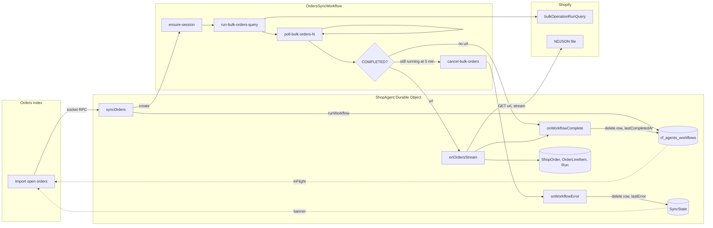
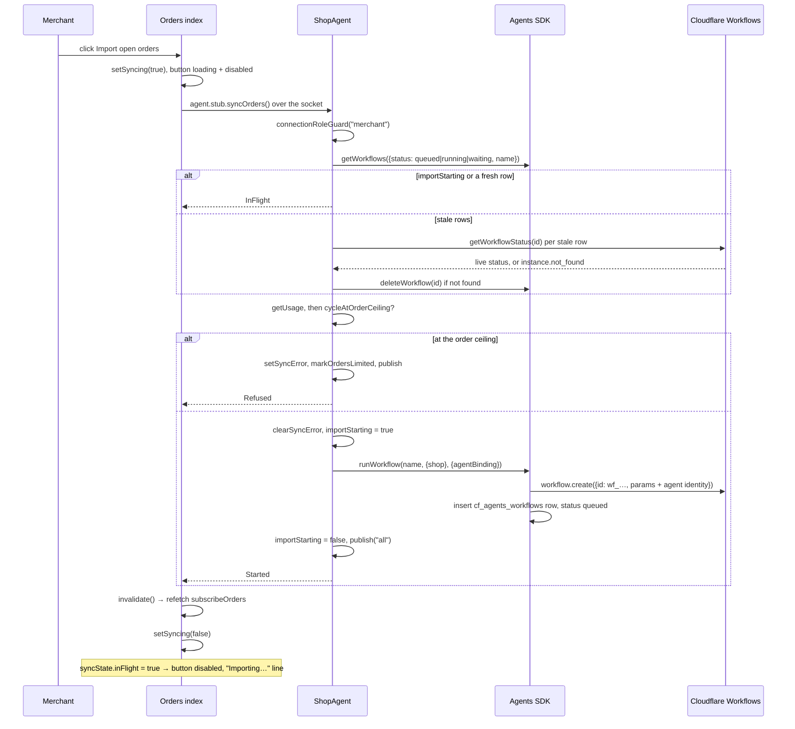
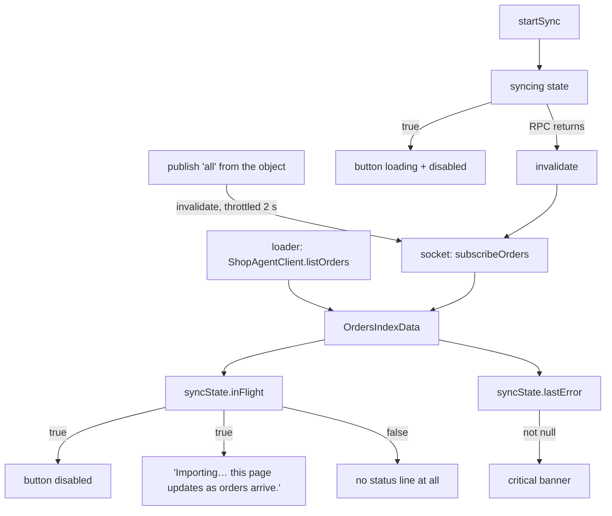

# Import open orders: how the import works, end to end

Written 2026-09-30 against `main` at `72c8e25`. The screen word is **Import open orders**;
the vocabulary word is **import** (`src/lib/domain/Orders.ts`). Questions and
recommendations are at the end.

## The short version

One click on the orders index starts one Cloudflare Workflow per shop. The Workflow asks
Shopify for a **bulk operation** over the open, unfulfilled orders created in the last 30 days,
polls it every 5 seconds for up to 5 minutes, and when Shopify has the file, hands its URL to
the shop's Durable Object. The object streams the NDJSON line by line into its SQLite, one
transaction per order, reconciling runs as it goes. Nothing is cleared first and the writes are
version-checked on Shopify's `updatedAt`, so webhooks can interleave and a repeat import is safe.

"One at a time" is held by the Agents SDK's own tracking table (`cf_agents_workflows`) plus one
in-memory flag over the only gap that table cannot cover. The screen reads the same table
(fresh rows only) to disable the button and show "Importing… this page updates as orders
arrive." There is no spinner while the import runs; the button's `loading` state covers only
the start RPC.



## Where the pieces live

| piece                                 | file                                                                  | context   | what it is                                                                                                                                                                 |
| ------------------------------------- | --------------------------------------------------------------------- | --------- | -------------------------------------------------------------------------------------------------------------------------------------------------------------------------- |
| the button, status line, error banner | `src/routes/app.orders.index.tsx`                                     | screen    | `syncButton`, `syncStatusText`, `startSync`                                                                                                                                |
| the start, the guards, the callbacks  | `src/lib/ShopAgent.ts`                                                | object    | `syncOrders`, `onOrdersStream`, `onOrdersSyncEmpty`, `onOrdersSyncError`, `onWorkflowComplete`, `onWorkflowError`, `IMPORT_IN_FLIGHT`, `IMPORT_STALE_MS`, `importStarting` |
| the Workflow                          | `src/lib/OrdersSyncWorkflow.ts`                                       | Workflow  | `OrdersSyncWorkflow.run`, `submitBulkOrdersQuery`, `pollBulkOrdersQuery`, `completedBulkUrl`, `ensureSessionProps`                                                         |
| the Shopify bulk API                  | `src/lib/OrdersBulkRepository.ts`                                     | Workflow  | `bulkOrdersQueryText`, `submit`, `findById`, `cancel`                                                                                                                      |
| the numbers                           | `src/lib/orderSyncConstants.ts`                                       | shared    | `ORDER_IMPORT_WINDOW_DAYS` 30, `BULK_GIVE_UP_MS` 5 min, `BULK_POLL_INTERVAL_MS` 5 s, `ORDERS_SYNC_WORKFLOW_NAME`                                                           |
| the NDJSON reader                     | `src/lib/ShopAgentOrdersStream.ts`                                    | object    | `runShopAgentOrdersStream`, `BulkLine`, `addLine`, `OrdersStreamCounts`                                                                                                    |
| the shared order shape                | `src/lib/OrderSync.ts`                                                | object    | `OrderNode`, `LineItemNode`, `toShopOrder`, `toOrderLineItem`                                                                                                              |
| the one write                         | `src/lib/OrderRepository.ts`                                          | object    | `upsertOrder` (the `updatedAt >=` guard), `setSyncError`, `clearSyncError`, `setLastCompletedAt`, `getSyncState`                                                           |
| the words                             | `src/lib/domain/Orders.ts`                                            | orders    | `BulkOperation`, `BulkOperationStatus`, `bulkOperationCompleted`, `OrderSyncSource`, `SyncState`, `OrdersSyncStatus`, `OrdersSyncResult`                                   |
| the screen read                       | `src/lib/agent/ShopWork.ts`                                           | shop work | `OrdersIndexData.syncState` is built from `host.importInFlight` plus the `SyncState` row                                                                                   |
| the binding                           | `wrangler.jsonc`                                                      | infra     | `ORDERS_SYNC_WORKFLOW` → class `OrdersSyncWorkflow`, exported from `src/worker.ts`                                                                                         |
| the tests                             | `test/integration/orders-sync-workflow.test.ts`, `e2e/orders.spec.ts` |           | the shape with Shopify stubbed; the real chain against the sandbox                                                                                                         |

## 1. Kick-off: from the click to a Workflow instance

### Sequence



### Call tree

```
app.orders.index.tsx  startSync()
└─ withSocketRecovery(agent)(() => agent.stub.syncOrders())
   └─ ShopAgent.syncOrders()                                  @callable, merchant only
      ├─ connectionRoleGuard("merchant")
      ├─ inFlight()
      │  ├─ runningImports()  = this.getWorkflows({status: IMPORT_IN_FLIGHT, workflowName})   sync SQL
      │  ├─ stale rows (older than IMPORT_STALE_MS = 10 min) → refreshWorkflow(id)
      │  │  └─ this.getWorkflowStatus(name, id)              Workflows API, rewrites the row
      │  │     └─ instance.not_found → this.deleteWorkflow(id)
      │  └─ runningImports().length > 0
      ├─ starting() || inFlight() → { _tag: "InFlight" }
      ├─ repository.getUsage() → Domain.cycleAtOrderCeiling(ordersThisCycle)
      │  └─ true → setSyncError(...), markOrdersLimited(now), publish("all") → { _tag: "Refused" }
      ├─ repository.clearSyncError()
      ├─ acquireUseRelease(importStarting = true, startWorkflow, importStarting = false)
      │  └─ this.runWorkflow(ORDERS_SYNC_WORKFLOW_NAME, { shop }, { agentBinding: "SHOP_AGENT" })
      │     ├─ workflow.create({ id: "wf_<nanoid>", params: { shop, __agentName, __agentBinding, ... } })
      │     └─ insert into cf_agents_workflows (status 'queued')
      ├─ publish("all")
      └─ { _tag: "Started" }
```

### How "one import at a time" holds

There is no reservation row of Baton's. The SDK's `cf_agents_workflows` row is the only record
that an import runs. Three cases, all in `syncOrders`:

| case                                    | what covers it                                                                                                                                                                                    |
| --------------------------------------- | ------------------------------------------------------------------------------------------------------------------------------------------------------------------------------------------------- |
| two clicks in one tick                  | `importStarting`, a plain field set for the width of the `await workflow.create` (the SDK inserts its row only after that await; the object is single-threaded and `getWorkflows` is synchronous) |
| a wedged row (instance died silently)   | a row older than `IMPORT_STALE_MS` is refreshed from the Workflows API; `instance.not_found` deletes it                                                                                           |
| a throw between `create` and the insert | the instance runs untracked; harmless because the query is fixed and the upsert idempotent                                                                                                        |

The `IMPORT_IN_FLIGHT` set is `queued`, `running`, `waiting`. `waiting` is included because a
refreshed row reads that way while the instance sleeps between polls.

## 2. The Workflow: submit, poll, hand off

### Steps

| step name                  | kind    | what it does                                                                                                                                        | permanent failures (`NonRetryableError`)             |
| -------------------------- | ------- | --------------------------------------------------------------------------------------------------------------------------------------------------- | ---------------------------------------------------- |
| `ensure-session`           | `do`    | `Shopify.ensureShopSession(shop)` on D1 primary; returns the session as a property array                                                            | refresh token expired; no or invalid offline session |
| `run-bulk-orders-query`    | `do`    | `bulkOperationRunQuery(query, groupObjects: false)` with the window start from the step's clock                                                     | any `userErrors` from Shopify                        |
| `wait-for-bulk-orders-N`   | `sleep` | 5 s                                                                                                                                                 |                                                      |
| `poll-bulk-orders-N`       | `do`    | `bulkOperation(id)`; loop while `CREATED`, `RUNNING` or `CANCELING` and elapsed < 5 min                                                             | operation disappeared                                |
| `cancel-bulk-orders`       | `do`    | only if still active at 5 min: `bulkOperationCancel(id)`, failure swallowed; then fail with "Shopify did not finish the export in time. Try again." |                                                      |
| `on-orders-stream`         | `do`    | `agent.onOrdersStream({ url })`, result dropped                                                                                                     |                                                      |
| `on-orders-sync-empty`     | `do`    | `agent.onOrdersSyncEmpty()` when the operation completed with no file                                                                               |                                                      |
| `__agent_reportComplete_0` | `do`    | `step.reportComplete()` → SDK notifies the agent → `onWorkflowComplete`                                                                             |                                                      |
| `on-orders-sync-error`     | `do`    | the `Effect.onError` sink: `agent.onOrdersSyncError({ message })` before the failure propagates                                                     |                                                      |

Poll steps are named per attempt because a step name is its cache key. The loop is bounded by
wall clock (5 min / 5 s = at most 60 polls), not by an attempt count.

### State machine of the Shopify operation

```mermaid
stateDiagram-v2
  [*] --> CREATED: bulkOperationRunQuery
  CREATED --> RUNNING
  RUNNING --> COMPLETED
  RUNNING --> FAILED
  RUNNING --> EXPIRED
  RUNNING --> CANCELING: bulkOperationCancel at 5 min
  CANCELING --> CANCELED
  COMPLETED --> [*]: url or partialDataUrl → onOrdersStream; neither → onOrdersSyncEmpty
  FAILED --> [*]: completedBulkUrl fails → error sink
  EXPIRED --> [*]: completedBulkUrl fails → error sink
  CANCELED --> [*]: gave-up message → error sink
```



`bulkIsActive` keeps `CANCELING` in the wait set on purpose: it is not terminal. Only
`COMPLETED` has a file (`Domain.bulkOperationCompleted`); `partialDataUrl` is accepted as a
fallback because partial rows are as valid as any under the `updatedAt` guard.

### The query

`bulkOrdersQueryText(now)` is the same on every click:

```
created_at:>='<now − 30 days, ISO 8601>' status:open -fulfillment_status:fulfilled
```

Fixed on purpose: no last-import marker, no delta window, so the second press behaves like the
first and a re-run is a few redundant writes. `-fulfillment_status:fulfilled` rather than
`unshipped` keeps partially fulfilled orders, which are still work. No `financial_status` term:
an unpaid order is stored and `orderCanCreateRuns` keeps runs off it. 30 days stays inside the
60 days Shopify grants without `read_all_orders`.

The document selects `__typename` on both `Order` and `LineItem` because the reader tags on it,
and has no `first` or `pageInfo` because a bulk query ignores both.

### Two constraints that shape `run`

1. The runtime layer must not be able to fail: it is built outside any step, and a throw
   outside a step ends the instance in `Errored` with no retry. So the layer holds only
   bindings; `ensureShopSession` (a D1 read and a possible token refresh) is its own step.
2. Step results must be JSON: the session crosses the step boundary as a property array and is
   rehydrated with `Session.fromPropertyArray`; `BulkOperation` is all strings and numbers.

### How the error reaches the merchant

Two writers, same column, same words:

```
run() fails
├─ Effect.onError sink → step "on-orders-sync-error" → agent.onOrdersSyncError({message})
│     → OrderRepository.setSyncError(message); publish("all")
└─ the rejection leaves run() → AgentWorkflow._runWithErrorReporting → _autoReportError
      → notifyAgent({type: "error"}) → SDK sets row status 'errored' → ShopAgent.onWorkflowError
      → setSyncError(error); deleteWorkflow(id); publish("all")
```

The sink exists so the message survives even if the SDK callback never arrives. The callback
exists because only it deletes the tracking row, which is what re-enables the button.

## 3. The stream: NDJSON into SQLite

### Call tree

```
ShopAgent.onOrdersStream({ url })                       RPC from the Workflow, role "rpc"
├─ reconcilerFor("bulk")  = ShopWorkAgent.reconciler("bulk")     loaded once, before any transaction
├─ runShopAgentOrdersStream({ url, afterWrite })
│  ├─ HttpClient.get(url)  filterStatusOk, retryTransient (exp 250 ms … 10 s, jittered, 3 times)
│  ├─ HttpClientResponse.stream                           body as a byte stream, never .text()
│  ├─ Ndjson.decodeSchema(BulkLine)                       one Order or LineItem per line
│  ├─ Stream.mapAccumEffect(null, addLine)                buffer: one order + its items
│  │  ├─ "Order" line     → emit the previous buffer, open a new one
│  │  ├─ "LineItem" line  → __parentId must equal the open order's id, else fail the stream
│  │  │                     past 250 items: drop the line, flag truncated
│  │  └─ onHalt           → emit the last buffer
│  └─ Stream.runFoldEffect(counts, per order)
│     ├─ toShopOrder({ node, syncedAt, lineItemsTruncated })
│     ├─ OrderRepository.upsertOrder({ order, lineItems, afterWrite: reconcile(order) })
│     │  ├─ one transaction
│     │  ├─ where excluded.updatedAt >= ShopOrder.updatedAt  (version check, ties accepted)
│     │  ├─ refused: new order at the order ceiling, or new order past retention
│     │  ├─ line items replaced wholesale when the row moved
│     │  └─ afterWrite → shop work's reconcile: create, resize, close runs on this order
│     └─ counts: ordersSeen, ordersUpserted, ordersInserted, ordersRefused, lineItemsUpserted, ordersTruncated, ceilingReleased
├─ Effect.ensuring(flushUsageEvents)                     the usage-event outbox, batched, even if the stream failed
├─ counts.ceilingReleased → ShopWorkAgent.afterCeilingReleased(url)   one reconcile-all pass
├─ ordersRefused > 0 → logError order-ceiling
├─ OrderRepository.sweepExpiredOrders({ now })           retention rides the import
├─ logInfo with every count and databaseSize
└─ publish("all")                                       every subscribed page refetches
```

### Why it is shaped this way

- **Constant memory.** The body is a stream decoded line by line and folded one order at a
  time. The buffer holds at most one order; the 250-item cap is what bounds it.
- **Merge, never rebuild.** Webhooks keep writing while this runs. The Durable Object's input
  gate opens on every `await` inside the fetch, so deliveries interleave between orders.
  Per-order transactions plus the `updatedAt` guard make that safe; nothing is cleared first.
- **A parent mismatch fails the stream** rather than dropping a line: Shopify documents
  children as always following their parent, so a mismatch means the file is not what the
  reader assumes.
- **The retention sweep and the usage flush ride the import** because it is already the
  heaviest thing the object does and is merchant-triggered.

### What the NDJSON looks like

```
{"__typename":"Order","id":"gid://shopify/Order/1","legacyResourceId":"1","name":"#1001",...}
{"__typename":"LineItem","id":"gid://shopify/LineItem/11","title":"Mug","__parentId":"gid://shopify/Order/1",...}
{"__typename":"LineItem","id":"gid://shopify/LineItem/12","title":"Bowl","__parentId":"gid://shopify/Order/1",...}
{"__typename":"Order","id":"gid://shopify/Order/2",...}
```

`product { tags }` is inlined on the item line because `product` is an object, not a connection,
so there is no third line type.

## 4. Completion: what each ending writes

| ending                          | tracking row                                            | `SyncState`                                                           | screen                                         |
| ------------------------------- | ------------------------------------------------------- | --------------------------------------------------------------------- | ---------------------------------------------- |
| file streamed, `reportComplete` | status `complete`, then deleted by `onWorkflowComplete` | `lastCompletedAt = now`, `lastError = null`                           | button back, status line gone, table refetched |
| window empty                    | same                                                    | same                                                                  | same; stored rows untouched                    |
| gave up at 5 min                | `errored`, then deleted                                 | `lastError` = "Shopify did not finish the export in time. Try again." | critical banner, button back                   |
| `FAILED` / `EXPIRED`            | `errored`, then deleted                                 | `lastError` = "Bulk operation did not complete: FAILED"               | critical banner, button back                   |
| step exhausted retries          | `errored`, then deleted                                 | `lastError` = the step message                                        | critical banner, button back                   |
| refused at the order ceiling    | no row                                                  | `lastError` = the ceiling copy; `ordersLimitedAt` set                 | critical banner, button back                   |

`lastCompletedAt` is written by the callback, not by the stream, so a file that streams halfway
and then fails never claims a completed import. It is not shown on screen.

## 5. The screen: button, status line, no spinner

### What drives each control



- `inFlight` is computed on the object per read: `host.importInFlight(now)` returns whether
  any `cf_agents_workflows` row for this workflow is in `IMPORT_IN_FLIGHT` **and** younger than
  10 minutes. The read never calls the Workflows API; only a click does.
- The button is `disabled={!identified || syncing || syncInFlight}` and `loading={syncing}`.
  `syncing` is true only for the width of the `syncOrders` RPC, so the spinner shows for well
  under a second. During the import itself the button is disabled and the subdued paragraph
  says "Importing… this page updates as orders arrive."
- The status line exists only while an import runs. At rest there is nothing, not even "Last
  imported", on purpose: webhooks keep the list current, so a standing time would read as a
  chore.
- Refreshes come from `publish("all")` at four points: start, stream end, complete, error.
  Rows land mid-stream, so the table fills while the line is up.
- `InFlight` and `Refused` results are not errors: the page just invalidates and the next
  read shows the state. Only an RPC failure shows a toast.
- The button is rendered twice (title bar slot and empty-state card); App Bridge hoists the
  slotted one out of the iframe.

### How the screen is protected against a double start

| layer   | guard                                             | gap it closes                                       |
| ------- | ------------------------------------------------- | --------------------------------------------------- |
| browser | `syncing` disables the button during the RPC      | double-click in one tab                             |
| browser | `syncInFlight` from the subscribed read           | a second tab, a reload                              |
| object  | `importStarting`                                  | two RPCs landing inside the `workflow.create` await |
| object  | fresh `cf_agents_workflows` row                   | every later RPC while the instance lives            |
| object  | stale-row refresh and `instance.not_found` delete | a dead instance disabling the button forever        |

The browser guards are only UX; the object's are the rule. A second tab that clicks before its
own read refreshed gets `InFlight` and nothing happens.

## 6. Vocabulary and bounded context

### Where the import words sit today

The Orders context (`src/lib/domain/Orders.ts`, "what Shopify says about an order, in
Shopify's words", may import platform only) holds: `import` and `sync` as vocabulary rows,
`BulkOperation`, `BulkOperationStatus`, `bulkOperationCompleted`, `OrderSyncSource`,
`SyncState`, `OrdersSyncStatus`, `OrdersSyncResult`. The rule for `OrdersIndexData.syncState`
is on `OrdersSyncStatus` and the fresh-row rule is pinned in `ShopAgent.ts` by `IMPORT_STALE_MS`.

That placement is defensible: the import is the way Shopify's orders reach Baton, and
`BulkOperation` is Shopify's own thing. Nothing in it reads shop work.

### Import or sync: the word, from first principles

The vocabulary has two rows today: **import** (the bulk fetch, the button) and **sync**
(writing one order: a webhook, the import, a resync). The code says sync almost everywhere and
the screen says import. Before fixing the identifiers, the question is which word is right.

What the operation is, in facts the word has to carry:

- Baton holds a copy of some of Shopify's orders. Shopify is the source of record.
- The button makes the copy agree with Shopify for one scope: open, unfulfilled, last 30 days.
- It is the same on every press and safe to repeat; a repeat is a few redundant writes.
- It is meant for a newly installed shop, and as a repair when the list looks wrong. The
  merchant is not expected to press it often.
- It is not mandatory. Webhooks create an order in Baton on any event Baton subscribes to, so a
  shop that never presses it still fills up, and also picks up pre-existing orders that get
  edited.
- The order page has the same operation at one-order scope, labelled Resync from Shopify.

The two words, against those facts:

| word   | what it says to a merchant                                          | fits                                                                   | misleads                                                                                                          |
| ------ | ------------------------------------------------------------------- | ---------------------------------------------------------------------- | ----------------------------------------------------------------------------------------------------------------- |
| import | bring records in from outside, once; a load                         | the first-day case: an empty Baton, fill it                            | a second press reads as a second load (duplicates?); the ongoing webhook intake is not an "import" either         |
| sync   | make this copy agree with the source; repeatable, direction implied | every press, first or twentieth; the order page's Resync; the webhooks | can read as continuous or two-way; a merchant may expect it to keep running, or to push something back to Shopify |

Shopify's own usage settles the tie. In Shopify's docs, "import orders" means creating orders
_in Shopify_ from another platform through `orderCreate` (three docs under
`refs/shopify-docs`, all about `orderCreate` and `processed_at` back-dating). "Sync orders" is
Shopify's phrase for an app or sales channel keeping its own copy of Shopify's orders current
(`refs/shopify-docs`, "Sync orders and subscriptions"). Route to Ship, the nearest competitor
in `refs/`, says "order sync" and "Auto-Sync Orders". Baton's rule is that Shopify's things get
Shopify's words, and Baton's copy agreeing with Shopify is, in Shopify's words, a sync.

| where                             | Shopify's admin on screen          | Help Center / docs term | API name                                |
| --------------------------------- | ---------------------------------- | ----------------------- | --------------------------------------- |
| an app pulling orders into itself | (none; app's own copy)             | sync orders, order sync | `bulkOperationRunQuery`, order webhooks |
| creating orders in Shopify        | Import (products; orders via apps) | import orders           | `orderCreate`                           |
| the one-order case                | (none)                             | sync, resync            | `order(id)`                             |

The "continuous" reading of sync is the one real cost, and the help text already answers it:
"after that, order webhooks keep them current." The ongoing intake _is_ the sync; the button is
the merchant asking for one now, at the 30-day scope.

**Recommendation: sync, one word, two scopes.** The vocabulary row becomes: sync, making
Baton's copy of an order agree with Shopify, from a webhook, the open-orders sync (the button)
or a resync (the order page). "Import" is retired and `scripts/rules-lint.ts` refuses it in
copy. Reasons, in order of weight:

1. It is Shopify's word for what Baton does, and "import" is Shopify's word for something
   Baton does not do.
2. It is true on every press. "Import" is true only on the first.
3. It unifies the index with the order page: Sync open orders, Resync from Shopify. One word
   the merchant learns once.
4. The code already says sync (`syncOrders`, `OrdersSyncWorkflow`, `SyncState`,
   `OrdersSyncResult`); the change is the vocabulary row, the screen copy, four `import`
   identifiers and the JSDoc, not a rename across the object and the Workflow.

Screen copy under that choice:

| slot              | today                                                                                                                                                                                              | proposed                                                                                                                                                                                       |
| ----------------- | -------------------------------------------------------------------------------------------------------------------------------------------------------------------------------------------------- | ---------------------------------------------------------------------------------------------------------------------------------------------------------------------------------------------- |
| index button      | Import open orders                                                                                                                                                                                 | Sync open orders                                                                                                                                                                               |
| empty-state body  | Import open orders to pull in what is on the bench, or wait for the next order. The import takes the open, unfulfilled orders from the last 30 days; after that, order webhooks keep them current. | Sync open orders to pull in what is on the bench, or wait for the next order. The sync takes the open, unfulfilled orders from the last 30 days; after that, order webhooks keep them current. |
| status line       | Importing… this page updates as orders arrive.                                                                                                                                                     | Syncing… this page updates as orders arrive.                                                                                                                                                   |
| status error      | Couldn't read import status.                                                                                                                                                                       | Couldn't read sync status.                                                                                                                                                                     |
| toast on failure  | Couldn't start the import.                                                                                                                                                                         | Couldn't start the sync.                                                                                                                                                                       |
| order page button | Resync from Shopify                                                                                                                                                                                | unchanged                                                                                                                                                                                      |

"Sync open orders" over "Sync from Shopify" on the index because the scope is the fact the
merchant needs (it is not every order), and the order page's "from Shopify" already says the
direction once.

If the choice goes the other way (import), everything in the next table renames to import and
"Resync from Shopify" stays as the one-order word; the two operations then carry different
words for the same thing at different scopes, which is the cost.

### Where identifiers and the vocabulary disagree today

The map says identifiers, JSDoc, tests and research speak the vocabulary word. Under the
current rows (**import** for the bulk fetch, **sync** for writing one order) the identifiers
mostly say the other one. Under the recommendation above, the `sync` rows below become
correct and the four `import` identifiers become the ones to rename.

| identifier                                                                       | says   | means                                                          | vocabulary word      |
| -------------------------------------------------------------------------------- | ------ | -------------------------------------------------------------- | -------------------- |
| `ShopAgent.syncOrders`                                                           | sync   | start the import                                               | import               |
| `OrdersSyncWorkflow`, `OrdersSyncParams`, `ORDERS_SYNC_WORKFLOW`                 | sync   | the import Workflow                                            | import               |
| `OrdersSyncResult`, `OrdersSyncStatus`                                           | sync   | the import's result, status                                    | import               |
| `SyncState` (table and schema), `getSyncState`, `setSyncError`, `clearSyncError` | sync   | what the last import left                                      | import               |
| `onOrdersSyncEmpty`, `onOrdersSyncError`                                         | sync   | import callbacks                                               | import               |
| `orderSyncConstants.ts`, `ORDER_IMPORT_WINDOW_DAYS`                              | both   | the import's numbers                                           | import               |
| `OrderSyncSource = "webhook" \| "bulk" \| "manual"`                              | sync   | correct word; but `bulk` and `manual` are not vocabulary words | `import`, `resync`   |
| `OrdersBulkRepository`, `bulkOrdersQueryText`, `BULK_*`                          | bulk   | Shopify's bulk operation                                       | Shopify's word, fine |
| `onOrdersStream`, `runShopAgentOrdersStream`                                     | stream | the NDJSON read                                                | mechanism, no row    |
| `importInFlight`, `importStarting`, `IMPORT_STALE_MS`                            | import | correct                                                        | import               |
| `ShopOrder.syncedAt`                                                             | sync   | listed as a mechanism column                                   | fine                 |
| `OrderSync.ts` (`OrderNode`, `orderSyncQuery`)                                   | sync   | the one-order fetch                                            | sync, correct        |

`pnpm vocab:audit` reports `bulk` 14, `window` 5, `stream` 3, `poll` 2, `completed` 3 as
words outside the vocabulary. JSDoc still says "the window-sync button"
(`app.orders.index.tsx`) and "the window sync pulls in" (`domain/ShopWork.ts`), which
`Screen.ts` lists as an implementer's phrase.

### A stale JSDoc

`ShopLimits.storageSoftLimitBytes` says "`syncOrders` refuses to start a bulk import when the
object's SQLite is past this." Nothing reads the constant; `syncOrders`'s own JSDoc says "No
storage guard beside it: the import's fixed open-work query is what bounds how much this object
can take on." One of the two is wrong.

## 7. Gaps and risks found

1. **No spinner during the import.** The merchant sees a disabled button and a subdued line.
   The e2e test relies on the line; nothing animates.
2. **`InFlight` is silent.** A second tab's click returns `InFlight` and the page only
   invalidates. The merchant gets no feedback that their click did nothing.
3. **`lastError` survives a successful start only by being cleared at the start**, so the old
   banner disappears the moment the next import begins, before anything is known. Fine, but
   worth knowing: a merchant who re-clicks after a failure loses the message immediately.
4. **The usage flush and the sweep run inside `onOrdersStream`,** which is itself a single
   Workflow step with the platform's retry. If the sweep throws after the stream wrote
   everything, the step retries and streams the whole file again. The upsert makes that
   correct, but it is a full second pass.
5. **`onOrdersStream`'s step has no explicit timeout.** A large file streams under the
   Workflow step's default limits and the Durable Object's request limits; no number is
   written down for how big a file is too big.
6. **The storage soft limit is documented but not enforced** (section 6).
7. **`OrderSyncSource` uses `manual`,** which appears in logs only, not on screen, so the
   lint does not catch it. The button's word is Resync.
8. **Two writers of `lastError` on failure** (the sink and the callback) are documented as
   saying the same thing. They do today; a divergence would not be caught by a test.
9. **A `Refused` import marks `ordersLimitedAt`,** which raises the quota banner. The orders
   index then shows both the critical `lastError` banner and the quota banner for the same
   fact.

## 8. Questions, with recommendations

1. **Import or sync?** Decided 2026-09-30: **sync**. The change set is in `docs/order-sync-vocabulary-research.md`. The argument is in section 6. It is
   Shopify's word for an app keeping its copy of orders current, "import" is Shopify's word
   for `orderCreate`, it is true on every press, it matches the order page's Resync, and the
   code already says it. The change is then: the vocabulary row (sync, with its three
   sources), retire "import" in `scripts/rules-lint.ts`, the five copy strings in the table
   above, and four identifiers (`importInFlight` → `syncInFlight`, `importStarting` →
   `syncStarting`, `IMPORT_STALE_MS` → `SYNC_STALE_MS`, `ORDER_IMPORT_WINDOW_DAYS` →
   `ORDER_SYNC_WINDOW_DAYS`), plus `IMPORT_IN_FLIGHT` and `importRowIsFresh`. The e2e test
   and the integration test titles follow. If the answer is import instead, the rename runs
   the other way across `syncOrders`, `OrdersSyncWorkflow`, `SyncState` (a schema edit),
   `OrdersSyncResult`, `OrdersSyncStatus`, the callbacks and the constants file, and the
   order page keeps a different word.
2. **Should `OrderSyncSource` be `"webhook" | "bulk" | "resync"`?** `bulk` is Shopify's word
   for the operation and names the path exactly; `manual` is not a vocabulary word and the
   button is Resync. Recommendation: yes, in the same change; it is a log value only.
3. **Does the import belong in the orders context, or does it want a row in platform?**
   Recommendation: leave it in orders. It is Shopify's orders arriving; the Workflow and the
   stream are mechanism and have no vocabulary row, which the map allows. Add one sentence to
   the Orders vocabulary intro saying the context also owns how Shopify's orders reach Baton.
4. **Spinner or progress while importing?** Options: (a) keep the line, add `s-spinner`
   beside it; (b) show a count ("12 orders so far") by publishing counts per N orders; (c)
   nothing. Recommendation: (a). It is one element and no new state. (b) needs a per-order
   publish or a counter column, which the throttled refetch would make lumpy.
5. **Should `InFlight` show a toast?** Recommendation: yes, a plain toast "An import is already
   running." Today the click is silently absorbed.
6. **Enforce `storageSoftLimitBytes` or delete it?** Recommendation: delete the constant and
   its sentence. `syncOrders`'s JSDoc already argues the fixed query is the bound, and the
   object logs `databaseSize` after every stream.
7. **Move the sweep and the usage flush out of the stream step?** Recommendation: not now.
   A retry re-streams the file, which is correct and rare. Write it down on `onOrdersStream`
   as the known cost.
8. **Pin the "two writers say the same thing" rule with a test?** Recommendation: yes, a test
   in `orders-sync-workflow.test.ts` that the message `onOrdersSyncError` records equals the
   one `onWorkflowError` receives for the gave-up and the `FAILED` paths.
9. **Should a `Refused` import set both banners?** Recommendation: drop the `setSyncError`
   write on the ceiling path and let the quota banner carry it, since `markOrdersLimited`
   already raises it and it says the same thing.
