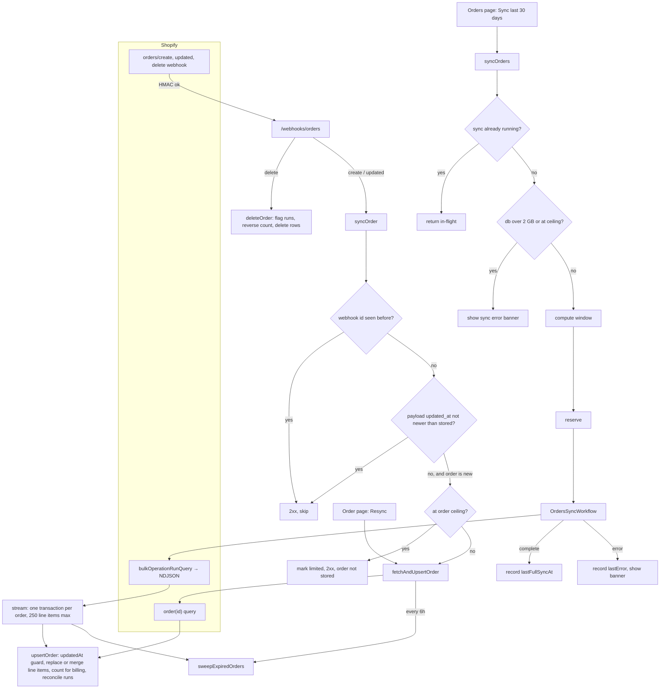
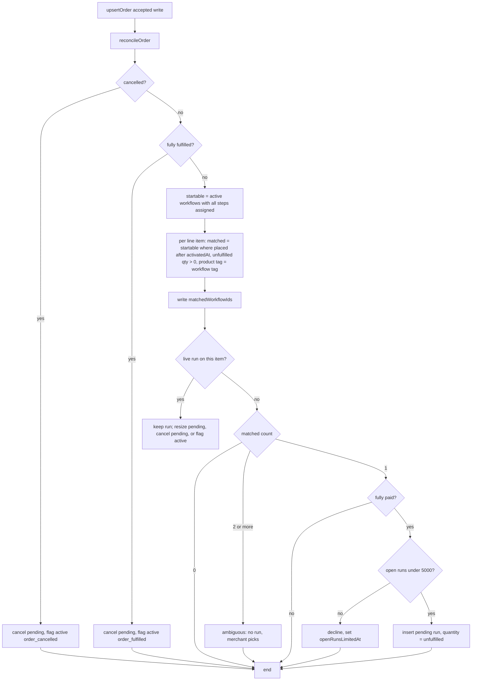
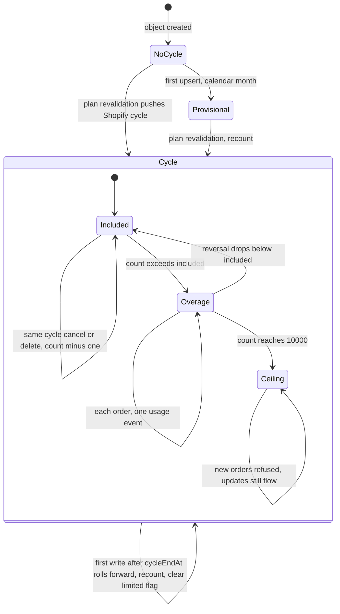

# Orders lifecycle research

How orders enter Baton, how they are reconciled, when workflows run, how orders are counted and capped, when they are purged, and what the home page should show. Code is the source of truth; JSDoc drift and suspected bugs are tabulated in §10. Line numbers are as of 2026-09-19.

Terms used throughout:

- **Included orders**: the number of orders per billing cycle a plan covers before overage. Basic 250, Pro 1000.
- **Overage**: orders beyond the included number, billed per order through the Shopify usage meter.
- **Order ceiling**: `maxOrdersPerCycle = 10,000`. Above this Baton stops storing new orders for the rest of the cycle. It exists to bound storage and abuse, not to bill.
- **Run ceiling**: `maxOpenRuns = 5,000`. Above this Baton stops auto-starting workflow runs.
- **Storage soft guard**: `storageSoftLimitBytes = 2 GB`. Baton's own check on the Durable Object's SQLite size; today it only blocks the bulk sync button.
- **DO SQLite hard limit**: Cloudflare's 10 GB per Durable Object. Not Baton's; if hit, writes fail.
- **Retention sweep**: Baton's purge of old orders (`sweepExpiredOrders`).

## 1. Summary

- Orders enter by four paths: `orders/create` and `orders/updated` webhooks, the `orders/delete` webhook, a per-order "Resync from Shopify" button, and the bulk "Sync last 30 days" button. No timers or alarms exist.
- Webhooks are already "a knock on the door": the payload is trimmed to `id` and `updated_at`, and Baton fetches the full order from the Admin API before storing anything.
- Every path writes through one upsert. A write is accepted only if the incoming Shopify `updatedAt` is at or after the stored one. Both values come from Shopify's `Order.updatedAt`; Baton's clock is never involved (§3).
- Workflow matching: a line item starts a run when its product carries the workflow's tag, the order was placed at or after the workflow was turned on, and it still has unfulfilled quantity. One run per line item. Two matching workflows means nothing starts until the merchant picks.
- The bulk button does a different thing on the first click (open, unfulfilled orders created in the last 30 days) than on later clicks (anything updated since the last sync). §5 reworks it into one fixed-query import with the agents SDK as the only run tracker.
- Counting for billing is per order: an order counts once, the first time Baton stores it while it is fully paid and not cancelled. Free trials are not involved.
- Purge today: closed orders untouched for 90 days with no live run are deleted; open orders never. Decided: replace with one rule, any order older than 365 days is deleted (§9).
- Storage: roughly 3–6 KB per order. At the 10k/cycle ceiling that is about 60 MB per month, so the 10 GB Cloudflare limit is years away even if nothing were ever purged.

## 2. Entry points

| Path                                      | Trigger                                                            | What Baton fetches                            | Guards before writing                                                                                            | Cite                                                                                                                              |
| ----------------------------------------- | ------------------------------------------------------------------ | --------------------------------------------- | ---------------------------------------------------------------------------------------------------------------- | --------------------------------------------------------------------------------------------------------------------------------- |
| Webhook `orders/create`, `orders/updated` | Shopify, payload trimmed to `id, admin_graphql_api_id, updated_at` | single-order GraphQL, `lineItems(first: 100)` | duplicate webhook id (7-day log); payload `updated_at` not newer than stored; new order refused at order ceiling | `shopify.app.toml:35-44`, `src/routes/webhooks.orders.ts:60-88`, `src/lib/ShopAgent.ts:1925-2050`, `src/lib/OrderSync.ts:130-164` |
| Webhook `orders/delete`                   | Shopify                                                            | nothing                                       | none (idempotent)                                                                                                | `ShopAgent.ts:2192-2213`, `OrderRepository.ts:872-899`                                                                            |
| Resync from Shopify                       | order detail page button                                           | same as webhook, `source: "manual"`           | upsert `updatedAt` guard only                                                                                    | `ShopAgent.ts:2173-2189`, `app.orders.$orderId.tsx:676,1569`                                                                      |
| Sync last 30 days                         | orders index button, merchant role                                 | `bulkOperationRunQuery` → NDJSON stream       | one sync at a time; storage soft guard; order ceiling                                                            | `ShopAgent.ts:1582-1742`, `OrdersSyncWorkflow.ts:254-415`, `ShopAgentOrdersStream.ts:139-235`                                     |

After each write, on every path: flush the usage-event outbox to Shopify, run the retention sweep (bulk: always; webhook: if the last sweep was more than 6h ago), and publish to open sockets.



## 3. Timestamps: what `updatedAt` is and why the comparison is acceptable

Concern: comparing timestamps to order events in a distributed system is fragile.

What is actually compared:

- Stored side: `ShopOrder.updatedAt`, copied verbatim from Shopify's `Order.updatedAt` on the last accepted write (`OrderSync.ts:80,137`).
- Incoming side: the same Shopify field, either from the webhook payload's `updated_at` (`webhooks.orders.ts:38-41`) or from the GraphQL response.

Baton never puts its own clock on either side, and never compares two different shops or two different orders. It compares two observations of one Shopify field for one order. Shopify is the single writer of that field; Baton only asks "is this a copy of the order at least as new as the one I already have?". That is a per-record version check, not cross-node event ordering. Same-millisecond ties are accepted (`>=`), so a tie never drops data; at worst it rewrites the same content.

Where this can still go wrong:

- Shopify's `updated_at` may not bump for every mutation. I could not confirm a specific list from the pinned docs in `refs/shopify-docs`; treat it as folklore. It does not matter for Baton either way: order-level tags are stored but never matched, and everything Baton routes on (line items, quantities, payment, fulfilment, cancellation) is an order mutation that does bump it.
- Product tags are a different case. `OrderLineItem.productTags` is a snapshot taken when the order was fetched (`Domain.ts:1517`). Retagging a product in Shopify does not touch the order, fires no order webhook, and so does not re-route already-stored orders. That is documented as intended: a run keeps the definition it started from. New orders after the retag see the new tags.
- Out-of-order webhook delivery is handled: an older delivery arriving after a newer one is skipped, and because Baton refetches rather than trusting the payload, even the "newer" delivery stores current state.

The alternative, always refetch and always overwrite with no comparison, would let a slow in-flight fetch from an older delivery overwrite a newer one after it lands. The version check prevents that. Decision (accepted): keep the comparison and document its meaning on `OrderRepository.upsertOrder`.

## 4. Bulk sync as implemented

Button: "Sync last 30 days" on the orders index. Merchant role only.

Window (`ShopAgent.ts:1087-1099`, `OrdersBulkRepository.ts:26,92-104`, `orderSyncConstants.ts`):

- First click ever (`lastFullSyncAt` is null): orders with `created_at` in the last 30 days that are open and not fulfilled.
- Every later click: orders with `updated_at` since the previous sync started, minus 15 minutes overlap, capped at 30 days back. No status filter.
- `lastFullSyncAt` is recorded only when a sync completes successfully.

30 days sits under Shopify's 60-day order-history scope, which the app has without requesting `read_all_orders`.

Repeatability: the button can be clicked any number of times. The UI disables it while a sync is running; the server refuses a second sync while one is reserved. Concurrent webhooks are safe: each order is its own transaction and the `updatedAt` guard arbitrates.

Mechanics: a Cloudflare Workflow submits a Shopify bulk operation, polls up to about 10 minutes, then streams the NDJSON result into the Durable Object one order per transaction, capping line items at 250 per order.

Known failure: if polling times out, the Shopify bulk operation keeps running (Shopify only fails it itself after 10 days, `refs/shopify-docs/docs/apps/build/apis/graphql-admin/bulk-operations/queries.md`, "Limitations"). Baton's reservation row is cleared by the failure, so a re-click submits a second operation. On API versions before 2026-01 Shopify rejected that because one was already running; on Baton's client version (2026-07, see §5) it is accepted, so the practical effect today is a stray operation, not a second failure. There is no cancel path.

## 5. Order intake from first principles

The current design conflates three jobs and gives them one button with two behaviours:

1. **Onboarding**: give a newly installed shop something to look at.
2. **Ongoing intake**: keep up with new and changed orders.
3. **Repair**: recover from a missed webhook (outage over 4h, ceiling refusals, Shopify-side stale `updated_at`).

What competitors do (`refs/route-to-ship`, `refs/makerbatch`, `refs/kanbanify`; marketing and help copy, no code):

- Route to Ship imports nothing at install. Backfill is a support ticket with a date range. Ongoing intake is webhooks plus an automatic incremental Admin API sweep as a safety net. No merchant-facing sync button. Only paid orders are synced. No hard cap; overage is billed and syncing never stops.
- MakerBatch: "new orders flow in automatically, nothing to import by hand." No backfill mentioned.
- Kanbanify appears to read Shopify live rather than store orders. BenchCue stores nothing.

Nobody exposes a first-run-versus-later distinction or a last-sync marker to the merchant.

What a made-to-order merchant plausibly wants at install: the orders they are working on right now, not a month of history they have already made. A 30-day open-order import is a reasonable approximation of "what is on the bench" because open and unfulfilled is the filter, not the age; a shop with a two-week lead time has nothing open older than a few weeks. But the merchant did not ask for 30 days and cannot see the filter, so the label misleads.

### Why the current bulk sync is confusing

It is three asynchronous systems behind one button. State lives in the Durable Object (reservation, TTL, `lastFullSyncAt`), in a Cloudflare Workflow (steps, retries), and in Shopify (the bulk operation, which outlives both). Each can fail or time out on its own and each needs its own recovery rule. On top of that the button changes behaviour after the first click, so the merchant cannot predict what it does. The 10-minute limit is not a platform constraint: `BULK_POLL_ATTEMPTS = 24` at 5s×3, 15s×3, 30s×18 = 600s (`orderSyncConstants.ts:18`, `OrdersSyncWorkflow.ts:318-347`) was copied from motio. Cloudflare lets a step sleep for up to a year and puts no wall-clock limit on a Workflow (`refs/cloudflare-docs`, workflows limits). When the loop runs out the code fails the run while Shopify's operation keeps going, which is the stuck-op bug.

Motio (`../motio/src/lib/ScanWorkflow.ts`) is the same shape, not a simpler one: same 24-poll schedule, same die-on-timeout. Its only simplification is that it never keeps a last-sync marker, because every scan is a full catalog pull. It pays for that with a hand-rolled singleton (`env.SCAN_WORKFLOW.create` with a fixed id, private param injection, a nine-way status match, and a Miniflare-vs-production preflight) that fights the agents SDK.

### What each job loses without any bulk sync

**Ongoing intake**: nothing. A missed `orders/create` self-heals: `syncOrder` treats an unknown id on `orders/updated` as new and fetches it (`ShopAgent.ts:1967-1980`). Shopify retries a failed delivery for 4 hours, so a permanent miss needs Baton down for over 4 hours **and** the order never changing again before fulfilment.

**Repair**: the per-order "Resync from Shopify" button covers a stored order that looks wrong. It cannot import an order Baton never stored. See option 1 below for the cheap fill.

**Onboarding**: the real loss. A merchant installs, opens Orders, sees nothing until the next webhook.

### How Shopify bulk operations work, briefly

`bulkOperationRunQuery` hands Shopify a query and returns immediately with an operation id. Shopify runs it in the background and exposes `status` (`CREATED`, `RUNNING`, `CANCELING`, `COMPLETED`, `FAILED`, `CANCELED`, `EXPIRED`; `refs/shopify-docs`, `enums/BulkOperationStatus.md`), a running `objectCount`, and, when complete, a `url` to a JSONL file (7-day life). `CANCELING` is not terminal; a poll loop must keep waiting through it. Two ways to learn it finished: poll `bulkOperation(id)` on a timer, or subscribe to the `bulk_operations/finish` webhook. Both are supported; neither is required. Polling is what motio does and is the fit here: it needs no extra route, no extra subscription, and the loop is a handful of lines. Motio also forwards each poll's `objectCount` as progress text through `reportProgress` → `onWorkflowProgress` → socket; Baton does not, because the import completes in under a minute and a spinner is enough (decided, §12). Drop the webhook idea.

Expected duration for this query: an open, unfulfilled, last-30-days export for a shop under the ceiling is tens to a few hundred orders. Shopify's fixed overhead is roughly 10–30 seconds; the whole thing typically completes inside a minute. Streaming a few hundred JSONL lines into the Durable Object takes seconds. The "timeouts" in the earlier sketch were give-up bounds, not expectations, and they were too generous. Nobody waits two hours; if it is not done in a few minutes something is wrong and the merchant should be told.

Volume: no separate cap is needed. The filter bounds the set to current open work, the order ceiling still applies at the stream, and a Pro shop at 1,000 orders per cycle has at most a few hundred open at once.

### The rework: one simple bulk import

Fixed query, no parameters, every click identical, no last-sync marker:

```
orders(query: "created_at:>='<now-30d>' status:open -fulfillment_status:fulfilled", sortKey: CREATED_AT)
```

Selection set trimmed to what Baton uses. **Drop order-level `tags`**: they are never matched, only shown as badges on the index and a fact on the order page; remove the column and both displays. Keep `note` and `customAttributes` on the order and line item: for made-to-order they carry the customer's customization details, which is what the maker reads. Everything else in the current query is used by matching, counting, or the order page.

One Workflow, three steps, plain agents SDK machinery:

1. **submit** (`step.do`): `bulkOperationRunQuery`. Return the operation id. No adopt logic: from API 2026-01 Shopify allows five concurrent bulk queries of each type per app per shop (`refs/shopify-docs/docs/apps/build/apis/graphql-admin/bulk-operations/queries.md`, "Limitations"). Baton's client is pinned to 2026-07 (`src/lib/Shopify.ts`, `ApiVersion.July26`) while `shopify.app.toml` declares 2026-10; both qualify. Decided: move the client to `ApiVersion.October26` so the two agree (#22). With the DO-side guard below, "already in progress" cannot occur from Baton's own clicks.
2. **poll** (loop): `step.sleep("5 seconds")` then `step.do` fetching `bulkOperation(id)`. No progress reporting. Exit on `COMPLETED` with `url`. On `FAILED`/`CANCELED`/`EXPIRED`, or after **5 minutes** without completion, `bulkOperationCancel(id)` and fail with a message ("Shopify did not finish the export in time. Try again."). Five minutes is ten times the expected duration; it is when to stop the spinner, not when to expect success. Sixty small steps is nothing against the 10,000-step instance limit.
3. **stream** (`step.do`, default retries and timeout: 5 retries, 10s exponential backoff, 10-minute timeout per attempt; `refs/cloudflare-docs`, workflows `sleeping-and-retrying`): the existing `onOrdersStream(url)`. Per-order transactions make a retry idempotent. Then `step.reportComplete`.

Error sink stays `Effect.onError` → `onOrdersSyncError` for the banner text.

**Is one already running?** Use the agents SDK's own tracking, not Shopify. `runWorkflow` records the instance in the DO's `cf_agents_workflows` table; `getWorkflows({ status: ["queued", "running"] })` is a local SQLite read inside the DO (`refs/agents/packages/agents/src/index.ts`, `getWorkflows`), and `onWorkflowComplete`/`onWorkflowError` flip the row. So `syncOrders` is: if `getWorkflows(...)` is non-empty, return "in flight"; else `runWorkflow`. Two admins clicking at once: `runWorkflow` awaits `workflow.create` **before** it inserts the tracking row, so a second call during that await would see an empty `getWorkflows`. The Durable Object runs one JavaScript thread and `getWorkflows` is synchronous, so a plain instance field set in the same tick closes the gap: set `this.importStarting = true` before `await runWorkflow(...)` and clear it after; the second click sees the flag and returns. No reservation row, no TTL, no existence probe. Two residuals: a throw between `create` and the insert leaves an untracked instance (harmless: it runs to completion on its own and the next click starts a fresh one; the upsert arbitrates), and a wedged instance (row stuck on `running` because the Workflow died without reporting). The SDK never reaps rows on its own; `getWorkflowStatus` refreshes a row from the Workflows API, so call it when the row is older than 10 minutes, the same way motio's loader reaps a stuck scan. After a refresh the row can read `waiting` (a sleeping Workflow), so the in-flight filter is `["queued", "running", "waiting"]`.

Merchant sees: one button, "Import open orders", tooltip "Imports open, unfulfilled orders from the last 30 days. Safe to run again." While running: button disabled, spinner. On failure: critical banner with the message. On success: the orders list fills over the socket; optionally "Last imported 2 minutes ago".

| Component                  | Today                                                                                                                             | Rework                                                                                                                                                                                                   |
| -------------------------- | --------------------------------------------------------------------------------------------------------------------------------- | -------------------------------------------------------------------------------------------------------------------------------------------------------------------------------------------------------- |
| `OrdersSyncWorkflow.ts`    | 416 lines, `timedPollStep`, poll schedule, window params                                                                          | ~150 lines, three steps                                                                                                                                                                                  |
| `ShopAgent.ts` sync sites  | ~57: `syncOrders`, `reserveSync`, `completeSync`, `failSync`, `clearSync`, `orderSyncWindow`, TTL, existence probe, storage guard | ~20: `syncOrders` (guard + `runWorkflow`), `onOrdersStream`, `onWorkflowComplete/Error`, `lastError`, `lastCompletedAt`                                                                                  |
| `SyncState` columns        | `workflowId`, `startedAt`, `windowStart`, `lastFullSyncAt`, `lastFullSyncWindowStart`, `lastError`                                | `lastError`, `lastCompletedAt`                                                                                                                                                                           |
| `orderSyncConstants.ts`    | 39                                                                                                                                | ~5                                                                                                                                                                                                       |
| `OrdersBulkRepository.ts`  | 235, parameterised query                                                                                                          | ~120, constant query, plus `cancel`                                                                                                                                                                      |
| `ShopAgentOrdersStream.ts` | 235                                                                                                                               | unchanged                                                                                                                                                                                                |
| `ShopOrder.tags`           | stored and shown                                                                                                                  | removed: bulk and single-order queries, `OrderSync` schema, `Domain`, `OrderRepository` reads and writes, index badge column, order page fact; `not null` column dropped by a `SqliteMigrator` migration |
| Concepts                   | window, first-vs-later, reservation, TTL, storage guard, poll schedule                                                            | one query, one guard, one give-up time                                                                                                                                                                   |

Remaining failure modes: Shopify does not finish in 5 minutes (cancel, banner, re-click); stream fails after default retries (partial import persists, banner, re-click re-covers because the query is fixed and the upsert idempotent); Workflow dies silently (row reaped after 10 minutes, button re-enables).

### Alternative: delete bulk sync, import through the admin link

Kept for the record. Baton ships `More actions → Open in Baton` (`extensions/baton-order-link` → `/app/orders/from-shopify` → `/app/orders/$orderId`). For an unstored order the page gets `null` and waits (`ShopAgent.ts:2952-2957`); an "Import from Shopify" action there is ~20 lines through `fetchAndUpsertOrder`. Net −1,000 lines, but onboarding forty open orders is forty clicks. Not pursued if the rework is built.

### Recommendation

Build the rework. It keeps the one thing a trial merchant needs, uses the agents SDK the way it is meant to be used, and removes every concept that made the current version confusing. Do not also build the admin-link import; one intake feature is enough.

## 6. Reconciliation on write

Owner: `OrderRepository.upsertOrder` (`OrderRepository.ts:823-864`).

- Upsert on `id`. Accepted only if incoming `updatedAt >= stored.updatedAt`. If rejected, line items and downstream reconcile are skipped.
- Line items are replaced wholesale when the fetch had the complete set (bulk always; webhook when the order has 100 or fewer), merged otherwise. See below.
- Cancelled, closed, fulfilled, and refunded are plain columns at write time. Their effects are downstream: `Domain.isCancelled` stops runs, `canStartRuns` requires fully paid and not cancelled, refunds only reduce `unfulfilledQuantity`.
- Billing count and workflow reconcile both run inside the same transaction.

### Replace vs merge line items

Why the merge path exists: the single-order query asks for `lineItems(first: $lineItems)` with 100 passed in, and does not page (`OrderSync.ts:147`, `ShopAgent.ts:1535`). For an order with more than 100 line items the webhook fetch sees a partial set. Replacing wholesale would delete items 101+ and reconcile would cancel their pending runs as `item_removed`. So the code carries a `lineItemsComplete` flag, replaces when true, merges when false, and relies on the bulk path (which always has the full set) to eventually complete the order.

Is 100 a Shopify limit? No. 100 is Baton's choice. Shopify's limit on any connection page is **250**; `first` above 250 is an error (`refs/shopify-docs`, pagination guidance). The other constraint is query cost: a single query may cost at most 1,000 points, and a connection costs its page size times the cost of each node. This query's node selects `variant { id }` and `product { id tags }`, so each line item is about 3 points; 250 items is roughly 750 points, under the cap with headroom. `Domain.ShopLimits.maxLineItemsPerOrder` is already 250.

Decision (accepted): **one query, always replace.** Set the page size to 250, delete `lineItemsComplete` and the merge branch, keep `lineItemsTruncated` for the rare order past 250, and publish the limit: "Baton tracks up to 250 line items per order." No pagination loop. A made-to-order shop with a 250-line order is outside the target; the truncation flag on the order page tells the merchant what happened.

## 7. Workflow matching

Owner: `WorkflowRunRepository.reconcileOrder` (`WorkflowRunRepository.ts:1111`), predicates at `:164-210`.

Workflow side, `canStart`: the workflow is on (`activatedAt` not null), has at least one step, and every step has a team that exists. Only active workflows are even considered.

Line item side, `matchesLineItem`:

- The product's tags (trimmed, lowercased) include the workflow's tag. Exact match, case-insensitive, one tag per workflow. No product, variant, collection, SKU, or channel criteria. Order-level tags are stored but not used.
- `order.processedAt >= workflow.activatedAt`. Orders placed before the workflow was turned on are not routed.
- `unfulfilledQuantity > 0`.

Order gates: a cancelled order cancels pending runs and flags active ones `order_cancelled`. A fully fulfilled order does the same with `order_fulfilled`. A run is only created when the order is fully paid (`AUTHORIZED` is not paid). There is no test-order, draft-order, or channel filter.

Granularity: one run per line item, quantity = `unfulfilledQuantity`. A line item with a live run (any status except cancelled, so `done` counts) is never re-routed. Exactly one matching workflow starts a run; two or more is ambiguous and nothing starts; the order page shows the candidates.

Activation timestamp: `Workflow.activatedAt` is the only field. Turn on sets it to now unless the dialog's "Include them" back-dates it to the earliest waiting order. That is the only way history gets routed; a bulk import of 30-day history does not start runs by itself. Every turn on/off, retag, apply, and date change re-reconciles all open paid orders, so a newly-on workflow picks up stored orders immediately. Turn off and delete leave existing runs alone.

Re-evaluation on each write: idempotent. New line items get runs; removed or zeroed items cancel pending runs or flag active ones `item_removed`; quantity changes resize pending runs and flag active ones `quantity_changed`. Runs never move between workflows.

Run ceiling: at 5,000 open runs, auto-start silently declines and sets `openRunsLimitedAt`; manual attach fails with an error.



## 8. Counting for billing

Plain statement: **an order counts toward the billing cycle once, at the first moment Baton stores it while it is fully paid and not cancelled.** Nothing to do with trials or plans; the same rule applies on every plan.

Details (`Domain.orderCountsTowardCycle` at `Domain.ts:704`, `OrderRepository.countOrder` at `:669-742`):

- An order that arrives already paid counts on arrival.
- An order that arrives unpaid (authorized, pending) does not count. It counts later, on the first write where it is fully paid.
- If an order that was counted is cancelled or deleted **within the same billing cycle it was counted in**, the count goes back down by one. Cancelled in a later cycle: no change; that cycle's bill already happened.
- Refunds, fulfilment, edits, and repeat syncs never change the count. `countedAt` on the row makes each order count at most once.
- Orders placed before the app was installed never count, even if paid later.
- Bulk import and resync count only orders Baton has never stored.

Billing cycle: Shopify's subscription cycle, pushed into the Durable Object on plan revalidation. Until the first push, a provisional calendar month. The cycle rolls forward on the first write after `cycleEndAt`; there is no clock, so a quiet shop's counter lags until its next order or a plan check.

Overage: each count change queues a `+1` or `-1` usage event; the outbox flushes to Shopify's meter after every webhook and bulk sync. Events dated before the current cycle are never sent. The per-order price is not in code; it is set on the meter in the Partner Dashboard (README: $0.15 Basic, $0.10 Pro). The meter is graduated: tier 1 is the included allowance at $0.00 (part of the subscription price, not a free tier), tier 2 is the per-order rate. Tier 1's size must equal `ordersPerCycle` in code, and nothing checks that they agree; the README states it as an operator rule and that is where it stays (#4).

Order ceiling at 10,000: new orders are not stored. The webhook returns 2xx without storing, so Shopify does not retry and the order is lost to Baton for that cycle. Updates to already-stored orders still flow. After the cycle rolls, those orders come back only if a bulk sync's window still covers them.



## 9. Retention and storage

### What the purge is for

Two goals: keep the Durable Object under Cloudflare's 10 GB SQLite limit, and keep the orders page from filling with history nobody will act on. Shopify remains the system of record; Baton is a working set.

### What it does today

`sweepExpiredOrders` (`OrderRepository.ts:1588-1668`) deletes, up to 200 per pass, orders that are:

- closed: fulfilled, or `cancelledAt` set, or `closedAt` set, and
- untouched: Shopify `updatedAt` older than 90 days, and
- idle: no pending or active run (a live run blocks deletion outright).

Line items and runs cascade. Orphaned runs older than 90 days are also removed. The sweep runs after every bulk sync and on the webhook path at most every 6 hours. There is no timer, so a shop with no webhook traffic never sweeps (and also never grows). Webhook dedupe rows older than 7 days are swept on every delivery.

Open orders, never fulfilled or closed in Shopify, are never deleted regardless of age.

### How much it matters

Per-order size, all tables and indexes: roughly 3–6 KB (schema `ShopAgent.ts:430-475`; the `raw` JSON column has already been dropped). That gives about 170k–330k orders per GB.

Worst case under the order ceiling: 10,000 new orders per month × 6 KB = 60 MB per month. Even with no purge at all, reaching 10 GB takes about 14 years. The realistic small-to-medium shop is two orders of magnitude below that. Storage pressure is not a near-term risk; the purge is hygiene for the orders list more than a capacity safeguard.

The one path that is truly unbounded is orders that stay open forever because the merchant fulfills outside Shopify. Even that path is bounded in rate by the ceiling.

### Recommendation

- **One rule: any order with `processedAt` older than 365 days is deleted, open or closed, live run or not.** Runs on it are cancelled first so nothing dangles. Drop the 90-day closed-order rule and its three-part predicate (closed, untouched, no live run). One rule is easier to state to a merchant, easier to test, and has no edge cases about what "closed" or "untouched" means.
- Cost of dropping the 90-day rule: closed orders stay for a year instead of three months. Storage is irrelevant (§ above). The only effect is the orders list. Today its default view is "All orders" (`state` null → `1 = 1` in `OrderRepository.listOrders`), so with 365-day retention the default view would accumulate a year of shipped orders. The 365-day rule therefore comes with a list change: default the index to open orders, keep "All" as a filter. That is a list filter, not a purge rule.
- Confirmed: with the 365-day rule nothing accumulates. The maximum a shop can hold is twelve months of intake, bounded by the ceiling at 12 × 10,000 = 120k orders, about 720 MB at 6 KB each. The 10 GB limit is unreachable.
- No Durable Object alarm. Frank assessment: not a strong recommendation, and on reflection not worth it. The sweep runs on the webhook path at most every 6 hours; a shop receiving webhooks sweeps, and a shop receiving none is not growing. The only shop that never sweeps is one that stopped trading, whose data sits inert until uninstall destroys the object. An alarm adds a scheduling path, a test surface, and a failure mode for a case with no cost. Rely on webhooks.
- State the policy in the app: "Baton keeps orders for a year. Shopify keeps everything." No merchant should read Baton as an archive.
- The 2 GB soft guard: confirmed, it gates only `syncOrders` (`ShopAgent.ts:1642`, the single call site). It goes away with the bulk sync rework (§5); the fixed open-work query bounds the import instead. The `databaseSize` number stays on the admin page.

## 10. JSDoc drift and suspected bugs

Severity: H = billing or data loss, M = merchant-visible or operational, L = doc only. Fate, given the decisions in §12: **moot** = disappears with the bulk-sync rework, the 365-day rule, or the 250-line replace; **code** = a fix is still needed; **doc** = JSDoc only. Every row was re-verified against source on 2026-09-20; none is wrong, two were overstated and are corrected below (#3, #11).

| #   | Where                                                                                                  | JSDoc / label says                                   | Code does                                                                                                                                        | Sev | Fate | Change                                                                                  |
| --- | ------------------------------------------------------------------------------------------------------ | ---------------------------------------------------- | ------------------------------------------------------------------------------------------------------------------------------------------------ | --- | ---- | --------------------------------------------------------------------------------------- |
| 1   | `OrdersSyncWorkflow.ts:311-347`                                                                        | —                                                    | After poll timeout the Shopify bulk op keeps running; no cancel path (§4)                                                                        | M   | moot | §5 cancels on give-up                                                                   |
| 2   | `app.orders.index.tsx:534,558`                                                                         | "Sync last 30 days", "No orders in the last 30 days" | First run: open work only by `created_at`. Later: `updated_at` delta.                                                                            | M   | moot | §5 label and copy                                                                       |
| 3   | `ShopAgent.ts:1995-2013`, `cycleAtOrderCeiling` JSDoc                                                  | —                                                    | Webhook at ceiling returns 2xx without storing; Shopify does not retry; order lost to Baton for the cycle. Undocumented.                         | M   | doc  | doc on `cycleAtOrderCeiling`: after rollover the merchant clicks Import open orders     |
| 4   | `Domain.ts:99`, `README.md:67`                                                                         | `ordersPerCycle` must equal the meter's "free" tier  | Nothing verifies; decided: operator discipline, no code. Tier 1 is the included allowance, not a free tier                                       | L   | doc  | reword the Domain JSDoc: "tier 1 (included allowance)", never "free"                    |
| 5   | Open-order retention                                                                                   | —                                                    | Never purged                                                                                                                                     | M   | moot | decided: 365-day rule (§9)                                                              |
| 6   | `canStart` JSDoc `WorkflowRunRepository.ts:164`                                                        | manual attach skips line-item half                   | `setRun` also skips paid and cancelled/fulfilled gates; attach on a cancelled order succeeds                                                     | M   | code | decided: guard in `attachWorkflow`, refuse cancelled/fulfilled, allow unpaid (§12)      |
| 7   | `hasLive` includes `done`; `Domain.flagActive` JSDoc "a done run is never touched"                     | Intended (`Domain.ts:2648`)                          | `adjust` iterates open runs only; a quantity increase on a done line is silently lost                                                            | M   | code | decided: flag done runs `quantity_changed` in `adjust`; update `flagActive` JSDoc (§12) |
| 8   | `orderSyncConstants.ts:12-14`                                                                          | overlap upserts are "free"                           | `>=` rewrites equal-`updatedAt` rows: line items replaced, reconcile re-run                                                                      | L   | moot | constant deleted with §5                                                                |
| 9   | `webhooks.orders.ts:8,44`                                                                              | "seven order topics"                                 | Three subscribed; test asserts three                                                                                                             | L   | doc  |                                                                                         |
| 10  | `reconcileAll` JSDoc `WorkflowRunRepository.ts:265`                                                    | "bounded by the live floor"                          | `openOrders` has no bound                                                                                                                        | L   | doc  |                                                                                         |
| 11  | `reconcileOrder`                                                                                       | —                                                    | Cancelled/fulfilled early-exit before `matchedWorkflowIds` is written; `reconcileAll` skips unpaid, so badges can be stale                       | L   | doc  | state on `reconcileOrder` that badges are current for open paid orders only             |
| 12  | `Domain.ts:545`                                                                                        | closed order untouched 90d is deleted                | also requires no pending/active run                                                                                                              | L   | moot | predicate replaced by §9                                                                |
| 13  | `ShopAgent.ts:2020-2024`                                                                               | quiet shop still ages out                            | no alarm; silent shop never sweeps                                                                                                               | L   | doc  | decided: no alarm; rewrite the comment (§9)                                             |
| 14  | `ShopAgent.ts:1040-1045`                                                                               | 60 min TTL is "comfortably longer"                   | 10 min × 5 retries can exceed; the existence check is the real guard                                                                             | L   | moot |                                                                                         |
| 15  | `Domain.ts:68`                                                                                         | "four-handle catalog"                                | two handles                                                                                                                                      | L   | doc  |                                                                                         |
| 16  | `SubscriptionPlan.ts:19,49,56`                                                                         | Flow action path                                     | copied from bang; Baton has none                                                                                                                 | L   | doc  | restate for socket 402 and `/app` redirect                                              |
| 17  | `OrderRepository.ts:1334`                                                                              | —                                                    | `lastFullSyncWindowStart` written, never read                                                                                                    | L   | moot |                                                                                         |
| 18  | `ShopAgent.ts:1918-1922`                                                                               | dedupe rejects redelivery on "the webhook path"      | only `syncOrder`; `deleteOrder` records nothing (idempotent)                                                                                     | L   | doc  |                                                                                         |
| 19  | `OrderRepository.ts:1411-1436`                                                                         | —                                                    | recount from `countedAt` is safe only for cycles of a month or less; yearly is forbidden by README but unenforced                                | L   | doc  | doc on `countedSince`                                                                   |
| 20  | `OrderRepository.upsertOrder`                                                                          | —                                                    | The `updatedAt` guard's meaning (Shopify version check, not clock ordering; ties accepted on purpose) is not stated; no test titles the tie rule | L   | doc  | doc per §3, plus a rule-titled test for equal `updatedAt`                               |
| 21  | `docs/limits-and-plans-research.md:109`, `docs/limits-and-plans-plan.md:52`, `docs/rules-inventory.md` | stale sizes, overage "out of scope", stale line refs | —                                                                                                                                                | L   | doc  | delete or refresh; this document joins the list once acted on                           |
| 22  | `src/lib/Shopify.ts:275`, `shopify.app.toml`                                                           | —                                                    | client pinned to `ApiVersion.July26` (2026-07); toml declares 2026-10                                                                            | L   | code | decided: client to `ApiVersion.October26`                                               |

Seven rows are moot (1, 2, 5, 8, 12, 14, 17): do not fix them, let the rework delete them. Three need code (6, 7, 22). The rest are JSDoc edits that can ship in one pass after the rework lands, so the JSDoc is written against the code that survives.

No correctness bug found in the upsert, meter, or tag-matching paths; each has rule-titled tests (`test/integration/order-repository.test.ts`, `test/integration/workflow-run-repository.test.ts`, `shop-agent-workflows.test.ts`). The two upsert tests for `lineItemsComplete` ("replaces the line-item set when the write reports it is complete", "merges instead of replacing when the fetch was truncated") die with §6.

## 11. Home page limits UI

Current (`app.index.tsx:159-192`): plan name, then two sentences, "Orders this billing period: X of Y — resets date" and "Members: X of Y". A warning banner appears only after crossing the included number. No approach warning, no overage amount, no meter.

Pattern from `refs/bang/src/routes/app.index.tsx:226-283`, `styles.css:14-39`: a "Usage and capacity" section as an `s-grid` of `s-box` cards, each with a label, a tone badge, a large "X of Y used" heading, a native `<progress>` bar (8px, 4px radius, `max = Math.max(limit, count)` so over-capacity renders full), and a subdued footer line.

Proposal:

| Card                     | Headline                          | Meter                                                  | Badge                                            | Footer                                                               |
| ------------------------ | --------------------------------- | ------------------------------------------------------ | ------------------------------------------------ | -------------------------------------------------------------------- |
| Included orders          | `min(used, included) of included` | `<progress max=included>`                              | warning at 80%, critical at 100% "Included used" | "Resets {cycleEndAt}"                                                |
| Extra orders this period | `max(0, used − included)`         | none until 80% of 10,000, then bar "of 10,000 ceiling" | critical when `ordersLimitedAt` set              | "Billed per order on your Shopify bill. See your plan for the rate." |
| Members                  | `members of maxMembers`           | `<progress max=max(maxMembers, count)>`                | critical when anyone is seatless                 | pending-squeeze note                                                 |

Keep `QuotaBanners` above the grid for state changes. Operator-only numbers (`databaseSize`, `pendingUsageEvents`, `deadUsageEvents`) belong on `admin.shop.$shop.tsx`.

## 12. Decisions

All decided 2026-09-20. No open questions remain.

- **Bulk sync (§5)**: build the rework, a single fixed-query import with the agents SDK as the only run tracker; retire the current implementation; no admin-link import. No progress line: spinner only, the import completes in under a minute.
- **Order-level tags**: dropped in the rework (column migration, index badges, order-page fact).
- **API version**: client moves to `ApiVersion.October26` to match `shopify.app.toml` (#22). Shopify publishes versions ahead of their calendar date; nothing prevents using it.
- **Timestamps**: keep the Shopify `updatedAt` version check; document it and add a rule-titled test for the tie (§3, #20).
- **Retention**: one rule, any order older than 365 days is deleted; no 90-day rule; no alarm (§9). With it, the orders index defaults to open orders and "All" becomes a filter.
- **Line items**: one query at Shopify's 250 maximum, always replace, publish the 250 limit (§6).
- **Overage price**: not in code, not on the home page. Show counts only; the plan page states the rate.
- **Meter tier size (#4)**: operator discipline, no code check. The $0.00 tier is the included allowance; do not call it a free tier.
- **Manual attach (#6)**: refuse on cancelled and fulfilled orders; still allowed on unpaid. One guard in `attachWorkflow`, one rule-titled test.
- **Quantity increase on a done line (#7)**: flag the done run `quantity_changed`, the same flag active runs get today, so it surfaces on the order page and run list. No new run, automatic or manual. The merchant already has the deliberate action: **Undo** reopens a finished step (`Domain.ts:2608`, `undoBlockedBy`), and undoing the last step takes a `done` run back to active (`Domain.ts:2643`). Once reopened, the existing `quantity_changed` handling applies. The whole change is: extend the flagging in `adjust` to include `done` runs, and update the `flagActive` JSDoc.
