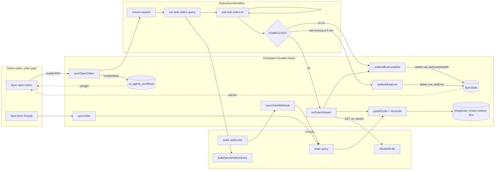
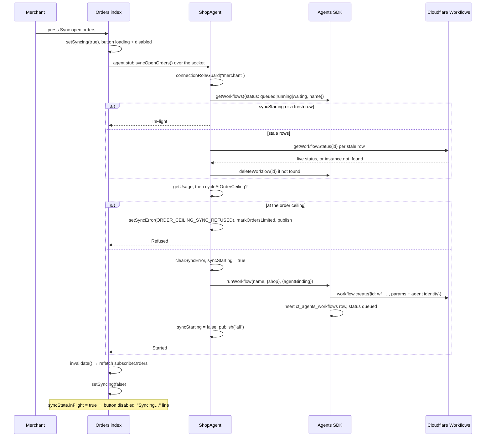

# Order sync: how it works end to end, and a spec for it

Status, 2026-10-01: `docs/order-sync-spec-plan.md` is done. The spec is the four tables in the JSDoc on `Domain.syncOrder` (`src/lib/domain/Orders.ts`): actions, sources, endings, rules; `pnpm spec check` holds them.

Written 2026-10-01 against `main` at `3ba85eb`. This replaces `docs/orders-import-research.md`
(2026-09-30), rewritten after the vocabulary change: the word is **sync**
(`docs/order-sync-vocabulary-research.md`, decided 2026-09-30). The first half says what the
code does today, in the vocabulary's words. The second half is the ask: a light spec for sync in
the JSDoc, in the form the tree already uses for `runActions`, `taskActions`, `reconcileItem`
and `ShopUsage`, drafted from the implementation so that it can then drive the implementation
and the tests. Questions with recommendations are at the end.

## The short version

**Sync** is making Baton's copy of an order agree with Shopify (the row in
`src/lib/domain/Orders.ts`). It happens three ways, and all three end in the same write:

| source            | what starts it                                         | what it fetches                                                                           | the write                                      |
| ----------------- | ------------------------------------------------------ | ----------------------------------------------------------------------------------------- | ---------------------------------------------- |
| an order webhook  | Shopify, on create, paid, edited, cancelled, fulfilled | the one order the payload names, by Admin API query                                       | `OrderRepository.upsertOrder`, one transaction |
| Sync open orders  | the merchant, on the orders index                      | a bulk operation over open, unfulfilled orders of the last 30 days, streamed line by line | the same, once per order in the file           |
| Sync from Shopify | the merchant, on the order page                        | that one order, by the same Admin API query as the webhook                                | the same                                       |

The write is a merge with a version check on Shopify's `updatedAt`: a staler copy never
overwrites a fresher row, a tie rewrites, items are replaced wholesale, and reconcile (shop
work's word) runs inside the same transaction. Only a _new_ order is gated, by the order ceiling
and by retention; a stored order always takes its update. Nothing is ever cleared by a sync, so
webhooks can interleave with the stream and a repeat press is a few redundant writes.

The open-orders sync is one Cloudflare Workflow per shop: submit the bulk operation, poll it
every 5 seconds for up to 5 minutes, hand the file's URL to the shop's Durable Object, which
streams it into SQLite. "One at a time" is held by the Agents SDK's own tracking table
(`cf_agents_workflows`) plus one in-memory flag over the only gap that table cannot cover. The
orders index reads the same table (fresh rows only) to disable the button and show "Syncing…
this page updates as orders arrive."

**The spec.** Sync has no spec today: its rules are spread over nine JSDocs and pinned by
tests whose titles nothing reads. Decided 2026-10-01 (sections 6 and 8): one `Domain` symbol in
`src/lib/domain/Orders.ts`, `syncOrder`, the pure decision of what one sync does to one stored
order, carrying four tables the way `reconcileItem` does: a **sources** table (one row per way
a sync happens, what it asks Shopify for, what skips it), an **actions** table (the write
decision as a fixture matrix the test reads out of the source), an **endings** table (what each
ending of the open-orders sync leaves in the tracking row, `SyncState` and on the screen), and a
**rules** table (the invariants, each with `where` and `pinned by`). `pnpm spec check` parses
all four. The pipeline table on `ShopAgentHost` keeps the cross-context wiring and links here
for the store half.



## Where the pieces live

| piece                              | file                                                                                                                                                                                                                                                                     | context   | what it is                                                                                                                                                                                                                  |
| ---------------------------------- | ------------------------------------------------------------------------------------------------------------------------------------------------------------------------------------------------------------------------------------------------------------------------ | --------- | --------------------------------------------------------------------------------------------------------------------------------------------------------------------------------------------------------------------------- |
| the words                          | `src/lib/domain/Orders.ts`                                                                                                                                                                                                                                               | orders    | the `sync` row; `BulkOperation`, `BulkOperationStatus`, `bulkOperationCompleted`, `SyncState`, `OrdersSyncStatus`, `OrdersSyncResult`, `SyncOrderInput`                                                                     |
| the orders index                   | `src/routes/app.orders.index.tsx`                                                                                                                                                                                                                                        | screen    | `syncButton`, `syncStatusText`, `startSync`; the critical banner from `syncState.lastError`                                                                                                                                 |
| the order page                     | `src/routes/app.orders.$orderId.tsx`                                                                                                                                                                                                                                     | screen    | Sync from Shopify, `syncMutation`                                                                                                                                                                                           |
| the webhook route                  | `src/routes/webhooks.orders.ts`                                                                                                                                                                                                                                          | Worker    | five topics to one handler; resolves the order id and `updated_at`                                                                                                                                                          |
| the three starts and the callbacks | `src/lib/ShopAgent.ts`                                                                                                                                                                                                                                                   | object    | `syncOpenOrders`, `syncOrderWebhook`, `syncOrder`, `onOrdersStream`, `onOrdersSyncEmpty`, `onOrdersSyncError`, `onWorkflowComplete`, `onWorkflowError`, `SYNC_IN_FLIGHT`, `SYNC_STALE_MS`, `syncRowIsFresh`, `syncStarting` |
| the one-order fetch                | `src/lib/agent/Orders.ts`                                                                                                                                                                                                                                                | object    | `OrdersAgent.fetchAndUpsertOrder`, shared by the webhook and Sync from Shopify                                                                                                                                              |
| the Workflow                       | `src/lib/OrdersSyncWorkflow.ts`                                                                                                                                                                                                                                          | Workflow  | `OrdersSyncWorkflow.run`, `submitBulkOrdersQuery`, `pollBulkOrdersQuery`, `completedBulkUrl`, `ensureSessionProps`                                                                                                          |
| the Shopify bulk API               | `src/lib/OrdersBulkRepository.ts`                                                                                                                                                                                                                                        | Workflow  | `bulkOrdersQueryText`, `submit`, `findById`, `cancel`                                                                                                                                                                       |
| the numbers                        | `src/lib/orderSyncConstants.ts`                                                                                                                                                                                                                                          | shared    | `ORDER_SYNC_WINDOW_DAYS` 30, `BULK_GIVE_UP_MS` 5 min, `BULK_POLL_INTERVAL_MS` 5 s, `ORDERS_SYNC_WORKFLOW_NAME`                                                                                                              |
| the NDJSON reader                  | `src/lib/ShopAgentOrdersStream.ts`                                                                                                                                                                                                                                       | object    | `runShopAgentOrdersStream`, `BulkLine`, `addLine`, `OrdersStreamCounts`                                                                                                                                                     |
| the shared order shape             | `src/lib/OrderSync.ts`                                                                                                                                                                                                                                                   | object    | `OrderNode`, `LineItemNode`, `toShopOrder`, `toOrderLineItem`, `orderSyncQuery`                                                                                                                                             |
| the one write                      | `src/lib/OrderRepository.ts`                                                                                                                                                                                                                                             | object    | `upsertOrder` (the `updatedAt >=` guard, the two new-order gates, `afterWrite`), `recordWebhookDelivery`, `getOrderUpdatedAt`, `setSyncError`, `clearSyncError`, `setLastCompletedAt`, `getSyncState`, `sweepExpiredOrders` |
| the refusal copy                   | `src/lib/quotaCopy.ts`                                                                                                                                                                                                                                                   | shared    | `ORDER_CEILING_SYNC_REFUSED`                                                                                                                                                                                                |
| the screen read                    | `src/lib/agent/ShopWork.ts`                                                                                                                                                                                                                                              | shop work | `OrdersIndexData.syncState` is `host.syncInFlight(now)` plus the `SyncState` row                                                                                                                                            |
| the pipeline table                 | `src/lib/agent/Host.ts`                                                                                                                                                                                                                                                  | object    | one row per source: store, reconcile, flush, release, publish                                                                                                                                                               |
| the binding                        | `wrangler.jsonc`, `src/worker.ts`                                                                                                                                                                                                                                        | infra     | `ORDERS_SYNC_WORKFLOW` → class `OrdersSyncWorkflow`                                                                                                                                                                         |
| the tests                          | `test/integration/orders-sync-workflow.test.ts`, `shop-agent-orders-stream.test.ts`, `shop-agent-sync-order.test.ts`, `shop-agent-orders-ceiling.test.ts`, `order-repository.test.ts`, `shopify-webhook.test.ts`, `shop-agent-usage-flush.test.ts`, `e2e/orders.spec.ts` |           | the Workflow's shape with Shopify stubbed; the stream in a Durable Object; the write; the real chain against the sandbox                                                                                                    |

## 1. The three sources

### The webhook: a signal, never the data

`shopify.app.toml` subscribes five topics: `orders/create`, `orders/paid`, `orders/edited`,
`orders/cancelled`, `orders/fulfilled`. `orders/updated` is left out on purpose: it fires on
every save. The route resolves each payload to an order GID and, for the four order-shaped
topics, the payload's `updated_at`; `orders/edited` carries an `order_edit` object with no
`updated_at`, so an edit always fetches. The Durable Object call is awaited inside Shopify's
five-second budget, and a failure propagates to a non-2xx so Shopify retries for four hours.

`ShopAgent.syncOrderWebhook`, in order:

1. **Dedupe.** `recordWebhookDelivery(webhookId)`; a redelivery is logged `duplicate` and
   returns.
2. **Staleness.** If the payload's `updated_at` is not newer than the stored row's, logged
   `stale` and returns. `null` (an edit) always fetches.
3. **Order ceiling, before the fetch.** A _new_ order (no stored row) at
   `Domain.cycleAtOrderCeiling` is refused: `markOrdersLimited`, log, a publish of the order id to
   no team, return 2xx. A stored order always goes on.
4. **Fetch and write.** `OrdersAgent.fetchAndUpsertOrder`: one Admin API query, `null` means
   the order is gone and is skipped; then `upsertOrder` with shop work's reconcile as
   `afterWrite`.
5. **Retention sweep**, at most every `ShopLimits.sweepIntervalMs` (6 hours), reading the same
   `ShopUsage` row the ceiling read.
6. **Publish** the order to the union of the teams holding an open task on it before and after.
7. **Flush the usage queue**, outside the transaction.

The topic is a log field and nothing else. Reconcile reads the fetched order, not what knocked,
which is why out-of-order delivery is correct (pass rule 1 on `Domain.reconcileItem`).

### Sync from Shopify: the merchant asks for one order

`ShopAgent.syncOrder`, `@callable()`, role merchant. No dedupe and no staleness check: the
merchant is asking for the fetch. Same `fetchAndUpsertOrder`, then a publish of the order id,
then the usage flush whether or not the fetch succeeded (the reconcile may have created the
order's first run, which counts it). The order page's button and its "older than 30 days"
copy are the one place the one-order sync reaches a screen.

### Sync open orders: the merchant asks for the open ones

`ShopAgent.syncOpenOrders`, `@callable()`, role merchant, no input. Section 3 is the whole of
it. Its answer is `OrdersSyncResult`: `Started`, `InFlight` (one is already tracked as running)
or `Refused` (the order ceiling, recorded on `SyncState.lastError` for the banner). None is an
error; the page re-reads `OrdersIndexData` in all three cases.

## 2. The one write: `OrderRepository.upsertOrder`

Every source ends here, with the order as `toShopOrder` made it and its items. One transaction:

```
upsertOrder({ order, lineItems, afterWrite })
├─ probe: select 1 from ShopOrder where id = ?             fresh = no row
├─ fresh and processedAt < retentionCutoff(syncedAt)       → written false, refused false   (retention: never stored again)
├─ cycle = currentCycle(syncedAt)                          rolls the billing cycle forward first
├─ fresh and cycleAtOrderCeiling(cycle.ordersThisCycle)    → markOrdersLimited; written false, refused true
├─ insert … on conflict(id) do update set … where excluded.updatedAt >= ShopOrder.updatedAt
│  └─ no row returned                                      → written false   (a staler copy)
├─ delete from OrderLineItem where orderId = ?; insert the items    replaced wholesale
├─ afterWrite (shop work's reconcile), inside the transaction
└─ { written: true, fresh, refused: false, afterWrite: Some(result) }
```

What the shape carries, as facts the spec has to state:

- **Version check, ties accepted.** `>=` so a re-fetch of the same version (an edit webhook
  after the admin's own save) still rewrites the row and its items.
- **Only a new order is gated.** Retention and the order ceiling read `fresh`. A stored order
  past retention still takes its update until the sweep deletes it; a stored order at the
  ceiling still updates ("the ceiling counts orders work started on, not orders stored").
- **`countedAt` survives.** The upsert's `set` list leaves it out (the data-model row on
  `initializeSchema`: "each sync overwrites it whole except `countedAt`", `(none yet)`).
- **Items are replaced, never merged.** The item set is the fetched set, so a removed item is
  gone and reconcile reads its run as an item at zero units (pass rule 1).
- **Reconcile is inside.** `afterWrite` runs after the items and only when the write happened;
  Durable Object SQLite refuses nested transactions, so the caller composes statements.
- **Truncation is a flag, not a refusal.** Past `ShopLimits.maxLineItemsPerOrder` (250) the
  stream drops the line and sets `lineItemsTruncated`; the one-order query's `hasNextPage` sets
  the same flag. The order is stored either way.

## 3. The open-orders sync

### Kick-off: from the click to a Workflow instance



### How "one open-orders sync at a time" holds

There is no reservation row of Baton's. The SDK's `cf_agents_workflows` row is the only record
that a sync runs, so two records cannot drift. Three cases, all in `syncOpenOrders`:

| case                                    | what covers it                                                                                                                                                                                  |
| --------------------------------------- | ----------------------------------------------------------------------------------------------------------------------------------------------------------------------------------------------- |
| two clicks in one tick                  | `syncStarting`, a plain field set for the width of the `await workflow.create` (the SDK inserts its row only after that await; the object is single-threaded and `getWorkflows` is synchronous) |
| a wedged row (instance died silently)   | a row older than `SYNC_STALE_MS` (10 min) is refreshed from the Workflows API; `instance.not_found` deletes it; any other failure leaves it and the next click asks again                       |
| a throw between `create` and the insert | the instance runs untracked; harmless because the query is fixed and the upsert idempotent                                                                                                      |

`SYNC_IN_FLIGHT` is `queued`, `running`, `waiting`; `waiting` is included because a refreshed
row reads that way while the instance sleeps between polls. The screen's read
(`host.syncInFlight`) counts fresh rows only and never calls the Workflows API; only a click
does. Were a stale row to keep the button disabled, the click that clears it could never
happen.

### The Workflow: submit, poll, hand off

| step name                  | kind    | what it does                                                                                                                                        | permanent failures (`NonRetryableError`)             |
| -------------------------- | ------- | --------------------------------------------------------------------------------------------------------------------------------------------------- | ---------------------------------------------------- |
| `ensure-session`           | `do`    | `Shopify.ensureShopSession(shop)` on D1 primary; returns the session as a property array                                                            | refresh token expired; no or invalid offline session |
| `run-bulk-orders-query`    | `do`    | `bulkOperationRunQuery(query, groupObjects: false)`; the 30-day start is the step's own clock, so a replay keeps the submitted scope                | any `userErrors` from Shopify                        |
| `wait-for-bulk-orders-N`   | `sleep` | 5 s                                                                                                                                                 |                                                      |
| `poll-bulk-orders-N`       | `do`    | `bulkOperation(id)`; loop while `CREATED`, `RUNNING` or `CANCELING` and elapsed < 5 min                                                             | operation disappeared                                |
| `cancel-bulk-orders`       | `do`    | only if still active at 5 min: `bulkOperationCancel(id)`, failure swallowed; then fail with "Shopify did not finish the export in time. Try again." |                                                      |
| `on-orders-stream`         | `do`    | `agent.onOrdersStream({ url })`, result dropped                                                                                                     |                                                      |
| `on-orders-sync-empty`     | `do`    | `agent.onOrdersSyncEmpty()` when the operation completed with no file                                                                               |                                                      |
| `__agent_reportComplete_0` | `do`    | `step.reportComplete()` → SDK notifies the agent → `onWorkflowComplete`                                                                             |                                                      |
| `on-orders-sync-error`     | `do`    | the `Effect.onError` sink: `agent.onOrdersSyncError({ message })` before the failure propagates                                                     |                                                      |

Poll steps are named per attempt because a step name is its cache key. The loop is bounded by
wall clock (5 min / 5 s = at most 60 polls), not by an attempt count. Two constraints shape
`run`: the runtime layer must not be able to fail (a throw outside a step ends the instance in
`Errored` with no retry, so the layer holds only bindings and `ensureShopSession` is its own
step), and step results must be JSON (the session crosses as a property array).

```mermaid
stateDiagram-v2
  [*] --> CREATED: bulkOperationRunQuery
  CREATED --> RUNNING
  RUNNING --> COMPLETED
  RUNNING --> FAILED
  RUNNING --> EXPIRED
  RUNNING --> CANCELING: bulkOperationCancel at 5 min
  CANCELING --> CANCELED
  COMPLETED --> [*]: url or partialDataUrl → onOrdersStream; neither → onOrdersSyncEmpty
  FAILED --> [*]: completedBulkUrl fails → error sink
  EXPIRED --> [*]: completedBulkUrl fails → error sink
  CANCELED --> [*]: gave-up message → error sink
```



### The query

`bulkOrdersQueryText(now)` is the same on every press:

```
created_at:>='<now − 30 days, ISO 8601>' status:open -fulfillment_status:fulfilled
```

Fixed on purpose: no last-sync marker, no delta, so the second press behaves like the first.
`-fulfillment_status:fulfilled` rather than `unshipped` keeps partially fulfilled orders, which
are still work. No `financial_status` term: an unpaid order is stored and `orderCanCreateRuns`
keeps runs off it. 30 days stays inside the 60 Shopify grants without `read_all_orders`, and the
number is in the empty-state copy, so it is a promise to the merchant as well as a query term.

### The stream: NDJSON into SQLite

```
ShopAgent.onOrdersStream({ url })                       RPC from the Workflow, role "rpc"
├─ reconciler                                             shop work's per-order reconcile, loaded once, before any transaction
├─ runShopAgentOrdersStream({ url, afterWrite })
│  ├─ HttpClient.get(url)  filterStatusOk, retryTransient (exp 250 ms … 10 s, jittered, 3 times)
│  ├─ HttpClientResponse.stream                           body as a byte stream, never .text()
│  ├─ Ndjson.decodeSchema(BulkLine)                       one Order or LineItem per line
│  ├─ Stream.mapAccumEffect(null, addLine)                buffer: one order + its items
│  │  ├─ "Order" line     → emit the previous buffer, open a new one
│  │  ├─ "LineItem" line  → __parentId must equal the open order's id, else fail the stream
│  │  │                     past 250 items: drop the line, flag truncated
│  │  └─ onHalt           → emit the last buffer
│  └─ Stream.runFoldEffect(counts, per order)
│     ├─ toShopOrder({ node, syncedAt, lineItemsTruncated })
│     ├─ OrderRepository.upsertOrder(...)                 section 2
│     └─ counts: ordersSeen, ordersUpserted, ordersInserted, ordersRefused, lineItemsUpserted, ordersTruncated, ceilingReleased
├─ Effect.ensuring(flushUsageEvents)                     once, even if the stream failed (pass rule 8)
├─ counts.ceilingReleased → ShopWorkAgent.afterCeilingReleased(url)   one reconcile all
├─ ordersRefused > 0 → logError order-ceiling
├─ OrderRepository.sweepExpiredOrders({ now })           retention rides the sync
├─ logInfo with every count and databaseSize
└─ publish("all")
```

Constant memory: the buffer holds at most one order and the 250-item cap bounds it. Merge,
never rebuild: the Durable Object's input gate opens on every `await`, so webhook deliveries
interleave between orders, and per-order transactions plus the version check make that safe. A
parent mismatch fails the stream rather than dropping a line, because Shopify documents children
as always following their parent and a mismatch means the file is not what the reader assumes.

### Completion: what each ending writes

| ending                          | tracking row                                            | `SyncState`                                                           | screen                                         |
| ------------------------------- | ------------------------------------------------------- | --------------------------------------------------------------------- | ---------------------------------------------- |
| file streamed, `reportComplete` | status `complete`, then deleted by `onWorkflowComplete` | `lastCompletedAt = now`, `lastError` unchanged (cleared at the start) | button back, status line gone, table refetched |
| no orders in the 30 days        | same                                                    | same                                                                  | same; stored rows untouched                    |
| gave up at 5 min                | `errored`, then deleted                                 | `lastError` = "Shopify did not finish the export in time. Try again." | critical banner, button back                   |
| `FAILED` / `EXPIRED`            | `errored`, then deleted                                 | `lastError` = "Bulk operation did not complete: FAILED"               | critical banner, button back                   |
| step exhausted retries          | `errored`, then deleted                                 | `lastError` = the step message                                        | critical banner, button back                   |
| refused at the order ceiling    | no row                                                  | `lastError` = `ORDER_CEILING_SYNC_REFUSED`; `ordersLimitedAt` set     | critical banner and the quota banner           |
| a second press while running    | untouched                                               | untouched                                                             | nothing; the page re-reads                     |

`lastCompletedAt` is written by the callback, not by the stream, so a file that streams halfway
and then fails never claims a completed sync. It is not shown on screen. The error reaches
`lastError` twice, by the sink (`onOrdersSyncError`) and by the callback (`onWorkflowError`);
the sink exists so the message survives if the callback never arrives, the callback exists
because only it deletes the tracking row, which is what re-enables the button.

## 4. The screen

- `inFlight` is computed on the object per read: any `cf_agents_workflows` row for this
  workflow in `SYNC_IN_FLIGHT` **and** younger than 10 minutes.
- The button is `disabled={!identified || syncing || syncInFlight}` and `loading={syncing}`.
  `syncing` is true only for the width of the RPC, so the spinner shows for well under a
  second. During the sync the button is disabled and the subdued paragraph says "Syncing… this
  page updates as orders arrive."
- The status line exists only while a sync runs. At rest there is nothing, not even "Last
  synced": webhooks keep the list current, so a standing time would read as a chore.
- Refreshes come from `publish("all")` at four points: start, stream end, complete, error.
  Rows land mid-stream, so the table fills while the line is up.
- `InFlight` and `Refused` are not errors: the page invalidates and the next read shows the
  state. Only an RPC failure shows a toast ("Couldn't start the sync.").
- The button is rendered twice (title bar slot and empty-state card); App Bridge hoists the
  slotted one out of the iframe.

| layer   | guard                                             | gap it closes                                       |
| ------- | ------------------------------------------------- | --------------------------------------------------- |
| browser | `syncing` disables the button during the RPC      | double-click in one tab                             |
| browser | `syncInFlight` from the subscribed read           | a second browser window, a reload                   |
| object  | `syncStarting`                                    | two RPCs landing inside the `workflow.create` await |
| object  | fresh `cf_agents_workflows` row                   | every later RPC while the instance lives            |
| object  | stale-row refresh and `instance.not_found` delete | a dead instance disabling the button forever        |

The browser guards are only UX; the object's are the rule.

## 5. Gaps and risks, as of `3ba85eb`

Carried over where still true, dropped where the vocabulary change fixed them.

1. **`ShopLimits.storageSoftLimitBytes` is documented but not enforced.** Its JSDoc says
   "`syncOpenOrders` refuses to start a sync when the object's SQLite is past this"; nothing
   reads it, and `syncOpenOrders`'s own JSDoc says the fixed query is the bound. One is wrong.
2. **`InFlight` is silent.** A press from a second browser window returns `InFlight` and the page only
   invalidates; the merchant gets no feedback.
3. **A `Refused` sync raises two banners** for one fact: the critical `lastError` banner and
   the quota banner from `ordersLimitedAt`.
4. **The sweep and the usage flush run inside the stream step.** If the sweep throws after the
   stream wrote everything, the Workflow step retries and streams the whole file again. Correct
   under the version check, but a full second pass; no JSDoc says so.
5. **No number says how big a file is too big.** The stream step runs under the Workflow step's
   default limits and the Durable Object's request limits.
6. **"Two writers say the same thing" is documented, not tested.**
7. **Five data-model and reconcile rows that are sync's are `(none yet)`** or pinned by a test
   in another suite: "each sync overwrites it whole except `countedAt`" (none yet); the
   `WebhookDelivery` row (none yet); the reconcile triggers rows for the webhook and the two
   syncs are pinned by reconcile tests, which is right for reconcile but says nothing about the
   dedupe, the staleness skip or the ceiling-before-fetch as sync facts.
8. **The stream's `syncedAt` is one clock reading for the whole file**, taken before the GET.
   Every streamed order carries the same `syncedAt`, and the retention cut and the billing cycle
   are resolved against it rather than against the moment each order is written. For a stream
   that takes minutes that is invisible; it is a fact a spec should state, since a cycle rolling
   over mid-stream lands every order in the cycle the stream started in.

## 6. What a light spec is, in this tree

The tree has four spec forms, each parsed by `pnpm spec check`; the reconcile spec
(`docs/reconcile-spec-research.md`, decided 2026-10-01) chose among them rather than inventing
one, and the same applies here.

| form           | where                                                              | fits when                                                                                   | checked how                                             |
| -------------- | ------------------------------------------------------------------ | ------------------------------------------------------------------------------------------- | ------------------------------------------------------- |
| action matrix  | `runActions`, `taskActions`, the actions table on `reconcileItem`  | inputs are a few enumerable states and every cell is a case: the test expands every fixture | parsed, rows must not overlap, the test reads the table |
| triggers table | `ShopUsage`, the triggers and effects tables on `reconcileItem`    | one row per event, columns are fixed-word effects, a `pinned by` test title                 | parsed, effect words from a list, every title exists    |
| rules table    | `initializeSchema`, `D1_TABLES`, the pass rules on `reconcileItem` | invariants that are not cases: one row per rule, `where` or `holds by`, `pinned by`         | parsed, every title exists                              |
| wiring table   | the sync pipeline on `ShopAgentHost`                               | cross-context plumbing; no `pinned by`, covered by suites by scenario                       | parsed for its header and fixed words                   |

Sync's rules are of four kinds, and each maps to one form:

| kind                                                                                                                                                                      | form           | why                                                                                                                           |
| ------------------------------------------------------------------------------------------------------------------------------------------------------------------------- | -------------- | ----------------------------------------------------------------------------------------------------------------------------- |
| **when a sync happens and what skips it**: the webhook's dedupe and staleness, the one-order sync's lack of both, the open-orders sync's ceiling-before-start             | triggers table | one row per source, like the reconcile triggers table; the reconcile table already names the three as triggers of _reconcile_ |
| **what one sync does to one stored order**: write, skip as older, refuse at the ceiling, refuse past retention; fresh or not                                              | action matrix  | five inputs with two or three values each, every cell a case; today the cases are SQL and a test per case with no table       |
| **what each ending of the open-orders sync leaves**: the tracking row and `lastError`                                                                                     | triggers table | one row per ending, fixed-word columns (`deleted`, `set`, `cleared`, `—`), the `ShopUsage` form                               |
| **invariants**: one at a time, the query is fixed, merge never clear, one transaction per order, ties accepted, only new orders gated, the sink and the callback agree, … | rules table    | not cases; the pass-rules form with `where` naming the enforcer                                                               |

Prose stays for the why (why `>=`, why no delta, why the stale row is asked about on the click
and not on the read), as `reconcileItem`'s JSDoc does.

### Where it lives

AGENTS.md: a rule is stated once, on the symbol that enforces it or the symbol that is the
concept. Sync's enforcers are five symbols in three files (`upsertOrder`, `syncOpenOrders`,
`syncOrderWebhook`, `syncOrder`, `OrdersSyncWorkflow.run`), and the concept has no function
today: the `sync` row's symbols are shapes (`OrdersSyncResult`, `SyncState`, `OrdersSyncStatus`,
`SyncOrderInput`) and one callable. Three homes are defensible:

| option                                                                                                                                             | for                                                                                                                                               | against                                                                                                                                                                    |
| -------------------------------------------------------------------------------------------------------------------------------------------------- | ------------------------------------------------------------------------------------------------------------------------------------------------- | -------------------------------------------------------------------------------------------------------------------------------------------------------------------------- |
| **A. a new `Domain` function, `syncOrder`, in `Orders.ts`**: the pure decision of what one sync does to one stored order, carrying all four tables | one JSDoc to read, in the context that owns the word; mirrors `reconcileItem` exactly; the action matrix gets a pure function the test can expand | a small refactor: `upsertOrder` probes `updatedAt` and calls the function instead of deciding in SQL; a name beside the callable `ShopAgent.syncOrder`                     |
| **B. on `SyncState`**, the shape that is "what the last sync left behind"                                                                          | no refactor; the endings table is literally what `SyncState` holds                                                                                | a shape carrying the write rules and the sources table is a stretch; the action matrix has no function to expand against, so the test would run `upsertOrder` per fixture  |
| **C. on the enforcers**, each rule on its symbol, the vocabulary row linking all five                                                              | the strict reading of "on the symbol that enforces it"                                                                                            | the stated purpose is one place a person reads to agree with the LLM; five JSDocs in three files defeats it, as the reconcile research found and decision 1 there rejected |

**Recommendation: A.** The concept symbol is the one place a person reads; the reconcile
precedent put the pass rules on `reconcileItem` with a `where` column for the enforcer, and the
same shape works here. The enforcers keep one sentence and a link each. The pipeline table on
`ShopAgentHost` keeps its row per source and links `syncOrder` for the store column, so the
wiring and the store rules are not restated.

On the name: `reconcileItem` is reconcile's per-item decision; sync's is per order, so
`syncOrder` is the parallel. It collides in reading, not in code, with `ShopAgent.syncOrder`
(the Sync from Shopify callable). The tree already has `Domain.reconcileItem` beside
`RunRepository.reconcileOrder`, and every table cell names the enforcer qualified. Decision 2
records the alternatives considered.

### What changes in code under A

- `src/lib/domain/Orders.ts`: `SyncAction` (a tagged union: `write` with `fresh`, `skip`,
  `refuse` with `ceiling | retention`) and `syncOrder({ stored, incoming, atCeiling })`.
  `stored` is `null` or `{ updatedAt }`; `incoming` is `{ updatedAt, processedAt, syncedAt }`.
  Pure, like `reconcileItem`.
- `OrderRepository.upsertOrder`: the probe becomes `select updatedAt`, the decision becomes a
  call, the SQL `where excluded.updatedAt >= ShopOrder.updatedAt` can stay as a belt or go
  (decision 3: it stays). Same transaction, same outputs.
- `scripts/lib/spec.ts`: `parseSyncSources` (header `source | asks Shopify for | skipped when |
pinned by`), `parseSyncActions` (the matrix, expanded like `parseReconcileActions`),
  `parseSyncEndings` (fixed words per column), `parseSyncRules` (the pass-rules parser with the
  symbol name changed); `checkPinned` on three of them. `pnpm spec print` adds the rows.
- `test/integration/domain.test.ts`: `Domain.syncOrder actions` reads the matrix out of the
  source and runs every fixture against the pure function.
- The tests the `(none yet)` cells name (section 7, tables C and D).
- The vocabulary row's symbol cell gains `syncOrder`.

## 7. The spec, after review

Drafted from the implementation on 2026-10-01, then reviewed from first principles the same
day (section 9); the tables below carry the review's edits. From here the spec drives the
implementation and the tests, not the other way round: a cell the code disagrees with is a bug
in the code or a change to make at the cell. Where no test pins a row the cell says `(none
yet)`; the plan writes every one (decision 4 of the reconcile spec). Column vocabularies are
fixed so the parser can refuse a word.

### A. Sources table

When a sync happens. One row per source; `who` is the gate the start passes; `asks Shopify
for` is the fetch; `skipped when` is what returns before any write.

| source                   | who                               | asks Shopify for                                                                     | skipped when                                                                                                                                        | pinned by                                                                                                                                                         |
| ------------------------ | --------------------------------- | ------------------------------------------------------------------------------------ | --------------------------------------------------------------------------------------------------------------------------------------------------- | ----------------------------------------------------------------------------------------------------------------------------------------------------------------- |
| order webhook, any topic | Shopify, by HMAC                  | the one order the payload names, whole                                               | a delivery id already seen; a payload version not newer than the row; a new order at the order ceiling, before the fetch; the order gone at Shopify | skips a delivery whose updated_at is not newer than the row; treats a redelivered webhook id as a no-op; refuses a new order at the ceiling and flags the refusal |
| Sync open orders         | the merchant, on the orders index | a bulk operation over open, unfulfilled orders created in the last 30 days, streamed | one already tracked as running; the shop at the order ceiling, before the start                                                                     | the sync query is fixed: open, unfulfilled, created in the last 30 days; refuses a second sync while one is tracked as running                                    |
| Sync from Shopify        | the merchant, on the order page   | the one order, whole; no dedupe, no version check                                    | the order gone at Shopify                                                                                                                           | the one-order sync stores the order and creates its run                                                                                                           |

The seed is not a source: it writes fixture rows through the same write, but nothing is asked
of Shopify and the rows carry `SEED_ORDER_ID_PREFIX`. It stays a row of the pipeline table on
`ShopAgentHost` only. The stream's callbacks (`onOrdersStream`, `onOrdersSyncEmpty`,
`onOrdersSyncError`) are reached by the Workflow alone, never from a browser: the file URL is
accepted only from a bulk operation this shop started (rule 15).

### B. Actions table

What one sync does to one order. Each row is a fixture set, each cell one input; `any` covers
every value of its column. `stored` is `none` or `stored`; `version` compares the incoming
`updatedAt` to the stored one; `age` compares `processedAt` to `retentionCutoff(syncedAt)`;
`ceiling` is `cycleAtOrderCeiling` at the cycle `syncedAt` lands in, after any roll-forward.
`action` is `write`, `skip` or `refuse`, with free text after a colon. The test reads this
table out of the source.

| stored | version       | age     | ceiling | action                                                             |
| ------ | ------------- | ------- | ------- | ------------------------------------------------------------------ |
| none   | any           | expired | any     | refuse: retention; nothing written, nothing flagged                |
| none   | any           | kept    | at      | refuse: ceiling; `ordersLimitedAt` set                             |
| none   | any           | kept    | under   | write: fresh; items inserted; reconcile                            |
| stored | older         | any     | any     | skip: the row and its items stay                                   |
| stored | same or newer | any     | any     | write: row rewritten except `countedAt`; items replaced; reconcile |

Five rows, no overlap. Today's tests per cell: "an order older than retention is never stored
again", "the ceiling counts orders work started on, not orders stored: a new order is refused at
it and a stored one still updates", "stores an order with its items", "leaves the row and its
items alone for an older updatedAt", "accepts an equal updatedAt and rewrites the row",
"replaces the line-item set on every accepted write". Under the decided form they become
fixtures the test reads from the table, and the repository tests keep the ones that assert SQL
effects (items replaced, `countedAt` kept).

### C. Endings table

What each ending of the open-orders sync leaves. `tracking row` is `inserted`, `deleted`,
`none` or `—`; `lastError` is `set`, `cleared` or `—`. There is no `lastCompletedAt` column:
the field is cut (decision 12), so a completed sync leaves nothing behind but its rows.

| ending                              | tracking row | `lastError` | pinned by                                                                                     |
| ----------------------------------- | ------------ | ----------- | --------------------------------------------------------------------------------------------- |
| started                             | inserted     | cleared     | clears the error the next sync is about to supersede                                          |
| the start failed                    | none         | cleared     | (none yet)                                                                                    |
| file streamed, complete             | deleted      | —           | completes: ensure-session -> bulk COMPLETED -> on-orders-stream                               |
| a partial file streamed, complete   | deleted      | —           | (none yet)                                                                                    |
| no orders in the 30 days            | deleted      | —           | completes: a window with no orders reaches on-orders-sync-empty                               |
| gave up at 5 minutes                | deleted      | set         | gives up after five minutes, cancels the Shopify operation, and fails with a merchant message |
| the operation `FAILED` or `EXPIRED` | deleted      | set         | an EXPIRED or FAILED operation fails without cancelling                                       |
| a step exhausted its retries        | deleted      | set         | errors through the on-orders-sync-error sink when a step exhausts its retries                 |
| the stream failed partway           | deleted      | set         | (none yet)                                                                                    |
| refused at the order ceiling        | none         | —           | (none yet)                                                                                    |
| a second press while one runs       | —            | —           | refuses a second sync while one is tracked as running                                         |

Row notes. _The start failed_: the error reaches the merchant as the RPC's toast and nothing
else; `lastError` was already cleared, so the banner is empty, which is honest (nothing ran).
_A partial file_: Shopify's `partialDataUrl` is streamed and the sync counts as complete,
because its rows are as valid as any under the version check; the merchant is not told the
file was partial (question 13). _The stream failed partway_: the orders already written stay
(rule 9). _Refused at the ceiling_: the quota banner
carries it (decision 8), so `lastError` is not written.

### D. Rules table

The invariants, in the order a sync meets them. `where` names the enforcer; the rule is stated
here and that symbol links it.

| rule                                                                                                                                                                                                                                                                                                                      | where                                                                         | pinned by                                                                                                                                                                      |
| ------------------------------------------------------------------------------------------------------------------------------------------------------------------------------------------------------------------------------------------------------------------------------------------------------------------------- | ----------------------------------------------------------------------------- | ------------------------------------------------------------------------------------------------------------------------------------------------------------------------------ |
| 1. a webhook is a signal, never the data: the order is fetched whole, and the topic decides nothing                                                                                                                                                                                                                       | `webhooks.orders`, `ShopAgent.syncOrderWebhook`                               | (none yet)                                                                                                                                                                     |
| 2. a webhook delivery is handled once: a seen delivery id returns; a payload version not newer than the row returns without a fetch; an edit, which has no version, always fetches                                                                                                                                        | `OrderRepository.recordWebhookDelivery`, `ShopAgent.syncOrderWebhook`         | treats a redelivered webhook id as a no-op; skips a delivery whose updated_at is not newer than the row                                                                        |
| 3. one open-orders sync at a time, and the Agents SDK's tracking row is the only record of it; a fresh row disables the button, a stale row is asked about on the next press and cleared if its instance is gone                                                                                                          | `ShopAgent.syncOpenOrders`, `SYNC_STALE_MS`, `syncStarting`                   | a tracking row disables Sync open orders only while it is fresh; a tracked sync whose instance is gone is cleared on the next click                                            |
| 4. the open-orders query is the same on every press: open, unfulfilled, created in the last 30 days; no marker, no delta                                                                                                                                                                                                  | `bulkOrdersQueryText`                                                         | the sync query is fixed: open, unfulfilled, created in the last 30 days                                                                                                        |
| 5. the order ceiling is read at the cycle the sync lands in, after any roll-forward, wherever it is read: before a start, before a webhook's fetch, and per new order in the write; a sync refused before it starts is refused once, visibly, and a stream that crosses the ceiling refuses each new order and streams on | `ShopAgent.syncOpenOrders`, `syncOrderWebhook`, `OrderRepository.upsertOrder` | (none yet)                                                                                                                                                                     |
| 6. every sync writes one order in one transaction: the row, its items replaced whole, and reconcile; a failure leaves none of the three                                                                                                                                                                                   | `OrderRepository.upsertOrder`                                                 | a pass that fails leaves neither the order nor its runs                                                                                                                        |
| 7. a staler copy never overwrites a fresher row; the same version rewrites; `countedAt` survives every write                                                                                                                                                                                                              | `Domain.syncOrder`, `OrderRepository.upsertOrder`                             | leaves the row and its items alone for an older updatedAt; accepts an equal updatedAt and rewrites the row                                                                     |
| 8. only a new order is gated, by retention and by the order ceiling; a stored order always takes its update                                                                                                                                                                                                               | `Domain.syncOrder`                                                            | the ceiling counts orders work started on, not orders stored: a new order is refused at it and a stored one still updates; an order older than retention is never stored again |
| 9. a sync merges and never clears: no sync deletes an order; retention does, by the order's own date, riding the open-orders sync and, rate-limited, the webhook                                                                                                                                                          | `ShopAgent.onOrdersStream`, `syncOrderWebhook`, `sweepExpiredOrders`          | leaves a fresher webhook row untouched; deletes any order older than 365 days, open or closed, with its runs, plus orphaned runs                                               |
| 10. an order keeps at most 250 items on either path; the rest are dropped and the order flagged, never refused; on the stream a child whose parent is not the open order fails the sync                                                                                                                                   | `runShopAgentOrdersStream`, `addLine`, `OrdersAgent.fetchAndUpsertOrder`      | caps an order's line items and flags it rather than failing the sync; fails when a line item names a parent that is not the open order                                         |
| 11. every streamed order carries the stream's one `syncedAt`, read before the file is fetched; retention and the billing cycle are resolved against it                                                                                                                                                                    | `runShopAgentOrdersStream`                                                    | (none yet)                                                                                                                                                                     |
| 12. the usage queue is sent once after a stream, whatever became of it; after a one-order sync from the order page, whatever became of it; and after a webhook's write, so a failed webhook flushes on Shopify's retry                                                                                                    | `ShopAgent.onOrdersStream`, `syncOrder`, `syncOrderWebhook`                   | syncing one order sends the usage queue, even when the sync fails                                                                                                              |
| 13. a completed sync leaves nothing behind but its rows: the completion callback deletes the tracking row and writes nothing else                                                                                                                                                                                         | `ShopAgent.onWorkflowComplete`                                                | (none yet)                                                                                                                                                                     |
| 14. a failed sync's banner is the merchant sentence, written by the sink; the callback that follows deletes the tracking row and never overwrites a message the sink wrote                                                                                                                                                | `ShopAgent.onOrdersSyncError`, `onWorkflowError`                              | (none yet)                                                                                                                                                                     |
| 15. the stream's callbacks are reached by the Workflow alone; the file URL is accepted only from a bulk operation this shop started; the two buttons are the merchant's socket and the webhook is HMAC                                                                                                                    | `ShopAgent.onOrdersStream`, `connectionRoleGuard`, `handleWebhook`            | (none yet)                                                                                                                                                                     |
| 16. a repeat sync of the same version changes nothing a screen shows: the row is rewritten, the items replaced with the same set, and reconcile writes nothing (pass rule 9 on `reconcileItem`)                                                                                                                           | `Domain.syncOrder`, `reconcileItem`                                           | creates runs on every streamed open order that matches, however old; a re-stream creates none                                                                                  |
| 17. no count a sync makes reaches a screen; the orders index shows whether one runs and the last error, nothing else                                                                                                                                                                                                      | `OrdersSyncStatus`, `OrdersStreamCounts`                                      | (none yet)                                                                                                                                                                     |

### E. What moves or links

| change                                                                                                                                                     | where                                                   |
| ---------------------------------------------------------------------------------------------------------------------------------------------------------- | ------------------------------------------------------- |
| the `sync` row's symbol cell gains `syncOrder`                                                                                                             | the Orders vocabulary                                   |
| the pipeline table's `store` cells shorten to "`syncOrder`: fetch one" / "`syncOrder`: each streamed order" and link                                       | `ShopAgentHost`                                         |
| the data-model row "each sync overwrites it whole except `countedAt`" gets the actions test as its `pinned by`                                             | `initializeSchema`                                      |
| `upsertOrder`, `syncOpenOrders`, `syncOrderWebhook`, `ShopAgent.syncOrder`, `OrdersSyncWorkflow.run` keep one sentence and a link to the rule they enforce | their JSDocs                                            |
| `storageSoftLimitBytes` and its sentence are deleted (decision 6)                                                                                          | `ShopLimits`                                            |
| the ceiling path's `setSyncError` write goes (decision 8)                                                                                                  | `ShopAgent.syncOpenOrders`                              |
| an `InFlight` result shows a toast (decision 7)                                                                                                            | the orders index                                        |
| the two pre-start ceiling reads resolve the cycle first (finding 1)                                                                                        | `syncOpenOrders`, `syncOrderWebhook`, `OrderRepository` |
| the callback's `lastError` write becomes write-if-null (finding 3)                                                                                         | `ShopAgent.onWorkflowError`                             |

## 8. Decisions

Reviewed 2026-10-01 in Plannotator. All eleven recommendations accepted as written:

1. **Form and home: a new `Domain.syncOrder` in `src/lib/domain/Orders.ts`**, the pure decision
   of what one sync does to one stored order, carrying the four tables.
2. **The name is `syncOrder`**; the callable `ShopAgent.syncOrder` is unchanged; every table
   cell qualifies the enforcer.
3. **The SQL version guard stays** beside the function.
4. **The endings table keeps "started"** as its first row, with `cleared`.
5. **The seed is not a source**; one sentence under the sources table.
6. **`ShopLimits.storageSoftLimitBytes` is deleted** with its sentence.
7. **`InFlight` shows a toast**, "A sync is already running"; the copy table's toast row may
   need a second form.
8. **A refused sync raises the quota banner only**; the `setSyncError` write on the ceiling path
   goes.
9. **The stream step's retry re-streaming the file** is stated as prose on
   `ShopAgent.onOrdersStream`, not as a rule row.
10. **Rule 11 (one `syncedAt` per stream) stays** and is pinned by a test that streams across a
    billing-cycle end.
11. **Rules 1 and 2 own the webhook route's facts**; the route's JSDoc keeps the why and links.

Also asked at the review: go through the proposed spec from first principles, ignoring the
implementation, for gaps, conflicts and concerns. Section 9 is that pass; its edits are in
section 7. Its four questions were reviewed the same day and accepted as recommended:

12. **`lastCompletedAt` is cut**, with its column, the `setLastCompletedAt` write, the
    data-model mention and the repository test; the endings table loses the column and rule 13
    becomes "a completed sync leaves nothing behind but its rows".
13. **The merchant is not told when the file was partial.** The ending row stays and gets a test.
14. **Sync from Shopify on an order Shopify no longer has** answers a `Result`, `Stored` or
    `Gone`; the order page shows a toast, "Shopify no longer has this order", and the stored
    row stays.
15. **The two pre-start ceiling checks stay** and read the count through a cycle-resolving read
    (finding 1).

## 9. Review from first principles

The draft was read as if it were the only description of sync, asking of each table: does it
say everything a reader needs to predict what sync does, do its rows agree with each other, and
does anything the code does today contradict it. Findings, with what changed:

1. **The two pre-start ceiling reads and the write disagree at a billing-cycle end.**
   `syncOpenOrders` and `syncOrderWebhook` read `ordersThisCycle` as stored (`getUsage`) and
   refuse at the ceiling; the write resolves the cycle first (`currentCycle`), which rolls a
   cycle whose end has passed, recounts and clears `ordersLimitedAt`. So on the first sync after
   a cycle ends and before the Worker pushes the next one, a shop at the old ceiling is refused
   where the write would have accepted. The draft's rule 5 did not say when the ceiling is
   read, so it could not catch this. Rule 5 now says: at the cycle the sync lands in, after any
   roll-forward, wherever read. The code change is one call in each pre-check (or a
   repository read that resolves the cycle), and the test is the `(none yet)` on rule 5. This
   is the one finding where the spec and the code disagree today.
2. **The webhook's version skip and the write's tie rule read as a contradiction.** Rule 2
   skips a payload version "not newer than the row"; rule 7 says the same version rewrites.
   Both are right and for different reasons: the skip saves a fetch the write would accept,
   and the tie rule exists for the two paths that never skip, the edit (no version) and Sync
   from Shopify. Rule 2 now says "returns without a fetch" so the two read as one.
3. **"Both say the same thing" is not true today.** The sink writes
   `causeToErrorMessage(cause)`, which for a tagged error is `<Tag>: <message>` plus a
   `[cause]:` line; the SDK's callback writes its own string of the thrown error. The only test
   on the banner text uses `toContain`, which is consistent with a prefix or a cause dump on
   screen. The draft's rule 13 pinned the claim with a repository test that does not test it.
   Split and rewritten: rule 13 is the completion write, rule 14 says the banner is the
   merchant sentence, written by the sink, and the callback never overwrites it. The code
   change is write-if-null in `onWorkflowError` and a message that is the sentence alone; the
   test asserts equality, not containment.
4. **The "started" row's tracking-row cell was `—`.** A start inserts the row; that is the
   whole mechanism of rule 3. The cell is `inserted`, and the column's words gain it.
5. **A failed start had no row.** `clearSyncError` runs before `runWorkflow`; if the create
   throws, `lastError` is empty, there is no tracking row, and the merchant sees the RPC's
   toast. Added as an ending so the table says why the banner is empty after a failed press.
6. **A partial file counted as "file streamed" with nothing saying so.** `partialDataUrl` is
   accepted and the sync completes; the merchant is not told. Added as an ending with
   `(none yet)`, and question 13 asks whether the merchant should be told.
7. **Rule 10 covered the stream only.** The one-order query asks for one page of 250 and
   flags `hasNextPage` the same way. Rule 10 now covers both paths.
8. **Rule 12 was wrong about the webhook.** Sync from Shopify flushes with `ensuring`; the
   webhook flushes only after a successful write, and a failed webhook returns non-2xx so
   Shopify retries and the retry flushes. The draft said "after every one-order sync", which
   the webhook is. Rule 12 now says each of the three.
9. **Nothing said who may start a sync or hand the stream a URL.** The spec would let a reader
   assume a browser could call `onOrdersStream`. Rule 15 states the three gates and that the
   callbacks are the Workflow's alone; the sources table gains a `who` column.
10. **"Safe to repeat" was a sentence in the short version and not a rule.** It is the promise
    the button makes. Rule 16 states it and pins it with the existing re-stream test.
11. **Rule 1 was pinned by a reconcile test.** "Waits for payment, then creates runs
    identically from any source" is about reconcile; it does not assert that a cancelled topic
    with an open fetched order stores it open. Now `(none yet)`, for a test of its own.
12. **`lastCompletedAt` is written and read by nothing.** The orders index shows no "last
    synced" (decided), no rule reads it, and the only reader is a repository test. Question 12.
13. **Sync from Shopify on an order Shopify no longer has is silent.** The fetch answers
    `null`, the object logs and returns, the page refetches and shows the stored order
    unchanged. The merchant pressed a button and learns nothing. Question 14.
14. **The ceiling refusal flag on the stream is per order.** Each refused new order calls
    `markOrdersLimited`; harmless, and the actions row says `ordersLimitedAt` set, which is
    true of each. No change.
15. **Checked and found consistent:** the actions table's five rows are disjoint and cover
    every input (`stored` × `version` × `age` × `ceiling`); the endings table's rows are one
    per ending of `syncOpenOrders` and of `OrdersSyncWorkflow.run`; rule 9 (no sync deletes an
    order) agrees with the actions table (items are replaced, which is a delete of items, not
    of an order) and with the data-model retention row; rule 6 agrees with pass rule 2 on
    `reconcileItem`; rule 16 agrees with pass rule 9; the pipeline table on `ShopAgentHost`
    agrees with rule 12 in every cell.

## 10. Questions, with recommendations

All answered 2026-10-01 (decisions 12 to 15 in section 8). Kept for the reasoning.

12. **Cut `lastCompletedAt`?** Nothing reads it (finding 12). Recommendation: cut it, with its
    column, the `setLastCompletedAt` write, the data-model mention and the repository test;
    the endings table loses the column and rule 13 becomes "a completed sync leaves nothing
    behind but its rows". If a future screen wants "last synced", the stream's log line has
    the time and the row can come back with its reader. Keeping it costs a column that the
    spec has to explain and no screen can justify.
13. **Tell the merchant when the file was partial?** Recommendation: no. The rows that arrived
    are correct, the ones that did not will arrive by webhook or on the next press, and a
    banner would ask the merchant to act on a fact they cannot act on. The ending row stays
    with `(none yet)` and gets a test.
14. **Sync from Shopify on an order Shopify no longer has.** Recommendation: a toast,
    "Shopify no longer has this order", from the order page, and the stored order left as it
    is: reconcile has already closed its runs if it was cancelled, and retention will delete
    it. The alternative, deleting the row on a `null`, would make a transient `null` (an
    Admin API hiccup) destructive. This adds a `Result` to `ShopAgent.syncOrder` (`Stored` |
    `Gone`), the shape-family rule in `Domain.ts`.
15. **Finding 1's fix: resolve the cycle in the pre-checks, or drop the pre-checks?** The
    write already refuses per new order, so the two pre-checks are optimisations: the
    open-orders one refuses once and visibly instead of per order, the webhook one saves a
    fetch. Recommendation: keep both and give them the cycle-resolving read; dropping the
    open-orders pre-check would turn one banner into a hundred refused rows in the log and a
    stream that did nothing.
