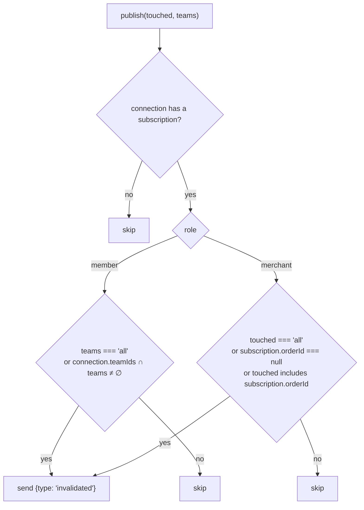
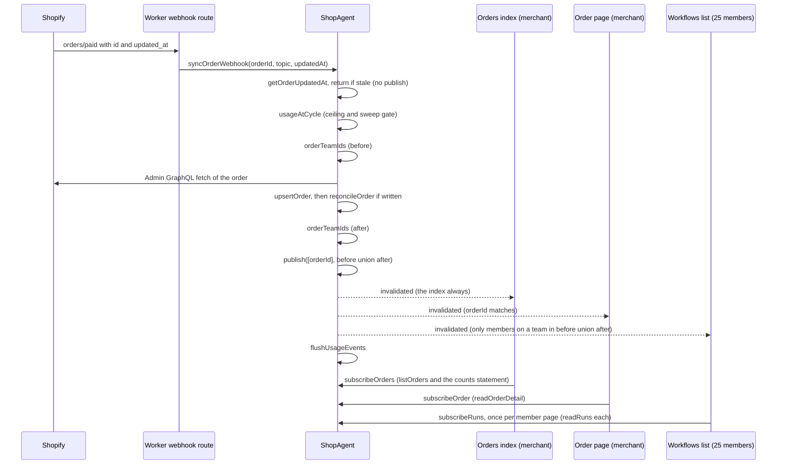

# Where the shop agent publishes, and what refetches

Written 2026-10-03. The question: at which points does `ShopAgent` push an invalidation to
open sockets, which screens refetch on it, what each refetch costs, and where a push could be
skipped or narrowed. The frame is a small-to-medium shop with one merchant and 25 members
holding their index screens open all day.

## Two corrections to the premise

**The subscribed screens do not revalidate the router.** `router.invalidate()` runs on a
socket close with `Domain.CONNECTION_CLOSE_REVOKED` (membership or plan changed) and after a
page's own loader-side writes (the workflows index, the workflow page, the team page, the
members page). Everything the socket pushes goes through TanStack Query: `useSubscribedQuery`
(`src/lib/useSubscribedQuery.ts`) owns one query per subscribed screen with
`staleTime: Infinity`, and an `invalidated` frame calls `queryClient.invalidateQueries` on
that one key. The route loader paints the SSR page and seeds `initialData`; after the socket
identifies, the loader is never read again for that key. So the cost per push is one
`subscribe<Feature>` RPC per open page, not a loader run.

**The push carries no scope.** `Domain.InvalidatedMessage` is `{ type: "invalidated" }`.
Scoping happens on the object, per connection, before the send (`publishTo` in
`src/lib/ShopAgent.ts`). A page that receives a frame always refetches; the only client-side
defence is a 2-second leading-plus-trailing throttle per hook (`INVALIDATION_THROTTLE_MS`).

## The four subscribed screens

| screen (Screens table)      | subscribe RPC     | subscription stored on the connection | what one refetch reads                                                                                                                                                                                                                                                                                                                         |
| --------------------------- | ----------------- | ------------------------------------- | ---------------------------------------------------------------------------------------------------------------------------------------------------------------------------------------------------------------------------------------------------------------------------------------------------------------------------------------------- |
| the orders index (merchant) | `subscribeOrders` | `{ orderId: null }`                   | `OrderRepository.listOrders`: the page (limit + 1 rows), four aggregates keyed by the page's ids, then the **counts statement**: a CTE grouping every open order's runs (`run_summary`), a materialised `facts` row per open order with the correlated multi-match and unassigned terms, and five sums over it. Plus teams and the sync state. |
| the order page (merchant)   | `subscribeOrder`  | `{ orderId: <gid> }`                  | `readOrderDetail`: one order, its items, its runs, the on workflows matching its tags, the other on workflow names, teams. Cheap.                                                                                                                                                                                                              |
| the workflows list (member) | `subscribeRuns`   | `{ orderId: null }`, scoped by team   | `readRuns`: `runListItems` reads **every current task on every open run with a task on the member's teams** (two statements), groups them into the four state counts in TypeScript, then two `count(*)` statements for the Done or closed window. Logged with `ms=`; on the dev store it is 0 to 1 ms.                                         |
| the workflow page (member)  | `subscribeRun`    | `{ orderId: null }`, scoped by team   | `readRunPage`: one run and its tasks. Cheap, but it shares the team scope, so it refetches as often as the list.                                                                                                                                                                                                                               |

`usage` on the orders index is loader-only on purpose and never moves under a push.

## How a push is scoped on the object

`publish(touched, teams)` iterates every connection and calls `publishTo`, which decides per
connection:



So the merchant's orders index receives **every** publish. The order page receives a publish
whose `touched` is `"all"` or names its order. A member receives a publish whose `teams` is
`"all"` or names one of their teams.

## Every publish site

`touched` is the order scope (merchant connections). `teams` is the team scope (member
connections). "reconcile" says whether a reconcile pass precedes the publish, because that is
where runs are created and the counts move.

### Orders arriving from Shopify

| trigger                                                   | method                                 | touched     | teams                                       | reconcile                     | notes                                                                                                                                                                                |
| --------------------------------------------------------- | -------------------------------------- | ----------- | ------------------------------------------- | ----------------------------- | ------------------------------------------------------------------------------------------------------------------------------------------------------------------------------------ |
| webhook `orders/create`, `paid`, `cancelled`, `fulfilled` | `syncOrderWebhook`                     | `[orderId]` | union of the order's teams before and after | the order, inside the upsert  | **Skipped** when the payload's `updated_at` is not newer than the stored row (returns before any fetch or publish). Publishes even when the fetch stored nothing (`written: false`). |
| webhook `orders/edited`                                   | `syncOrderWebhook`                     | `[orderId]` | same                                        | same                          | No `updated_at`, so it always fetches, and always publishes.                                                                                                                         |
| webhook, new order at the cycle ceiling                   | `syncOrderWebhook`                     | `[orderId]` | `[]` (no member)                            | none                          | Nudges the merchant's screens so the next loader read shows the banner.                                                                                                              |
| Sync open orders pressed                                  | `syncOpenOrders`                       | `"all"`     | `"all"`                                     | none                          | Publishes once on start (sync state flips to in flight) or on refusal at the ceiling.                                                                                                |
| the open-orders sync's stream finishes                    | `onOrdersStream`                       | `"all"`     | `"all"`                                     | each order, inside its upsert | One publish after the whole stream, never per order.                                                                                                                                 |
| the sync workflow completes                               | `onWorkflowComplete`                   | `"all"`     | `"all"`                                     | none                          | Milliseconds after `onOrdersStream`'s publish; the client throttle collapses the pair.                                                                                               |
| the sync workflow fails / sink error                      | `onWorkflowError`, `onOrdersSyncError` | `"all"`     | `"all"`                                     | none                          | Sync state carries the message.                                                                                                                                                      |
| Sync this order (the order page button)                   | `syncOrder`                            | `[orderId]` | `"all"`                                     | the order                     | Could name the teams the way the webhook does; it does not.                                                                                                                          |

### Workflow and team configuration (merchant)

| trigger                 | method                      | touched | teams                             | reconcile                              | notes                                                                            |
| ----------------------- | --------------------------- | ------- | --------------------------------- | -------------------------------------- | -------------------------------------------------------------------------------- |
| Edit tag                | `updateWorkflowTag`         | `"all"` | `"all"`                           | all orders, only if the workflow is on | Publishes even when the workflow is off and no pass ran.                         |
| Apply                   | `applyDraft`                | `"all"` | `"all"`                           | all orders, only if on                 | Same.                                                                            |
| the on/off switch       | `setWorkflowOn`             | `"all"` | `"all"`                           | all orders, always                     | The case the question names: turning on creates runs, so the counts move.        |
| Turn on from the editor | `applyAndTurnOn`            | `"all"` | `"all"`                           | all orders, always                     |                                                                                  |
| Delete workflow         | `removeWorkflow`            | `"all"` | `"all"`                           | all orders, always                     |                                                                                  |
| Delete team             | `deleteTeam`                | `"all"` | `"all"`                           | all orders, always                     | Also closes the deleted team's member sockets, which reconnect and re-subscribe. |
| Assign a task's team    | `merchantAssignRunTaskTeam` | `"all"` | before ∪ after teams of the order | none                                   | Named teams; merchant side still `"all"`.                                        |

Not publishing, by design: Create draft, Discard draft, every edit inside the draft (add
step, add task, rename, instructions), team create and rename, member add and remove, billing
and usage. Those screens are loader-based and refresh themselves with `router.invalidate()`.

### Run and task verbs

All thirteen go through `publishToTeams(target)`, which reads the order's teams
(`RunRepository.listOrderTeamIds`) **after** the write and publishes with
`touched = "all"` (the parameter's default; no caller passes anything else).

| actor    | verbs                                                        | touched     | teams                                                           |
| -------- | ------------------------------------------------------------ | ----------- | --------------------------------------------------------------- |
| merchant | Mark done, Reopen, Put back, Set note, Block, Unblock        | `"all"`     | every team with a task on the order                             |
| merchant | Cancel workflow (`merchantCancelRun`)                        | `"all"`     | teams read before the write                                     |
| merchant | Attach workflow (`merchantAttachWorkflow`)                   | `[orderId]` | `"all"` (the one verb that narrows the order and not the teams) |
| member   | Start, Put back, Set note, Block, Unblock, Mark done, Reopen | `"all"`     | every team with a task on the order                             |

`touched = "all"` means every merchant **order page** refetches on every task verb on any
order in the shop, although `listOrderTeamIds` has already resolved the order id to find the
teams.

### Dev only

`seedOrders` publishes `"all"` once after seeding.

## Sequence: an order flips to paid



The member fan-out on a webhook is already team-scoped. A paid order whose items match a
workflow with tasks on two teams reaches those two teams' members only. An order no workflow
matches reaches no member at all (`before ∪ after` is `[]`).

The merchant fan-out is not scoped: the orders index refetches on every webhook the shop
receives, stale ones excepted, and runs the counts statement each time.

## Call tree

```
publish(touched, teams)                       src/lib/ShopAgent.ts
├─ syncOrderWebhook                            [orderId], before ∪ after   ← /webhooks/orders (create, paid, cancelled, fulfilled, edited)
│    └─ (ceiling) [orderId], []
├─ syncOrder                                   [orderId], "all"            ← order page: Sync this order
├─ syncOpenOrders                              "all"                       ← orders index: Sync open orders (start / refused)
├─ onOrdersStream                              "all"                       ← OrdersSyncWorkflow, after the stream
├─ onWorkflowComplete / onWorkflowError        "all"                       ← OrdersSyncWorkflow callbacks
├─ onOrdersSyncError                           "all"                       ← OrdersSyncWorkflow sink
└─ ShopAgentHost.publish                                                   src/lib/agent/ShopWork.ts
     ├─ updateWorkflowTag, applyDraft          "all"       (reconcileAllIfOn)
     ├─ setWorkflowOn, applyAndTurnOn,
     │  removeWorkflow, deleteTeam             "all"       (reconcileAllNow)
     ├─ merchantAttachWorkflow                 [orderId], "all"
     ├─ merchantCancelRun                      "all", teams(before)
     ├─ merchantAssignRunTaskTeam              "all", before ∪ after
     ├─ publishToTeams(target)                 "all", teams(after)
     │    ├─ merchantMarkTaskDone / Reopen / PutBack / SetRunNote / Block / Unblock
     │    └─ memberStartTask / PutBack / SetRunNote / Block / Unblock / MarkTaskDone / Reopen
     └─ seedOrders                             "all"
```

## What already suppresses or narrows a push

- A webhook whose `updated_at` is not newer than the stored row returns before the fetch and
  never publishes. This is the only "nothing changed, say nothing" check in the code.
- A webhook on an order no team has a task on publishes to no member.
- A new order refused at the ceiling publishes to no member.
- A member receives only publishes naming one of their teams, so members on an idle team
  are not touched by another team's work.
- An order page receives only publishes naming its order, when the writer names one.
- The open-orders sync publishes once after the stream, not per order.
- The client throttles invalidations per hook to one refetch per 2 seconds, leading and
  trailing, so a burst of N frames costs 2 refetches, not N.
- Every identify (first connect and each reconnect) refetches once; the keepalive and
  watchdog keep a healthy socket from cycling, so this is rare.

## What does not suppress a push, and could

1. **A fetch that stored nothing still publishes.** `fetchAndUpsertOrder` returns
   `written: false` when the upsert's version guard rejected the row (a redelivery, or an
   `orders/edited` that fetched the same version), and `syncOrderWebhook` publishes anyway.
   Nothing changed in SQLite; the reconcile did not run (it is the upsert's `afterWrite`).
   **Done (2026-10-03):** `fetchAndUpsertOrder` returns `changed` (the row moved, or the
   reconcile created, resized or closed a run); the webhook path and the one-order sync publish
   only on it, and the webhook logs `status=unchanged` otherwise. `written` was not the gate:
   the same version rewrites (rule 7 on `Domain.syncOrder`), so a redelivered edit is `written`.
2. **A reconcile that did nothing still publishes.** `reconcileOrder` and `reconcileAll`
   return counts (`created`, `resized`, `closed`, `multiMatch`) and the callers log them and
   publish regardless. Edit tag and Apply on an **off** workflow skip the pass entirely and
   still publish `"all"` to every open page.
   **Webhook half done with item 1.** **Workflow-verb half: follow-up, not done.** Apply
   changes what the order page's Workflow select lists whether or not a run moved, and Edit
   tag on an off workflow changes the merchant's workflows index, which is loader data and does
   not subscribe; a narrower rule would need a second signal beside the run counts. Both verbs
   say so in their JSDoc.
3. **Task verbs publish `touched = "all"`.** `publishToTeams` resolves the order id to find
   the teams, then throws it away. Every open merchant order page refetches on every Start
   or Mark done anywhere in the shop.
   **Done (2026-10-03):** `listOrderTeamIds` returns the order with its teams, and
   `publishToTeams` passes `[orderId]` as `touched` (`"all"` when the run is gone).
4. **The open-orders sync publishes twice at the end** (`onOrdersStream`, then
   `onWorkflowComplete`). The client throttle collapses the pair, so this costs one extra
   frame per page and no extra read. Not worth a change.
5. **A hidden browser page refetches like a visible one.** The hook refetches on every frame whether
   or not `document.visibilityState` is `"visible"`. A merchant with the orders index open in
   a background browser page all day pays the counts statement for every webhook.
   **Done (2026-10-03):** `useSubscribedQuery` marks the query stale on a frame while the page
   is hidden and refetches once on the next `visibilitychange` to visible (`pageIsHidden`).
6. **The push is not typed.** Sync-state-only changes (a sync started, a sync failed) and
   order-state changes look the same to the client. With one subscription per connection this
   costs nothing today; it would matter only if a page ever held two subscriptions.

## Cost model

Per publish, within one Durable Object, where every read serialises on the object's one
thread:

| open pages                 | refetch per publish                    | reads                                                                          |
| -------------------------- | -------------------------------------- | ------------------------------------------------------------------------------ |
| 1 merchant, orders index   | always                                 | 1 × `listOrders` (page + 4 aggregates + counts CTE over all open orders)       |
| 1 merchant, an order page  | `touched` is `"all"` or names it       | 1 × `readOrderDetail`                                                          |
| 25 members, workflows list | `teams` is `"all"` or names their team | up to 25 × `readRuns` (all current tasks on their teams' open runs + 2 counts) |

Two sources dominate, and they differ in shape:

- **Webhooks** are already team-scoped and skip stale deliveries. A paid order reaches the
  merchant and the teams on that order. The expensive part is the merchant's counts
  statement, once per webhook.
- **Task verbs** are the real volume. 25 members each pressing Start or Mark done once a
  minute is 25 publishes a minute; each reaches every member on the order's teams plus the
  merchant's index and **every** merchant order page (`touched = "all"`). With one or two
  large teams that is on the order of 25 × 25 = 625 `readRuns` a minute, about 10 a second,
  on one object, all day. The 2-second client throttle caps each page at 30 refetches a minute,
  so the ceiling is 25 × 30 = 750 a minute however busy the shop gets. `readRuns` is indexed
  and measured at 0 to 1 ms on the dev store, but it reads every current task for the team,
  so it grows with open work, and Durable Object billing counts each RPC as a request plus
  its wall time.

No remote log sample is on disk (`logs/` holds only the local worker log), so these are
shapes, not measurements. `readRuns` logs `ms=` per call; `listOrders` does not log at all.

## Recommendations, in order

1. **Publish only when the write did something.** In `syncOrderWebhook`, publish when
   `written` is true or when the reconcile's counts are non-zero; return without a publish
   otherwise. Same shape in `syncOrder`. In `updateWorkflowTag` and `applyDraft`, publish only
   when the pass ran (`reconcileAllIfOn` ran) and created or closed something; the order
   page's Workflow select changes on Apply, so the Apply case keeps `touched = "all"` when
   the pass created nothing but still needs a merchant-only nudge. Rule for the JSDoc on
   `publish`: a publish follows a write that changed a stored row or a run; a call that
   changed nothing publishes nothing. Pin with a test per site.
2. **Name the order in `publishToTeams`.** `listOrderTeamIds` already resolves the order id
   for the run-shaped targets; return it alongside the teams and pass `[orderId]` as
   `touched`. The orders index still refetches (it subscribes to everything); the other
   order pages stop. One repository return shape, one `publishToTeams` change, one test.
3. **Defer refetches on hidden browser pages.** In `useSubscribedQuery`, when
   `document.visibilityState === "hidden"`, invalidate with `refetchType: "none"` and refetch
   once on `visibilitychange` to visible. The watchdog effect already listens to
   `visibilitychange` in `ShopAgentSocketHost`, so the pattern exists. Bench tablets stay
   visible and unaffected; a merchant's background pages stop paying for every webhook.
4. **Instrument on local and staging, not production** (decision 4). Add `ms=` to
   `listOrders` as `readRuns` has it, and log each publish at Info with how many merchant
   and member connections it reached, both gated on `ENVIRONMENT !== "production"` (the
   object reads it from its env binding, `wrangler.jsonc`). With those two lines, Workers
   observability on staging counts `subscribeOrders` and `subscribeRuns` per shop per hour
   and how long each took. No load test. The counts statement stays the next candidate; its
   options (an incremental counter table maintained at write time, a separate counts query
   with a longer throttle, or a version stamp the client compares) wait for that reading.
5. **Leave alone:** the double publish at the end of the open-orders sync, a typed push, and
   any server-side coalescing. The client throttle already does the coalescing per page, a
   server-side timer fights hibernation, and a typed push buys nothing while a connection
   holds one subscription.

## Decisions

Answered 2026-10-03 in Plannotator. No open questions remain.

1. A write that changed nothing publishes nothing. Start with the webhook path, where
   `written` already exists and redeliveries are a known source of no-op fetches; the rule
   goes on `publish` with a test per site.
2. `publishToTeams` names the order: `listOrderTeamIds` returns the order id with the teams
   and the publish passes `[orderId]` as `touched`.
3. Hidden browser pages defer their refetch until they are visible.
4. Instrument on local and staging, not production: `ms=` on `listOrders` and a per-publish
   recipient count, gated on `ENVIRONMENT`. No load testing. The counts work waits for the
   staging reading. (Revised the same day from "no instrumentation".)
5. The task-verb fan-out to every teammate is accepted as is.
