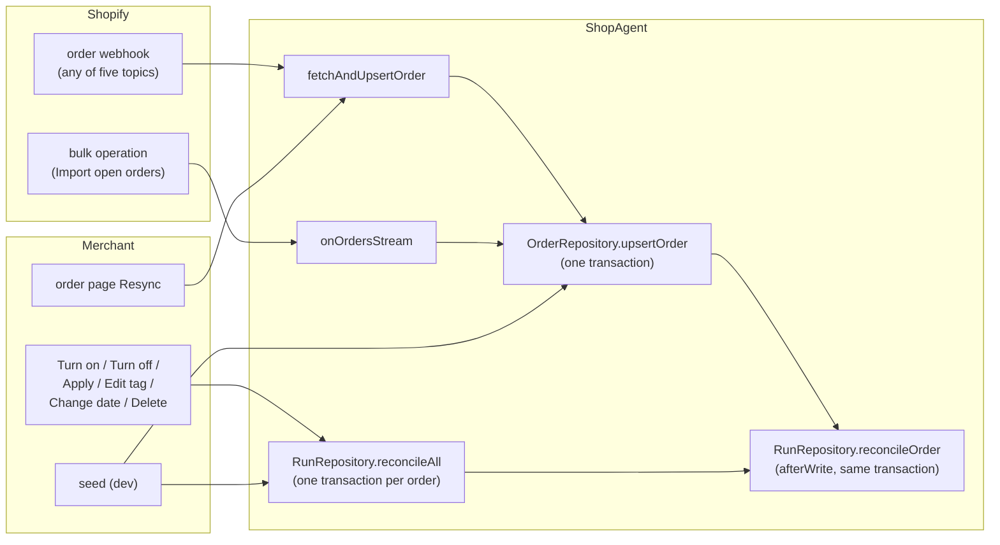

# Reconcile: what it is, how it runs, and what its spec should be

## The short version

Reconcile is the one place Baton decides what runs an order should have. It reads one stored
order and its items, compares them with the workflows that are on, and makes the runs agree:

- an item that one on workflow matches and that has no run gets a run;
- an item that two or more match gets nothing, and the order page asks the merchant to choose;
- an open run whose item lost units is resized; at zero units it is closed;
- an order Shopify cancelled or fulfilled has every open run closed;
- a done run is never touched, and any run, done or closed included, keeps its item from getting
  another one.

It is idempotent: running it twice changes nothing the second time. That is why every Shopify
event, every workflow change and the seed can all call the same function without knowing what
happened before. Shopify's own guidance for order management systems says the same thing: fetch
the whole order after each webhook, reconcile from the fetched state, and reconcile again
periodically for the events that never arrived.

There are two shapes:

| name          | scope                              | called by                                                                    |
| ------------- | ---------------------------------- | ---------------------------------------------------------------------------- |
| reconcile     | one order, inside its upsert       | a webhook, the import, the order page's refresh, the seed                    |
| reconcile all | every open, paid order, one by one | Turn on, Turn off, Apply, Edit tag, the coverage date, Delete workflow, seed |

## Words used below

The left column is the word this doc uses. The right says whether the glossary in `Domain.ts`
has it. Section "Vocabulary" says what to add.

| word             | meaning                                                                                                                                                          | symbol                                        | in glossary                         |
| ---------------- | ---------------------------------------------------------------------------------------------------------------------------------------------------------------- | --------------------------------------------- | ----------------------------------- |
| reconcile        | make an order's runs agree with the order and the on workflows                                                                                                   | `RunRepository.reconcileOrder`                | no                                  |
| reconcile all    | reconcile every open, paid order once                                                                                                                            | `RunRepository.reconcileAll`                  | no                                  |
| startable        | a workflow that is on, has a task, and has every task on a team the shop still has                                                                               | `RunRepository.canStart`                      | no                                  |
| match            | an item and a startable workflow: the tag test and the coverage date                                                                                             | `RunRepository.matchesLineItem`               | no                                  |
| coverage date    | the date a workflow is responsible from; orders placed before it never match                                                                                     | `Workflow.activatedAt`                        | no                                  |
| ambiguous        | an item two or more startable workflows match, with no run                                                                                                       | `Domain.ambiguousItems`, `matchedWorkflowIds` | no (the issue "choose workflow" is) |
| one run per item | an item has at most one run, whatever its status; a done or closed run still counts, so nothing starts another. The code calls this "the slot"; see "Vocabulary" | the unique index on `Run.lineItemId`          | no                                  |
| units to make    | the item's `currentQuantity`                                                                                                                                     | `Domain.unitsToMake`                          | no                                  |
| resize           | write the item's units onto an open run                                                                                                                          | `Run.quantityChangedFrom`                     | no                                  |
| close            | end an open run for a reason that is not a person's Done                                                                                                         | `Domain.ClosedReason`                         | yes (run state "closed")            |
| creation gate    | whether reconcile may start runs on the order: paid and not cancelled                                                                                            | `Domain.canStartRuns`                         | no                                  |
| stop gate        | whether reconcile closes every open run: the order cancelled or fulfilled. An order-level test, like the creation gate; both read the order, never an item       | `Domain.isCancelled`, `Domain.isFulfilled`    | no                                  |
| start context    | the startable workflows with their tasks, and the shop's teams from D1, read once before a pass                                                                  | `RunRepository.StartContext`                  | no                                  |
| source           | which path wrote the order: webhook, bulk, manual                                                                                                                | `Domain.OrderSyncSource`                      | no                                  |

## When reconcile runs



Three facts about the wiring matter more than the arrows:

1. **Reconcile runs inside the order's write.** `upsertOrder` opens the transaction, writes the
   order and its items, then runs `afterWrite`, which is reconcile. A webhook therefore either
   stores the order and its runs, or neither. Durable Object SQLite cannot nest transactions,
   so reconcile issues plain statements and never opens its own.
2. **The start context is read first, outside the transaction.** The shop's teams live in D1,
   a network read, which cannot happen inside the object's transaction. So `startContext()` runs
   **once** per webhook, once per import, once per reconcile all, and every order in that pass
   works from the same snapshot. A thousand-order import reads D1 once, not a thousand times;
   its cost is one D1 read per import plus one per webhook. The price is staleness, not money: a
   team deleted in the middle of the import is not seen by the rest of it. The JSDoc calls this
   accepted.
3. **The topic is ignored.** A webhook says "orders/updated" or "orders/cancelled"; reconcile
   does not read it. It fetches the order and works from what Shopify says now. That is what
   makes retries and out-of-order delivery safe: the newest state wins, whatever knocked.

Which caller runs which shape, and when a caller skips. "Include them" is a box in the Turn on
dialog: when open orders placed before now would match the workflow, the dialog says how many and
offers to include them, which dates the workflow's coverage from the earliest of them instead of
from now. Turn on without the box covers orders placed from now on.

| caller                                    | shape         | skipped when                                                                      |
| ----------------------------------------- | ------------- | --------------------------------------------------------------------------------- |
| order webhook                             | reconcile     | duplicate webhook id; payload older than the stored row; order deleted at Shopify |
| Import open orders                        | reconcile     | the stored row is fresher; the order is past retention; the order ceiling         |
| order page Resync                         | reconcile     | order deleted at Shopify; no dedupe, no staleness check                           |
| Turn on (with or without Include them)    | reconcile all | never                                                                             |
| Turn off                                  | reconcile all | never: the survivor of an ambiguity starts                                        |
| Delete workflow                           | reconcile all | never: same reason                                                                |
| Apply, Edit tag, Change the coverage date | reconcile all | the workflow is off                                                               |
| Attach, Change workflow                   | neither       | `setRun` is the merchant's own choice and bypasses matching                       |
| Delete team                               | neither       | see "Problems found" 3                                                            |
| a run going done under the ceiling        | neither       | see "Problems found" 4                                                            |

## What one pass does


Two gates, on purpose split. Cancelled and fulfilled are the stop gates: they return early and
close everything open. Paid is the creation gate: it only decides whether new runs start. So an
edit that pushes a paid order back to unpaid keeps its runs, still resizes and closes them, and
starts nothing new until the balance lands. A payment wobble never cancels work.

Done runs are never touched. Closed runs are never touched. Both keep their item's slot, so a
tag match after a merchant's Cancel workflow, or after Shopify ended the work, starts nothing.
The only way to a new run on such an item is the merchant's Change workflow, which deletes the
incumbent.

### Call tree, one webhook

```
/webhooks/orders (HMAC checked)
└─ ShopAgent.syncOrder                      duplicate webhook id? older updatedAt? → return
   ├─ orderTeamIds(before)                  the teams with a task on the order, before the write
   ├─ ShopAgent.fetchAndUpsertOrder
   │  ├─ Shopify Admin: OrderSync query     the full order; null → log, return
   │  ├─ ShopAgent.reconciler("webhook")
   │  │  └─ ShopAgent.startContext          on workflows + tasks (object), the shop's teams (D1)
   │  └─ OrderRepository.upsertOrder        ── one transaction ──
   │     ├─ retention cutoff, order ceiling  fresh order only: refuse an order placed over 365 days ago,
   │     │                                    or one past the cycle's order ceiling (ShopLimits)
   │     ├─ upsert ShopOrder                 where excluded.updatedAt >= stored.updatedAt
   │     ├─ delete + insert OrderLineItem    matchedWorkflowIds written as [] on insert only
   │     └─ afterWrite → RunRepository.reconcileOrder   (the flowchart above)
   │        ├─ closeOpenRuns                 order_cancelled | fulfilled | item_removed
   │        │  └─ releaseOpenRunLimit        clears the open-run ceiling banner once under 5000 open runs
   │        ├─ insertRun                     on conflict do nothing (the slot)
   │        │  └─ OrderRepository.countOrder metering: first run counts the order
   │        └─ update Run quantity           resize, quantityChangedFrom
   ├─ flushUsageEvents                       send the usage queue
   ├─ orderTeamIds(after)
   └─ publish(orderId, teams)                 to every team that had a task on the order before the
                                              write or has one after it: a reconcile can take a team's
                                              last task away, and that team is only nameable before
```

### Call tree, Turn on

```
ShopAgent.setWorkflowActive
├─ WorkflowRepository.setWorkflowActive     activatedAt = now, or the earliest waiting order's date when
│                                            the merchant ticked Include them
├─ ShopAgent.reconcileAllNow
│  ├─ ShopAgent.startContext
│  └─ RunRepository.reconcileAll
│     ├─ select open, paid orders           cancelled/fulfilled: nothing to start; unpaid: starts when it pays
│     └─ for each, concurrency 1:  sql.withTransaction(reconcileOrder)
│  └─ flushUsageEvents                       ensuring: even if the pass failed halfway
└─ publish("all")                            returns { started } for the toast
```

## Worked examples

**A new order.** Shopify sends `orders/create`. Baton fetches it: unpaid, one item tagged
`hinge`, workflow Finishing (tag `hinge`) is on. Reconcile writes `matchedWorkflowIds =
[Finishing]` and starts nothing, because the creation gate is closed. `orders/paid` arrives;
reconcile runs again from scratch, matches again, sees one match and no run, inserts the run
with its tasks, counts the order.

Why match at all while unpaid? Matching is recomputed on every pass, so the unpaid match is not
needed for the paid pass. It is written for the order page: the item's picker lists the matched
workflows first, and the JSDoc says the column must never be stale behind a definition change.
That is the only reason. Whether it is worth the write is question 8 below.

**Two workflows claim an item.** Brass (tag `brass`) and Finishing (tag `hinge`) are both on;
an item carries both tags. Reconcile writes both ids, starts nothing, and the orders index shows
Needs a workflow. The merchant either chooses on the order page (`setRun`, no reconcile) or turns
one workflow off: Turn off runs reconcile all, the item now has one match, the survivor's run
starts. That is why Turn off reports "started N".

**A quantity edit after work started.** The item was 3, the run's task is started. Shopify
sends `orders/edited`; units to make is now 2. Reconcile writes `quantity = 2,
quantityChangedFrom = 3`. The card shows Quantity changed · 3 → 2. The next Done clears the badge.
Had no task started, the run would be resized silently.

**A refund to zero.** Units to make reaches 0. The open run closes as `item_removed`. If the
merchant later edits the item back to 2, nothing restarts: the closed run holds the slot. The
order page offers Change workflow on the closed item.

**Turn on, with the Include them box ticked.** A workflow turned on today covers orders placed
from today. The dialog also counts open orders already stored that were placed earlier and would
match: items with the tag, not already carrying a run, and not also matched by another on
workflow. When that count is above zero the dialog names it and offers the Include them box.
Ticked, Turn on dates the coverage from the earliest such order rather than from now, and the
reconcile all that follows starts the paid ones. The count is "what would actually start", not
"what matches".

## Vocabulary

Reconcile speaks a dozen words the glossary does not have, and it uses two glossary words in a
second sense.

**Words with no glossary row.** reconcile, reconcile all, startable, match, coverage date,
ambiguous, slot, units to make, resize, creation gate, stop gate, start context, source. Each is
defined in a JSDoc somewhere, sometimes in two places with slightly different wording ("the item
half" and "the definition half" on `matchesLineItem` and `canStart`; "existing runs win" on
`reconcileOrder`; "holds the slot" on `RunStatus`).

**Collisions.**

- _active_. The glossary says a workflow is on or off, stored as `activatedAt`. The code says
  `isActive`, `listActiveWorkflowDetails`, `setWorkflowActive`, "the active set". A run's stored
  open status is also `active`. Three things, one word. Prose and JSDoc should say "on"; whether
  the identifiers rename is a question below.
- _start_. The glossary's verb `start` is a member taking a task. Reconcile "starts a run",
  `canStart`, `canStartRuns`, `startable`, `StartContext`, `ActivateResult.Ok.started`. The
  member's Start and reconcile's start are different acts on different nouns. The JSDoc on
  `Workflow` decided this on purpose ("`start` / `canStart` is creating a run"), but the
  glossary's verb table does not carry the second sense.
- _closed_. A closed order (Shopify has ended it) and a closed run (something other than
  Done ended it) are both "closed", and reconcile is where they meet: a closed order closes
  runs. The glossary already keeps them apart by noun; the doc and the spec must always say
  which.
- _cancel_. The merchant's Cancel workflow (a verb on a run, reason `merchant_cancelled`) and
  Shopify's cancelled order (a stop gate, reason `order_cancelled`).

**Recommended glossary rows.** A "Reconcile" table beside "Run states", in the glossary's
form. Screen is "(none)" for every row: no screen says any of these words. The merchant sees the
effects (Needs a workflow, Closed · Item removed, Quantity changed) and never the mechanism.

| word             | meaning                                                                              | symbol                                                | screen                        |
| ---------------- | ------------------------------------------------------------------------------------ | ----------------------------------------------------- | ----------------------------- |
| reconcile        | make an order's runs agree with the order and the on workflows; idempotent           | `RunRepository.reconcileOrder`                        | (none)                        |
| reconcile all    | reconcile every open, paid order once                                                | `RunRepository.reconcileAll`                          | (none): "started N" toast     |
| startable        | on, has a task, every task on a team the shop still has                              | `RunRepository.canStart`                              | (none)                        |
| match            | an item and a startable workflow: tag and coverage date agree                        | `RunRepository.matchesLineItem`, `matchedWorkflowIds` | (none)                        |
| coverage date    | the date an on workflow is responsible from; earlier orders never match              | `Workflow.activatedAt`                                | the date on the workflow page |
| ambiguous        | an item two or more startable workflows match, with no run                           | `ambiguousItems`                                      | Needs a workflow (the issue)  |
| one run per item | the rule: an item has at most one run, whatever its status; a run **holds** its item | `Run.lineItemId` unique                               | (none)                        |
| units to make    | what is left to make: `currentQuantity`                                              | `unitsToMake`                                         | the quantity on the card      |

"Slot" is the code's word for the one-run-per-item rule (`RunStatus`: "holds the item's slot"). It
is a metaphor, and the rule already has a plain statement: one run per item, and a run holds its
item. Recommendation: no noun at all. Say the rule, use "holds" as the verb, and drop "slot" from
JSDoc. The alternatives considered: "seat" is taken by billing, "claim" and "place" are new
metaphors, and "the item's run" says which run without saying that there can be only one.

"Roster" is another code word with no glossary row: `TeamRoster`, `recordRoster`,
`rosterAtCeiling`, "the live roster", "roster size". It means the shop's members, or the shop's
teams, depending on the sentence. Neither the merchant nor a member ever sees it. Recommendation:
retire it. Where it means the members it is "members" and "member count"; where it means the
teams it is "teams". This doc has already replaced it.

"Resize" and "close" are verbs reconcile does, listed in the outcomes table below rather than as
nouns. "Creation gate" and "stop gate" are JSDoc terms on `canStartRuns`, `isCancelled` and
`isFulfilled`, like "provisional cycle" is on its symbol: not glossary words.

## Naming discipline: how a collision happens and how to stop the next one

The glossary has grown one table at a time, each added when a change needed it: run states,
then task states, then billing, then issues, then screens. Each table is coherent on its own.
The collisions above are what happens between tables: a word chosen for one concept while the
glossary was silent on the other. Nobody chose "active" for three things; three changes each
found the word free.

### The principles

1. **One word, one concept; one concept, one word.** The test is a sentence: if a sentence in
   glossary words can be read two ways, the vocabulary has a collision. "The active workflow's
   active run" reads fine to the code and two ways to a person.
2. **The merchant's world names what surfaces; the code names the rest, and never surfaces it.**
   Shopify's words for Shopify's things (order, item, tag, fulfilled, cancelled, paid). The shop
   floor's words for the floor's things (team, task, step, block, note). An invented word only
   for a thing with no natural name (run, reconcile, slot), and an invented word never appears on
   a screen: the merchant sees its effects. This is the rule the glossary already applies to
   "run".
3. **Identifiers carry the glossary word, never the stored literal.** A run's open status is
   stored as `active` and the glossary calls it open; `runIsOpen` is right. A workflow's on
   switch is stored as `activatedAt` and the glossary calls it on; `isActive` is the stored
   word leaking into an identifier, and it is where the collision with the run status came
   from. The stored literal belongs in the schema, the migration and the glossary's `stored`
   column, nowhere else.
4. **A person's act and a mechanism's effect get different verbs.** The glossary's verb table
   is what a person does (start, done, block, cancel, attach). What reconcile does to a run is
   not an act by anyone: it creates, resizes and closes. A verb from the person table used for a
   mechanism ("reconcile starts a run", "Turn off started N") is how "start" collided.
5. **An adjective may be shared across nouns only when it means the same thing on each, and it
   is then always written with its noun.** "Open order" and "open run" share "open" because
   both mean work can still be recorded; "closed order" and "closed run" share "closed"
   because both mean something other than a person ended it. "Active" fails this test: an
   active workflow is on, an active run is open, and neither means what the other does.
6. **Retiring is cheaper than living with it.** A rename touches identifiers, tests, JSDoc and
   maybe a callable name, once. A collision is paid on every read, by a person and by the
   model, for as long as it stands. When a better word is found, the existing word goes on the
   retired list and the lint refuses it.

### The procedure for a new word

Before a change introduces a word, in this order:

1. **Look it up.** Is the concept already in the glossary under another word? Use that word.
2. **Collision check.** Grep `src/` for the stem (`grep -oh "\b[A-Za-z_]*[Ss]tart[A-Za-z_]*\b"
src/lib/*.ts | sort -u`). Every identifier that comes back must mean the same thing, or the
   word is taken. This is the check that would have caught "active" and "start".
3. **Write the row first.** Word, meaning in one line, the symbol that is the concept, and what
   the screen says or "(none)". If the screen column is not "(none)", the word must pass
   principle 2.
4. **Rename in the same change.** Every identifier, JSDoc, test title and research doc that
   said the old word. A rename is never a follow-up: the glossary says the word is ubiquitous,
   and a half-renamed tree is the collision again under a new name.
5. **Retire the loser.** Add the old word to the retired list with its replacement, so the
   lint refuses it in copy and, once `rules-lint` learns identifiers, in code.

### The collisions this research found, and what to do about each

| word   | sense A                                                                                      | sense B                                                                                     | recommendation                                                                                                                                                                                                                                                                                  |
| ------ | -------------------------------------------------------------------------------------------- | ------------------------------------------------------------------------------------------- | ----------------------------------------------------------------------------------------------------------------------------------------------------------------------------------------------------------------------------------------------------------------------------------------------- |
| active | workflow on (`isActive`, `setWorkflowActive`, `listActiveWorkflowDetails`, "the active set") | run open (stored `active`); app subscription (`activeSubscription`)                         | rename the workflow side to "on": `workflowIsOn`, `setWorkflowOn`, `listOnWorkflowDetails`, "the on workflows"; keep stored `active` for the run in the schema only; retire "active"                                                                                                            |
| start  | a member takes a task (verb table)                                                           | a run is created (`canStart`, `canStartRuns`, `startable`, `StartContext`, `started` count) | reconcile and Attach "create" a run (the glossary's attach row already says "creates the run"; `ReconcileCounts.created` already does); the workflow half becomes "eligible" (`workflowIsEligible`, `EligibleContext`), the order half `orderCanCreateRuns`; the Turn on toast counts "created" |
| closed | order: Shopify has ended it                                                                  | run: something other than a person's Done ended it                                          | keep both (principle 5), always with the noun; the spec's tables say "closed order" and "closed run" in full                                                                                                                                                                                    |
| cancel | the merchant's Cancel workflow on a run                                                      | Shopify's cancelled order                                                                   | keep both, with the noun; the reason literals `merchant_cancelled` and `order_cancelled` already carry it                                                                                                                                                                                       |
| sync   | fetch and upsert one order (`syncOrder`, `OrderSync`)                                        | the Resync button; the import (`syncOrders`)                                                | no collision: one meaning, fetch and store what Shopify has. The spec should say sync is what happens before reconcile and never reconciles by itself                                                                                                                                           |

"Eligible" is offered because the other candidates fail: "ready" is a task state, "live" and
"applied" are on the `Workflow` JSDoc's not-used list, "complete" reads as done, "whole" is
not a word anyone says. If "eligible" is refused, the fallback is keeping "start" for a run and
adding a verb row `start | run | reconcile or Attach creates it`, so at least the glossary
admits the second sense.

### Making the check mechanical

`pnpm spec check` already verifies that every glossary symbol exists and that the screen
columns equal the label constants. `rules-lint` refuses retired words in screen copy. Two
additions would catch the next collision before review:

- **Reserved stems.** A short list beside the glossary: a stem and the one concept it may name
  (`active` → nothing, retired; `start` → a task; `on` → a workflow). `rules-lint` refuses an
  exported identifier under `src/lib/` that carries a reserved stem for another concept. A
  stem list, not a full parse: `isActive`, `listActiveWorkflowDetails` and `canStartRuns` are
  all caught by a substring test on exported names.
- **The sentence test in the glossary.** Each new table ends with one sentence that uses its
  words together with the older tables' words. The task states table already does this ("In
  progress is the run's screen word and only the run's"). It is not mechanical, but it is the
  moment a reviewer notices two senses side by side.

## Problems found

1. **The rule has no home.** The behaviour is spread across the JSDocs on `RunStatus`,
   `ClosedReason`, `Run.quantityChangedFrom`, `OrderLineItem`, `canStartRuns`, `isCancelled`,
   `isFulfilled`, `canStart`, `matchesLineItem`, `reconcileOrder`, `reconcileAll`,
   `reconcileAllNow` and `reconcileAllIfActive`, plus five inner comments in the function body.
   Each is right; none is the spec. AGENTS.md says behavioural rules stay on a `Domain` symbol,
   and there is no `Domain` symbol for reconcile: the decision (what to start, close, resize) is
   interleaved with the SQL that does it.
2. **No test reads a table.** Twenty-odd tests in `run-repository.test.ts` pin the behaviour by
   hand-written title. They are good tests, but nothing checks that every cell has one, the way
   `runActions` and the triggers table are checked.
3. **Delete team does not reconcile.** A workflow whose task lost its team stops being startable
   (`canStart` fails). Nothing re-runs the pass, so `matchedWorkflowIds` on every open order
   still lists that workflow until the order's next webhook. Needs a workflow on the index and
   the picker's "matched first" ordering read stale. Apply, Edit tag and the date all reconcile;
   team delete is the one definition-side change that does not.
4. **The open-run ceiling releases nothing.** The ceiling is `ShopLimits.maxOpenRuns`, 5000
   open runs per shop: items being made at once, not orders. Its JSDoc calls it a safety valve
   for the object's storage, not a product limit; a shop near it is far outside what the app is
   designed for. The other ceiling, `maxOrdersPerCycle` at 100, is on new orders stored per
   billing cycle and is the one a real shop can reach. When reconcile declines to start runs at
   the open-run ceiling, the JSDoc says "the next reconcileAll starts it once there is
   room". Nothing schedules that pass: a run going done clears the banner flag
   (`releaseOpenRunLimit`) and stops. The declined order waits for its own next webhook or for
   the merchant to edit a workflow. At the ceiling that could be a long wait for a quiet order.
5. **Reconcile all skips unpaid orders**, so after a definition change their matches are stale
   until they pay. The pass on payment fixes it before any run starts, so no wrong run results;
   only the order page's picker ordering and the "matched" badge are behind. Fulfilled and
   cancelled orders are skipped for a better reason: there is nothing to do on them.
6. **The `ambiguous` count and the issue disagree.** `reconcileOrder` counts an unpaid order's
   ambiguous items; `orderIssues` says an unpaid order is not choosing. The log figure and the
   Issues count differ by the unpaid orders. Harmless, but a spec that names one number has to
   pick.
7. **The start context is a snapshot** for a whole bulk stream, taken before the first network
   read of the NDJSON file. The Durable Object serialises callables, but a stream that awaits
   network lets other callables in between chunks. The JSDoc states the trade. The spec should
   state it as an assumption, as the triggers table does for billing cycles.
8. **`matchedWorkflowIds` is a cache with two writers' worth of rules.** The upsert writes `[]`
   on insert and leaves it alone on update; reconcile overwrites it; `listOrders` restates the
   ambiguity test in SQL; `ambiguousItems` and `lineItemState` restate it in TypeScript. Four
   sites agree today. The data-model table on `initializeSchema` should carry the column's rule
   ("written by reconcile only") if it does not already.

None of these produces a wrong run. 3 and 4 produce a stale screen or a late start. 1 and 2 are
the reason this doc exists.

## What the spec could look like

Two tables, because reconcile has two kinds of rule: _when_ it runs, and _what it does to one
item_. Both fit a JSDoc.

### The triggers table (when)

Same form as the triggers table on `ShopUsage`: one row per trigger, fixed words in the shape
column, a pinned test title. Lives on the symbol that is the concept (question 1 says which).

| trigger                  | shape         | skipped when                                            | pinned by                                                                                                                              |
| ------------------------ | ------------- | ------------------------------------------------------- | -------------------------------------------------------------------------------------------------------------------------------------- |
| order webhook, any topic | reconcile     | duplicate id, older payload, order gone                 | waits for payment, then starts runs identically from any source                                                                        |
| Import open orders       | reconcile     | stored row fresher, past retention, order ceiling       | creates runs only for orders processed after the workflow was created; a re-stream creates none                                        |
| order page Resync        | reconcile     | order deleted at Shopify; no dedupe, no staleness check | (none yet)                                                                                                                             |
| Turn on, Include them    | reconcile all | never                                                   | counts open orders that would match if the date allowed, paid or not, with the earliest placed date; Include them starts the paid ones |
| Turn off                 | reconcile all | never                                                   | turning one of two matching workflows off starts the survivor and says how many                                                        |
| Delete workflow          | reconcile all | never                                                   | (none yet)                                                                                                                             |
| Apply                    | reconcile all | workflow off                                            | an edit after turn-on still starts the workflow's tasks; apply while on replaces them and earlier runs keep their copies               |
| Edit tag                 | reconcile all | workflow off                                            | retagging an on workflow reconciles stored orders against the new tag                                                                  |
| Change the coverage date | reconcile all | workflow off                                            | (none yet)                                                                                                                             |
| Delete team              | none          | always (problem 3)                                      | (none yet)                                                                                                                             |
| Attach, Change workflow  | none          | always: `setRun` is the merchant's choice               | manual attach is refused on a cancelled or fulfilled order and allowed on an unpaid one                                                |

`shape` is one of `reconcile`, `reconcile all`, `none`, so `pnpm spec check` can refuse a row
that says what happens in words the reader has to interpret, as it does for the order-count
column today. `pinned by` is checked the same way: a title no test carries fails the check.

### The outcomes table (what, per item)

Same form as `runActions`: each row is one fixture, each cell one input, the last column the
outcome from a fixed list. A test reads the table out of the source and asserts every row, so a
change starts at a cell.

| order     | paid | units   | run on item     | matches           | outcome                                    |
| --------- | ---- | ------- | --------------- | ----------------- | ------------------------------------------ |
| cancelled | any  | any     | open            | any               | close `order_cancelled`                    |
| fulfilled | any  | any     | open            | any               | close `fulfilled`                          |
| closed    | any  | any     | done or closed  | any               | nothing                                    |
| open      | any  | 0       | open            | any               | close `item_removed`                       |
| open      | any  | changed | open, unstarted | any               | resize, no badge                           |
| open      | any  | changed | open, started   | any               | resize, badge from the original            |
| open      | any  | same    | open            | any               | nothing                                    |
| open      | any  | some    | done or closed  | any               | nothing: the slot is held                  |
| open      | yes  | some    | none            | 1                 | start                                      |
| open      | yes  | some    | none            | 2+                | nothing: ambiguous                         |
| open      | any  | some    | none            | 0                 | nothing                                    |
| open      | no   | some    | none            | 1                 | nothing: waits for payment; match recorded |
| open      | yes  | some    | none            | 1, at the ceiling | nothing: banner raised                     |

`outcome` is one of `start`, `close <reason>`, `resize`, `nothing`, with the rest of the cell
free text after a colon. "matches" counts startable workflows only; an off workflow, an empty
one, or one with an unassigned task is not a match. Every row already has a test in
`run-repository.test.ts`; the table would name them or the test would read the table.

The prose under the tables carries what a cell cannot: the two-gate split and why, the snapshot
assumption, and that reconcile is idempotent.

### Where the rule and the test meet

`runActions` is a pure function in `Domain.ts`; its test builds each row's inputs and calls it.
Reconcile is not pure: it reads storage and writes it. Two ways to get a table-driven test:

- **Extract the decision.** A pure `Domain` function takes the order, its items, its runs with
  tasks, and the startable workflows, and returns a plan: which items to start with which
  workflow, which runs to close with which reason, which to resize, which items are ambiguous,
  and the new `matchedWorkflowIds`. `reconcileOrder` reads, calls it, executes the plan, and
  handles the ceiling. The outcomes table goes on the planner; `domain.test.ts` reads it like
  `run-actions.test.ts` reads `runActions`. The repository's tests stay as they are for the
  SQL half.
- **Keep it as it is** and have `run-repository.test.ts` read the table, build each row's rows
  in SQLite, run `reconcileOrder`, and assert the outcome. Heavier per row, no code change.

## Decisions (reviewed 2026-09-29)

Accepted as recommended: Q1 (a pure planner in `Domain.ts` carries the tables), Q2 (the word is
"reconcile"), Q3 (eight glossary rows, gate words stay JSDoc terms), Q4 ("coverage date"), Q6
(Delete team reconciles all), Q7 (the open-run ceiling releasing runs a pass), Q9 (`ambiguous`
counts only when the creation gate is open), Q10 (a closed run holds its item; no restart), Q11
(per-item rows), Q12 (`spec check` parses both tables and the test reads the outcomes table).

Deferred to `docs/domain-vocabulary-research.md`, which goes first: Q5 (`active`), Q13
(`start`), Q14 (the lint), and the words this review questioned: roster, slot. The vocabulary is
decided before the reconcile spec is written, so the spec is written in the final words once.

Still open here: Q8 (cost answered above; decision pending).

## Questions

Answered questions are kept for the record; the Decisions section above is current.

**Q1. Where does the spec live?** Recommendation: a new pure planner in `Domain.ts` (the first
option above), with the outcomes table on it and the triggers table on the same symbol or on
`RunStatus`. Reason: AGENTS.md puts behavioural rules on `Domain` symbols, a pure function gets
the same table-reading test as `runActions`, and the decision stops being interleaved with SQL.
The cost is one refactor before any behaviour change. The alternative, tables on
`RunRepository.reconcileOrder` as it stands, is a smaller change and breaks the "rules on
Domain" convention for the one rule that most needs a home.

**Q2. What is the word for the operation?** Recommendation: keep "reconcile". It is Shopify's
own word for the pattern, every identifier and log line already uses it, and no screen ever
says it, so the retired-words lint is not affected. "Sync" is the fetch that precedes it and
should stay distinct. Add "reconcile" and "reconcile all" to the glossary as above.

**Q3. Which of the new words go in the glossary?** Recommendation: the eight rows in
"Vocabulary". Leave "creation gate", "stop gate", "start context" and "source" as JSDoc terms
on their symbols. The test for a glossary word is "would a JSDoc, test or research doc need it
to say a rule": startable, match, ambiguous, slot and coverage date all pass; "gate" is a
description of a predicate, not a thing.

**Q4. "coverage date" or another word for `activatedAt`?** The JSDoc on `setWorkflowActive`
already says "coverage date". Recommendation: adopt it as the glossary word; the screen column
says what the workflow page shows beside its Change control, which this research did not audit.
The alternative "turn-on date" is wrong once Include them or Change has moved it.

**Q5. Should the workflow-side `active` identifiers rename to `on`?** Moved to
`docs/domain-vocabulary-research.md`, with the Shopify Flow finding: Flow's buttons say Turn on
and Turn off, its status badge says Active and Inactive, and its prose says "activate". Baton's
screen words (On, Off, Turn on, Turn off) and its identifiers (`isActive`, `setWorkflowActive`)
are both Flow's words; the collision is only with the run's stored `active`. The recommendation
there is to keep Flow's words on screen and decide the identifier rule for the whole vocabulary,
not for this one word.

**Q6. Should Delete team reconcile all?** Recommendation: yes, through `reconcileAllNow`, and a
triggers row saying so. It is the one definition-side change that can turn a startable workflow
into a non-startable one without a pass. The cost is one full pass per team delete, which is
rare. The alternative is a spec row saying the matches go stale until the next webhook, which
is honest but leaves Needs a workflow wrong on the index.

**Q7. Should the ceiling releasing trigger a pass?** Recommendation: yes. When
`releaseOpenRunLimit` clears the flag, the caller runs reconcile all once. It happens on the
transition only, so the ordinary Done pays nothing. The alternative is to say in the spec that a
declined order waits for its next webhook or a workflow change, and to accept the wait.

**Q8. Should reconcile all include unpaid orders?** Recommendation: yes. It creates nothing on
them, so the cost is the read and the `matchedWorkflowIds` write, and it removes a stale-screen
case from the spec. Keep fulfilled and cancelled excluded.

Cost, from `refs/cloudflare-docs` (Durable Objects pricing, "Rows written"): rows written are
$1.00 per million past 50 million a month; rows read are $0.001 per million past 25 billion.
One unpaid order in a pass costs about three reads (order, items, runs) and one write per item.
A shop with 100 open unpaid orders of three items pays 300 writes per reconcile all, and a
reconcile all runs only on a workflow change, so a shop making ten changes a day writes about
90,000 rows a month this way, under a fifth of one percent of the included 50 million. Money is
not the constraint; the object's per-request time on a shop with an unusual number of open
orders is, and that is the constraint the paid orders already set.

**Q9. Should `ReconcileCounts.ambiguous` count unpaid orders?** Recommendation: no; count only
when the creation gate is open, so the log figure equals the Issues count. It is a log number,
so either answer is safe; the spec should name one.

**Q10. An item refunded to zero and then edited back: restart or not?** Today the closed run
holds the slot and the merchant uses Change workflow. Recommendation: keep it, and make it an
outcomes row (`open | any | some | done or closed | any | nothing`). Closed is final everywhere
else, and a silent restart would put a fresh run under a card the maker has already read as
closed.

**Q11. Per item or per order rows?** Recommendation: per item, with the order's state as
columns, as drafted. The order-level rules (cancelled, fulfilled) are the first two rows with
"any" in the item columns, the same trick `runActions` uses for "closed" under `order`.

**Q12. Which checks does `pnpm spec check` add?** Recommendation: parse both tables; refuse a
`shape` or `outcome` word outside its list; refuse a `pinned by` title no test carries; and, if
Q1 takes the planner, have `domain.test.ts` read the outcomes table and assert every row, the
way `run-actions.test.ts` does. That is the same three checks the existing tables get, and the
same script.

**Q13. "start" for a run: rename to "create" and "eligible", or admit the second sense?**
Recommendation: rename, per principle 4. `canStart` becomes `workflowIsEligible`, `canStartRuns`
becomes `orderCanCreateRuns`, `StartContext` becomes `EligibleContext`, `ActivateResult.Ok.started`
becomes `created`, and the `Workflow` JSDoc's line "`start` / `canStart` is creating a run" goes.
The fallback is a verb row for `start | run`, which keeps the code and makes the glossary honest.

**Q14. Should `rules-lint` learn reserved stems?** Recommendation: yes, the substring check on
exported identifiers under `src/lib/`, with `active` and `start` as the first two entries. It is
a small script change and the only mechanical guard against the next collision. The
alternative is the procedure alone, which relies on every change doing the grep.

## Carried over from the vocabulary plan (2026-09-29)

Two rows failed the vocabulary's entry test in `docs/domain-vocabulary-plan.md` (Phase 5) and
were deferred here because this spec owns the words. The spec that comes out of this research
must do both; neither is optional.

1. **The workflow column `activatedAt`.** It is the coverage date: orders placed at or after it
   get runs from the workflow, and the merchant moves it from the workflow page (Change,
   `SetWorkflowActivatedAtInput`). Its name carries the retired stem "activ" and names neither the
   state ("on") nor the date's meaning. When this spec adds "coverage date" to the vocabulary,
   rename the column in place in `initializeSchema` to the word's identifier (`coverageFrom` or
   what the row settles on), with `SetWorkflowActivatedAtInput`, `ChangeActivatedAtResult`, the
   workflow-states table's `stored` cell (`activatedAt` set / null) and the tests, in one change,
   then `pnpm dev:reset`. Until then `pnpm vocab:audit` lists `activated`.
2. **The order issue `choose_workflow`.** It names the remedy, not the fault; the fault is an
   ambiguous item. When this spec adds "ambiguous", the issue's word and literal become
   `ambiguous` (`OrderIssue`, `ORDER_ISSUE_LABEL`, the order-issues table), screen word unchanged
   (Needs a workflow).

## Status

On hold (2026-09-29): the vocabulary comes first. `docs/domain-vocabulary-research.md` and its
plan `docs/domain-vocabulary-plan.md` settle the words this spec would be written in; this doc
is picked up again once that plan is carried out. The decisions above stand.
