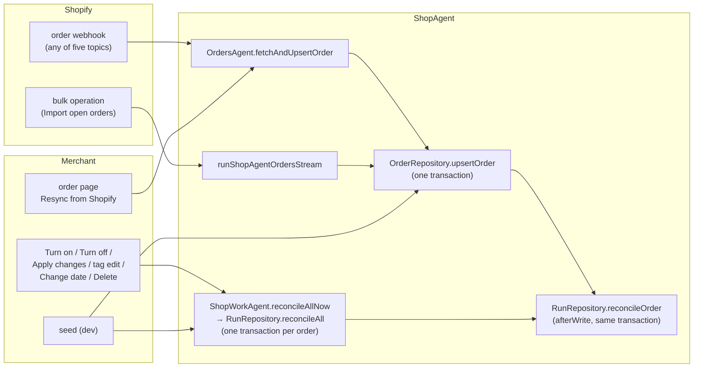
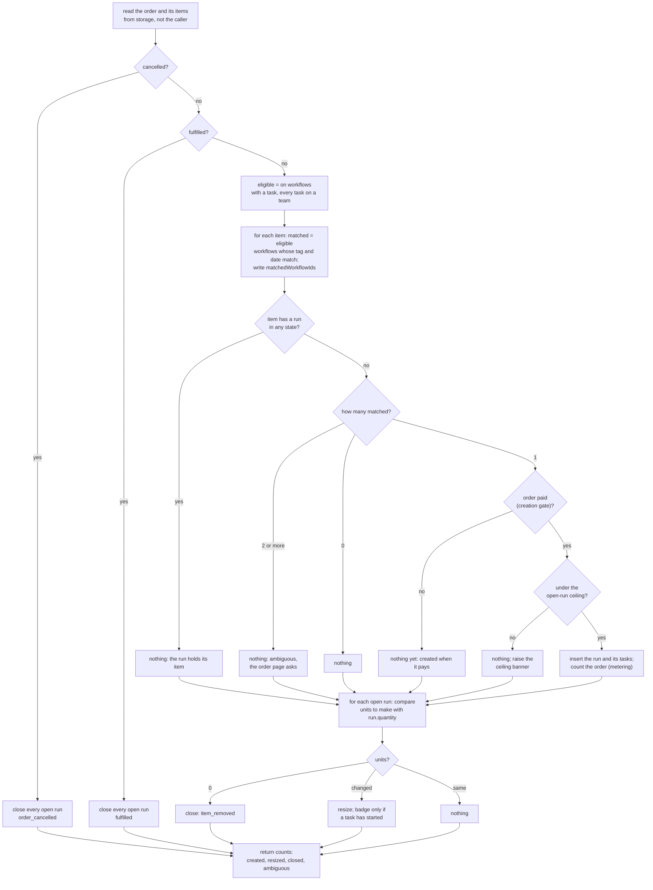

# Reconcile: what it is, how it runs, and what its spec should be

Updated 2026-09-30 against the tree after the vocabulary work (contexts, the renames, the
stored-literal pass, epoch-millisecond timestamps, the object split into services). The
decisions of the 2026-09-29 review stand and are listed under "Decisions". Everything that
review deferred to the vocabulary is now settled there, and this doc is written in the
vocabulary's words. New questions are at the end.

## The short version

Reconcile is the one place Baton decides what runs an order should have. It reads one stored
order and its items, compares them with the workflows that are eligible, and makes the runs
agree:

- an item that one eligible workflow matches and that has no run gets a run;
- an item that two or more match gets nothing, and the order page asks the merchant to choose;
- an open run whose item lost units is resized; at zero units it is closed;
- an order Shopify cancelled or fulfilled has every open run closed;
- a done run is never touched, and any run, done or closed included, holds its item, so nothing
  creates another one.

It is idempotent: running it twice changes nothing the second time. That is why every Shopify
event, every workflow change and the seed can all call the same function without knowing what
happened before. Shopify's own guidance for order management systems says the same thing: fetch
the whole order after each webhook, reconcile from the fetched state, and reconcile again
periodically for the events that never arrived.

There are two shapes:

| name          | scope                              | called by                                                                       |
| ------------- | ---------------------------------- | ------------------------------------------------------------------------------- |
| reconcile     | one order, inside its upsert       | a webhook, Import open orders, the order page's Resync from Shopify, the seed   |
| reconcile all | every open, paid order, one by one | Turn on, Turn off, Apply changes, the tag edit, the workflow's Delete, the seed |

## Where reconcile sits on the map

Reconcile is the seam between two contexts. It reads orders words (paid, cancelled, fulfilled,
units to make, the item's tags) and writes shop work words (run, task, closed, resized,
`matchedWorkflowIds`). The map in `src/lib/Domain.ts` already draws this: shop work is
downstream of orders, "conformist on words, a translation on model", crossing at `OrderState`,
`orderIsOpen`, `unitsToMake`, `ShopOrder` and `OrderLineItem`. `matchedWorkflowIds` is the one
column shop work writes on an orders row, and the `OrderLineItem` JSDoc says so.

So a reconcile symbol belongs in `src/lib/domain/ShopWork.ts`, which may import Orders. Today
the decision lives in `src/lib/RunRepository.ts`, interleaved with the SQL that carries it out,
and its four predicates (`workflowIsEligible`, `matchesLineItem`, `placedSince`, `matchesTag`)
are exports of the repository, not of a context file. That is the gap decision 10 closes.

## Words used below

Every word here is either a vocabulary word already or one this doc proposes. The `now` column
is the identifier in the tree today.

| word           | meaning                                                                                                                | now                                                                                      | vocabulary row                              |
| -------------- | ---------------------------------------------------------------------------------------------------------------------- | ---------------------------------------------------------------------------------------- | ------------------------------------------- |
| reconcile      | make an order's runs agree with the order and the eligible workflows                                                   | `RunRepository.reconcileOrder`                                                           | no                                          |
| reconcile all  | reconcile every open, paid order once                                                                                  | `RunRepository.reconcileAll`, `ShopWorkAgent.reconcileAllNow`, `reconcileAllIfOn`        | no                                          |
| eligible       | a workflow that is on, has a task, and has every task on a team the shop still has; only such a workflow creates       | `workflowIsEligible`, `EligibleContext`, `requireEligibleTasks`, `WorkflowNotEligible`   | no                                          |
| match          | an item and an eligible workflow: a product tag equals the tag, units above zero; the date half goes (decision 18)     | `matchesLineItem` (= `placedSince` and `matchesTag`), `OrderLineItem.matchedWorkflowIds` | no                                          |
| coverage date  | the date an on workflow applies from; orders placed before it never match                                              | `Workflow.activatedAt`                                                                   | no; goes, decision 18                       |
| ambiguous      | an item two or more eligible workflows match, with no run                                                              | `ambiguousItems`, `ReconcileCounts.ambiguous`, `LineItemState.attachable.ambiguous`      | no                                          |
| earlier orders | open orders already stored, placed before the coverage date, that the workflow would create runs on if it covered them | `countWaitingOrders`, `WaitingOrders`, "Include them"                                    | no; goes, decision 18                       |
| units to make  | what is left to make on an item: Shopify's `currentQuantity`                                                           | `unitsToMake` (in Orders)                                                                | no                                          |
| create         | what reconcile and Attach do to a run                                                                                  | `ReconcileCounts.created`, `SwitchResult.Ok.created`, `orderCanCreateRuns`               | verb row: attach workflow "creates the run" |
| resize         | write the item's units onto an open run                                                                                | `Run.quantityChangedFrom`, `ReconcileCounts.resized`                                     | no                                          |
| close          | end an open run for a reason that is not a person's Done                                                               | `ClosedReason`                                                                           | run state "closed"                          |
| holds its item | the one-run-per-item rule: a run in any state keeps its item from getting another                                      | the unique index on `Run.lineItemId`; the `RunState` table's row "holds its item"        | data-model row                              |
| creation gate  | whether reconcile may create runs on the order: paid and not cancelled                                                 | `orderCanCreateRuns`                                                                     | JSDoc term                                  |
| stop gate      | whether reconcile closes every open run: the order cancelled or fulfilled                                              | `orderIsCancelled`, `orderIsFulfilled`                                                   | JSDoc term                                  |
| source         | which path wrote the order: webhook, bulk, manual                                                                      | `OrderSyncSource`                                                                        | the Orders row "sync"                       |

"Slot", "roster", "startable", "active" (for a workflow) and "start" (for a run) are gone from
the tree: the vocabulary retired them, `RESERVED_STEMS` in `scripts/lib/rules-lint.ts` refuses
the first two and `active` in exported identifiers, and the Shared words table records that a
member starts a task and a workflow creates a run. "Waiting" is a vocabulary word for a task
state; `countWaitingOrders` and `WaitingOrders` use it for something else (decision 16).

## When reconcile runs



The object is split into services now (`src/lib/agent/`), and the split shows who owns what:

- `OrdersAgent.fetchAndUpsertOrder` fetches one order and stores it. It takes the reconciler as
  a parameter and never imports shop work, so the orders service stays on its side of the map.
- `ShopWorkAgent` owns `eligibleContext`, `reconciler(source)`, `reconcileAllNow` and
  `reconcileAllIfOn`, and every workflow verb calls one of the last two.
- `ShopAgent.ts` is the callable surface: `syncOrder` (the webhook), `resyncOrder`, `syncOrders`
  (the import) and the workflow callables wire the two services together; `reconcilerFor` is
  the one-line bridge.

Three facts about the wiring matter more than the arrows:

1. **Reconcile runs inside the order's write.** `upsertOrder` opens the transaction, writes the
   order and its items, then runs `afterWrite`, which is reconcile. A webhook therefore either
   stores the order and its runs, or neither. Durable Object SQLite cannot nest transactions,
   so reconcile issues plain statements and never opens its own.
2. **The eligible context is read first, outside the transaction.** The shop's teams live in
   D1, a network read, which cannot happen inside the object's transaction. So `eligibleContext`
   runs once per webhook, once per import, once per reconcile all, and every order in that pass
   works from the same snapshot. The price is staleness, not money: a team deleted in the
   middle of an import is not seen by the rest of it. The JSDoc calls this accepted.
3. **The topic is ignored.** A webhook says `orders/updated` or `orders/cancelled`; reconcile
   does not read it. It fetches the order and works from what Shopify says now. That is what
   makes retries and out-of-order delivery safe: the newest state wins, whatever knocked.

Which caller runs which shape, and when a caller skips. "Include them" is a box in the Turn on
dialog; the next section says what it is and whether it should exist.

| caller                                         | shape         | skipped when                                                                                                        |
| ---------------------------------------------- | ------------- | ------------------------------------------------------------------------------------------------------------------- |
| order webhook (`syncOrder`)                    | reconcile     | duplicate webhook id; payload older than the stored row; a new order at the order ceiling; order deleted at Shopify |
| Import open orders (`syncOrders`)              | reconcile     | the stored row is fresher; the order is past retention; a new order at the order ceiling                            |
| order page Resync from Shopify (`resyncOrder`) | reconcile     | order deleted at Shopify; no dedupe, no staleness check                                                             |
| Turn on (`setWorkflowOn`, `applyAndTurnOn`)    | reconcile all | never                                                                                                               |
| Turn off (`setWorkflowOn`)                     | reconcile all | never: the survivor of an ambiguity is created                                                                      |
| Delete workflow (`removeWorkflow`)             | reconcile all | never: same reason                                                                                                  |
| Apply changes, the tag edit, the date's Change | reconcile all | the workflow is off (`reconcileAllIfOn`)                                                                            |
| Attach, Change workflow (`setRun`)             | neither       | the merchant's own choice bypasses matching                                                                         |
| Delete team (`deleteTeam`)                     | neither       | see "Problems found" 2; decision 4 says it should                                                                   |
| a run going done under the open-run ceiling    | neither       | see "Problems found" 3; decision 5 says it should                                                                   |
| seed (`seedOrders`)                            | both          | local only                                                                                                          |

## The coverage date and the Turn on dialog, from first principles (cut by decision 18; kept as the record)

This is the one part of reconcile that has its own control on a screen, and the review found
it hard to follow. Here is what the merchant sees, what the column does, why it exists, and
what would go if it were cut.

### What the merchant sees

Turn on, on the workflow page and the workflow editor, opens this dialog:

```
┌─ Turn on Finishing? ─────────────────────────────────────────────┐
│                                                                  │
│  Every order placed from now with an item tagged “hinge” will    │
│  start this workflow on that item.                               │
│                                                                  │
│  3 earlier orders are unfulfilled and would match.               │
│  ☐ Include them                                                  │
│                                                                  │
│                                      [ Cancel ]  [ Turn on ]     │
└──────────────────────────────────────────────────────────────────┘
```

The second paragraph and the box appear only when the count is above zero. Turn on without the
box: the three earlier orders get nothing. With it: they get runs, and the toast says "Turned
on. Attached to 3 items on waiting orders."

Once on, the workflow page shows a line, "Applies to orders placed since 12 Sep 2026", with a
Change control that opens a date picker. Moving the date earlier makes older stored orders
match on the next reconcile all; moving it later makes nothing match that has already got a
run, because a run holds its item.

### What the column does

`Workflow.activatedAt` is a timestamp or null. Null is off. Set, it is the date an order must
have been placed on or after (`ShopOrder.processedAt`, Shopify's placed date) for the workflow
to match any of its items. `placedSince` in `RunRepository.ts` is that one comparison. Turn on
writes now, or the earliest earlier order's placed date when Include them is ticked; Change
writes whatever the merchant picked; Turn off writes null.

So one column carries two facts: the switch, and a cut-off date. The name says "when it was
activated", which stops being true the moment the merchant ticks Include them or uses Change.
That, plus the retired stem `activ`, is what was wrong with the name. Decision 18 cuts the date, so the column becomes a boolean `on`.

### Why the date exists

Baton meets orders on three paths: the webhook for a new or edited order, Import open orders,
and Resync. Import fetches every open, unfulfilled order in the shop
(`status:open -fulfillment_status:fulfilled`, in `OrdersBulkRepository.ts`), however old. A
shop installing Baton with forty open orders, or a merchant turning on a second workflow a
month in, therefore has stored orders that were placed before the workflow existed. The date
rule is the answer to one question: should those orders get runs?

Without the rule the answer is always yes. Every open stored order with a matching, paid,
run-less item gets a run the moment a workflow turns on. The rule makes the answer the
merchant's: no by default, yes by ticking Include them, and adjustable later by Change.

What the rule does not do: it does not protect fulfilled or cancelled orders. Those are
stopped by the stop gate before matching is reached, on every path. And it does not affect
Attach: the merchant can put any workflow on any item of an open order by hand, whatever the
date.

## What one pass does



Two gates, on purpose split. Cancelled and fulfilled are the stop gates: they return early and
close everything open. Paid is the creation gate: it only decides whether new runs are created.
So an edit that pushes a paid order back to unpaid keeps its runs, still resizes and closes
them, and creates nothing new until the balance lands. A payment wobble never cancels work.

Done runs are never touched. Closed runs are never touched. Both hold their item, so a tag match
after a merchant's Cancel workflow, or after Shopify ended the work, creates nothing. The only
way to a new run on such an item is the merchant's Change workflow, which deletes the incumbent.

### Call tree, one webhook

```
/webhooks/orders (HMAC checked)
└─ ShopAgent.syncOrder                      duplicate webhook id? older updatedAt? → return
   ├─ ShopUsage read                        a new order at the order ceiling (maxOrdersPerCycle) → mark, publish, return
   ├─ shopWork.orderTeamIds(before)         the teams with a task on the order, before the write
   ├─ OrdersAgent.fetchAndUpsertOrder(reconcilerFor("webhook"))
   │  ├─ Shopify Admin: OrderSync query     the full order; null → log, return
   │  ├─ ShopWorkAgent.reconciler("webhook")
   │  │  └─ eligibleContext                 on workflows + tasks (object), the shop's teams (D1)
   │  └─ OrderRepository.upsertOrder        ── one transaction ──
   │     ├─ retention cutoff, order ceiling  fresh order only: refuse an order placed over 365 days ago,
   │     │                                    or one past the cycle's order ceiling (ShopLimits)
   │     ├─ upsert ShopOrder                 where excluded.updatedAt >= stored.updatedAt
   │     ├─ delete + insert OrderLineItem    matchedWorkflowIds written as [] on insert only
   │     └─ afterWrite → RunRepository.reconcileOrder   (the flowchart above)
   │        ├─ closeOpenRuns                 order_cancelled | fulfilled | item_removed
   │        │  └─ releaseOpenRunLimit        clears the ceiling banner once under 5000 open runs
   │        ├─ insertRun                     on conflict do nothing (the item is held)
   │        │  └─ OrderRepository.countOrder metering: the first run counts the order
   │        └─ update Run quantity           resize, quantityChangedFrom
   ├─ sweepExpiredOrders                     rate-limited by lastSweepAt
   ├─ publish(orderId, teams)                before ∪ after: a reconcile can take a team's last task away
   └─ flushUsageEvents                       send the usage queue
```

### Call tree, Turn on

```
ShopAgent.setWorkflowOn
└─ ShopWorkAgent.setWorkflowOn
   ├─ WorkflowRepository.setWorkflowOn      activatedAt = now, or the earliest earlier order's placed date when
   │                                         the merchant ticked Include them; refuses NoTasks, TaskUnassigned
   ├─ reconcileAllNow("setWorkflowOn")
   │  ├─ eligibleContext
   │  ├─ RunRepository.reconcileAll
   │  │  ├─ select open, paid orders        cancelled/fulfilled: nothing to create; unpaid: created when it pays
   │  │  └─ for each, concurrency 1:  sql.withTransaction(reconcileOrder)
   │  └─ flushUsageEvents                    ensuring: even if the pass failed halfway
   └─ publish("all")                         SwitchResult.Ok.created feeds the toast
```

## Worked examples

**A new order.** Shopify sends `orders/create`. Baton fetches it: unpaid, one item tagged
`hinge`, workflow Finishing (tag `hinge`) is on. Reconcile writes `matchedWorkflowIds =
[Finishing]` and creates nothing, because the creation gate is closed. `orders/paid` arrives;
reconcile runs again from scratch, matches again, sees one match and no run, inserts the run
with its tasks, counts the order.

Why match at all while unpaid? Matching is recomputed on every pass, so the unpaid match is not
needed for the paid pass. It is written for the order page: the item's picker lists the matched
workflows first, and the `OrderLineItem` JSDoc says the column is written by reconcile only and
must never be stale behind a definition change.

**Two workflows claim an item.** Brass (tag `brass`) and Finishing (tag `hinge`) are both on;
an item carries both tags. Reconcile writes both ids, creates nothing, and the orders index
shows Needs a workflow. The merchant either chooses on the order page (`setRun`, no reconcile)
or turns one workflow off: Turn off runs reconcile all, the item now has one match, the
survivor's run is created. That is why Turn off's toast can say a workflow started.

**A quantity edit after work started.** The item was 3, the run's task is started. Shopify
sends `orders/edited`; units to make is now 2. Reconcile writes `quantity = 2,
quantityChangedFrom = 3`. The card shows Quantity changed · 3 → 2. The next Done clears the
badge. Had no task started, the run would be resized silently.

**A refund to zero.** Units to make reaches 0. The open run closes as `item_removed`. If the
merchant later edits the item back to 2, nothing restarts: the closed run holds its item. The
order page offers Change workflow on the closed item.

**Turn on, with the Include them box ticked.** A workflow turned on today covers orders placed
from today. The dialog also counts open orders already stored that were placed earlier and
would get a run: items with the tag, not already carrying a run, and not also matched by
another eligible workflow. When that count is above zero the dialog names it and offers the
Include them box. Ticked, Turn on dates the coverage from the earliest such order rather than
from now, and the reconcile all that follows creates runs on the paid ones. The count is "what
would actually be created", not "what matches".

## What the vocabulary work settled

The 2026-09-29 review deferred five things to the vocabulary. All five are done and this doc no
longer argues them:

| deferred                | outcome in the tree                                                                                                                                                                                                                  |
| ----------------------- | ------------------------------------------------------------------------------------------------------------------------------------------------------------------------------------------------------------------------------------ |
| `active` for a workflow | `workflowIsOn`, `setWorkflowOn`, `listOnWorkflowDetails`, `reconcileAllIfOn`, `SwitchResult`; the run's stored state is `open`; `active` is a reserved stem                                                                          |
| `start` for a run       | `workflowIsEligible`, `orderCanCreateRuns`, `EligibleContext`, `SwitchResult.Ok.created`, `requireEligibleTasks`, `WorkflowNotEligible`; the Shared words table carries the two senses; merchant copy still says a workflow "starts" |
| the lint                | `RESERVED_STEMS` (active, roster, slot, tier, glossary, production) and the bare `is<State>` check in `scripts/lib/rules-lint.ts`, run by `pnpm lint`                                                                                |
| roster                  | gone: members, member count, teams                                                                                                                                                                                                   |
| slot                    | gone: the `RunState` table's row says a run "holds its item"; the data-model row on `initializeSchema` says "a closed run holds its item until a person replaces it"                                                                 |

Two rows the vocabulary plan could not settle were sent here, and they are decision 12 and decision 13: the
column `activatedAt`, and the order issue `choose_workflow`. The plan also said, in so many
words, that the reconcile spec adds the reconcile words (reconcile, match, ambiguous, coverage
date, eligible), so `pnpm vocab:audit` still lists `reconcile`, `eligible`, `ambiguous`,
`placed` and `activated`.

What the vocabulary gives this spec that it did not have before: the entry test (a concept, one
meaning per context, Shopify's words for Shopify's things, the stored literal is the word, a
shared word travels with its noun), the runbook for adding a word (`docs/vocabulary-runbook.md`),
and a home for reconcile's rows: the shop-work tables in `src/lib/domain/ShopWork.ts`.

## Problems found

1. **The rule has no home.** The behaviour is spread across the JSDocs on `RunState`,
   `ClosedReason`, `Run`, `OrderLineItem`, `orderCanCreateRuns`, `orderIsCancelled`,
   `orderIsFulfilled`, `Workflow`, `workflowIsEligible`, `matchesLineItem`, `reconcileOrder`,
   `reconcileAll`, `reconcileAllNow` and `reconcileAllIfOn`, plus five inner comments in the
   function body. Each is right; none is the spec. The map says a rule is stated once on the
   symbol that is the concept, and there is no context symbol for reconcile: the decision (what
   to create, close, resize) is interleaved with the SQL that does it, and its four predicates
   are exports of `RunRepository.ts`, outside `src/lib/domain/`. No test reads a table; the
   fifteen tests under `RunRepository.reconcileOrder` in `run-repository.test.ts` pin the
   behaviour by hand-written title, and nothing checks that every case has one.
2. **Delete team does not reconcile.** `deleteTeam` deletes the D1 row, nulls every task
   pointer (`unassignTeam`) and closes the members' connections. A workflow whose task lost its
   team stops being eligible, but nothing re-runs the pass, so `matchedWorkflowIds` on every
   open order still lists that workflow until the order's next webhook. Needs a workflow on the
   orders index and the picker's matched-first ordering read stale. Decision 4
   accepted the fix; it is not in the tree.
3. **The open-run ceiling releases nothing.** When reconcile declines to create runs at
   `ShopLimits.maxOpenRuns`, the JSDoc says "the next `reconcileAll` starts it once there is
   room". Nothing schedules that pass: `releaseOpenRunLimit`, called from `recomputeState` and
   from `closeOpenRuns`, clears the banner flag and stops. Decision 5 accepted the fix; not in the tree.
4. **Reconcile all skips unpaid orders** (`openOrders` in `RunRepository.ts` selects
   `fullyPaid = 1`), so after a definition change their matches are stale until they pay. The
   pass on payment fixes it before any run is created, so no wrong run results; only the order
   page's picker ordering is behind. Decision 17 removes the column, and the staleness with it.
5. **The `ambiguous` count and the issue disagree.** `reconcileOrder` counts ambiguous items
   before it reads the creation gate; `orderIssues` says an unpaid order has no
   `choose_workflow` issue. The log figure and the Issues count differ by the unpaid orders. Decision 6
   accepted counting only when the gate is open; not in the tree.
6. **`matchedWorkflowIds` has four readers of one rule.** The upsert writes `[]` on insert and
   leaves it alone on update; reconcile overwrites it; `listOrders` restates the ambiguity test
   in SQL; `ambiguousItems` and `lineItemState` restate it in TypeScript. The `OrderLineItem`
   JSDoc and the data-model row on `initializeSchema` now both say "written by reconcile only",
   which answers the old problem 8. What remains is that the ambiguity test itself (two or more
   matches, units above zero, no run) is stated three times.
7. **A vocabulary collision the lint cannot see.** `waiting` is the task-state word; `WaitingOrders`
   and `countWaitingOrders` mean something else in the same context. The reserved-stem lint
   catches a retired word, not a live word used for a second concept. Decision 16.
8. **The eligible context is a snapshot** for a whole bulk stream, taken before the first
   network read of the NDJSON file. The Durable Object serialises callables, but a stream that
   awaits network lets other callables in between chunks. The JSDoc on `eligibleContext` states
   the trade. The spec should state it as an assumption, as the triggers table does for billing
   cycles.

None of these produces a wrong run. 2 and 3 produce a stale screen or a late run. 1 is the
reason this doc exists.

## What the spec could look like

Two tables, because reconcile has two kinds of rule: _when_ it runs, and _what it does to one
item_. Both fit a JSDoc, in the form the tree already checks: the triggers table on `ShopUsage`
(fixed words per column, a `pinned by` test title) and `runActions` (one fixture per row, the
test reads the table out of the source).

### The triggers table (when)

| trigger                        | shape         | skipped when                                           | pinned by                                                                                                                              |
| ------------------------------ | ------------- | ------------------------------------------------------ | -------------------------------------------------------------------------------------------------------------------------------------- |
| order webhook, any topic       | reconcile     | duplicate id, older payload, order ceiling, order gone | waits for payment, then creates runs identically from any source                                                                       |
| Import open orders             | reconcile     | stored row fresher, past retention, order ceiling      | creates runs only for orders processed after the workflow was created; a re-stream creates none                                        |
| Resync from Shopify            | reconcile     | order gone                                             | (none yet)                                                                                                                             |
| Turn on                        | reconcile all | never                                                  | counts open orders that would match if the date allowed, paid or not, with the earliest placed date; Include them starts the paid ones |
| Turn off                       | reconcile all | never                                                  | turning one of two matching workflows off starts the survivor and says how many                                                        |
| Delete workflow                | reconcile all | never                                                  | (none yet)                                                                                                                             |
| Apply changes                  | reconcile all | workflow off                                           | applyAndTurnOn promotes the draft and turns the switch on in one call; an empty workflow is refused                                    |
| the tag edit                   | reconcile all | workflow off                                           | retagging an on workflow reconciles stored orders against the new tag                                                                  |
| Delete team                    | reconcile all | never (after problem 2 is fixed)                       | (none yet)                                                                                                                             |
| the open-run ceiling releasing | reconcile all | still at the ceiling (after problem 3 is fixed)        | (none yet)                                                                                                                             |
| Attach, Change workflow        | none          | always: the merchant's choice                          | manual attach is refused on a cancelled or fulfilled order and allowed on an unpaid one                                                |

`shape` is one of `reconcile`, `reconcile all`, `none`, so `pnpm spec check` can refuse a row
that says what happens in words the reader has to interpret, as it does for the order-count
column of the billing table today. `pinned by` is checked the same way: a title no test carries
fails the check. The titles above are the tests' current titles where one exists; three of
them still say a workflow "starts", which is the merchant's copy word and, per the Shared words
table, allowed in prose; whether test titles should follow the identifier word ("creates") is
decision 14.

### The outcomes table (what, per item)

Same form as `runActions`: each row is one fixture, each cell one input, the last column the
outcome from a fixed list.

| order     | paid | units   | run on item     | matches           | outcome                                       |
| --------- | ---- | ------- | --------------- | ----------------- | --------------------------------------------- |
| cancelled | any  | any     | open            | any               | close `order_cancelled`                       |
| fulfilled | any  | any     | open            | any               | close `fulfilled`                             |
| closed    | any  | any     | done or closed  | any               | nothing                                       |
| open      | any  | 0       | open            | any               | close `item_removed`                          |
| open      | any  | changed | open, unstarted | any               | resize, no badge                              |
| open      | any  | changed | open, started   | any               | resize, badge from the original               |
| open      | any  | same    | open            | any               | nothing                                       |
| open      | any  | some    | done or closed  | any               | nothing: the run holds its item               |
| open      | yes  | some    | none            | 1                 | create                                        |
| open      | yes  | some    | none            | 2+                | nothing: ambiguous                            |
| open      | any  | some    | none            | 0                 | nothing                                       |
| open      | no   | some    | none            | 1                 | nothing: created when it pays; match recorded |
| open      | yes  | some    | none            | 1, at the ceiling | nothing: banner raised                        |

`outcome` is one of `create`, `close <reason>`, `resize`, `nothing`, with the rest of the cell
free text after a colon. "matches" counts eligible workflows only; an off workflow, an empty
one, or one with an unassigned task is not a match. "closed" under `order` is the matrices'
word: cancelled or fulfilled. Every row already has a test in `run-repository.test.ts`; the
table would name them or the test would read the table.

The prose under the tables carries what a cell cannot: the two-gate split and why, the snapshot
assumption, and that reconcile is idempotent.

### Where the rule and the test meet

Decision 1 chose the planner: a pure function in the shop-work context carries the
tables, `reconcileOrder` reads storage, calls it, and executes the answer. The shape of that
function is decision 10: per item.

## Decisions

Every accepted answer, as a statement. The questions that produced them are not repeated.

### Reviewed 2026-09-29

1. A pure planner in the shop-work context carries the tables.
2. The word is "reconcile".
3. The reconcile words get vocabulary rows; "creation gate", "stop gate", "eligible context"
   and "source" stay JSDoc terms on their symbols.
4. Delete team reconciles all (not yet in the tree; problem 2).
5. The open-run ceiling releasing runs a reconcile all once (not yet in the tree; problem 3).
6. `ReconcileCounts.ambiguous` counts only when the creation gate is open (not yet in the
   tree; problem 5).
7. A closed run holds its item; an item refunded to zero and edited back does not restart.
8. The outcomes table is per item, with the order's state as columns.
9. `pnpm spec check` parses both tables, refuses a `shape` or `outcome` word outside its list
   and a `pinned by` title no test carries; the test reads the outcomes table.

Settled afterwards by the vocabulary work: `active` for a workflow, `start` for a run, the
reserved-stem lint, roster, slot. Listed under "What the vocabulary work settled".

### Reviewed 2026-09-30

10. **The planner is per item, like `runActions`.** `reconcileItem(order, item, run with
    tasks or none, matched count, atCeiling)` returns an `Outcome` tagged union (`create`,
    `close` with its reason, `resize` with the badge flag, `nothing`). `reconcileOrder` loops
    the items, computes `matched` and the ceiling capacity, and executes each outcome. The
    four matching predicates (`workflowIsEligible`, `matchesLineItem`, `placedSince`,
    `matchesTag`) move to `ShopWork.ts` beside it; the repository keeps only SQL.
11. **Both tables live on the planner.** The outcomes table is its spec by construction; the
    triggers table is when it is called.
12. **`activatedAt` renames to `coverageFrom`**. Superseded by decision 18: there is no column to rename. With it:
    `SetWorkflowActivatedAtInput` → `SetWorkflowCoverageInput`, `setWorkflowActivatedAt` →
    `setWorkflowCoverage` (repository, service, callable, client, route),
    `ChangeActivatedAtResult` → `ChangeCoverageResult`, `changeActivatedAtResultMessage`,
    `CHANGE_ACTIVATED_AT_MODAL`, the `activatedAt` field of `SetWorkflowOnInput` and
    `ApplyAndTurnOnInput`, the workflow-states table's `stored` cell (`coverageFrom` set /
    null), the data-model row, the tests, and `activated` on `RESERVED_STEMS`. In place in
    `initializeSchema`, then `pnpm dev:reset`. Rejected: `appliesSince` (collides with the
    Apply verb), `onSince` (the merchant moves the date after Turn on), two columns (off with
    a stale date is meaningless).
13. **The order issue `choose_workflow` becomes `ambiguous`**: literal `ambiguous` in
    `OrderIssue`, `ORDER_ISSUE_LABEL`, `orderIssues`, the order-issues table, `listOrders`'s
    SQL and the tests; screen unchanged (Needs a workflow). The issue names the fault, as
    unassigned, empty team and blocked do.
14. **Pinned test titles say "creates", not "starts".** The three titles that say a workflow
    "starts" are retitled when the triggers table lands.
15. **Cost is argued on marginal rates, never on an included allowance.**
16. **"Uncovered orders" is rejected.** Superseded by decision 18, which removes the count. Had the date stayed, the word was the dialog's own,
    "earlier orders".

17. **Matches are derived, never stored.** The `matchedWorkflowIds` column and its data-model
    row go. Matching is a predicate with two twins, as issues are: `itemMatches` in
    `ShopWork.ts` (the code reconcile uses) for the order page and `lineItemState`, and a SQL
    join in `listOrders` of the item's `json_each(productTags)` against the on workflows' `tag`
    with every task's `teamId` set. Reconcile writes nothing on a pass except the runs that
    change; the index and the picker read the workflows as they are now, so a tag edit, a team
    delete or a Turn off shows on the next page load with no pass. Reconcile all keeps skipping
    unpaid orders: there is nothing to refresh on them, and a run is created when they pay.
    The one stated limit: SQL cannot ask D1 whether a team exists, so the SQL twin reads
    "every task's `teamId` set", which is what the object holds after `deleteTeam` nulls the
    pointers; the window before that null is the one already stated on `deleteTeam`, and a
    retry repairs it. Rejected: keeping the column and writing only on change.

18. **The coverage date is cut.** `activatedAt` becomes `Workflow.state`, text, `on` or
    `off`, the stored literal being the word as `RunState` stores `open`, `done`, `closed`
    (not a column named `on`: `on` is a SQL reserved word in every join), read by
    `workflowIsOn`. A workflow that is on applies to every stored open
    order: Turn on, Turn off, Apply changes, the tag edit and Delete workflow test every stored
    open order with no date clause, and a webhook, an import or a resync tests its order the
    same way. Gone from the tree: `placedSince` and the date half of `matchesLineItem`;
    `countWaitingOrders`, `WaitingOrders`, `CountWaitingOrdersInput`, `waitingOrdersLine`, the
    Turn on dialog's second paragraph and its Include them box; `setWorkflowActivatedAt`,
    `SetWorkflowActivatedAtInput`, `ChangeActivatedAtResult`, `changeActivatedAtResultMessage`,
    `CHANGE_ACTIVATED_AT_MODAL`, the Change control and the "Applies to orders placed since"
    line; the `activatedAt` field on `SetWorkflowOnInput` and `ApplyAndTurnOnInput`; the
    "waiting orders" fork in `createdToast`; the tests "skips orders placed before the
    workflow was turned on" and the `countWaitingOrders` group; the workflow-states table's
    `stored` cells become `on` = 1 / 0 and the data-model row loses "and the coverage date";
    `activated` joins `RESERVED_STEMS`. **The Turn on dialog shows no count and no
    statistics**: it states the rule ("Every open order with an item tagged X starts this
    workflow on that item") and confirms. The toast says "Turned on." or "Turned off." and
    nothing else (decision 20). The merchant's way out for an order they did not mean is Cancel workflow. Decisions 12 and 16
    are superseded: there is no column to rename and no count to name. The record of the
    question is the section "Record: the coverage date, as decided" below.
19. **The vocabulary rows.** Five rows in the shop-work nouns table: reconcile (`reconcileItem`,
    `RunRepository.reconcileOrder`; screen none), reconcile all (`ShopWorkAgent.reconcileAllNow`;
    screen none, the Turn on and Turn off toasts), eligible (`workflowIsEligible`,
    `EligibleContext`; screen none, Needs a team names the fault), match (`itemMatches`; the
    order page's picker lists matches first; meaning: an item and an eligible workflow, a
    product tag equals the tag and units are above zero), ambiguous (`ambiguousItems`,
    `OrderIssue` `ambiguous`; Needs a workflow). One Orders row, "current quantity"
    (`OrderLineItem.currentQuantity`, Shopify's word; the quantity on the card), with
    `unitsToMake` moved to `ShopWork.ts` as shop work's reading of it and a shop-work row
    "units to make". No row for coverage date or earlier orders (decision 18), none for
    creation gate, stop gate, eligible context or source (decision 3).
20. **No count of items or runs reaches a screen.** The toast after Turn on, Turn off, Apply
    changes and the tag edit says the verb and nothing else; `createdToast` goes, and
    `SwitchResult.Ok` carries the workflow only. `reconcileAllNow` returns nothing to its
    callers; `RunRepository.reconcileAll` returns nothing; `ReconcileAllCounts` goes. The
    per-order `ReconcileCounts` (created, resized, closed, ambiguous) stays for the one log
    line on `reconciler`, because it costs no read: each number is a sum of writes the pass
    made. Nothing counts items for a screen, so no query counts them.

## Questions

No open questions remain (2026-09-30).

## Record: the coverage date, as decided

The text of the question that produced decision 18, kept because the implementation plan
will delete what it describes and a later reader will want to know what the date was and why
it went. "Recommendation" below is what was decided; the dialog's count in option B was
struck at the decision, and decision 20 struck the toast's count afterwards.

**The question: cut the coverage date?** Everything needed to decide was here; nothing above had to be
read first.

_What the thing is._ When a merchant presses Turn on, the dialog looks like this:

```
┌─ Turn on Finishing? ─────────────────────────────────────────────┐
│                                                                  │
│  Every order placed from now with an item tagged “hinge” will    │
│  start this workflow on that item.                               │
│                                                                  │
│  3 earlier orders are unfulfilled and would match.               │
│  ☐ Include them                                                  │
│                                                                  │
│                                      [ Cancel ]  [ Turn on ]     │
└──────────────────────────────────────────────────────────────────┘
```

The second paragraph and the box appear only when Baton already holds open orders, placed
before today, with an item tagged `hinge`. Turn on without ticking the box: those three
orders get nothing, ever, from this workflow. Tick it: they get runs now. Afterwards the
workflow page shows "Applies to orders placed since 12 Sep 2026" with a Change control, a
date picker the merchant can move.

Under the screen, one column holds it: `Workflow.activatedAt`. Null means off. A date means
on, and it is the date an order must have been placed on or after for the workflow to match
any of its items. Turn on writes today; Include them writes the oldest earlier order's date
instead; Change writes what the merchant picked; Turn off writes null. That is the whole
mechanism: one column, one comparison (`placedSince`), one dialog, one control.

_Why it exists._ Import open orders fetches every open, unfulfilled order in the shop, however
old. So Baton often holds orders that were placed before a workflow existed. Two stories:

- **A new shop.** The merchant installs Baton with 40 open orders in Shopify, presses Import
  open orders, creates Finishing (tag `hinge`) and presses Turn on. Twelve of the 40 have a
  `hinge` item. Do those twelve get a Finishing run?
- **A second workflow, a month in.** The merchant adds Brass (tag `brass`) and presses Turn
  on. Five open orders already stored have a `brass` item. Do those five get a Brass run?

The date is how Baton makes the answer the merchant's: no by default, yes if they tick Include
them, and adjustable later with Change. It does nothing else. Fulfilled and cancelled orders
are protected by the stop gate, not by the date. Attach ignores the date.

_Option A, keep it._ The dialog keeps asking, the workflow page keeps the date line and
Change, and the column keeps its date role under a new name (`coverageFrom`, decision 12).
`WaitingOrders` and `countWaitingOrders` rename to `EarlierOrders` and `countEarlierOrders`
(decision 16). The vocabulary gains the row "coverage date". Cost: a column that means two
things (switch and date), a count callable, a dialog that changes shape, a date control, and a
vocabulary word, for a choice the merchant makes once per workflow and, on the evidence of
this review, finds hard to follow. Shopify Flow, whose Turn on and Turn off the screen
copies, has no such date.

_Option B, cut it._ Turn on always says yes. The twelve orders in the first story and the five
in the second get runs when the merchant presses Turn on, and the toast says "Turned on.
Attached to 12 items." The dialog becomes one paragraph that states the count before they
confirm ("12 open orders have an item tagged “hinge” and will start this workflow now"), a
read-only number, nothing stored. There is no date, no Include them, no Change control, no
"Applies to orders placed since" line. The column becomes the switch alone: a boolean `on`, the stored literal being the word. An order the
merchant did not want in Baton gets Cancel workflow on the order page, the control they
already have for any run.

What B deletes from the tree: `placedSince` and the date half of `matchesLineItem`;
`countWaitingOrders`, `WaitingOrders`, `CountWaitingOrdersInput`, `waitingOrdersLine`;
`setWorkflowActivatedAt`, `SetWorkflowActivatedAtInput`, `ChangeActivatedAtResult`,
`changeActivatedAtResultMessage`, `CHANGE_ACTIVATED_AT_MODAL` and the Change control; the
`activatedAt` field on `SetWorkflowOnInput` and `ApplyAndTurnOnInput`; the "waiting orders"
fork in `createdToast`; the tests "skips orders placed before the workflow was turned on" and
the `countWaitingOrders` group; decisions 12 and 16, which no longer apply.

What B costs the merchant: they cannot turn a workflow on without the open backlog being
attached, and each of those orders is counted against the billing cycle the moment its first
run is created (the metering row "first run on an order"). In the first story that is twelve
orders on the meter in one click, which is why the dialog states the count before Turn on.

_Would B surprise a merchant?_ The review asked whether B is always what the merchant wants.
Here is the set of orders B touches, and every way a merchant could be surprised, with what
A and B each do.

What Baton holds: every order a webhook delivered since install, plus what Import open orders
fetched. Import is one fixed query, the same on every press: open (not closed, not cancelled),
not fully fulfilled, created in the last 30 days (`ORDER_IMPORT_WINDOW_DAYS` in
`orderSyncConstants.ts`; the 60 days is Route to Ship's App Store read permission, not Baton's
window). Nothing older than 30 days ever enters Baton by import. Of what is held, Turn on under
B creates a run only on an item that is on an open, paid order, matches the tag, and has no run
of any state. That is the whole exposure.

| scenario                                                                         | what B does                            | surprise?                                                                        |
| -------------------------------------------------------------------------------- | -------------------------------------- | -------------------------------------------------------------------------------- |
| new shop: imports, creates the first workflow, turns it on; 12 open orders match | 12 runs; the toast says so             | no: they imported the orders to work them                                        |
| an imported order the bench is already halfway through, outside Baton            | a run at Not started                   | mild: the member marks the done tasks done, or the merchant cancels the workflow |
| a paid order open for weeks (custom work awaiting approval, awaiting stock)      | a run                                  | no: in a made-to-order shop an unfulfilled paid order is the backlog             |
| an unpaid open order                                                             | nothing until it pays                  | no                                                                               |
| a second workflow added a month in; 5 open orders have its tag and no run        | 5 runs                                 | no: the merchant made the workflow for that tag                                  |
| an item already on a run, in any state, when a new workflow matches it           | untouched                              | no: a run holds its item                                                         |
| an item two workflows match                                                      | nothing; Needs a workflow              | no                                                                               |
| Turn off for a day, then Turn on again                                           | the paused day's orders get runs       | no: resuming resumes the pending work (the walk-through below is where A fails)  |
| the meter                                                                        | every order that gets a run is counted | the backlog is billed in one click; the dialog shows the count before the button |

The pause row, walked through. Monday: the merchant turns Finishing off. Tuesday and
Wednesday: four orders arrive with `hinge` items. Webhooks store them; they are paid, open, and
have no run, because the workflow is off. Thursday: the merchant turns Finishing on again.

- Under A, Turn on writes Thursday as the date. The four orders were placed Tuesday and
  Wednesday, before Thursday, so they never match. The dialog does show "4 earlier orders are
  unfulfilled and would match" with the box; if the merchant reads it and ticks, fine. If they
  press Turn on the way they pressed it last time, the four orders sit on the orders index as
  Not started with nothing in Issues, and no later webhook changes that, because the date rule
  says no on every pass. That is the surprise: the merchant paused and resumed, and four
  orders fell through.
- Under B, Thursday's Turn on creates the four runs and the toast says "Attached to 4 items".

Every surprise under B is of one kind: work the merchant already has shows up as work. The one
surprise under A, the pause, is the opposite kind: work the merchant has does not show up. And
there is no cheaper middle: any "do not include these" choice has to be remembered somewhere
for the next webhook on those orders not to create the runs anyway, and the thing that
remembers it is the date. Cutting the date means cutting the choice.

_What the two apps in `refs/` do._ Route to Ship never imports pre-install orders; a merchant
who wants them emails support with a date range, and pipelines route whatever is in the app.
Makerbatch's listing says "nothing to import by hand" and "fix a mapping once and existing
orders re-group automatically": its rules apply to what is already there. Neither gives the
merchant a per-rule date. Shopify Flow, whose Turn on and Turn off the screen copies, acts on
events after activation and never back-dates. Baton's date is the odd one out in all three
directions.

_Under B, exactly what happens, event by event._ The question the review asked: is there any
cut-off at all? No. Under B a workflow has no timestamp. The column `activatedAt` becomes a
boolean `on`, the stored literal is the vocabulary word, and `workflowIsOn` reads it. Whether
an item gets a run is decided by the same test on every path, with no date in it:

> the item's order is open (not cancelled, not fulfilled) and paid; the item has units to make;
> one of its product tags equals the workflow's tag; the workflow is on, has tasks, and every
> task has a team; no other on workflow's tag matches the item too; the item has no run in any
> state; the shop is under the open-run ceiling.

That test is what reconcile already runs today, minus the clause "and the order was placed on
or after the workflow's date". Every event below runs that test on some set of orders and
creates a run wherever it passes:

| event                                      | which orders are tested | what a merchant sees                                                                                                               |
| ------------------------------------------ | ----------------------- | ---------------------------------------------------------------------------------------------------------------------------------- |
| Turn on                                    | every stored open order | the dialog says "N open orders have an item tagged X and will start now"; the toast says how many were attached                    |
| Turn off                                   | every stored open order | this workflow creates nothing from now; its open runs carry on; an item it had made ambiguous may now get the other workflow's run |
| Apply changes, on an on workflow           | every stored open order | an item the new tasks make eligible gets a run now; existing runs keep their copied tasks                                          |
| the tag edit, on an on workflow            | every stored open order | items with the new tag get runs now; items with the old tag keep their runs                                                        |
| Delete workflow                            | every stored open order | its runs stay; an item it had made ambiguous may now get the other workflow's run                                                  |
| Delete team (decision 4)                   | every stored open order | the workflow with a task on that team stops creating; a rival it had blocked may create                                            |
| a new order's webhook                      | that order              | a run per matching item, once paid                                                                                                 |
| an edit, payment, cancel or fulfil webhook | that order              | runs created once paid; resized on a quantity change; closed on cancel, fulfil or zero units                                       |
| Import open orders                         | each imported order     | runs on the imported open, paid orders that match the on workflows                                                                 |
| Resync from Shopify                        | that order              | same as a webhook                                                                                                                  |

What this changes from today is one thing: the clause "placed on or after the date" is gone,
so "every stored open order" means every stored open order, not every stored open order placed
since Turn on. Apply changes, the tag edit and Turn off already walk every stored open order
today; the date only trimmed which ones could pass. The only orders that were ever behind the
date are ones placed before the workflow's last Turn on, which is the backlog at install and
anything that arrived during a pause. Under B those are simply in.

What stops a run, under B, is the rest of the test and nothing else: the workflow off; the
order cancelled, fulfilled or unpaid; zero units; no tag match; a second workflow matching too
(Needs a workflow); a run already on the item, in any state; the open-run ceiling.

What the merchant can no longer do: say "this workflow is for orders from next Monday on".
The way to get that effect is to turn the workflow on next Monday. If they turn it on today it
covers today's backlog, and the dialog tells them the number first.

_Decided: B, cut it, and without the dialog count._ Import open orders is the merchant's one decision about the
backlog: press it and the last 30 days of open work is Baton's, do not press it and Baton is
install-forward like Route to Ship. A workflow turned on afterwards applies to that work,
which is what the import was for; asking for a second yes per workflow is the part nobody
could explain. The meter is the one real cost, and the dialog states the count before the
button. The pause case is where A does harm and B does not. The way out for a wrong order,
Cancel workflow, exists today.

## Status

Research complete (2026-09-30). Every question is decided; decisions 1 to 20 are the spec's
inputs. The plan is `docs/reconcile-plan.md`. It covers the planner and its two tables (decisions 10,
11), the vocabulary rows (19), the cut (18), the match predicate replacing the stored column
(17), the issue literal (13), the test retitles (14), the three fixes from 2026-09-29 (4, 5,
6), and the `spec check` additions (9).
