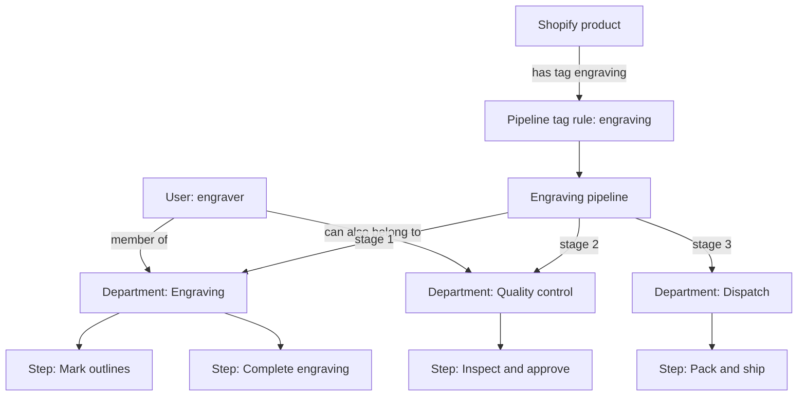

# Route to Ship Tag Routing Research

Research date: 2026-09-01

## Conclusion

Route to Ship's in-app Help center says pipeline routing is based on Shopify **product tags**. It says Route to Ship examines each line item's product tags and independently routes a matching line item to each matching pipeline. The pipeline builder exposes one undifferentiated `Shopify Tags` field, but its helper text misleadingly calls it an **order-tag** rule.

Product-tag routing is therefore documented in the app, public site, App Store listing, and checked-in reference. It is not runtime-tested in this sandbox. The public Shopify integration page is inconsistent: it claims both order and product tags, whereas the in-app Help describes only product-tag matching.

Order synchronization is webhook-first. Authenticated Help says seven order, fulfillment, and refund topics deliver changes within seconds. Pre-install orders are explicitly **not** imported by default; Route to Ship asks merchants to request a support-run backfill by date range. The public integration page claims an incremental Admin GraphQL safety-net sync, but no public or in-app source gives its cadence, lookback window, cursor, or reconciliation rules. A per-order `Resync` action is documented and present in the app.

## Public Claims

### Public Order-And-Product Claim

The Shopify integration documentation says:

> "Orders auto-route into the right production pipeline using your Shopify order and product tags."

Source: [Route to Ship Shopify integration](https://www.routetoship.com/integrations/shopify), mirrored at [`refs/route-to-ship/integrations/shopify.md`](../refs/route-to-ship/integrations/shopify.md#L21-L23).

That page also says paid-order sync brings "line items, product tags, customer details, and fulfillment status" into Route to Ship ([source](https://www.routetoship.com/integrations/shopify); [mirror](../refs/route-to-ship/integrations/shopify.md#L17-L23)).

### Product Tags Specifically

Product-tag routing is stated repeatedly and more concretely elsewhere:

- The homepage says Route to Ship "reads the product's tag" and illustrates `tag: engraving read from product` ([source](https://www.routetoship.com/); [mirror](../refs/route-to-ship/index.md#L75-L87)).
- Support says: "Use Shopify tags on products to auto-route orders to the right pipeline" ([source](https://www.routetoship.com/support); [mirror](../refs/route-to-ship/support.md#L33-L35)).
- A guide says synced line items route based on Shopify product tags ([mirror](../refs/route-to-ship/blog/how-to-build-production-pipeline-shopify.md#L74-L81)).
- Another guide says merchants can map Shopify product tags to specific pipelines ([mirror](../refs/route-to-ship/blog/print-on-demand-vs-made-to-order.md#L108-L112)).

The Shopify App Store listing also declares both `Order tags` and `Product tags` as automation-task capabilities. That is app-listing metadata, so it supports the claimed capability but does not document configuration or runtime matching behavior ([mirror](../refs/route-to-ship/listing.md#L61-L65)).

## In-App Help: Product Tags

The authenticated in-app Help center, `https://app.routetoship.com/help/pipelines`, explicitly answers the configuration question:

> "Each pipeline is linked to Shopify product tags. When an order comes in, its product tags determine which pipeline(s) to use automatically."

Its pipeline-builder instructions say to enter `Shopify Tags (comma-separated)` and that "Orders with matching product tags will auto-route to this pipeline."

Its tag-routing FAQ gives the most specific behavior found:

> "When a Shopify order syncs, Route to Ship looks at each line item's product tags. If any tag matches a pipeline's tag list, that line item is routed to that pipeline. A single product can have multiple tags matching different pipelines — each line item is routed independently."

The `Orders & Sync` guide at `https://app.routetoship.com/help/orders` repeats this: routing uses Shopify product tags; products with multiple tags can match multiple pipelines; each line item is routed independently.

Neither guide describes matching **order tags**, so the public integration page's order-tag claim remains unconfirmed and conflicts with the in-app routing documentation.

## Inspected App UI

Inspected in the embedded Shopify app on 2026-09-01:

- Settings > Pipelines > Visual Builder opens `https://app.routetoship.com/pipeline-builder` in the Shopify iframe.
- The create-pipeline form has one required field: `Shopify Tags (comma-separated)`.
- The field is a selectable/typeable tag combobox.
- Its only inline routing help text is: **"Orders with these tags will use this pipeline"**.
- There is no product/order source selector or product-tag picker. The Help center clarifies that the field is for product tags.
- There is no documented precedence for an order tag and a product tag that select different pipelines.

The department wizard is unrelated to tag-source routing. Its "tags" wording refers to specialized team-member roles; its workflow-step page contains no Shopify tag configuration. The Orders table has a `Tag (comma-separated)` filter and a `Pipeline Tags` column, but neither explains or configures matching.

No pipeline or department changes were saved during this inspection.

## Item-Level Flow

Route to Ship does not turn one Shopify order into separate Shopify orders. It keeps the order as the parent record and evaluates its line items independently for routing:

1. Shopify sends an order containing one or more line items.
2. Route to Ship reads the product tags for each line item.
3. A line item enters every pipeline whose configured tag list matches one of that item's product tags.
4. That item's work progresses through the departments and steps configured for that pipeline.
5. The order-detail view shows each line item's production journey. `My Work` presents the resulting tasks grouped by parent order, with an optional `Group by product` view.

Example: an order with five line items, where each item's product has a different tag and each tag selects a different pipeline, produces five item-level production journeys. The worker does not receive five separate Shopify orders; they see tasks for the one order, associated with the relevant product/item and department.

The Help center also says one product with multiple matching tags can enter multiple pipelines. Therefore one line item can have more than one production journey. This may be intentional for independent work streams, but the documentation does not explain how completion across multiple matching pipelines affects the parent order's final status.

### Department Task Granularity

Item-level routing does not always mean one visible task per line item. A department has a `Complete once per order` (`workPerOrder`) setting:

- Disabled: each line item is a separate task in that department.
- Enabled: all line items in an order are grouped into one task for that department.

The Help center gives Dispatch as the intended per-order example. This lets an item-level production pipeline converge into one order-level task at a department that handles the entire shipment.

## Configuration Hierarchy

Route to Ship uses departments as the pipeline’s stages because a department is both the production work area and the unit that owns workers, a manager, and its internal task list. A pipeline supplies the cross-department route; a department supplies the work to do at that stop.

```text
Shop
├── Users
│   └── A user can belong to multiple departments
├── Departments (optionally nested as parent/sub-departments)
│   ├── Members and optional manager
│   ├── Steps/tasks and their step types
│   └── Work mode, including per-line-item or once-per-order tasks
└── Pipelines
    ├── Shopify product-tag match rules
    ├── Sequential or parallel department flow
    └── An arranged list/flow of departments
```

The pipeline connects **departments**, not individual steps. Steps are defined inside their department. A pipeline's sequential/parallel mode controls movement between departments; a department can also place steps in the same Parallel Group to run those steps concurrently.

The usual setup order is: create users, create departments and their steps/members, then create pipelines by arranging departments and assigning product tags.

### Configuration Relationship



### Runtime Flow For One Line Item

```mermaid
flowchart LR
  Order[Shopify order] --> Item[Line item: engraved necklace]
  Item -->|product tag matches engraving| Pipeline[Engraving pipeline]
  Pipeline --> Engraving[Engraving department]
  Engraving --> Mark[Mark outlines]
  Mark --> Engrave[Complete engraving]
  Engrave --> QC[QC department]
  QC --> Inspect[Inspect and approve]
  Inspect --> Dispatch[Dispatch department]
  Dispatch --> Pack[Pack and ship]
```



The line item is not literally moved out of its Shopify order. Route to Ship records and displays its production work under the parent order. The diagrams describe the logical production path.

## Order Release And Updates

### When Work Enters A Pipeline

The public documentation consistently presents **payment** as the production-release point:

- The Shopify integration page: "Paid orders flow in automatically over Shopify webhooks in real time" ([source](https://www.routetoship.com/integrations/shopify); [mirror](../refs/route-to-ship/integrations/shopify.md#L17-L23)).
- The homepage: "The minute the payment clears, Route to Ship pulls the order, the line items, the personalization fields, and the customer note" ([mirror](../refs/route-to-ship/index.md#L362-L369)).
- The product pages say paid orders drop onto the production board automatically ([mirror](../refs/route-to-ship/for/print-on-demand.md#L19-L23)).

So the documented intended behavior is: payment clears, the order syncs, then each matching line item enters its product-tag-selected pipeline. The authenticated Getting Started guide is less precise, saying only that new orders sync in real time after installation.

The documented webhook lists do not include `ORDERS_PAID`. It is therefore unclear whether Route to Ship detects payment by examining financial status on `ORDERS_CREATE` / `ORDERS_UPDATED`, subscribes to an undocumented payment topic, or merely uses "paid orders" as simplified marketing language.

### Initial Installation And Historical Orders

Route to Ship says it starts capturing orders **from installation onward**, not by importing the shop's existing order history:

> "New orders sync automatically from the moment you install via Shopify webhooks — orders that existed in your store before install aren't imported by default."

For older orders, the merchant must email support with a date range for a one-time backfill ([support mirror](../refs/route-to-ship/support.md#L27-L31); [homepage mirror](../refs/route-to-ship/index.md#L543-L551)). Authenticated `Orders & Sync` Help repeats the same behavior.

This means the orders that appeared shortly after sandbox installation were not necessarily an automatic historical scan. The documented explanations are that they arrived after installation through webhooks or were backfilled separately. Although the App Store permission disclosure says Route to Ship can access order history for the last 60 days ([mirror](../refs/route-to-ship/listing.md#L218)), permission to read those orders is not evidence that it imports them on installation.

### Update Events Are Synced, But Their Workflow Effect Is Not Documented

The in-app `Orders & Sync` Help FAQ says the app syncs these Shopify webhook events within seconds:

```text
ORDERS_CREATE
ORDERS_UPDATED
ORDERS_CANCELLED
ORDERS_EDITED
FULFILLMENTS_CREATE
FULFILLMENTS_UPDATE
REFUNDS_CREATE
```

It also says the order-detail page has a `Resync` action to manually refresh one order's data from Shopify.

This establishes that Route to Ship receives order changes. It does **not** establish how a change affects already-created production work. Documentation does not say whether an order edit that adds/removes a line item or changes quantity will:

- create only the additional item-level work;
- remove or cancel unstarted work;
- reroute an existing line item after its product/tag changes;
- preserve completed or in-progress work; or
- require a manual resync or operator decision.

Do not infer that every `ORDERS_UPDATED` event creates a new job. The documentation calls it a sync event, not a production-work creation event.

### Webhook Processing And Manual Recovery

The deployed order-detail UI gives more detail about an API failure during webhook processing. Its `Waiting for the rest of this order from Shopify` state says Route to Ship saved what the webhook notification carried — order number, customer, and total — but still lacks items, pipeline, and delivery address because Shopify could not be reached. It tells the operator to use `Re-sync from Shopify`; opening Route to Ship inside Shopify admin is also said to reconnect the store and then resync.

This supports the following limited model:

1. A webhook can create at least a skeletal local order record.
2. Route to Ship also calls Shopify for richer order data needed for line items and routing.
3. If that API call fails, the local record remains in an `awaitingSync` state rather than being discarded.
4. Per-order `Resync` retries the Shopify fetch and refreshes the local record.

The same UI says an incomplete order older than Shopify's 60-day read window can no longer be enriched and remains only as a reference. It does not say that the incremental safety-net sync retries these records automatically.

### Incremental Safety Net: Cadence Unknown

The strongest safety-net claim remains the public Shopify integration page:

> "Paid orders flow in automatically over Shopify webhooks in real time, with an incremental Admin GraphQL sync as a safety net so nothing is missed."

Source: [Route to Ship Shopify integration](https://www.routetoship.com/integrations/shopify), mirrored at [`refs/route-to-ship/integrations/shopify.md`](../refs/route-to-ship/integrations/shopify.md#L17-L23).

No inspected source says whether this runs hourly, daily, on app launch, after a webhook failure, or on another trigger. No source documents:

- the query cursor or timestamp used for incremental discovery;
- the lookback overlap used to avoid boundary misses;
- whether it discovers missing orders only or also reconciles changed orders;
- whether it reruns product-tag routing and production-work creation; or
- how it deduplicates a webhook delivery against a safety-net result.

The deployed frontend contains user-facing strings for starting a sync, selecting a shorter period after timeout, viewing Shopify sync logs, and triggering pipelines for synced orders. However, the current app router exposes no Shopify-integration settings route, and the inspected Settings page has no bulk-sync control. These strings may belong to an internal, removed, or unfinished tool; they establish that bulk-sync tooling has existed in some form, but not that a scheduled job currently runs or what its cadence is.

### Documentation Conflict

The in-app `Shopify Integration` Help page separately says the automatically registered topics are only `ORDERS_CREATE`, `ORDERS_UPDATED`, and `APP_UNINSTALLED`. That conflicts with the more detailed `Orders & Sync` list above. Neither list includes an explicit payment topic despite the public site's repeated paid-order claim. The public integration page adds an incremental Admin GraphQL sync as a safety net, but does not give its interval or reconciliation rules.

There is no documentation that a standalone **product-tag edit** triggers rerouting of existing orders. Product tags are routing inputs when an order is processed; whether they are snapshotted, fetched live, or reconciled later is unspecified.

## Tours

The interactive-tours menu showed `Admin Overview Tour`, `Manager Tour`, and `Orders Page Overview`. `Start over` successfully restarted the 15-step Admin Overview tour.

The tour confirmed the item-level presentation: its `Order Detail` step says the detail screen contains "line items, pipeline progress, department steps, and fulfillment status" so a user can track "exactly where each item is in production." Its `My Work` page says tasks are "grouped by order" and offers a `Group by product` switch.

The restarted tour did not add tag-matching semantics beyond the Help FAQs.

## Interpretation

Product tags are the supported routing assumption for current product work. Order-tag matching remains an undocumented inconsistency rather than a blocker to that conclusion. The possible explanations are:

1. The field matches both order tags and line-item product tags, but the Help center documents only the latter.
2. The field matches only product tags, and the public integration page's order-tag claim is incorrect or stale.
3. Order tags work only after another mechanism, such as Shopify Flow, copies or transforms them; no documentation states this.

The product-tag behavior is documented, but the current evidence cannot distinguish these order-tag possibilities. The builder's order-only inline wording conflicts with its Help center.

For synchronization, the evidence supports webhook-first ingestion, an API enrichment step, retained partial records on API failure, manual per-order retry, support-assisted historical backfill, and a claimed incremental API safety net. It does **not** support assigning that safety net a daily or other interval. Route to Ship would need to confirm the scheduler and reconciliation semantics, or they would need to be observed through a deliberately missed-webhook test.

## Needed Verification

Run controlled tests before relying on undocumented order-tag behavior or update reconciliation:

1. Create one pipeline with a unique routing tag, for example `routing-product-test`.
2. Add that tag to a product, not to the order.
3. Place and pay for an order containing only that product.
4. Confirm whether the order enters that pipeline.
5. Repeat with the tag applied only to an order.
6. Test an order tag and a different product tag that each map to different pipelines, then record the winner or any multi-pipeline behavior.
7. After a paid order is routed, increase and decrease a line item's quantity and record the resulting tasks.
8. Add and remove a tagged line item from a paid order and record whether corresponding work is added or cancelled.
9. Change a product tag after payment, then trigger an order resync and record whether existing work is rerouted.
10. Cancel or refund an in-progress order and record whether work remains visible, is blocked, or is cancelled.
11. Disable or break the app's webhook delivery, create a paid order, restore delivery, and measure whether the incremental safety net discovers it without manual action.
12. Repeat around several observation windows to establish the safety-net cadence rather than assuming it is daily.
13. Force or observe an `awaitingSync` order and determine whether it recovers automatically, on embedded-app launch, or only after per-order `Resync`.
14. Re-deliver a webhook for an already-synced order and confirm that order records and production work are idempotent.

Use product tags for routing: that is the documented in-app configuration. Do not rely on order tags until the order-only test passes or Route to Ship confirms the public integration-page claim.

## Questions For Route To Ship

- Does `Shopify Tags` match order tags, product tags on all line items, or both?
- For multiple line items with different product tags, does Route to Ship create multiple jobs, select one pipeline, or apply a precedence rule?
- What happens when order and product tags select different pipelines?
- Are product tags read live during order sync, copied to the order, or fetched separately from Shopify?
- Is Shopify Flow required or recommended to copy product tags to orders?
- Is payment the only production-release gate, or can pending, authorized, or manually-approved orders enter work queues?
- What does each of `ORDERS_UPDATED`, `ORDERS_EDITED`, `ORDERS_CANCELLED`, and `REFUNDS_CREATE` do to existing production work?
- Are routing tags and released quantities snapshotted per line item, and how are order edits reconciled?
- Which webhook topic or financial-status transition releases a paid order into production?
- Which webhook list is current: the seven-topic `Orders & Sync` list or the three-topic `Shopify Integration` list?
- How often does the incremental Admin GraphQL safety-net sync run, what lookback/cursor does it use, and does it reconcile updates or only discover missing orders?
- Does an `awaitingSync` order retry automatically, on app launch, or only through manual `Resync`?
- Is the date-range backfill entirely support-operated, and does it automatically create production work for imported orders?
