# Shopify Flow workflow-management UX — research

Research date: 2026-09-06. Research only, not a spec.

Scope: Shopify Flow's own UI/UX for managing workflows, observed live in `sandbox-shop-01` via the embedded Flow app (`https://admin.shopify.com/store/sandbox-shop-01/apps/flow/`). Anchor object is the existing workflow **"Tag orders that include specific products"** (`01a07082-bf17-73f8-9a7e-f64547510ecb`). Goals: list page (table, filter badges, primary actions), workflow detail view (layout, More actions, Saved/Draft/Version-history tabs, Recent runs), and the edit interaction (how drafts are created, applied, discarded; editor More actions; Rename; Cancel/Close semantics).

All screenshots below live in `docs/shopify-flow-ux/` and are referenced relatively so another agent can read this doc and look at the images. Screenshots were taken 2026-09-06 against the sandbox as found, plus changes made during the session (documented in §7).

## 1. Workflows list (`/apps/flow/`)

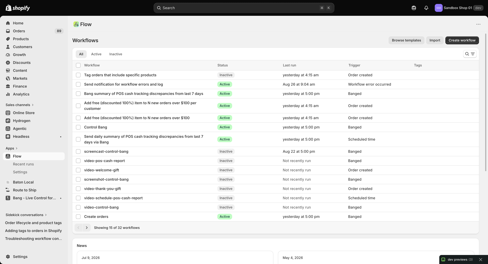

Header row:

- Title `Workflows`.
- Three primary actions, right-aligned: **Browse templates** (secondary), **Import** (secondary), **Create workflow** (primary, dark). No other header buttons inside the Flow frame. (The Shopify admin chrome above the frame has its own `More actions`, not explored.)
- Below the title, status tabs: **All** (selected pill), **Active**, **Inactive**. These are tabs, not filter badges — clicking them switches the table query.
- Search/filter affordance is a single icon button **"Search and filter results"** (magnifier + filter icon) at the right end of the tab row. Clicking it expands an inline search row (next section).

Table columns (left to right): checkbox, **Workflow** (link), **Status**, **Last run**, **Trigger**, **Tags**.

- Workflow cells are links into the detail view. Observed rows include `Tag orders that include specific products` (Inactive), `Send notification for workflow errors and log` (Active), several `Bang …` / `video-…` / `screenshot-…` workflows, and `Create orders` (Active).
- Status is a pill: green **Active**, grey **Inactive**.
- Last run is relative (`yesterday at 4:15 am`, `Aug 26 at 9:04 am`) or the literal `Not recently run`.
- Trigger names the trigger that fired: `Order created`, `Workflow error occurred`, `Banged` (custom trigger from the Bang app), `Scheduled time`.
- Tags column was empty for every visible row. Tags here are Flow's own workflow tags (see Manage tags), not order/product tags.
- Header checkbox reads **"Select all 15 on page"**. Pagination footer: `Previous` (disabled on page 1), `Next`, **"Showing 15 of 32 workflows"** — page size 15.

Below the table: a **News** section (observed cards: Jul 9 2026 "Copy and paste steps in your workflows", May 4 2026 "View who edited, activated, or deactivated a workflow version", each with a `Learn more` changelog link and a `See all posts` button) and a **Featured templates** section (four template buttons plus `See all templates`).

### Search + filter row

Clicking the search icon replaces the tab row with a search row (screenshot §2 covers the open filter menu):

- Textbox **"Search by workflow name"** with a **Cancel** button that collapses the row back to tabs.
- **"Add filter +"** button opening a small menu with exactly two items: **Tags** and **Activation status**.

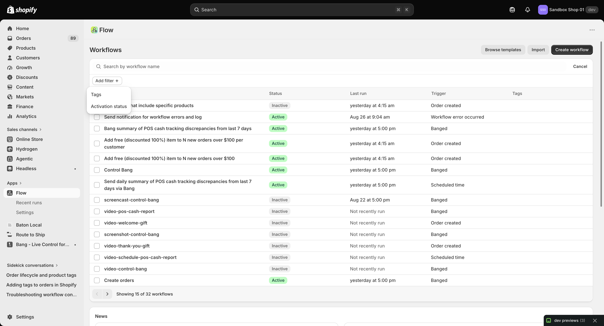

Selecting **Activation status** pins a filter badge inline (screenshot below): a popover titled **Activation status** with two radios (**Active**, **Inactive**) and a **Clear** button that is disabled until a value is picked. (Tags filter not exercised — no workflow in view had tags to filter on.)

Notes:

- The badge UI is the standard Shopify admin filter pattern: badge → popover → radio → Clear. Applied badges would sit inline next to "Add filter" (none were applied during this pass).
- Pressing Escape closes the popover; Cancel collapses the whole search row.

## 2. Workflow detail (overview)

Route: `/apps/flow/overview/<workflowId>?tab=main|draft|past-versions`. The app frame is served from `flow.shopifyapps.com/overview/…?shop=sandbox-shop-01.myshopify.com&tab=…`.

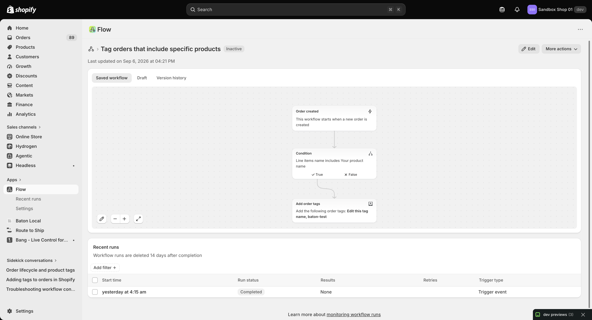

Layout, top to bottom:

1. Breadcrumb-ish row: Flow icon › **"Tag orders that include specific products"** (h1) + status text **Inactive** (plain text next to the title, not a pill here).
2. Header actions, right-aligned: **Edit** (pencil icon) and **More actions ▾**. When the workflow is Inactive **and has no draft**, a third button **Turn on workflow ▾** appears (§6). When a draft exists, Turn on is absent and only Edit + More actions show.
3. `Last updated on …` line (observed `Sep 6, 2026 at 04:21 PM` on entry, `04:39 PM` after Apply, `04:41 PM` after Discard — every promote/discard bumps it).
4. Tabs: **Saved workflow** (selected) | **Draft** | **Version history**. **The Draft tab exists only while a draft exists** — after Apply it disappears, leaving two tabs (verified §7).
5. Read-only **workflow preview canvas**: dotted background, three cards connected vertically:
   - `Order created` — "This workflow starts when a new order is created",
   - `Condition` — True/False branch pills (`✓ True`, `✕ False`),
   - `Add order tags` — "Add the following order tags: Edit this tag name, baton-test".
   - Canvas footer controls (bottom-left): **Edit workflow** (pencil, jumps into the editor), **Zoom out**, **Zoom in**, **Default view** (fit). Nodes carry ARIA descriptions exposing keyboard move/delete, and edges are focusable ("press enter to select an edge…").
6. **Recent runs** section: heading + retention note **"Workflow runs are deleted 14 days after completion"**, an **Add filter +** button, and a table with columns checkbox / **Start time** (link) / **Run status** / **Results** / **Retries** / **Trigger type**. Observed one row: `yesterday at 4:15 am`, `Completed`, `None`, (blank retries), `Trigger event`, linking to `/activity/<runId>`. Footer: `Learn more about monitoring workflow runs` (help.shopify.com link). The runs table shows skeleton rows while loading — an early screenshot of Version history caught the same skeleton pattern, so wait for real rows before concluding "empty".

### More actions (detail)

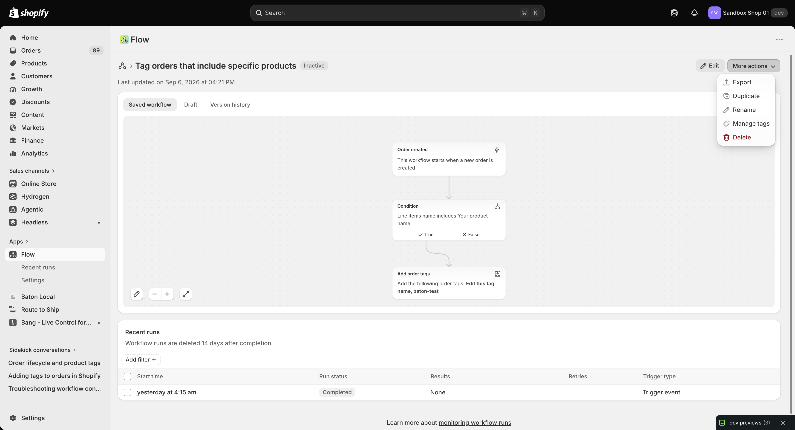

Menu items, in order: **Export**, **Duplicate**, **Rename**, **Manage tags** (opens a dialog), **Delete**. No confirmation was clicked for destructive items. Rename on the detail view was not exercised (Rename was exercised in the editor instead, §5 — same dialog is expected).

### Draft tab (before Apply)

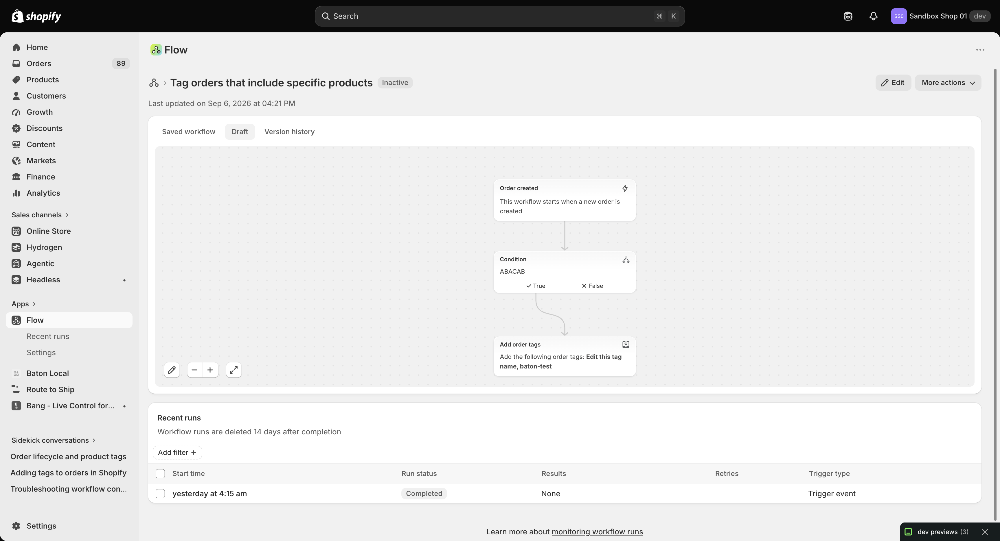

With a pre-existing draft (left over from whoever edited before this session), the Draft tab rendered the same three nodes but the Condition card's subtitle read **ABACAB** where Saved read **"Line items name includes Your product name"**. Inference (labeled): ABACAB is most likely a custom step **description** (the side panel has an "Edit description" control that overrides the auto-generated summary on canvas), not the condition value itself — the editor side panel's value textbox still read `Your product name` (§5). Do not cite ABACAB as a condition value.

### Version history tab

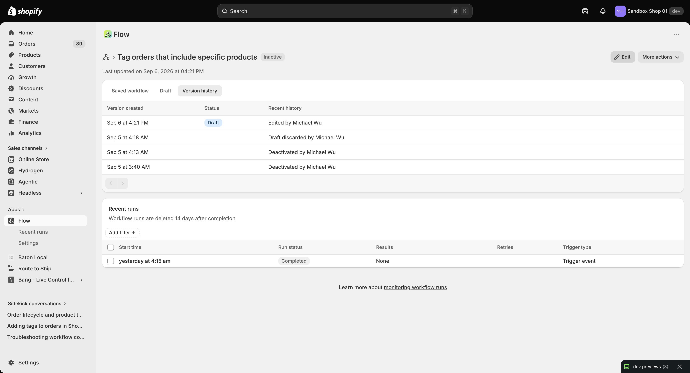

Columns: **Version created** (link to a version preview at `flow.shopifyapps.com/workflow-version-preview/<workflowId>/<versionId>`) / **Status** / **Recent history** (actor button). Observed rows (newest first):

- `Sep 6 at 4:21 PM` — Draft — **Edited by Michael Wu ▾**
- `Sep 5 at 4:18 AM` — (draft row) — **Draft discarded by Michael Wu ▾**
- `Sep 5 at 4:13 AM` — **Deactivated by Michael Wu ▾**
- `Sep 5 at 3:40 AM` — **Deactivated by Michael Wu ▾**

Pagination Previous/Next both disabled (fewer rows than a page). Caution: the tab initially renders an empty table (headers only) while loading — the committed screenshot is the re-taken one after rows appeared. An earlier capture in this same session showed zero rows for the same tab; treat any "empty version history" observation as suspect unless loading is ruled out.

## 3. Editor

Entry: clicking **Edit** (or **Edit workflow** on the canvas) navigates the admin chrome to `/apps/flow/editor/<workflowId>/<versionId>` with the canvas served from `flow.shopifyapps.com/editor/…`. Editing happens **in this full-page editor, not in a modal dialog** — the "dialog box" impression from the request most likely refers to the left **side panel** that opens when a node is selected (§4), or to the Rename/Discard/Turn-on modals.

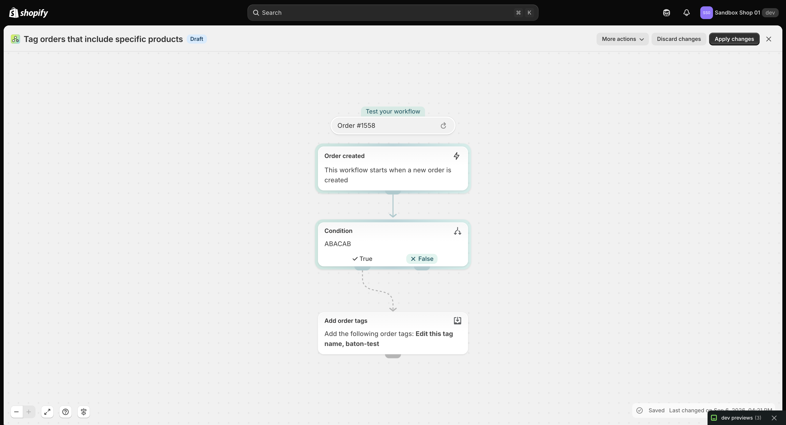

Editor chrome (admin frame, above the Flow iframe):

- Title (h1, same workflow name) + blue **Draft** badge — **only while a draft exists**. Clean state shows no badge.
- With a draft: **More actions ▾**, **Discard changes** (secondary), **Apply changes** (primary dark), **Close ✕**.
- Clean (no draft): **More actions ▾**, **Turn on workflow** (secondary), **Close ✕**. No Discard/Apply, no Draft badge.
- Canvas differences from the read-only preview: every node output has a **+ / Add step** button; a **"Test your workflow"** pill sits above the trigger (observed `Order #1558` with a reselect/refresh button); canvas footer has **Arrange workflow**, **Help** (help.shopify.com link), zoom controls, Default view. Footer bottom-right: **Saved** check + `Last changed on …`, briefly replaced by a **Saving** spinner during autosave.

### Editor More actions

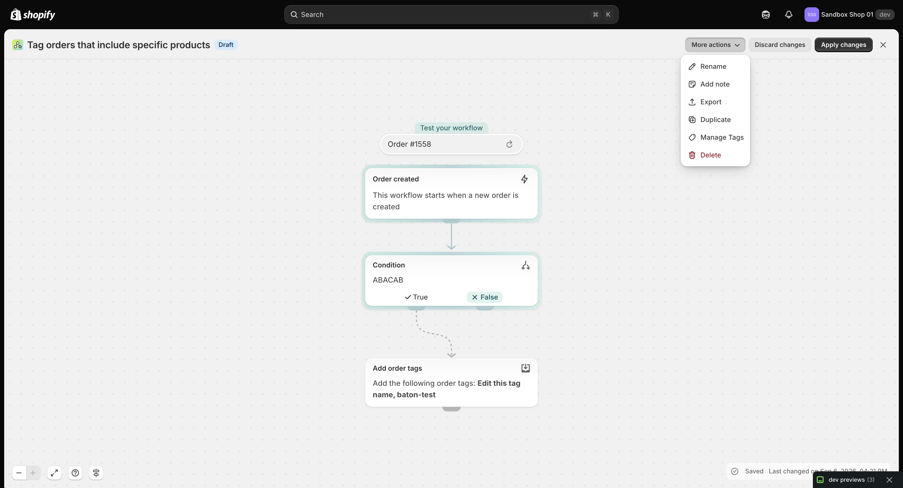

Items: **Rename**, **Add note**, **Export**, **Duplicate**, **Manage Tags**, **Delete**. Compared with the detail view's menu (§2), the editor menu **adds "Add note"**; the rest match (modulo Tags capitalisation).

## 4. Selecting a step — the side panel

Clicking the Condition node opens a panel docked left over the canvas:

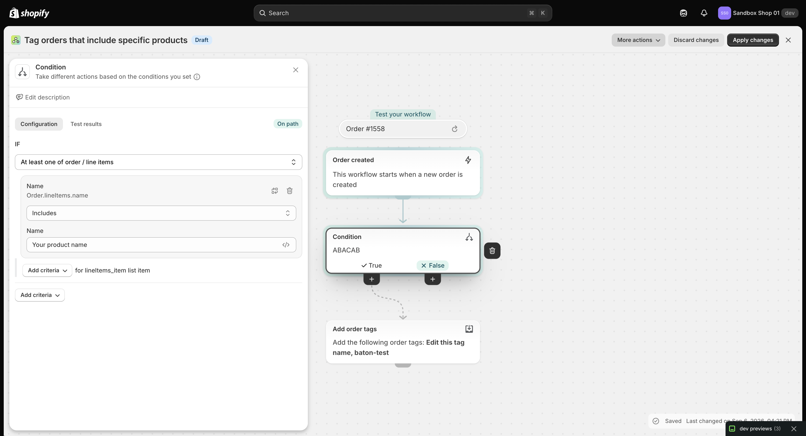

Panel contents:

- Header: step icon + **Condition**, subtitle "Take different actions based on the conditions you set" (info icon), **✕ Close**.
- **Edit description** row (pencil). This is the suspected source of the ABACAB canvas subtitle (§2).
- Tabs **Configuration** (selected) / **Test results**, plus an **On path** badge (green pill, right side).
- Condition builder:
  - `IF` heading, scope button **"At least one of order / line items"**.
  - Criterion group: field row **Name** / `Order.lineItems.name` with side actions (copy/variables icon, trash **Delete**), an **Edit** button toggling the field picker.
  - **Comparison** combobox, observed value **Includes**. Full option list captured from the accessibility tree: Equal to, Not equal to, **Includes (selected)**, Does not include, Is at least one of, Is not any of, Starts with, Does not start with, Ends with, Does not end with, Empty or does not exist, Not empty and exists.
  - Value row: label **Name**, textbox with `Your product name` (this is what the fill test edited), variable-picker button (`</>`).
  - Two **Add criteria ▾** buttons: one scoped `for lineItems_item list item`, one top-level.
- Selecting a node also reveals a floating **Delete step** (trash) button on the canvas next to the node.

## 5. Rename

More actions → Rename opens a modal **dialog "Rename workflow"**:

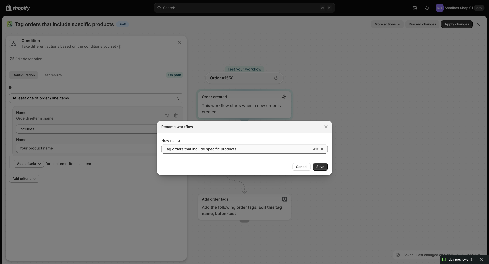

- **New name** textbox prefilled with the current name (`Tag orders that include specific products`), live count `41/100` (100-char limit implied).
- Buttons: **Cancel** (secondary), **Save** (primary), plus modal **Close ✕**. Cancel was clicked; no rename was saved.

## 6. Turn on workflow

For the Inactive workflow with no draft, **Turn on workflow ▾** opens a modal **"Ready to turn on your automation workflow?"** with body **"Turning on the workflow will activate the automation."** and **Cancel** / **Turn on** buttons.

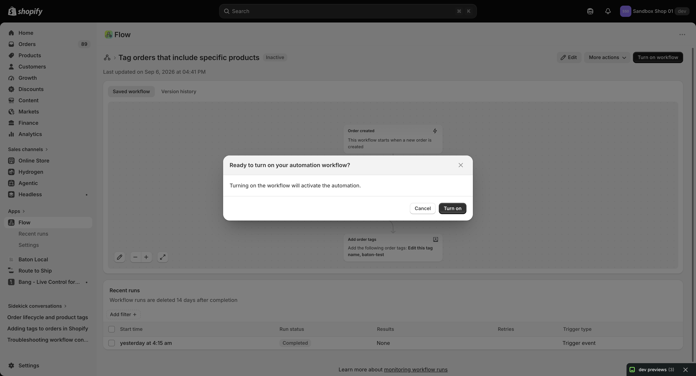

Cancel was clicked; the workflow was deliberately left **Inactive** (activating it would start tagging real orders). Do not infer the Turn-off UX from this — no active workflow was deactivated in this pass.

## 7. Draft lifecycle — observed end to end (with mutations)

Initial state on entry: a draft already existed (Draft tab present; editor showed Draft badge + Discard/Apply; Condition canvas subtitle ABACAB vs Saved's full sentence).

### Apply

Clicked **Apply changes** in the editor (screenshot: post-apply editor):

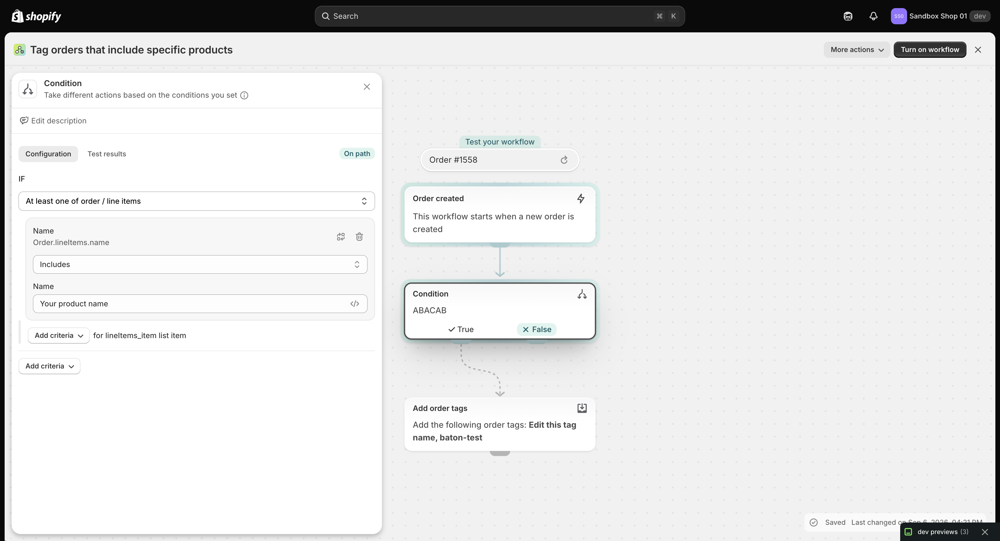

Observed, in order:

1. Footer flipped to **Saving** (spinner) briefly.
2. Header lost the **Draft** badge and the **Discard/Apply** buttons; it now showed **More actions / Turn on workflow / Close**.
3. Closing back to the overview (`?tab=main`): the **Draft tab was gone** (only Saved workflow | Version history), `Last updated` had bumped 04:21 PM → 04:39 PM, and the **Saved canvas now showed ABACAB** on the Condition card.

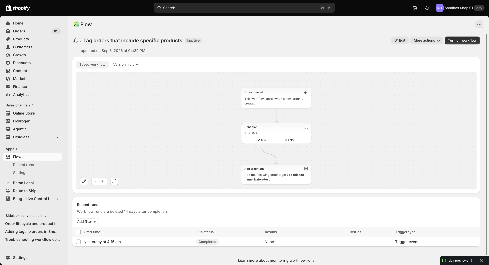

So Apply promotes the draft into Saved and removes the draft — matches the requester's mental model. One surprise: the editor URL's `<versionId>` did **not** change on Apply (stayed `01M1W63YTT5MF5YDJS1C3G3YEQ`); the Version history tab still listed `Sep 6 at 4:21 PM / Edited by Michael Wu` as newest immediately after (likely eventual consistency or the list keying off something other than the promote event — Last updated did bump, so the write landed).

### Re-edit creates a draft lazily (not on entry)

Clicked **Edit** again right after Apply: the editor opened **clean** — footer `Saved`, `Last changed … 04:39 PM`, header More actions / Turn on / Close, **no Draft badge, no Discard/Apply**. Entering the editor does not create a draft.

Then edited the Condition value textbox `Your product name` → `Your product name TEST` via fill. Nothing happened immediately (header unchanged, footer still Saved 04:39). Within ~seconds (autosave round-trip), without further input:

- URL `<versionId>` changed `01M1W63…` → `01M1W77RJPYVN35AH2D0T9MTJ6` (new draft version id),
- blue **Draft** badge + **Discard changes** / **Apply changes** appeared.

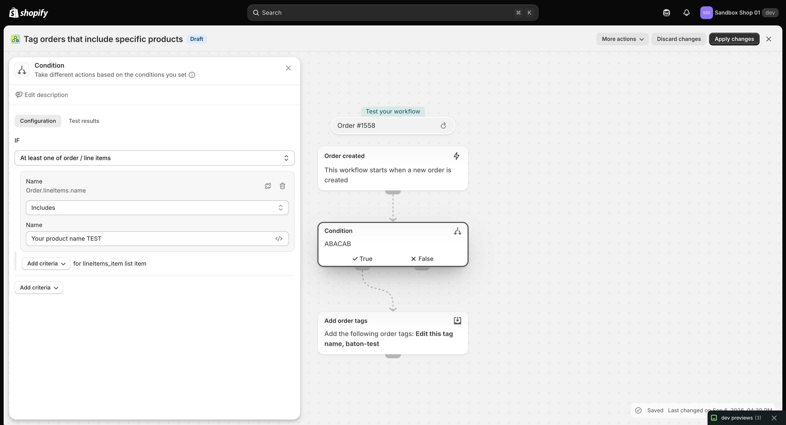

Conclusion: the draft is created **lazily on first autosaved change**, with a new version id, not on editor entry. Correction to the requester's hypothesis ("clicking edit again would create a draft under the covers"): entry alone does not; the first keystroke/fill does.

### Discard

Clicked **Discard changes** → modal **"Discard Changes?"** / **"Are you sure you want to discard these changes?"** with **Cancel** / **Discard** (+ modal Close).

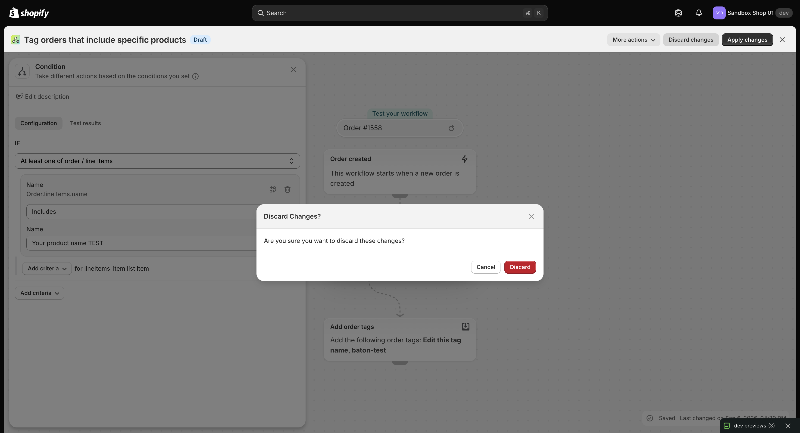

Confirmed Discard:

- Button entered a disabled/processing state, then the editor URL reverted to the saved version id (`01M1W63…`), Draft badge and Discard/Apply disappeared, footer back to `Saved / Last changed … 04:40 PM`.
- The TEST suffix was gone. Last updated on the overview later read 04:41 PM.

### Close

**Close ✕** (top-right of the editor chrome) navigates back to the overview (`?tab=main` or `?tab=past-versions` depending on entry point) with **no confirmation and no discard** — the pre-existing draft survived Close/Open cycles before Apply. Close ≠ Discard.

### Net mutations left behind

Deliberate, please do not "clean up" without reading this:

- The pre-existing draft (Condition subtitle ABACAB) was **applied to Saved**. Saved now reads ABACAB where it previously read the full condition sentence. The TEST edit was discarded. Workflow remains **Inactive**; no activation, rename, delete, or duplicate was performed.
- If a future pass needs the original summary back, the version-history preview links (§2) plus the `04:21 PM` entry should show the pre-apply content; or re-edit the description/value and Apply again.

## 8. Recent-runs filter (detail)

Not deeply exercised (one run total). The **Add filter +** button in Recent runs mirrors the list-page pattern. No badge inventory taken — the table is the standard Flow runs table (Start time / Run status / Results / Retries / Trigger type) with a 14-day retention notice.

## 9. What this implies for Baton

- **Saved vs Draft as tabs on the detail page, editor as a separate route bound to a version id, lazy draft creation on first change, Apply-promotes + Draft-tab-disappears, Discard-with-confirmation, Close-preserves-draft** is a coherent, proven model for "safe editing with history". Baton's `workflow-draft-spec.md` should be checked against it: the largest deltas are (a) Flow keeps at most **one** draft per workflow (new edits reuse/replace it — the version id changed once per draft, not once per keystroke), and (b) entry is free — drafts cost nothing until the merchant types.
- **Version history rows log actor + action** (edited / draft discarded / deactivated), each linking to a read-only version preview. Cheap accountability Baton currently lacks.
- **Activation is a separate explicit dialog** (Turn on → confirm), orthogonal to saving. Baton conflates "active" with "routable" in places — Flow keeps Inactive workflows fully editable with runs history intact.
- **Rename is a small modal with a 100-char counter**, available in both detail and editor menus. Baton's inline-name editing should keep the same limit if it shares the col.
- **Condition builder vocabulary** (scope button "At least one of…", field path `Order.lineItems.name`, 12 string comparisons, Add-criteria nesting) is the reference for any Baton rule UI — note how the canvas card shows the human summary while the panel shows the structured form. The ABACAB episode suggests the card subtitle is the **description override when present, else the auto-summary** — worth verifying before copying.

## 10. Open questions / things not covered

- Manage tags dialog contents (both menus) — not opened.
- Export/Duplicate/Delete flows and their confirmations — not clicked.
- Add note (editor-only menu item) — not opened.
- Test-results tab of the side panel; "Test your workflow" with Order #1558 reselect — not run (would execute a test?).
- Add-step picker contents (trigger/condition/action catalogue) — not opened.
- Turn-off / deactivate dialog for an Active workflow — not touched (only Cancel on Turn-on).
- Whether two staff editing concurrently conflict, and what the actor ▾ dropdowns in version history expand to.
- Exact semantics of the ABACAB subtitle (description vs value) — inferred as description, not proven; check via Edit description.
- Why Version history did not immediately show the 04:39/04:41 promote entries.
