# Shopify Flow — workflow lifecycle UX, and where Baton differs

Research date: 2026-09-17. Research only: no recommendations, no implementation plan.

Re-done from first principles against the live Flow app in `sandbox-shop-01`
(`https://admin.shopify.com/store/sandbox-shop-01/apps/flow`), by creating two throwaway
workflows and driving them through the whole lifecycle — create, configure, rename, turn on,
edit, apply, discard, turn off, delete — plus a deliberately invalid one to see activation
validation. Both were deleted at the end; the sandbox is back to 33 workflows and nothing
pre-existing was touched.

Supersedes the state-machine parts of `shopify-flow-ux-research.md` (2026-09-06). That pass never
saw the create flow, never activated anything, and reported some things wrong — corrections are
called out inline as **Correction**. Its sections on the list-page filter row and the condition
builder side panel are still the only record of those and are not repeated here.

Screenshots are in `docs/shopify-flow-lifecycle/`, referenced relatively.

---

## 1. The object model Flow shows the merchant

Flow presents four things, and every piece of chrome is a function of them:

| Concept                   | Where it lives                           | Merchant-visible name                    |
| ------------------------- | ---------------------------------------- | ---------------------------------------- |
| Workflow                  | `/apps/flow/overview/<workflowId>`       | the row in the list; the page title      |
| The version that runs     | first tab of the overview                | **Active workflow** / **Saved workflow** |
| The version being written | second tab, present only while it exists | **Draft**                                |
| Everything that ever was  | third tab                                | **Version history**                      |

Routes:

- list — `/apps/flow/`
- overview — `/apps/flow/overview/<workflowId>?tab=main|draft|past-versions`
- editor — `/apps/flow/editor/<workflowId>/<versionId>`
- new — `/apps/flow/editor` (no ids yet)
- read-only version preview — `flow.shopifyapps.com/workflow-version-preview/<workflowId>/<versionId>`

**The version id in the editor URL is the unit of editing.** Creating a draft mints a new one;
Apply keeps it (the draft version becomes the live version); Discard reverts the URL to the
previous one. Watching that segment is the cheapest way to see the state machine work.

---

## 2. State matrix — the thing worth copying

This is the whole of Flow's badge/button logic. Two independent bits: **is it on** and **is there
a draft**.

### Editor header (`/apps/flow/editor/…`)

| Workflow state                          | Badge next to title   | Buttons, left → right                                                                           |
| --------------------------------------- | --------------------- | ----------------------------------------------------------------------------------------------- |
| Never activated (draft is all there is) | **Draft** (blue/info) | `More actions ⌄` · **Turn on workflow** (dark primary) · `✕`                                    |
| Active, no draft                        | _(none)_              | `More actions ⌄` · **Turn off workflow** (**red** primary) · `✕`                                |
| Inactive, previously applied, no draft  | _(none)_              | `More actions ⌄` · **Turn on workflow** (dark primary) · `✕`                                    |
| Any state, draft exists                 | **Draft** (blue/info) | `More actions ⌄` · `Discard changes` (plain secondary) · **Apply changes** (dark primary) · `✕` |

Two rules fall out of that:

1. **The Draft badge means "there are unapplied changes", not "this is the editor".** A clean
   editor carries no badge at all ([27](shopify-flow-lifecycle/27-editor-inactive-no-draft.png)).
2. **While a draft exists the editor offers no activation control at all.** Turn on / Turn off is
   replaced by Discard/Apply ([17](shopify-flow-lifecycle/17-editor-active-with-draft.png)). You
   resolve the draft first, then decide about running.

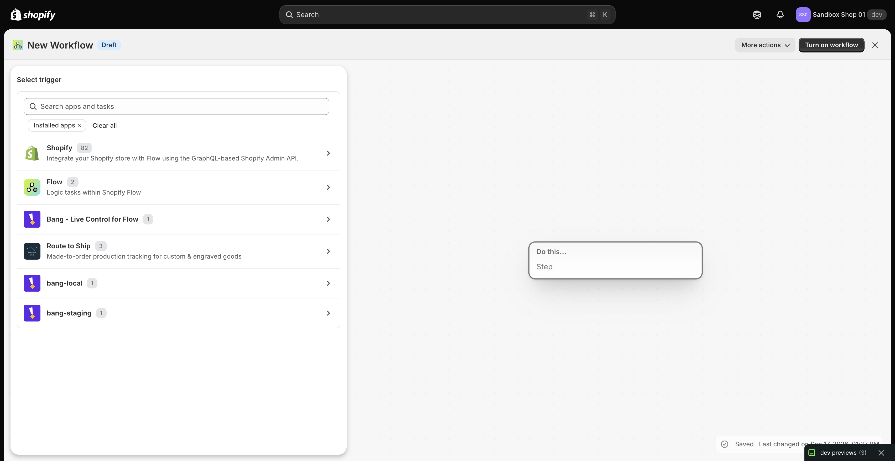
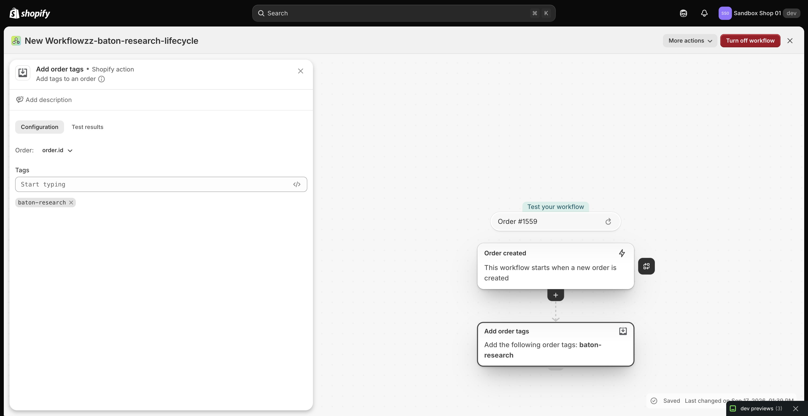
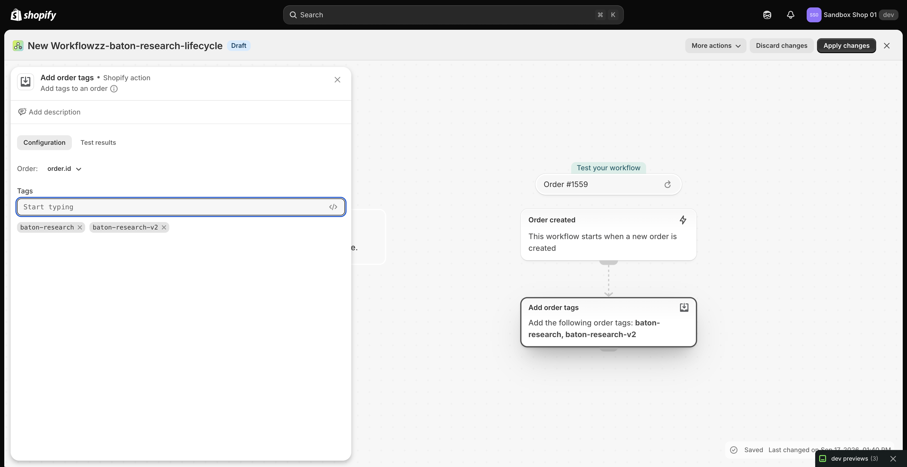

### Overview header (`/apps/flow/overview/…`)

`✏ Edit` (secondary) · `More actions ⌄` (secondary) · **Turn on workflow / Turn off workflow**
(primary; red when it says Turn off).

- Status sits next to the h1 as a subdued pill: `Active` / `Inactive`. (It is a
  `s-internal-badge` in the title-metadata slot with default tone — _not_ the green success badge
  the list's Status column uses. Same word, two tones, two surfaces.)
- **Active + draft** → `Turn off workflow` is still there.
- **Inactive + draft** → the activation button **disappears**; only `Edit` and `More actions`
  remain ([28](shopify-flow-lifecycle/28-overview-inactive-with-draft.png)). Asymmetric on
  purpose, presumably: you may stop a running workflow mid-edit, but you may not start one whose
  pending edit you have not resolved.

### Overview tabs — the first tab is renamed by state

| Workflow state                         | Tabs                                            |
| -------------------------------------- | ----------------------------------------------- |
| Never activated                        | `Draft` · `Version history`                     |
| Active, no draft                       | `Active workflow` · `Version history`           |
| Inactive, previously applied, no draft | `Saved workflow` · `Version history`            |
| Active + draft                         | `Active workflow` · `Draft` · `Version history` |
| Inactive + draft                       | `Saved workflow` · `Draft` · `Version history`  |

A brand-new workflow has **no "Saved workflow" tab at all** — nothing has ever been applied, so
the only thing to show is the draft ([05](shopify-flow-lifecycle/05-new-overview-draft-only.png)).
Turning it on renames that tab to `Active workflow` and the Draft tab vanishes
([12](shopify-flow-lifecycle/12-overview-active.png)). Turning it off renames it again to
`Saved workflow` ([25](shopify-flow-lifecycle/25-after-turn-off-saved-tab.png)).

Layout under the header: `Last updated on <date>` as a plain line **outside and above** the tab
card, then the tab card (tabs + read-only canvas with a pencil `Edit workflow` and zoom
controls), then a separate Recent runs card.

---

## 3. Creating a workflow

`Create workflow` (dark primary, third in `Browse templates` · `Import` · `Create workflow`) goes
to `/apps/flow/editor` — **a full-screen surface with the app title `Flow` and a lone `✕`. No
name is asked for. No workflow exists yet.**

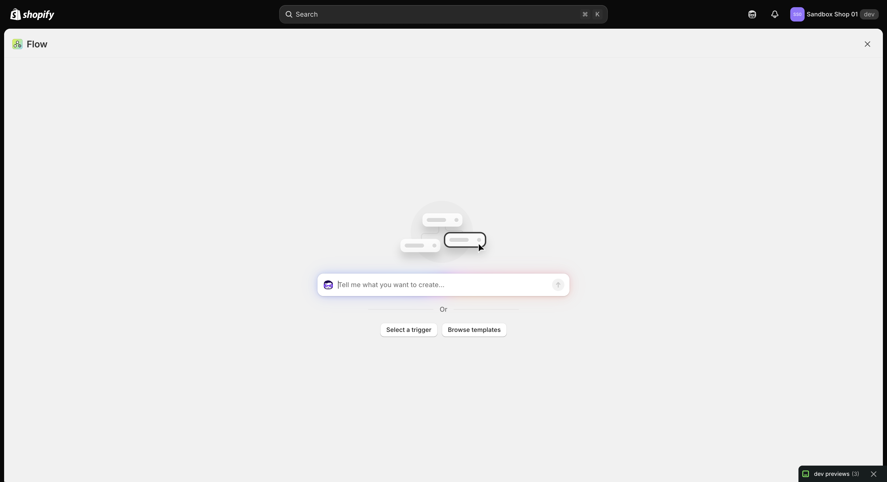

Three ways in, on one centred card:

- a prompt box **"Tell me what you want to create…"** with a Send arrow (AI build), then
- a divider reading **Or**, then
- **`Select a trigger`** and **`Browse templates`**.

Choosing `Select a trigger` is what **creates the workflow object**: the URL immediately becomes
`/apps/flow/editor/<workflowId>/<versionId>`, the title becomes **New Workflow**, the `Draft`
badge and `More actions` / `Turn on workflow` / `✕` appear, and the footer reads
`✓ Saved · Last changed on <date>`. Naming happens later via More actions → Rename; the default
name is literally `New Workflow`.

Canvas at that moment: one placeholder node headed **"Do this…"** with the subtitle `Step`, and a
`Select trigger` panel docked left.

Step-adding flow:

1. `Select trigger` panel → app list with per-app counts (`Shopify 82`, `Flow 2`, installed apps
   below) → drill into an app → per-app search (`Search Shopify`, `Showing 2 results`) → pick.
2. The chosen trigger becomes a node; a `Test your workflow` pill with a real order
   (`Order #1559`) appears above it; the node grows a `+` **Add step** button.
3. `+` drops an empty node offering exactly two buttons: **`Create action`** / **`Create
condition`** ([07](shopify-flow-lifecycle/07-add-step-action-or-condition.png)).
4. That opens `Select action` — same two-level app→task picker.
5. The configured node's side panel is headed `<Step name> • <App> action`, with the task
   description + ⓘ, an **Add description** row, tabs `Configuration` / `Test results`, an `On
path` pill when the step is reachable, and the fields
   ([08](shopify-flow-lifecycle/08-editor-action-panel.png)).

Canvas node subtitles are human summaries of the config (`Add the following order tags:
baton-research`), with the literal word **`Empty`** where a required value is missing.

`Escape` in the editor closes the whole editor back to the overview — it does not just close a
panel. Close/Escape **never** discards the draft.

---

## 4. Draft lifecycle

**Opening the editor writes nothing.** Verified twice: entering a clean editor leaves the header
badge-less and the version id unchanged.

**The first autosaved content change creates the draft.** On changing a tag value, within a couple
of seconds and with no further input: the URL's version id changed
(`01M2R7303B…` → `01M2R7EC89…`), the `Draft` badge appeared, and `Discard changes` / `Apply
changes` replaced `Turn off workflow`.

> **Correction** to the 2026-09-06 pass: it guessed Apply "did not change the version id". It does
> — Apply _keeps the draft's_ id because the draft version _becomes_ the live version; it is
> Discard that moves the id back.

Autosave is surfaced bottom-right of the canvas as `✓ Saved · Last changed on Sep 17, 2026,
01:43 PM`, flipping to a `Saving` spinner mid-write. There is no manual save.

**Not everything is drafted.** Adding a note (§6) saved fine and produced **no** Draft badge and
**no** bump to `Last changed`. Notes are workflow metadata, not versioned content.

### Apply

`Apply changes` → **confirmation only when the workflow is on**:

> **Apply changes?**
> This workflow is turned on. Once you apply changes, they'll take effect immediately.
> `Cancel` · `Apply` (dark primary)

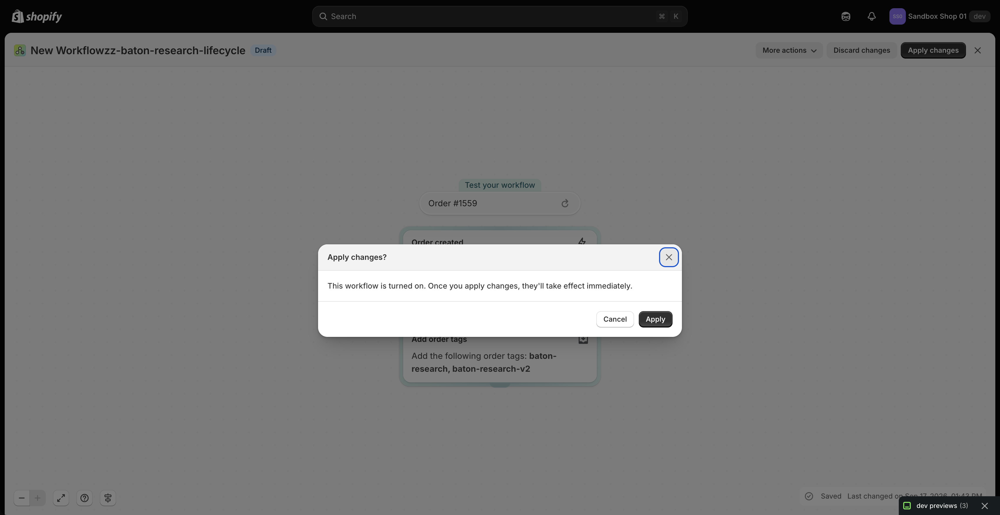

On an inactive workflow Apply goes through with no dialog. After Apply: badge gone, Discard/Apply
gone, activation control back, Draft tab gone from the overview, `Last updated` bumped.

### Discard

`Discard changes` (a plain secondary button — the destructive colour lives in the dialog, not the
header):

> **Discard Changes?** ← note the stray title-case "Changes"
> Are you sure you want to discard these changes?
> `Cancel` · `Discard` (**red**)

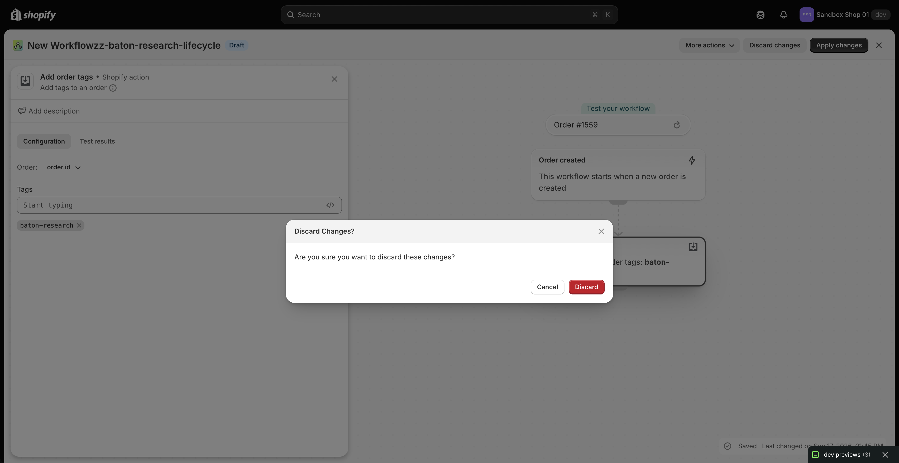

After confirming: the version id in the URL reverts, badge and buttons disappear, the content is
restored, and Version history keeps the discarded version as a row with **no status badge** and
`Draft discarded by <name>`.

### Turn on as a shortcut for Apply

For a never-activated workflow there is no Apply button at all. **`Turn on workflow` both applies
the draft and activates it**, in one confirmed step.

---

## 5. Turn on / Turn off

> **Ready to turn on your automation workflow?**
> Turning on the workflow will activate the automation.
> `Cancel` · `Turn on` (dark primary)

> **Turn off workflow**
> If you turn this workflow off, the runs in progress will be cancelled.
> `Dismiss` · `Turn off` (dark primary — **not** red, despite the red trigger button)

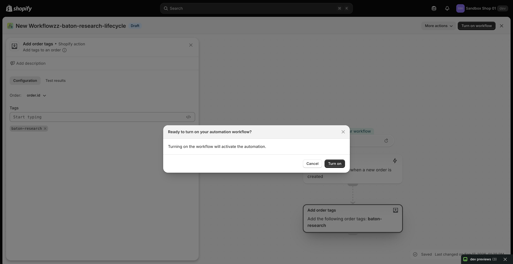
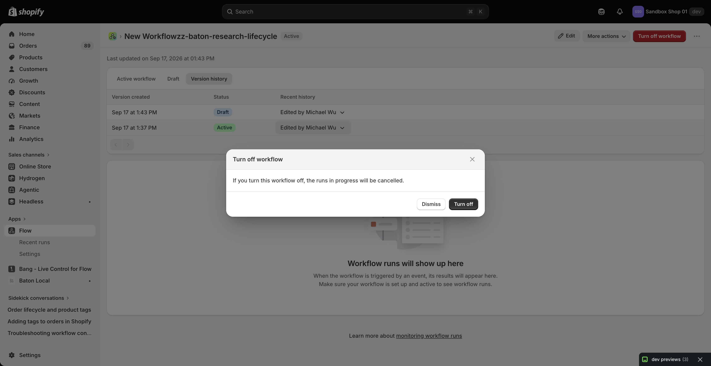

Both are confirmed. Both are available from the overview _and_ the editor (the editor only when no
draft is pending). The trigger button for Turn off is red; the dialog's confirm button is not.
The dismissive verb differs between the two dialogs (`Cancel` vs `Dismiss`) — see §9.

### Validation happens _after_ you confirm, not before

A workflow with no trigger and no action still shows an enabled `Turn on workflow` and still shows
the confirm dialog. Confirming produces a **critical card floating at the top-right of the
canvas** with a bulleted list of what is missing, and the button then goes disabled:

> • Add a trigger to this workflow
> • Add an action to this workflow

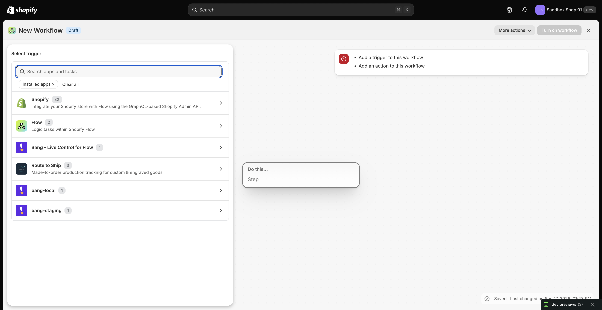

No modal, no banner at the top of the page, no inline field errors — a floating card on the canvas
next to the thing that is wrong.

---

## 6. More actions — inventory and order

| Surface                          | Items, in order                                                             |
| -------------------------------- | --------------------------------------------------------------------------- |
| Editor, never-activated workflow | Rename · Export · Duplicate · Manage Tags · **Delete** (red)                |
| Editor, once applied/active      | Rename · **Add note** · Export · Duplicate · Manage Tags · **Delete** (red) |
| Overview                         | Export · Duplicate · Rename · Manage tags · **Delete** (red)                |

Three things to notice: `Add note` only exists once the workflow has an applied version; the
overview's order is different from the editor's; and the casing differs (`Manage Tags` vs `Manage
tags`). The first is meaningful, the other two look like drift.

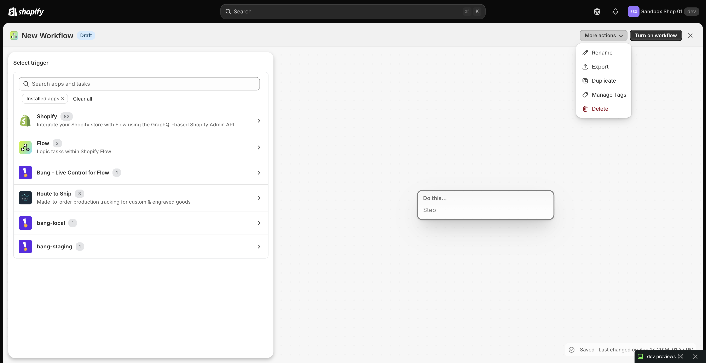
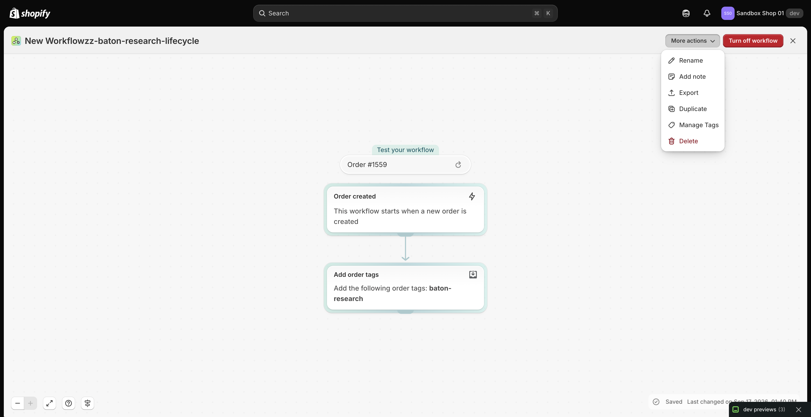
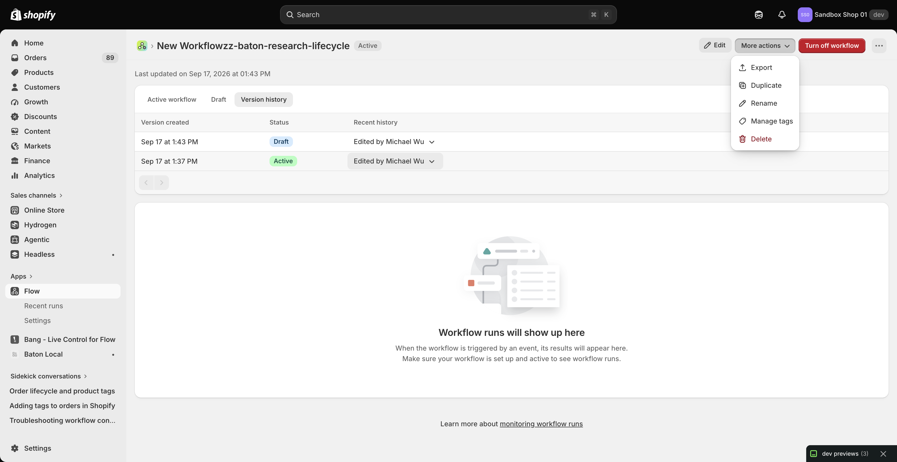

**Add note** drops a card on the canvas titled **"About this workflow"** with the placeholder
_"What's it for, when it runs, and anything to know before editing…"_. Clicking it opens an inline
rich-text editor (B / I / U / link / ordered list / bullet list) with a **Done** button.

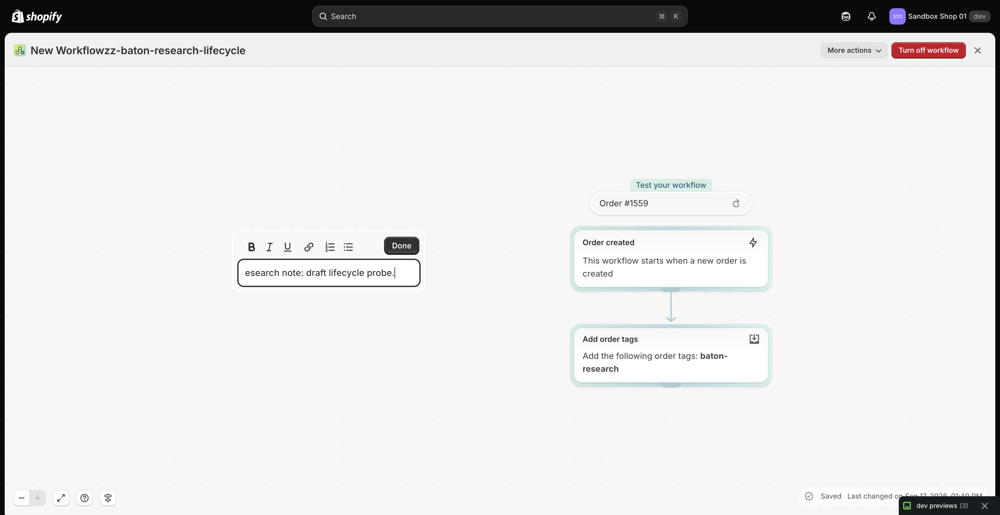

**Rename** is a small modal: heading `Rename workflow`, field labelled `New name`, a live
character counter (`12/100`), `Cancel` · `Save`. Success shows a toast `Workflow renamed`.

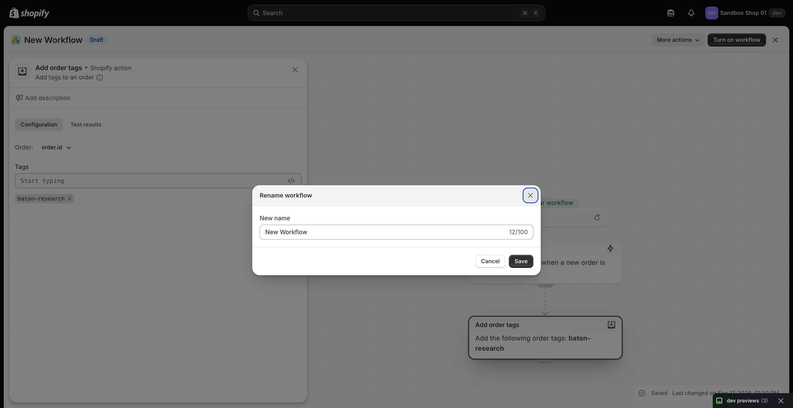

**Delete** names the workflow in the heading and says what survives:

> **Delete `<workflow name>`?**
> This workflow will be permanently deleted. Only its recent run history will be retained.
> `Cancel` · `Delete` (**red**)

Confirming redirects to the list with a toast `Workflow deleted`.

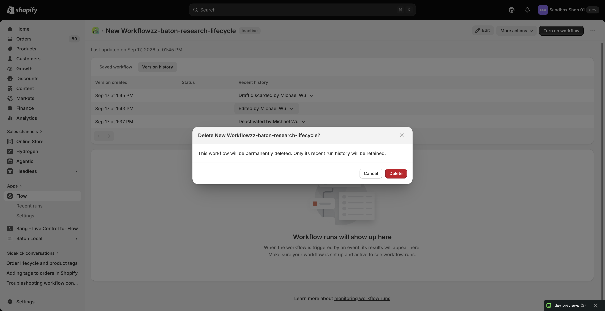

---

## 7. Version history

Columns: **Version created** · **Status** · **Recent history**.

- _Version created_ is a link to a read-only preview of that version.
- _Status_ is a badge: **Draft** (blue/info), **Active** (green/success), or **blank** for a
  version that is neither (superseded, or a discarded draft).
- _Recent history_ is a disclosure button labelled with the newest event on that version
  (`Edited by Michael Wu`, `Draft discarded by Michael Wu`, `Deactivated by Michael Wu`). Opening
  it shows a small timeline popover headed **Recent history**: `Edited by … / Sep 17 at 1:40 PM`,
  `Activated by … / Sep 17 at 1:40 PM`, `Version created by … / Sep 17 at 1:37 PM`.

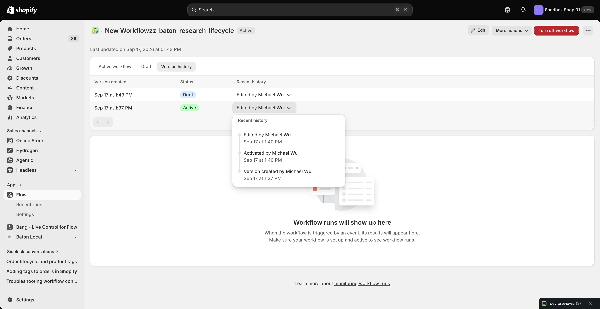

Every lifecycle event is attributed to a staff member and timestamped. This is a 2026-05 feature
per the app's own News card.

---

## 8. The list page

Header: `Browse templates` (secondary) · `Import` (secondary) · **`Create workflow`** (dark
primary). Tabs `All` / `Active` / `Inactive`. Columns **Workflow · Status · Last run · Trigger ·
Tags**. 15 rows per page, `Showing 15 of 33 workflows`. Below the table: a **News** card and a
**Featured templates** card.

**The list shows no draft state.** A workflow with a pending draft renders exactly like one
without — just its `Active`/`Inactive` pill. (The row's href does carry the _draft_ version id in
a `##<versionId>` fragment, but nothing visible says so.)

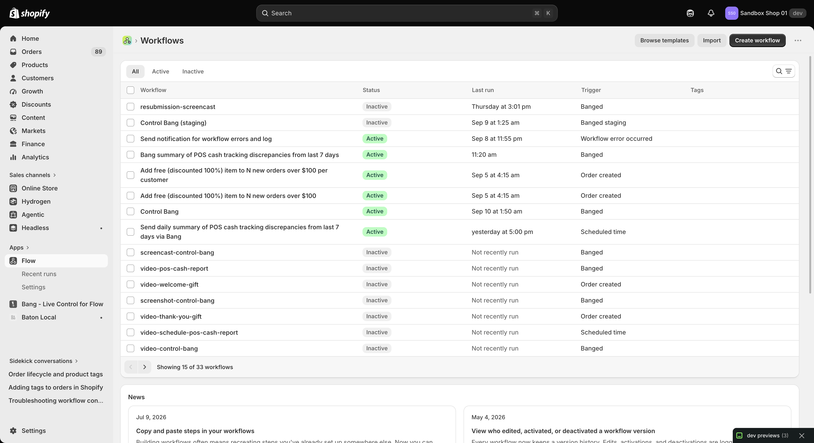

---

## 9. Inconsistencies inside Flow itself

Worth naming so they are not copied by accident:

- Dialog titles mix cases: `Apply changes?`, `Discard Changes?`, `Turn off workflow`,
  `Ready to turn on your automation workflow?`.
- Dismissive verbs mix: `Cancel` in four dialogs, `Dismiss` in Turn off.
- Turn off's trigger button is red but its confirm button is not; Discard's trigger button is
  plain but its confirm button is red.
- `Manage Tags` (editor) vs `Manage tags` (overview); the two menus also order their items
  differently.
- The status word is a green success badge in the list's Status column and a neutral pill next to
  the overview's h1.

> **Correction** to the 2026-09-06 pass: it recorded `Turn on workflow ▾` with a caret. There is
> no caret and no split button — it is a plain button. It also described the overview status as
> "plain text"; it is a subdued badge.

---

## 10. Baton today

Read from `src/routes/app.workflows.index.tsx`, `app.workflows.$workflowId.tsx`,
`app.workflows.$workflowId_.edit.tsx`, `src/components/WorkflowSwitch.tsx`,
`src/lib/workflowShared.ts`, and confirmed live in the dev app.

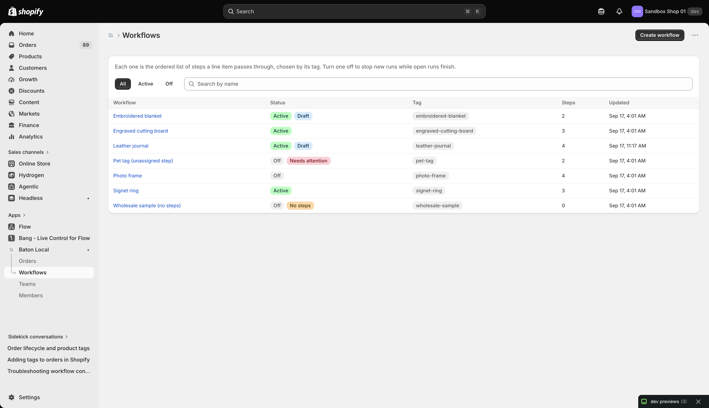
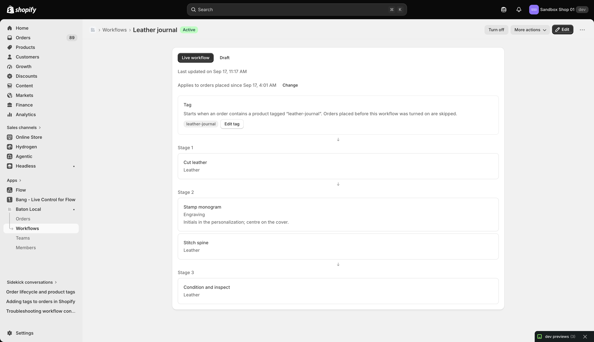
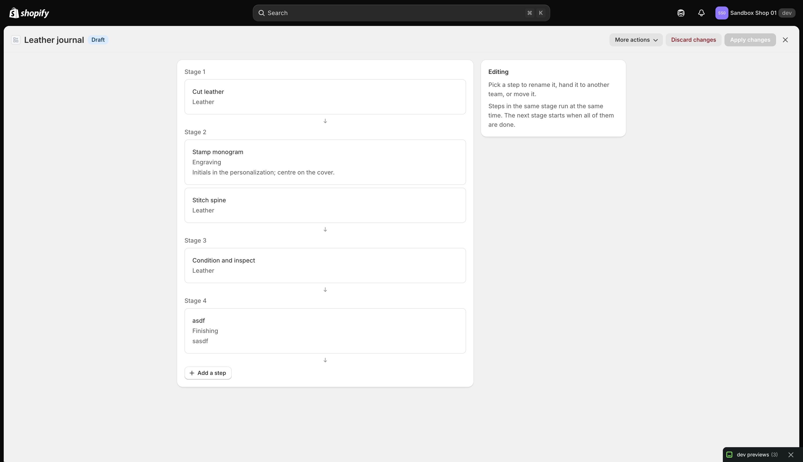
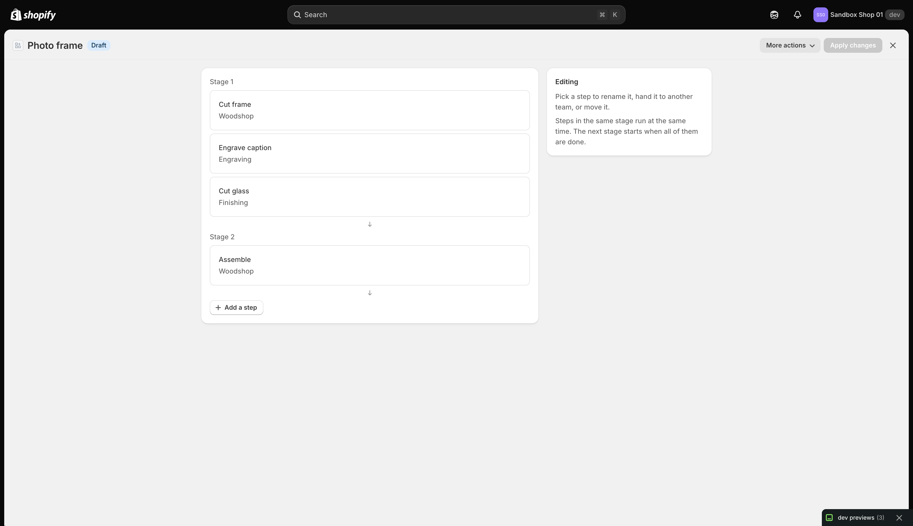

- **Index** — `Create workflow` (primary) alone in the header. Filter row is _inside_ the card:
  `All` / `Active` / `Off` pills + a search field. Columns **Workflow · Status · Tag · Steps ·
  Updated**. The Status cell stacks up to four badges: `Active`/`Off`, `Draft`, `No steps`,
  `Needs attention`. Create is a modal asking **Name** and **Tag**, then opens the editor window.
- **Detail** — status accessory badge; actions `Turn off` · `More actions ⌄` · **`Edit`
  (primary)**. More actions: Rename · Duplicate · Delete. Two pill "tabs" `Live workflow` /
  `Draft`, rendered **only when a draft exists**. `Last updated on …` sits _inside_ the card,
  under the tabs, followed by `Applies to orders placed since <date>  Change`. The Draft view
  carries an info banner _"Not running yet — These changes take effect when you apply them in the
  editor."_ No version history and no run history, deliberately (a run copies its steps at start).
- **Editor** — opened in an App Bridge `s-app-window`, Flow's chrome. Header: title + a **`Draft`
  badge that is always present**, then `More actions ⌄` · `Discard changes` (critical tone, only
  when a draft exists) · `Apply changes` (primary, **disabled** when there is no draft) · `✕`.
  More actions: Rename · Delete. A right-hand `Editing` / `Step` panel instead of Flow's left
  panel.
- **Turn on/off lives only on the detail page.** Turn on opens a dialog `Turn on <name>?` whose
  body explains the tag rule, plus an optional `Include them` checkbox for earlier unfulfilled
  orders. **Turn off has no confirmation at all** — a plain secondary button that fires
  immediately.
- **Validation is pre-emptive**: `turnOnBlocker` / `applyBlocker` disable the button _and_ render
  a banner (`Turn on is unavailable`, `Not ready to apply`) before the merchant clicks.

---

## 11. Where Baton differs from Flow

Ordered roughly by how load-bearing the difference is.

| #   | Dimension                     | Shopify Flow                                                                                                             | Baton                                                      |
| --- | ----------------------------- | ------------------------------------------------------------------------------------------------------------------------ | ---------------------------------------------------------- |
| 1   | Editor badge                  | `Draft` **iff unapplied changes exist**; clean editor has no badge                                                       | `Draft` **always**, as a label for the surface             |
| 2   | Activation from the editor    | Yes — `Turn on/off workflow` whenever no draft is pending                                                                | Never; editor has no activation control                    |
| 3   | Editor with a draft           | `More actions` · `Discard changes` · **`Apply changes`** · `✕`                                                           | Same three + `✕` — **matches**                             |
| 4   | Detail primary action         | **Turn on/off workflow** (dark, red when off)                                                                            | **Edit**                                                   |
| 5   | Detail action order           | `Edit` · `More actions` · `Turn on/off`                                                                                  | `Turn off` · `More actions` · `Edit` — reversed            |
| 6   | Turn off styling              | Red/critical primary                                                                                                     | Plain secondary                                            |
| 7   | Turn off confirmation         | Modal: _"the runs in progress will be cancelled"_                                                                        | **None** — fires on click                                  |
| 8   | Turn on confirmation          | Modal, generic one-liner                                                                                                 | Modal, names the tag rule + optional backfill checkbox     |
| 9   | Apply confirmation            | Only when the workflow is on                                                                                             | Only when the workflow is on — **matches**                 |
| 10  | Discard button tone           | Plain secondary in header, red in the dialog                                                                             | Critical tone in the header _and_ the dialog               |
| 11  | First tab name                | Renamed by state: `Draft` / `Active workflow` / `Saved workflow`                                                         | Always `Live workflow`                                     |
| 12  | Tabs when no draft            | Always ≥ 2 tabs (Version history keeps the row alive)                                                                    | No tab row at all                                          |
| 13  | Never-activated workflow      | Overview shows `Draft` + `Version history` only — there is no live side yet                                              | No distinct state; detail shows the live (empty) workflow  |
| 14  | Draft visible in the list     | No                                                                                                                       | Yes — a `Draft` badge per row                              |
| 15  | Creating                      | No name asked; object is created by the first gesture in a full-screen editor; default name `New Workflow`; rename later | Modal asks **Name** + **Tag** first, then opens the editor |
| 16  | Validation                    | Post-hoc: confirm, then a floating critical card on the canvas lists what is missing, button then disables               | Pre-emptive: button disabled + banner before the click     |
| 17  | Version history / attribution | Full: per-version status badges, actor + timestamp timeline per version, read-only version previews                      | None                                                       |
| 18  | Autosave affordance           | Persistent `✓ Saved · Last changed on …` in the canvas footer, `Saving` spinner mid-write                                | None                                                       |
| 19  | Editor More actions           | Rename · Add note · Export · Duplicate · Manage Tags · Delete                                                            | Rename · Delete                                            |
| 20  | Detail More actions           | Export · Duplicate · Rename · Manage tags · Delete                                                                       | Rename · Duplicate · Delete                                |
| 21  | Delete dialog body            | Names what survives: _"Only its recent run history will be retained."_                                                   | _"This can't be undone."_                                  |
| 22  | Notes                         | `Add note` → an "About this workflow" rich-text card on the canvas, not versioned                                        | None                                                       |
| 23  | `Last updated` placement      | Plain line above the tab card                                                                                            | Inside the card, below the tabs                            |
| 24  | Side panel side               | Left, over the canvas                                                                                                    | Right, as an `s-section slot="aside"`                      |
| 25  | Casing / verbs                | Drifts (`Discard Changes?`, `Dismiss`, `Manage Tags`)                                                                    | Consistent sentence case, `Cancel` everywhere              |

Notes on a few rows:

- **#1 is the sharpest divergence.** In Flow the badge is _state_; in Baton it is _chrome_. Because
  Baton's badge never turns off, Baton has to disable `Apply changes` to signal "nothing to apply",
  which reads as a broken button rather than as an absent one. Flow signals the same fact by
  showing a different set of buttons entirely.
- **#7 is the only place Baton is less careful than Flow about a destructive act.** Flow warns that
  in-progress runs are cancelled; Baton turns off silently (its `startedToast` explains after the
  fact).
- **#14, #16, #17, #25 are places Baton is deliberately or incidentally _better_** — the index
  draft badge is argued for in a JSDoc on `statusBadges`, pre-emptive validation is friendlier than
  Flow's confirm-then-fail, and Baton's copy does not drift. Flow's version history is the
  clearest thing Baton lacks outright.
- **#15** is defensible: Baton's tag is what makes a workflow reachable at all, so asking for it up
  front is not the same decision Flow is making. But it is why Baton's editor never needs the
  "rename the thing you just made" affordance that Flow puts first in its editor menu.

---

## 12. Not covered

- `Export`, `Import`, `Duplicate`, `Manage tags` and `Browse templates` — opened the menus, never
  ran them.
- The AI "Tell me what you want to create…" path.
- `Test your workflow` / the `Test results` tab.
- Recent runs table with actual rows (both test workflows had none); the 14-day retention notice
  and its columns are recorded in `shopify-flow-ux-research.md` §2.
- Whether the "About this workflow" note survives into a draft version — the note did not appear in
  the a11y tree of the draft editor session opened afterwards, but that was not chased down.
- Concurrent editing by two staff.
- Rolling back to an older version from the version-history preview.
