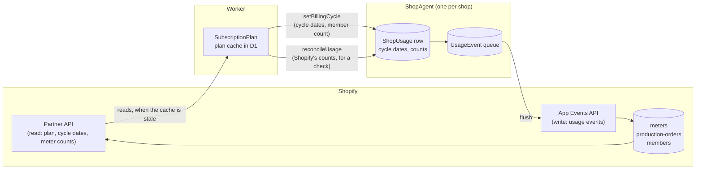
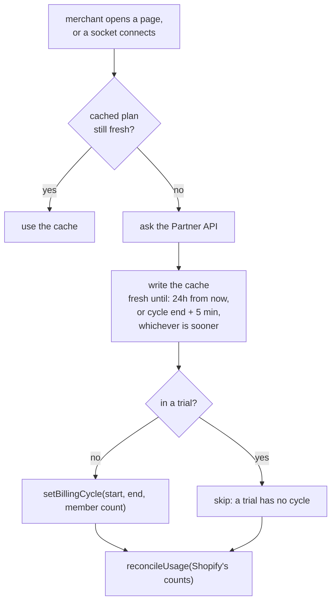
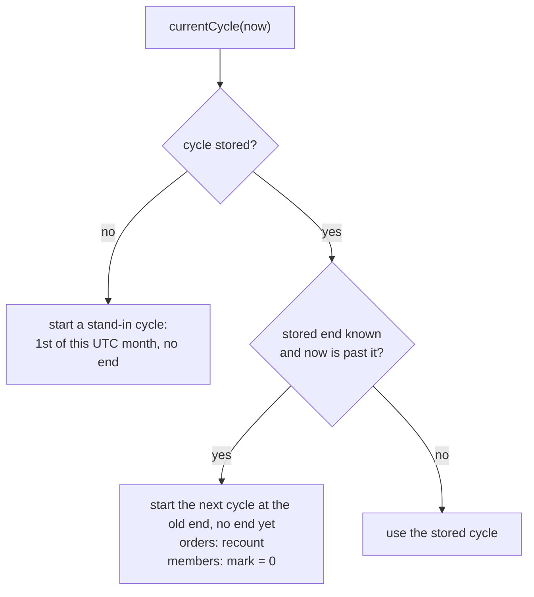
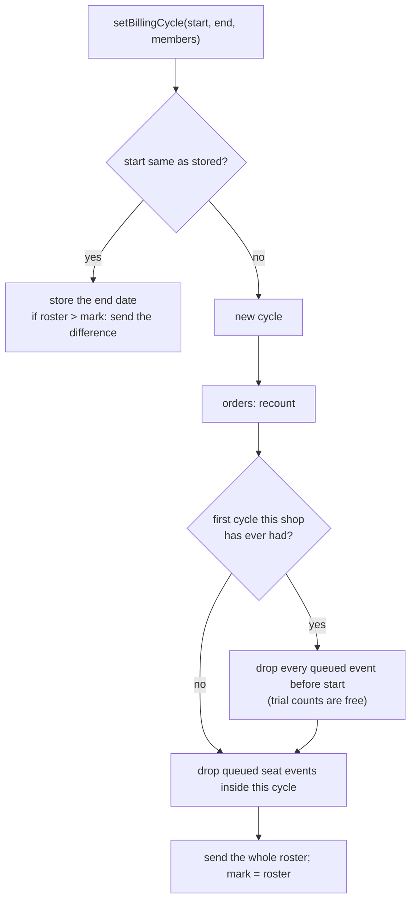
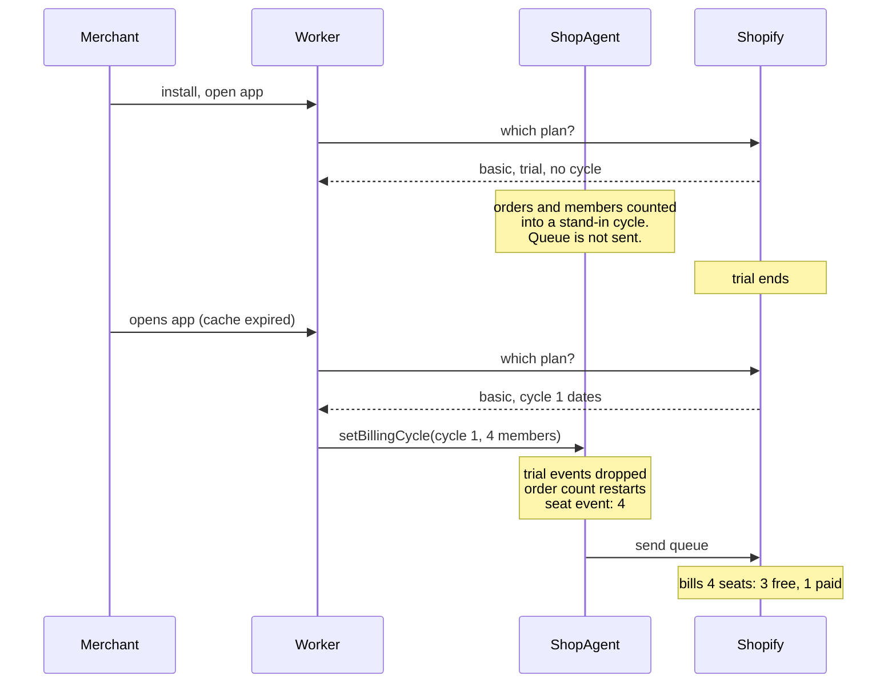
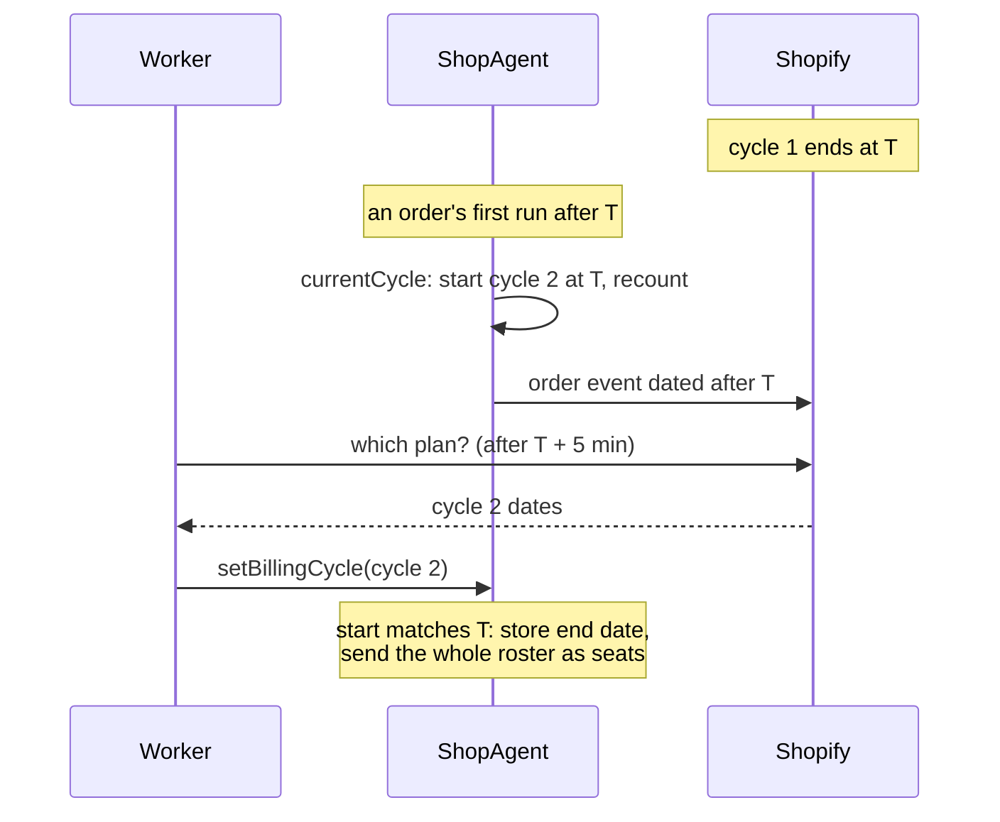

# Usage metering: how Baton counts and bills orders and members

## The short version

Shopify bills the merchant. Baton only tells Shopify how many units the shop used.

- **Orders.** An order is one unit the first time Baton starts a run for it. Never more, never
  taken back.
- **Members.** Each billing cycle, the unit count is the highest number of members the shop had
  during that cycle. Removing a member does not lower it.

Each plan includes some units for free (Basic: 20 orders, 3 members; Pro: 30 orders, 10
members). Shopify applies that allowance and prices the rest. Baton sends every unit and never
does the math.

## Words used below

| word             | meaning                                                                                              |
| ---------------- | ---------------------------------------------------------------------------------------------------- |
| app subscription | one shop's purchase of a plan, as Shopify reports it. A shop has one or none.                        |
| billing cycle    | one month of an app subscription. Counts start at zero each cycle. Screens call it "billing period". |
| trial            | the 14 days before Basic's first billing cycle. Nothing is billed.                                   |
| meter            | a counter Shopify keeps per app subscription. Baton has two: `production-orders` and `members`.      |
| usage event      | one message from Baton to Shopify: "add N to this meter". Kept in a queue until Shopify accepts it.  |
| counted order    | an order Baton has started a run for, and so reported. Marked by `ShopOrder.countedAt`.              |
| seat             | one unit on the `members` meter.                                                                     |

## Who does what



1. The **Worker** asks Shopify which plan the shop has and which cycle it is in.
2. It passes the cycle dates to the shop's **Durable Object**.
3. The Durable Object counts orders and members, puts a usage event in its queue for each unit,
   and sends the queue to Shopify.

## When Baton learns a new cycle has started

Shopify never tells Baton. Baton has to ask. It asks when the cached plan is stale and someone
opens the app or connects a socket (merchant or member).



Two more things force a fresh read: Shopify's redirect back after the merchant picks a plan
(the URL carries `plan_handle`), and the Manage plan button (it shortens the cache to 15 min).

Because the cache always expires 5 minutes after the cycle end, the first page load after that
reads the new cycle. A member's page load or socket connect counts too, so a shop whose members
work every day re-reads at least daily.

**If nobody opens anything, Baton never re-reads.** That can happen: webhooks keep arriving and
reconcile keeps starting runs with no person involved. Then:

- **Orders are still billed correctly.** Each order event is one unit dated when it was
  counted, and Shopify puts it in whatever cycle is open at Shopify.
- **Baton's own order count goes wrong.** The Durable Object starts cycle 2 by itself at the
  old end date (next section), but it does not know cycle 2's end, so it never starts cycle 3.
  From then on the count keeps growing across months. The home page shows it too high, and at
  100 the order ceiling refuses new orders it should not.
- **Members go unbilled.** The roster for a new cycle is sent only by `setBillingCycle` or a
  member add. With neither, Shopify's `members` meter stays at zero for that cycle.

See question 1.

## Counting an order: call tree

```
RunRepository.insertRun                     one run created (reconcile, attach, change workflow)
└─ OrderRepository.countOrder(orderId, now)
   ├─ seeded order? → stop
   ├─ currentCycle(now)                      which cycle is this? (see below)
   ├─ update ShopOrder set countedAt = now
   │    where id = orderId and countedAt is null
   │  └─ no row changed? → stop              already counted: nothing else happens
   ├─ ShopUsage.ordersThisCycle += 1
   └─ queue usage event
        key   = "<orderId>#count"
        meter = production-orders, value = 1, dated now
```

All of this runs in one transaction with the run insert. Either all of it happens or none.

"Reconcile, attach, change workflow" are the three ways a run is created. Reconcile is Baton
matching an item to a workflow by its tag. **Attach** is the merchant pressing Attach on an
item on the order page to give it a workflow by hand. Change workflow replaces an item's run,
and its order is almost always counted already, so it adds nothing.

`seeded order? → stop` exists for local development only: see question 2.

## Adding a member: call tree

```
addMemberFn (the members page)
├─ Repository.addMember                      D1 roster
├─ Repository.countMembers → size
└─ ShopAgent.recordRoster(size)
   ├─ OrderRepository.recordRoster
   │  ├─ currentCycle(now)
   │  └─ raiseSeatMark
   │     ├─ size <= membersHighWater? → stop
   │     ├─ membersHighWater = size
   │     └─ queue usage event
   │          key   = "seat#<cycleStart>#<size>"
   │          meter = members, value = size − old mark
   └─ flush the queue
```

Removing a member calls nothing. The count for the cycle stays where it was.

**The mark** (`membersHighWater`) is the highest roster size so far this cycle, which is the
number of seats Shopify has been told about. Baton only ever sends the difference when the
roster goes above it:

| step         | roster | mark before | sent to Shopify | mark after | Shopify's meter |
| ------------ | ------ | ----------- | --------------- | ---------- | --------------- |
| cycle starts | 3      | 0           | 3               | 3          | 3               |
| add Ann      | 4      | 3           | 1               | 4          | 4               |
| remove Bo    | 3      | 4           | nothing         | 4          | 4               |
| add Cy       | 4      | 4           | nothing         | 4          | 4               |
| add Di       | 5      | 4           | 1               | 5          | 5               |

On Basic (3 seats included), this cycle bills 2 seats.

## Which cycle a count lands in

`currentCycle` runs before every count. It lets the Durable Object move to a new cycle by itself,
without waiting for the Worker.



The Worker's next `setBillingCycle` fills in Shopify's real dates.

**Recount.** `ordersThisCycle` is a stored number. When a cycle starts, Baton does not set it
to 0. It counts the orders whose `countedAt` falls on or after the new cycle's start. Setting
it to 0 would lose orders already counted in the new cycle before Baton knew the cycle had
started. Example: cycle 2 starts at midnight, and Baton learns of it at 9:00. Orders counted
between midnight and 9:00 are in cycle 2, and Shopify has billed them in cycle 2. The recount
finds them, so the home page agrees with the bill. Orders counted before midnight belong to
cycle 1 and drop out.

## What `setBillingCycle` does



- **Same start** is the ordinary case: every re-read during a cycle. The roster can be above the
  mark when a member add failed to reach the Durable Object. This sends the missed seats.
- **Send the whole roster.** Shopify's `members` meter starts every cycle at 0. So at a new
  cycle Baton sends one event with the current roster size, say 4, and sets the mark to 4.
  Shopify prices it: on Basic, 3 free and 1 paid.

## Timelines

### Basic with a trial



### The monthly roll



Either step can happen first. Events from cycle 1 still in the queue at T are never sent (see
the next section).

## Never billing twice, never losing a unit

| guard                                                 | stops                                                       |
| ----------------------------------------------------- | ----------------------------------------------------------- |
| webhook delivery id stored                            | a repeated webhook doing anything twice                     |
| `countedAt is null` in the update                     | a second run on an order counting again                     |
| queue key is the primary key (`insert or ignore`)     | the same event queued twice                                 |
| Shopify keeps every key forever                       | an event sent twice being billed twice                      |
| a queue row is deleted only after Shopify answers 2xx | an event lost because a send failed                         |
| an expired order is never stored again                | an order coming back without `countedAt` and counting again |

An event dated before the current cycle can never be sent: Shopify refuses timestamps outside the
open cycle. Baton keeps it in the queue, marked dead, and shows the count on the admin shop page.
Nothing ever deletes a dead event, so they pile up without limit. There should be few (one per
order that missed its cycle), but nothing bounds them. See question 3.

Each revalidation compares Shopify's meter counts with Baton's and logs a warning when they
differ by more than what is still queued. That log is the only check that Shopify billed what
Baton sent: the App Events API answers 202 even to an event it later ignores.

## Problems found

1. **No glossary words for any of this.** "Cycle", "seat", "meter", "usage event", "trial" and
   "included" are used across the code and defined nowhere.
2. **Attach does not send its event.** When the merchant presses Attach, the order's event is
   queued but not sent. It waits for the next webhook, import, member add or page load. Near the
   end of a cycle on a quiet shop, it can miss the cycle and go unbilled.
3. **Resolved: no problem.** The seat logic assumes a billing cycle starts where the previous
   one ended. Monthly cycles do; a plan switch starts a new app subscription with its meter at zero,
   where sending the roster again is correct. The spec states the assumption.
4. **Order events are lost at a plan switch** if they were still queued when the merchant
   switched.
5. **The Members tile can differ from the bill.** It shows today's roster ("5 members, 3
   included") and nothing about seats billed. The bill is the cycle's mark. They differ only
   after a member is removed during the cycle.
6. **Resolved: no change.** Trial orders count toward the 100-order ceiling. The ceiling is
   provisional and will rise. A trial shop that reaches it has new orders refused and sees the
   banner; the first billing cycle recounts the trial orders out and clears the refusal, and
   Import open orders brings back what is still open.
7. **A shop nobody opens stops rolling its cycle** (see "When Baton learns a new cycle has
   started"): the order count grows across months and the members meter is never sent.
8. **Dead events are never deleted.**

## What the spec could look like

Same form as `runActions`: a table in JSDoc, parsed by `pnpm spec check`, each row naming the
test that pins it. One table of triggers:

| trigger                        | order count | member mark | queue                        | pinned by                                                                               |
| ------------------------------ | ----------- | ----------- | ---------------------------- | --------------------------------------------------------------------------------------- |
| first run on an order          | +1          | —           | +1 order event               | an order is counted once, when its first run is created                                 |
| another run on a counted order | —           | —           | —                            | a re-sync never queues a second count                                                   |
| member added, above the mark   | —           | → roster    | +1 seat event (the rise)     | an add past the high-water mark queues one seat event and raises the mark               |
| member removed                 | —           | —           | —                            | (none yet)                                                                              |
| first count past the cycle end | recounted   | → 0         | —                            | rolls the cycle forward on the first order past its end                                 |
| new cycle pushed               | recounted   | → roster    | +1 seat event (whole roster) | a new cycle resets the mark to the roster and queues it as the cycle's first seat event |
| first cycle after a trial      | recounted   | → roster    | trial events dropped         | the first billing cycle discards events queued before the shop could be addressed       |
| queue sent, Shopify says 2xx   | —           | —           | row deleted                  | flush deletes accepted events and keeps refused ones with the error                     |

Most rows already have a test in `test/integration/order-repository.test.ts`.

## Decisions

No open questions remain.

1. The triggers table lives on `ShopUsage` in `Domain.ts`, parsed by `pnpm spec check`, each row
   naming the test that pins it.
2. Glossary rows are added for `plan`, `app subscription`, `billing cycle`, `trial`, `meter`, `usage event`,
   `counted order` and `seat` (screen: "members").
3. "Billing cycle" is the word everywhere, screens included; "billing period" is retired. The copy
   change starts at the glossary row.
4. `ActiveSubscription` is renamed `AppSubscription` (Shopify's own type name; `Domain.Subscription`
   is already the socket's live-query subscription), and "contract" becomes "app subscription" in
   the JSDoc.
5. A daily Cloudflare cron trigger in the Worker re-reads every shop whose cached plan is stale
   (problem 7), through `SubscriptionPlan.refresh`.
6. The seed writes `countedAt` on its own orders, dated before any cycle, and `countOrder` loses
   its seed check.
7. The retention sweep deletes dead events older than 60 days (problem 8). Sixty days covers the
   cycle an event died in and the next, and each failed send is also logged when it happens.
8. The queue is sent after Attach and on the Manage plan click (problems 2 and 4).
9. The Members tile stays as it is. Its JSDoc says it shows the roster, not the billed seats.
10. Order of work: glossary and triggers table first, no behaviour change. Then each fix as its
    own change, starting at its table row.
11. The spec states the assumption the seat logic relies on: a billing cycle starts where the
    previous one ended.
12. Trial orders keep counting toward the order ceiling; the spec says so as a decision.
