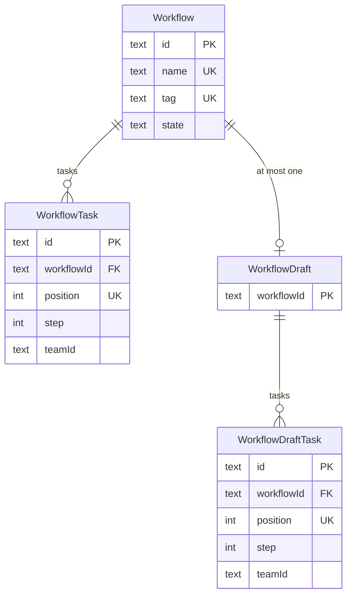
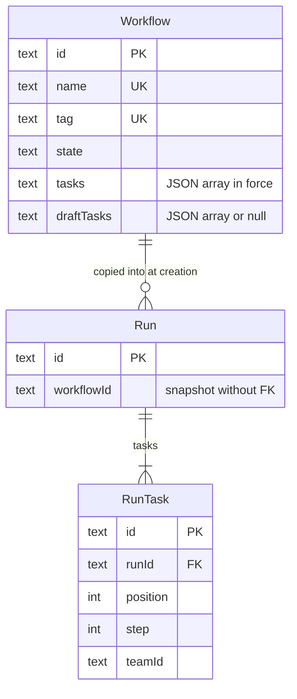
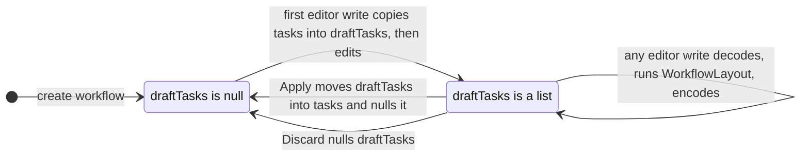
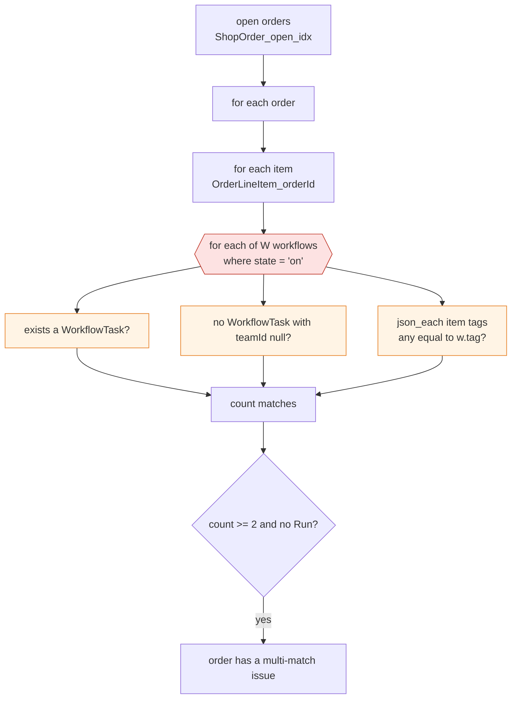
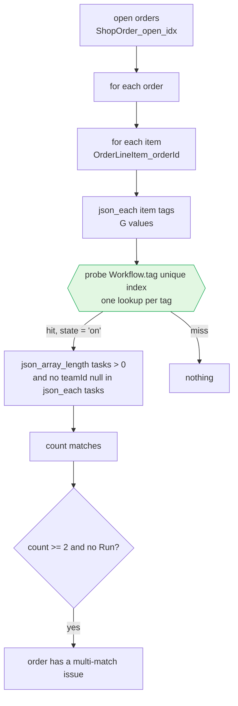
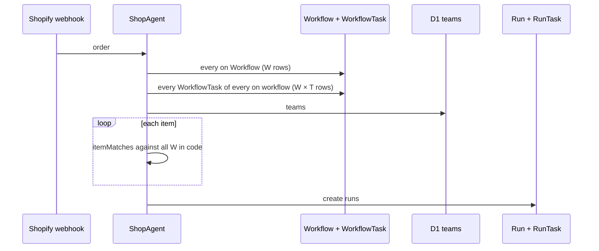
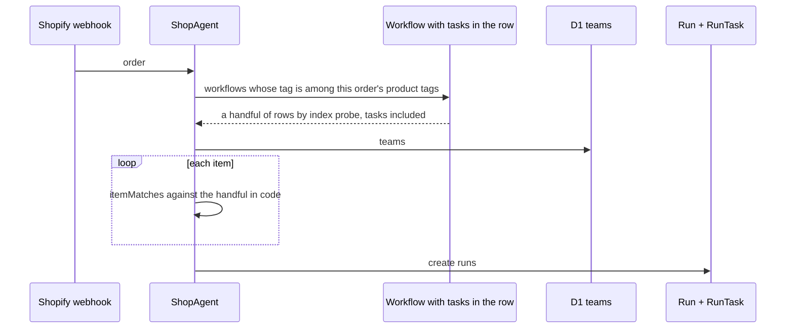
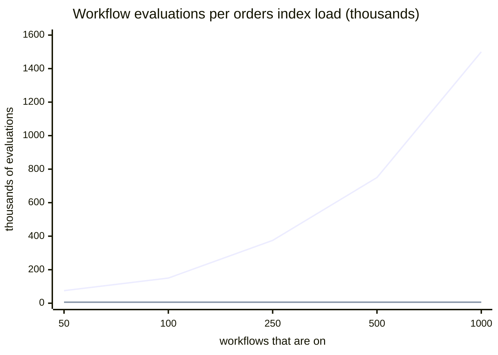

# How to store a workflow's tasks and its draft

Written 2026-10-03. The question: a workflow definition and its draft are the same kind of thing,
a list of tasks in steps, and today they live in two pairs of tables (`Workflow` / `WorkflowTask`
and `WorkflowDraft` / `WorkflowDraftTask`). Is that the right shape, from first principles, for a
codebase that wants to be simple to write and hard to get wrong? Refactoring cost is not a factor:
we are prototyping and can reset every store. Runs are out of scope except where the definition
feeds them.

Recommendation, short form: store each task list as one JSON column on the `Workflow` row,
`tasks` for what is in force and `draftTasks` for the draft, and drop all four task tables. In the
same change, make every read that looks for a workflow find it by its tag, which is unique and
indexed, instead of scanning every workflow per item; the orders index and run creation do that
scan today and it is the real performance problem, independent of storage. The rest of this doc is
the argument, the alternatives, the reads laid out, and the questions.

## What exists today

Four tables in the Durable Object (`initializeSchema`, `src/lib/ShopAgentSchema.ts`):

| table               | key                                   | holds                                               |
| ------------------- | ------------------------------------- | --------------------------------------------------- |
| `Workflow`          | `id`                                  | name, tag, `state` (on / off), `updatedAt`          |
| `WorkflowTask`      | `id`; unique `(workflowId, position)` | position, step, name, teamId, instructions          |
| `WorkflowDraft`     | `workflowId`                          | `updatedAt` only; its existence is "a draft exists" |
| `WorkflowDraftTask` | `id`; unique `(workflowId, position)` | the same columns as `WorkflowTask`                  |

The two task tables have the same shape, and the DDL comment gives the reason for two tables: "a
task-id write can never be ambiguous about its side, and unique (workflowId, position) holds on
each side independently."

How the verbs use them (`src/lib/WorkflowRepository.ts`):

- **Edit** is implicit. Opening the editor writes nothing. The first change calls `ensureDraft`,
  which inserts a `WorkflowDraft` row and copies every `WorkflowTask` into `WorkflowDraftTask`
  **under the same id**. So the id the editor sent for a workflow task names the draft's copy a
  moment later, and `requireEditableTask` looks in the draft first and the workflow second.
- **Every editor write** (`addStep`, `addTask`, `updateTask`, `moveTask`, `joinTask`,
  `separateTask`, `removeTask`) lands on `WorkflowDraftTask`. Layout edits read the draft's
  `(id, position, step)` rows, run a pure `WorkflowLayout` function over the whole list, and write
  the whole list back. Because of `unique (workflowId, position)`, `writeLayout` first parks every
  row at `-position`, then assigns final positions; `position` therefore has no `>= 1` check.
- **Apply** (`promoteDraft`) deletes the workflow's tasks, `insert ... select`s the draft's tasks
  into `WorkflowTask` with their ids, bumps `Workflow.updatedAt`, deletes the draft. Refuses no
  draft, an empty draft, an unassigned task.
- **Discard** deletes the `WorkflowDraft` row; the tasks cascade.
- **Run creation** reads `WorkflowTask` through `listOnWorkflowDetails` and copies into `RunTask`.
  Nothing on that path names a draft table.

Where two tables cost something today, every site that must remember there are two:

| site                                        | what it does twice                                                         |
| ------------------------------------------- | -------------------------------------------------------------------------- |
| `ensureDraft`                               | copies rows table to table, preserving ids                                 |
| `requireEditableTask`, `getTask`            | look in the draft table, then the workflow table                           |
| `promoteDraft`                              | delete, insert-select, delete                                              |
| `writeLayout`                               | parks at `-position` to get round the unique index                         |
| `listTeamWorkflows`, `listAllTeamWorkflows` | `union` over both task tables for the team page and the teams index        |
| `unassignTeam`                              | three updates (both task tables plus `RunTask`)                            |
| `teamIdsInUse`                              | `union` over three tables                                                  |
| `replaceWorkflows` (seed)                   | `writeTasks` parameterised by table name                                   |
| `getWorkflow`                               | four selects                                                               |
| the data-model table                        | two `draft` rows, one `step` row that says "the draft obeys the same rule" |

The DDL's stated reason has partly eroded: the ids **are** shared between the two tables (that is
the point of `ensureDraft`), so a task id is ambiguous about its side whenever a draft exists, and
`requireEditableTask` is the code that resolves it. The reason that still stands is the second one:
the position uniqueness is per side.

## First principles

**What a definition is.** A workflow's tasks are one value: an ordered list, grouped into steps,
that is only ever read whole and only ever written whole. Run creation copies the whole list. The
editor's every layout operation already reads the whole list, transforms it in `WorkflowLayout`,
and writes the whole list. The list is bounded, at most `WorkflowLimits.maxTasks` (20) tasks, and a
shop has at most `maxWorkflows` (50) workflows: a thousand tasks in the worst shop, a few hundred
kilobytes. Nothing queries tasks of a definition by anything but the workflow, except the team
pointer (next paragraph). A thing read whole, written whole, small and bounded, is a document, not
a set of rows.

**What a draft is.** The draft is a second value of the same type, attached to the workflow, that
exists from the first edit until Apply or Discard. Its one job is to let a merchant edit without
the definition in force changing underneath open orders, and to let them throw the edit away. The
vocabulary says "one or none". A second value of the same type that is one-or-none is a nullable
field, not a second entity.

**Who reads what.** Run creation reads the definition in force and must never see the draft. The
editor reads the draft when there is one and the definition otherwise, and writes the draft. The
workflow page reads both to show a Draft badge. The team page and the teams index ask "which
workflows use this team", counting drafts. A team delete nulls the pointer in both and in run
tasks. That is the whole list.

**What must stay true.** From the data-model table and the JSDoc on `Workflow`:

1. A run starting between two edits sees one whole definition. Apply is one transaction.
2. No history: what is replaced is gone.
3. No unsaved state anywhere: every edit is on the server at once.
4. Opening the editor writes nothing; the first change creates the draft.
5. A task keeps its id from the workflow into the draft and back, so the editor can edit a task it
   is looking at before any draft exists, and so the task it is editing is the same task after
   Apply.
6. Steps are dense from 1 and non-decreasing along position; a step has one or more tasks.
7. A team delete leaves every pointer null, in the definition, the draft and the runs.
8. Apply and Turn on refuse an empty definition and an unassigned task.

Rule 5 is the one that shapes the answer most, so it is worth asking whether it is a rule at all or
only how the code grew. It is the latter. Nothing in the product needs a task to keep its id across
Edit and Apply. The shared id exists because of rule 4 (opening the editor writes nothing): with no
draft yet, the editor is looking at the workflow's tasks and the only handle it has for "change this
task" is the id of a workflow task; copying under the same id was the cheapest way to make that
handle keep working a moment later. Two other designs honour rule 4 without it: the client creates
the draft lazily before its first write (two round trips, once), or the editor addresses a task by
`(workflowId, position)` and never by id. The second is worse: a stale tab that says "remove
position 3" removes whatever is at position 3 now, where a stale id fails as `TaskNotFoundError`.
So the question is not whether ids must survive the copy but whether tasks need ids at all, and the
answer is yes, as the cheap guard against a stale tab and as the React key, and for nothing else. The
weight rule 5 carries in the options below is therefore "how much code does each design spend
giving a task an identity", not "which designs are allowed". D spends none: the id is a string in
the document, so copying the document copies it. That is the simplification you are asking about,
and it falls out of D rather than needing to be designed.

**What the schema can hold and what it cannot.** Today's schema holds "at most one draft" (the
primary key on `WorkflowDraft`), "a task is in exactly one workflow", and "positions are unique per
side". It cannot hold "steps are dense from 1" or "a step has one or more tasks" (both `app`), and
the position uniqueness it does hold is the thing that makes `writeLayout` park rows. The strongest
form of a rule is not a constraint the database checks; it is a representation in which the
violation cannot be written. An array has no gaps in its indexes.

## Options

### A. Two table pairs (today)

Described above. Correct, tested, and every rule has a home. The cost is the table of sites above:
ten places that know about two tables, a shared-id convention that the schema cannot express, a
parking trick in `writeLayout`, and a fifth of the repository's lines spent moving rows between
tables that mean the same thing.

### B. One task table with a side column

`WorkflowTask (id, workflowId, side check (side in ('workflow', 'draft')), position, step, ...)`,
unique `(workflowId, side, position)`, with `WorkflowDraft` kept for existence or replaced by
`Workflow.draftUpdatedAt`.

This fails rule 5 or the primary key: the same id cannot be on both sides under `id text primary
key`. Either the key becomes `(id, side)` and every task write takes two keys, or the ids diverge
and the editor is handed new ids on first change. And it adds a hazard the two tables did not have:
every read of the definition in force must say `where side = 'workflow'`, and the one that forgets
feeds the draft to run creation. The two-table design made that mistake a compile-time one (a
different table name); B makes it a runtime one. B is the current design with its one real safety
removed. Rejected.

### C. Task sets with two pointers

```
Workflow (id, ..., tasksId references WorkflowTaskSet, draftId references WorkflowTaskSet)
WorkflowTaskSet (id, workflowId, updatedAt)
WorkflowTask (id, setId references WorkflowTaskSet on delete cascade, position, step, ...)
```

One task table, no side column. Apply: `draftId` becomes `tasksId`, the old set is deleted and its
tasks cascade. Discard: delete the draft set. Edit: copy the in-force set to a new set, point
`draftId` at it. Run creation joins through `tasksId` and cannot reach the draft by accident,
because the draft is a different set, not a different flag.

This is a clean relational answer and it is what a database person would draw. Its problems are
rule 5 and the vocabulary. Copying a set gives the copies new ids (same primary key problem as B),
so the editor's first change on a never-drafted workflow must either be two round trips (create the
draft, get the new ids, then edit) or return a task the client was not holding. And the word for a
`WorkflowTaskSet` row in ordinary speech is "version", which the JSDoc on `Workflow` lists as a
word Baton does not use, because a version table is a history table waiting to happen. It is also
still three tables, a cascade, two nullable pointers that must be kept consistent, and a parking
trick in `writeLayout` (the unique index moves to `(setId, position)` and the problem comes with
it). C is better than A and worse than D.

### D. One row, two JSON columns

```
create table if not exists Workflow (
  id text primary key,
  name text not null unique check (...),
  tag text not null unique check (...),
  state text not null check (state in ('on', 'off')),
  -- The definition in force: a JSON array of tasks in position order, each
  -- {id, step, name, teamId, instructions}. What run creation copies.
  tasks text not null default '[]',
  -- The draft: null when there is none; the same shape otherwise.
  draftTasks text,
  updatedAt integer not null
);
```

`WorkflowTask`, `WorkflowDraft`, `WorkflowDraftTask` and their indexes go. The verbs:

| verb             | SQL                                                                                                                                                    |
| ---------------- | ------------------------------------------------------------------------------------------------------------------------------------------------------ |
| first edit       | `update Workflow set draftTasks = tasks where id = ? and draftTasks is null`, then the edit                                                            |
| any editor write | read `draftTasks`, decode, transform with `WorkflowLayout`, encode, `update Workflow set draftTasks = ?`                                               |
| Apply            | `update Workflow set tasks = draftTasks, draftTasks = null, updatedAt = ? where id = ?`                                                                |
| Discard          | `update Workflow set draftTasks = null, updatedAt = ? where id = ?`                                                                                    |
| run creation     | `select * from Workflow where state = 'on'`; decode `tasks`                                                                                            |
| team "Used by"   | `select id, name from Workflow where exists (select 1 from json_each(tasks) where json_extract(value, '$.teamId') = ?) or exists (... draftTasks ...)` |
| team delete      | read every workflow, null the pointer in both arrays in code, write back; or `json_set` per row                                                        |
| seed             | one insert per workflow                                                                                                                                |

What each rule becomes:

1. One transaction: Apply is one statement. Trivially atomic.
2. No history: the old `tasks` value is overwritten.
3. No unsaved state: unchanged.
4. Opening writes nothing: unchanged. The first change is `coalesce(draftTasks, tasks)`.
5. Task ids carry across: free. The id is a string inside the document, so the copy on first edit
   and the carry-over on Apply preserve it with no convention to remember and no shared-key trick.
6. Dense steps, one or more tasks per step: `position` disappears from storage. The array index is
   the position, and it cannot have a gap. `step` stays, and `WorkflowLayout.normalize` already
   makes it dense on every write; the Effect `Schema` for the array checks it on every read and
   write, so a bad document cannot enter. The `writeLayout` parking trick and the missing
   `position >= 1` check both disappear, because there is no unique index to collide with.
7. Team delete: one loop over every workflow row in one transaction, plus the `RunTask` update.
   The same code nulls both arrays, so the two cannot drift.
8. Apply refusals: unchanged; they are already computed in code from the decoded list.

What it costs:

- **Rules move from `schema` to `app`.** Today's `schema` rows for the draft ("at most one draft;
  the draft holds tasks only") become `app`, or vanish because the representation makes them
  meaningless (a nullable column is at most one by nature). The `step >= 1` and non-empty `name`
  checks move into the `Schema` decoder. The data-model table's discipline is intact: the rows say
  `app` and name the test through the write path. This is the trade the doc asks you to weigh: a
  constraint the database checks versus a representation that has nothing to check.
- **SQL cannot see into a task without `json_each`.** The queries that look inside are the team
  ones and the eligibility checks in the orders index, and `json_each` is already the pattern in
  `OrderRepository` for product tags. Once a workflow is found by its tag, the list it opens is at
  most `maxTasks` long, so there is nothing inside a task worth an index (the performance section).
- **A document column is opaque in the console.** `select * from Workflow` shows JSON. Today it
  shows JSON for `productTags`, `properties` and `blockedBy` too, so the pattern is established.
- **Size.** A Durable Object row is capped at 2 MB (`refs/cloudflare-docs`, Durable Objects
  limits). Twenty tasks with the longest allowed instructions are well under a hundred kilobytes.

What else simplifies: `WorkflowDraftTask`, `WorkflowDraftTasks`, `WorkflowWithDraft`,
`WorkflowDraftDetail` and the `draft.draft` nesting in `WorkflowPageData` collapse to `tasks` and
`draftTasks: Array | null` on one shape. `ensureDraft`, `requireEditableTask`, `insertDraftTaskRow`,
`writeLayout`, `layoutOf`, `relayout`, `insertTask` and `promoteDraft` become a single
`editDraft(workflowId, f: (tasks) => tasks)` helper and a handful of one-statement updates. The
repository shrinks by roughly half. `WorkflowLayout` is unchanged; it was already written for this.

### E. D, with the draft derived instead of stored

Same two columns, but the editor always writes `tasks` and Apply snapshots it into `appliedTasks`
(null until the first Apply). Run creation reads `appliedTasks`. "A draft exists" is derived:
`tasks` differs from `appliedTasks`. Discard is `tasks = coalesce(appliedTasks, '[]')`.

Fewer states than D (there is no "draft exists but equals the definition", and an edit undone by
hand makes the Draft badge go away, which is right), and nothing to keep in step. Against it: it
changes the vocabulary row for draft from "the workflow's edited copy, from Edit until Apply or
Discard" to "the tasks, when they differ from what is applied"; the Draft badge needs a structural
comparison of two decoded arrays on every workflow page read; and the column the editor writes is
no longer called draft, which puts the hazard of B back in a smaller form: the hot path must read
`appliedTasks`, and `tasks` is the attractive wrong name. D keeps today's words exactly. E is
offered as a question, not the recommendation.

## Comparison

| property                                   | A today             | B side column       | C task sets            | D two JSON columns         | E derived draft      |
| ------------------------------------------ | ------------------- | ------------------- | ---------------------- | -------------------------- | -------------------- |
| tables for definitions                     | 4                   | 3                   | 3                      | 1                          | 1                    |
| task id stable across Edit and Apply       | by convention       | no, or compound key | no                     | by construction            | by construction      |
| run creation can read the draft by mistake | different table     | forgotten `where`   | different set          | different column           | different column     |
| dense steps held by                        | app                 | app                 | app                    | representation + app       | representation + app |
| at most one draft held by                  | schema              | schema              | schema                 | representation             | representation       |
| Apply                                      | 3 statements        | 3 statements        | 2 statements + cascade | 1 statement                | 1 statement          |
| layout write                               | park, then renumber | same                | same                   | encode array               | encode array         |
| sites that know about two sides            | 10                  | every query         | 2 pointers             | 2 columns, named           | 2 columns, named     |
| team "Used by" query                       | union of 2          | 1 table             | 1 table via join       | `json_each` over 2 columns | same as D            |
| console readability                        | rows                | rows                | rows                   | JSON                       | JSON                 |

## Recommendation

**D.** Store `tasks` and `draftTasks` as JSON on the `Workflow` row, drop the four task tables,
keep `RunTask` as rows. Reasons, in order of weight:

1. It matches what the thing is. A definition is read whole, written whole, bounded and small; the
   editor already treats it as a whole value through `WorkflowLayout`. The tables were a projection
   of a document into rows, and every one of the ten sites above is the cost of projecting it back.
2. It makes rule 5 free. The id-sharing convention, the two-table lookup and the carry-over on
   Apply were all the price of giving a task one identity across two tables. Inside one document
   that identity needs no code.
3. It turns the hardest `app` rule into a non-rule. Positions cannot have gaps in an array. The
   parking trick, the missing check, and the "the draft obeys the same rule at every write" clause
   go away because there is nothing to obey.
4. It keeps the vocabulary. "draft: one or none" is `draftTasks is null`. Every verb row in the
   vocabulary stays as written. The only word that changes meaning is `position`, which stops being
   stored and becomes the array index, so the `step` noun row's symbol cell changes.
5. It is the established pattern. `productTags`, `properties` and `blockedBy` are already JSON
   columns read through `Schema` and queried with `json_each`.

Keep `RunTask` as rows. A run task is acted on singly, has its own state columns and consistency
checks, and the member's workflows list filters it by team through `RunTask_teamId_idx` across
every open run in the shop. That is row-shaped work; a definition is not. The asymmetry is the
point: the definition is copied into rows at the moment it becomes work.

### Performance: every read of a definition, and what it costs

This section was rewritten after the first review. The first draft said the only scan D makes
worse is the team page's "Used by", opened occasionally. That was wrong about where the hot path
is. The reads below are what the code does today, found by following every caller of
`listOnWorkflowDetails` and every SQL fragment that names `Workflow` or `WorkflowTask`. `W` is the
number of workflows that are on, `T` the tasks per workflow, `N` the shop's open items (open paid
orders times items per order), `G` the product tags on an item.

| read                                                                        | when it runs                                                         | how it reads workflows today                                                                                                                                                                   | cost today                                             |
| --------------------------------------------------------------------------- | -------------------------------------------------------------------- | ---------------------------------------------------------------------------------------------------------------------------------------------------------------------------------------------- | ------------------------------------------------------ |
| orders index counts (`OrderRepository.listOrders`)                          | every orders index load and every socket push, so every order change | `MULTI_MATCH` is correlated per open order; inside it `ITEM_MATCHES` scans every `Workflow` row per item, with two `WorkflowTask` subqueries and a `json_each` of the item's tags per workflow | `N × W` workflow evaluations, each `O(T)`              |
| orders index page badges (`multiMatchRows`)                                 | same                                                                 | `ITEM_MATCHES` again, for the page's items only                                                                                                                                                | `50 × items × W`                                       |
| run creation (`eligibleContext`)                                            | every order webhook; once per bulk stream; every open-orders sync    | `listOnWorkflowDetails`: every on `Workflow` and every `WorkflowTask` of every on workflow, two statements, then `itemMatches` in code per item against the whole list                         | `W + W × T` rows decoded per webhook, then `items × W` |
| reconcile all (`reconcileAllNow`)                                           | every workflow change: Apply, Turn on, Turn off, delete, retag       | one `eligibleContext`, then `reconcileOrder` per open order against the whole list                                                                                                             | `W × T` once, then `N × W` in code                     |
| the order page (`readOrderDetail`)                                          | every order page load and push                                       | `listOnWorkflowDetails`, filtered to workflows with tasks, sent whole as the options of the Workflow select                                                                                    | `W + W × T` rows, on the wire                          |
| the workflows index (`listWorkflows`)                                       | every load and push                                                  | every `Workflow` row plus `select * from WorkflowTask`, badges derived in code                                                                                                                 | `W + W × T`                                            |
| the teams index and team page (`listAllTeamWorkflows`, `listTeamWorkflows`) | every load                                                           | `union` of both task tables by `teamId`, indexed                                                                                                                                               | indexed                                                |
| team delete (`unassignTeam`)                                                | rare                                                                 | three indexed updates                                                                                                                                                                          | indexed                                                |

Two rows are the problem, and they are the hottest reads in the app. At `W = 50` and a few hundred
open items the orders index counts statement does tens of thousands of workflow evaluations per
load, which SQLite hides; at `W = 1,000` and `N = 1,500` it does 1.5 million, each with two
subqueries, on every order change, and it stops hiding. Run creation decodes 21,000 rows per
webhook. Neither has anything to do with how tasks are stored. They are both the same mistake: the
code starts from the workflows and asks each one "do you match this item", when the item's tags are
known and the workflow's tag is unique and indexed. The fix is to start from the item.

#### How each read becomes indexed

The design rule: **a workflow is found by its tag, never by scanning.** `Workflow.tag` is
`unique`, which is an index. An item carries a few product tags. So "which workflows match this
item" is `G` index probes, whatever `W` is. Every read below is that rule applied.

**Run creation and reconcile.** `eligibleContext` stops loading every on workflow. Per order it
loads the workflows whose tag is one of the order's items' tags:

```sql
select * from Workflow w
where w.state = 'on'
  and w.tag in (
    select tag.value
    from OrderLineItem li, json_each(li.productTags) tag
    where li.orderId = ?
  )
```

The comparison is plain equality, and that is a change from today. Today's SQL twin of
`itemMatches` compares `lower(trim(tag.value)) = w.tag`, and `Domain.WorkflowTag` lowercases the
workflow's tag at input, because an earlier decision chose to match tags the way the Shopify admin's
search does, case-insensitively. That decision does not survive first principles:

- **Shopify's own rule is exact.** A product tag is stored as typed, and `Engraving` and
  `engraving` are two tags on a product (the Flow manual says "Tags are case sensitive" on every tag
  action, `refs/flow-manual/reference/actions/add-product-tags.md`). Flow conditions compare them
  exactly. Only the admin's search box is case-insensitive, and a search box is not a match rule.
  Matching exactly makes Baton agree with the thing a merchant can check: the tag on the product.
- **Baton mints the tag.** The merchant does not invent it on the product and hope; the create
  dialog shows it and the merchant copies it onto the product. The one failure exact matching
  admits, a case typo on the product, shows up as the order under Not started with the workflow in
  the select, where it is fixed with one click, and is the same failure a typo of any other letter
  already produces.
- **Clean data is the boundary's job, not the query's.** The `Schema` already trims the workflow
  tag at input (`Domain.WorkflowTag`), and that stays: a value Baton stores is clean when stored.
  Shopify's admin trims a tag's surrounding whitespace on save, so the product tags arrive clean and
  are stored as sent. Nothing is left for the query to repair, and a string function on a compare
  is a sign that something upstream was not cleaned. Dropping the fold also removes the two "stated
  gaps" the JSDoc on `ITEM_MATCHES` has to carry today, where SQLite's ASCII `lower` and
  TypeScript's Unicode `toLowerCase` disagree on a non-ASCII tag.

So the recommendation is: exact matching everywhere. `Domain.WorkflowTag` trims and stops
lowercasing; the `unique` on `Workflow.tag` is exact, as Shopify's are; `matchesTag` in code and the
SQL above both compare with `=` and no functions; the data-model row that says "the tag trimmed and
case-insensitively, as Shopify's admin treats tags" is rewritten to "compared exactly, as Shopify
stores it". Accepted in the fifth review; it reverses a recorded decision.

The result is the handful of workflows that can match anything on this order; their `tasks` are decoded (under D, in
the same row), and `itemMatches` and `workflowIsEligible` run in code exactly as today, against the
D1 teams. A webhook reads a few rows instead of thousands. A bulk stream of a thousand orders makes
a thousand of these queries instead of one big read; each is a few index probes inside the same
Durable Object, and the stream was already one transaction per order. `reconcileAll` is the same
per order. The `EligibleContext` shape stays; it is built per order instead of per pass, and the
"snapshot that a mid-stream team delete would not refresh" caveat on it goes away.

**The orders index.** `ITEM_MATCHES` is inverted to start from the item's tags:

```sql
(select count(distinct w.id)
 from json_each(li.productTags) tag
 join Workflow w on w.tag = tag.value
 where w.state = 'on'
   and json_array_length(w.tasks) > 0
   and not exists (
     select 1 from json_each(w.tasks) t
     where json_extract(t.value, '$.teamId') is null))
```

Per item: `G` probes of the tag index, and the two eligibility checks run only over the matched
workflows' task lists (at most `T` elements each). The counts statement's cost becomes `N × G`
index probes, independent of `W`. Under A the same inversion works with the two `WorkflowTask`
subqueries kept; under D the subqueries become `json_each` over a list already in the row, so the
matched workflow is one row read with no second table. This is the one place D is faster than A
rather than merely simpler.

Storing the match count on the item instead (reconcile computes it anyway) was considered and does
not help. The probe is already proportional to nothing but the item's own tags, so there is nothing
left for a stored value to save; and a stored count is a derived fact that every item sync and
every workflow change would have to recompute, wrong in the window between a Turn off and its
reconcile. Rejected.

**The order page.** The vocabulary's verbs here are **Attach** (the item has no run; creates one)
and **Change workflow** (the item has a run; replaces it). Both are done through a select labelled
Workflow: at rest under an item with no run, with the Attach button beside it, and inside the
Change workflow modal. The select's options are the workflows whose tag matches the item first,
then every other workflow with tasks after a divider, so a merchant can attach a workflow the
product's tags did not pull in. A multi-match item (two eligible workflows match it, so Baton
created no run) shows the Multiple workflows match issue and the same select, with both matches at
the top.

What the page reads for that today: `listOnWorkflowDetails`, every on workflow and every one of
its tasks, on every page load and every push to this order's subscribers. The tasks are needed for
the matched list (eligibility: has a task, every task on a team) and for nothing else; the "every
other workflow" part needs only names. So the cost is `W + W × T` rows decoded and sent per load
and per push: at fifty workflows about a thousand rows, at a thousand workflows 21,000 rows and a
payload around a megabyte, to fill a select that lists a thousand names.

Is this one worth the worry? Less than the two hot reads. An order page has few subscribers (the
merchant tabs looking at that order), and the pushes that reach it are this order's changes plus
Apply and the on/off switch, which publish to every order page. It is not a scan multiplied by
items. It is a payload that grows with the workflow count, and at the limit you settle on it is
the biggest payload in the app. The fix has two sizes:

- **Query only.** Under D, the matched workflows come from the tag lookup above (`G` probes, tasks
  in the row); the rest of the options come from `select id, name from Workflow where state = 'on'
and json_array_length(tasks) > 0 order by name`, names only. The page sends a handful of
  workflows with tasks and up to a thousand names, about 50 KB at the limit. No screen change.
- **Query and screen.** The select keeps the matched workflows and gains a last option, Other
  workflow, that opens a modal with a search field; the modal queries
  `where name like ? || '%'` over the unique name index and returns a page of names. The page
  sends only the matched workflows. This is the dialog you described; it costs a new modal, its
  copy row, and a second round trip for the uncommon case of attaching an unmatched workflow.

I recommend the first now and the second only if the name list is still too much at the limit you
settle on: a thousand names in a select is poor to use before it is poor to load, and that is a
screen question to take with the workflows index's paging. Accepted in the fifth review.

**The workflows index.** It lists every workflow with badges derived from every task. At a thousand
rows it needs paging and a name search like any Polaris index, and the badges are computed for the
page's rows only: under D, decode the page's fifty `tasks` lists; `stepCount` is
`max(json_extract(value, '$.step'))` over `json_each(tasks)` per page row. Paging is a screen
change too, decided in the third review to be part of this work, and the per-page badge read needs no decision.

**The teams index and team page.** "Used by" loses its index under D and becomes `json_each` over
`tasks` and `draftTasks` of every row: `W × T` JSON values, 20,000 at the limit, in process, on a
page that is not pushed on order changes. Low single-digit milliseconds. If the teams index ever
pages, the count moves to the page's rows; nothing stored.

**Team delete.** Read every row, null the pointer in code, write back, in one transaction. A
thousand rows, rare.

After the change, the cost table reads: orders index `N × G` probes; run creation `G` probes per
item; order page `G` probes plus a search; workflows index one page; teams index one scan of
`W × T` JSON values; team delete one pass. Nothing is proportional to `W` on a path an order
change triggers.

#### The counts themselves

The orders index's strip shows five numbers, and the counts statement is what the hot path pays for
beyond the page of fifty orders. Whether the screen needs them is a fair question, so here is what
each one costs after the fix, over `O` open paid orders with `R` runs and `N` items between them:

| count       | what it is                                               | how it is read after the fix                                                                                         | cost            |
| ----------- | -------------------------------------------------------- | -------------------------------------------------------------------------------------------------------------------- | --------------- |
| Open        | open paid orders                                         | a range over `ShopOrder_open_idx`                                                                                    | `O`             |
| Not started | open orders with no run open or done                     | `run_summary`: the open orders' runs grouped by order through `Run_orderId_idx`                                      | `O + R`         |
| Making      | open orders with an open run                             | same grouped read                                                                                                    | included        |
| Made        | open orders with done runs and none open                 | same grouped read                                                                                                    | included        |
| Issues      | multi-match, or an unassigned run task, or a blocked run | blocked is in `run_summary`; unassigned walks each open run's tasks by `(runId, position)`; multi-match is the probe | `R × T + N × G` |

Everything is bounded by the open orders and what hangs off them, which is also what the screen is
about. At 500 open orders, 1,500 items, 1,500 runs of seven tasks and four tags an item, that is
about 10,000 task rows and 6,000 index probes per load, a few milliseconds in process. Nothing in
the statement reads a row that does not belong to an open order, and nothing grows with the
workflow count or with retained closed orders.

**Does the app need counts at all?** Two screens have a strip of counts: the orders index (Open,
Not started, Making, Made, Issues) and the member's workflows list (Started by you, Started by
others, Ready, Blocked, Done). From first principles, a count answers one question without a
click: how much is waiting, and where. For the merchant that is "how many orders need a decision
from me" (Issues, Not started) and "how much is in the shop" (Making, Made). For a member it is the
length of their queue (Ready) and what they have in hand (Started by you). Take the numbers away and
the strip is a row of filters: the merchant learns there are issues only by clicking Issues, and a
member learns the queue is empty only by clicking Ready. The orders index and the workflows list
are the two screens people keep open all day, and a live number on a filter is the one thing that
makes keeping them open worth anything. So yes: the counts are essential on these two strips, and
the question is only what they cost.

**What they cost, with the push model counted in.** A write publishes an invalidation to every
connection whose subscription it touches; each subscribed client refetches its own page, throttled
to one refetch per two seconds per client (`useSubscribedQuery.ts`). The Durable Object runs the
refetches one at a time. So the cost of one order change is: subscribers × one statement each,
where subscribers is the merchant's open tabs plus the members with their list open, at most
`ShopLimits.maxMembers` (12) plus a few, call it fifteen, and the statement is bounded by the open
orders as the table above says. Fifteen statements of a few milliseconds each is well under a tenth
of a second of SQLite time per change; a burst (a bulk sync) collapses to one refetch per client
per two seconds. That is the honest worst case, and it is small, because it is bounded by two
numbers that are both small for the shops Baton is for: how many people are looking, and how many
orders are open.

**How many orders are open.** `ShopLimits.maxOrdersPerCycle` is 100: past a hundred counted orders
in a billing cycle, Baton stops syncing new ones. It is provisional, and the plan entitlements below
it are `basic` 20 and `pro` 30 included orders a cycle. Where it ends up: Route to Ship's tiers are
25, 250, 1,000 and 5,000 orders a month (`refs/route-to-ship/pricing.md`); a small made-to-order
shop does 20 to 100 orders a month and a medium one 100 to 500. Open orders at once is monthly
volume times lead time, so with two to four weeks at the bench a medium shop holds 50 to 500 open
orders, and the ceiling that fits the target is likely 500 to 1,000 a cycle, five to ten times
today's number. Even at 1,000 open orders with three items each, the counts statement touches
about 20,000 task rows and 12,000 index probes, still milliseconds. The counts stay cheap across
the whole range the product aims at.

**If they ever are not cheap**, the fixes come in this order and none of them removes a number.
First, compute each count once per write and keep it in the object's memory until the next write;
the Durable Object serialises writes, so a cache invalidated on write is trivially right, and every
merchant subscriber gets the same numbers from one statement instead of one each. Second, debounce
the publish on the server so a burst of webhooks yields one invalidation. Third, and only if a
shop outgrows the target, page the counts' inputs. Dropping the counts is not on the list: it is
the one change that makes the screen worse to save a cost that two cheaper changes remove.

I recommend keeping all ten counts, and noting the once-per-write cache as the first lever if a
measurement ever says one is needed.

#### The same reads, drawn

**Data model, before and after.** Four tables become one, and the arrows a query has to follow
to get from an item to a task's team go from four hops to one.





Each element of `tasks` and `draftTasks` is one task: `id`, `step`, `name`, `teamId`,
`instructions`. `position` is the element's index.

**The draft's life under D.** One column, three verbs, no second entity.



Run creation reads `tasks` in both states and never `draftTasks`.

**The orders index counts, today.** For every open order the statement walks every item, and for
every item it walks every on workflow. The red loop is the one that multiplies.



Cost: `N × W` passes through the red box, each with three subqueries. At `W = 1,000` and
`N = 1,500` items, 1.5 million passes per orders index load, and the index is pushed on every
order change.

**The orders index counts, after.** The item's tags drive; each tag is one probe of the unique
index on `Workflow.tag`; the eligibility checks run only on the matched rows.



Cost: `N × G` probes. With four tags on an item, 6,000 probes whatever `W` is. The matched
workflow's task list is in the row the probe returned, so there is no second table to visit.

**Run creation per webhook, today and after.**





**How the cost moves with the workflow count.** Two lines, same statement, before and after the
inversion, with the shop held at 1,500 open items and four product tags an item. The line that
climbs is **today**: the counts statement evaluates every on workflow for every item, so
evaluations = items × workflows, 75,000 at fifty workflows and 1.5 million at a thousand. The flat
line is **after**: the statement probes the tag index once per tag on each item, so evaluations =
items × tags = 6,000, and the workflow count does not enter. Mermaid draws no legend on this chart,
so the table under it carries the same numbers.



| workflows that are on                             | 50     | 100     | 250     | 500     | 1,000     |
| ------------------------------------------------- | ------ | ------- | ------- | ------- | --------- |
| today: scan every workflow per item (evaluations) | 75,000 | 150,000 | 375,000 | 750,000 | 1,500,000 |
| after: probe the tag index per item tag (probes)  | 6,000  | 6,000   | 6,000   | 6,000   | 6,000     |

The same picture holds for run creation, with `W + W × T` rows decoded per webhook today (1,050 at
fifty workflows; 21,000 at a thousand) against a handful after.

#### The workflow limit

`WorkflowLimits.maxWorkflows` is 50 and `maxTasks` is 20, both provisional and both documented as
"raise freely" (`Platform.ts`). Decision from the first review: `maxWorkflows` goes to 1,000 now,
as a guard against a runaway seed and not a product promise. With the reads above indexed by tag,
the number no longer appears in any per-order cost, and it bounds only the two merchant index pages
and the team-delete pass.

#### How many tasks a workflow may have

What a task costs on disk, as JSON in the `tasks` column. The fields and their caps: `id` and
`teamId` are 36-character UUIDs; `name` is `NAME_MAX_LENGTH` 64 characters; `instructions` is 2,000
characters; `step` is a small integer; the keys and quotes are about 60 bytes.

| case                                                            | bytes per task | 20 tasks, both columns full | 25           | 30           | 50           |
| --------------------------------------------------------------- | -------------- | --------------------------- | ------------ | ------------ | ------------ |
| worst: every character 4 bytes of UTF-8, every field at its cap | 8,400          | 336 KB (16% of 2 MB)        | 420 KB (21%) | 504 KB (25%) | 840 KB (42%) |
| realistic worst: 2 bytes per character, every field at its cap  | 4,300          | 172 KB (8%)                 | 215 KB (11%) | 258 KB (13%) | 430 KB (21%) |
| typical: a 20-character name, 200 characters of instructions    | 330            | 13 KB                       | 17 KB        | 20 KB        | 33 KB        |

"Both columns full" is the row with a draft open, since `tasks` and `draftTasks` share the row and
the 2 MB cap is per row. The lever on size is `instructions` at 2,000 characters, not the task
count: halving it halves every cell. At 20 or 25 tasks the worst case is a sixth or a fifth of the
cap with every field pathological; 50 is where the worst case nears half and the design would be
flirting with the limit you said to stay away from.

From the product side. No competitor publishes a ceiling: Kanbanify lists "unlimited custom
stages" and Route to Ship "unlimited departments" (`refs/kanbanify/listing.md`,
`refs/route-to-ship/pricing.md`), so there is no market number to match, and both are kanban
boards where a stage is a column and twenty columns is already unreadable. A made-to-order shop's
real workflows are short: cast, polish, set, engrave, inspect, pack is six; cut, join, sand,
finish, assemble, inspect, pack is seven; pattern, cut, sew, embroider, press, inspect, pack is
seven. Twenty is three times that. The constraints that bite first are not storage but the
screens: the workflow editor's canvas, "Step k of n" on the member's row, and a merchant's ability
to hold the sequence in their head, all of which degrade past a dozen.

Recommendation: keep `maxTasks` at 20. It is three times a long real workflow, the worst-case row
is a sixth of the cap, and nothing in the screens is designed for more. 25 costs nothing technically
(a fifth of the cap in the worst case) and is the number to move to if a merchant asks; 50 is the
number not to reach. The lever on size is `instructions`, taken up in the next section.

#### How long a task's instructions should be

What instructions are in Baton today. `TaskInstructions` (`ShopWork.ts`) is "merchant-written
how-to for a task, copied onto every run", capped at 2,000 characters, the same cap as a run note
and twice a block reason. The merchant writes it in the workflow editor's Instructions field; the
member reads it on the member's workflow page under the task name, as plain `s-text`, no headings,
no lists, no links rendered. The merchant's workflow page shows it subdued under the task. It is
copied into `RunTask.instructions` at run creation, once per task per run.

What it is for. The instructions are per task in the definition, so they are the same for every
item that goes through that task: a jeweller's "Set stones" instructions are identical for every
ring. Anything that varies per order is not here; it is on the item (title, variant, SKU, line
item properties such as the engraving text), which the member's page shows beside the tasks. So the
field's job is the standing reminder for a step: the setting, the standard, the check, the thing
people forget. It is not the procedure. The procedure for a step, with photos and tolerances and
what to do when the casting has a pit, is a document the shop already has or should have, a bench
book or an SOP, and Route to Ship's own writing on SOPs makes the same split: a useful SOP is
"specific, short, and actionable", and it lives in a documented procedure, not in the pipeline
tool (`refs/route-to-ship/blog/sops-for-scaling-custom-shopify-products.md`). Neither Kanbanify
nor Route to Ship exposes a per-stage free-text field at all; Route to Ship's step types are
start/stop, checklist and approval (`refs/route-to-ship/demo.md`). BenchCue's "production
instruction" is the customer's line item properties, not merchant text (`refs/benchcue/index.md`).

What 2,000 characters is. About 300 words, roughly a full phone screen of unbroken text in the
font the member's page uses, with no formatting to break it up. A member at a bench reads it on a
phone or a tablet between picking up the piece and starting; a paragraph that long is skimmed or
skipped, and the thing people forget is buried in it. The cap also multiplies: it is copied onto
every run task, so a twenty-task workflow at the cap writes 40 KB of instructions per run, and a
shop keeping a thousand runs in retention holds 40 MB of repeated text in `RunTask`. None of that
breaks anything, but it is paying for a use the field should not have.

What the sizes look like, worst case (4 bytes per character) for one task and for a twenty-task
workflow with a draft open, and for one run's copied tasks:

| cap   | words, about | one task worst | 20 tasks, both columns | share of the 2 MB row | one run's RunTask copies |
| ----- | ------------ | -------------- | ---------------------- | --------------------- | ------------------------ |
| 2,000 | 300          | 8.4 KB         | 336 KB                 | 16%                   | 40 KB                    |
| 1,000 | 150          | 4.4 KB         | 176 KB                 | 9%                    | 20 KB                    |
| 500   | 75           | 2.4 KB         | 96 KB                  | 5%                    | 10 KB                    |
| 280   | 45           | 1.5 KB         | 60 KB                  | 3%                    | 5.6 KB                   |

Recommendation: **500 characters.** About 75 words, four or five short sentences, half a phone
screen: enough for "Torch at 2. Quench in the pickle, not water. Check the shank for porosity
before polishing. Reference: bench book §4", and not enough for the bench book. It keeps the
worst-case row at a twentieth of the cap, and it tells the merchant what the field is for by its
size, the way a tweet does. 280 is the other defensible number; it is a tighter nudge, but it
makes the fourth sentence a struggle and gains only two points of row headroom. 1,000 keeps the
problem: it is still a wall of text on a phone.

Two things go with the number. The field counts down to the cap, as `RunNote` and `BlockReason`
already do with their exported caps, so a merchant writing the fifth sentence sees why it is
refused. And the editor's help text under the field says what it is for, in the copy table's
voice: "A short reminder for this step. Keep the full procedure in your bench book." A URL in the
text is fine and should stay plain; rendering links on the member's page is a separate decision
and not needed to make the field useful.

#### Do tasks need instructions at all

The cap question leads to the field question, so here it is from first principles, leading with
what cutting the field would remove.

**What goes if it goes.** The one place a merchant can say how a step is done to someone who was
not standing there: the standard ("mirror finish, no scratches under the lamp"), the setting
("torch at 2"), the check ("measure the shank before polishing"), the pointer ("bench book §4").
Without it a task is a name and a team, and everything else is said in person or kept outside
Baton. For a shop of one or two who know the work, nothing is lost. For a shop that takes on a
seasonal helper, or whose owner wants to be away from the bench, the member's workflow page stops
being a work card and becomes a to-do list, and the owner is back to being asked.

**What it costs to keep.** A field in the workflow editor, a line under each task on the member's
workflow page and the merchant's, a column in the task document and in `RunTask`, a cap with its
help text, and one more field a merchant may leave empty. No index, no query, no rule beyond the
cap. At 500 characters, a twenty-task workflow with every field full adds under 50 KB to the row
and 10 KB to each run; a typical workflow adds a few hundred bytes.

**What the evidence says.** No competitor has the field: Route to Ship's steps are start/stop,
checklist or approval; Kanbanify has stages; BenchCue treats the customer's line item properties
as the production instruction. So the market has not proven it necessary. It also has not proven
it unnecessary: those products are boards and sheets, and none of them tries to tell a member how
to do a step. The closest thing in small manufacturing is the job traveller, the card that follows
a piece through the shop: one line per operation, usually with a short note, and the procedure in
a separate book. That is the shape Baton has, and the note is this field.

**Where the line sits.** A task name of up to 64 characters carries the verb and the object
("Polish shank to mirror"). The item carries what varies per order. The field exists for what is
the same on every item and does not fit in a name, which is most setup and inspection steps and
few others. A merchant who never fills it loses nothing, since the field is optional and the
member's page prints nothing for an empty one.

**Recommendation: keep it, at 500 characters, optional as today.** Cutting saves a field and a
column and gives up the one use that matters for the shops Baton is for, the owner who wants to
step away from the bench without the work stopping. If you decide to cut it, cut it whole: the
field, the column on both task shapes, the member's line and the copy. Do not relocate it to a
workflow-level note or a team-level note, which would be the same field with a worse scope.

Out of scope here but worth writing down: instructions are copied onto each run at creation, so a
merchant who fixes a typo in the definition does not fix it on open runs. That is the "snapshot"
rule for everything on a run, chosen so a run never changes under a member. The lower cap makes
the copy cheaper; it does not change the rule.

### Changing the shape of a task later

With tables, adding a column to a task is `alter table add column`, renaming one is
`alter table rename column`, and a change of meaning is an `update` over every row. With a JSON
column, every change is a read-decode-transform-encode-write over every row, in a `SqliteMigrator`
step written in TypeScript. Is that worse? Three cases:

- **Adding a field.** No migration at all. The Effect `Schema` for a task declares the new field
  optional with a default (or `Schema.optionalKey`), old documents decode with the default, and the
  next write of that workflow stores the new shape. This is the common case while prototyping and
  it is easier than with tables.
- **Renaming or removing a field, or changing a type.** One migration step: `select id, tasks,
draftTasks from Workflow`, decode with the old `Schema`, map, encode with the new, `update`. At
  1,000 rows this is one transaction of a few milliseconds, and it is ordinary TypeScript against
  two typed shapes rather than SQL against untyped columns. The same framework runs it that runs
  the DDL today (`runShopAgentMigrations`).
- **A change that tables would also need an `update` for** (a new derived field, a changed
  encoding of `teamId`): the same cost under both.

Two things keep it from becoming a mess. The task `Schema` is the one definition of the shape, and
every read and write goes through it, so there is no row anywhere that the decoder has not seen;
and `RunTask` is still rows with the same fields, so any change to what a task is already touches
a table migration and a copy path, and the JSON step is one more entry beside them. What to avoid:
a `version` field inside each document with branching decoders. Migrate the rows forward once and
keep one `Schema`. While prototyping, `pnpm dev:reset` is the migration.

What the change touches, for scale, not for cost:

- `initializeSchema`: the `Workflow` DDL and the data-model rows about `step`, `draft` and the
  team pointer; the `holds by` cells move to `app`; new tests through the write path for each.
- `Domain.WorkflowTask` loses `position` (or keeps it as a derived field the decoder fills from the
  index, if the screens want it; the screens use `stepsOf`, which sorts by step then position, so
  the array order is enough). `WorkflowDraftTask`, `WorkflowDraftTasks`, `WorkflowWithDraft`,
  `WorkflowDraftDetail` go; `WorkflowDraft` goes; the draft is the `draftTasks` column.
- `WorkflowRepository`: the editor writes become one helper; `getWorkflow`, `listOnWorkflowDetails`,
  `listTeamWorkflows`, `listAllTeamWorkflows`, `unassignTeam`, `teamIdsInUse`, `replaceWorkflows`,
  `duplicateWorkflow` each lose a table.
- `RunRepository`: the copy into `RunTask` reads the decoded array; position is the index plus one.
- `pnpm spec check`: the `stored` cells and the data-model parser need no new feature; the rows
  change. `scripts/rules-lint.ts` is unaffected.
- Seed fixtures: already arrays; the `step` defaulting stays in code.
- The tag-indexed reads, in the same plan: `eligibleContext` in `agent/ShopWork.ts` becomes
  per-order and takes the order's tags; `listOnWorkflowDetails` becomes `listOnWorkflowsByTags`;
  `ITEM_MATCHES` in `OrderRepository.ts` is inverted to start from `json_each(li.productTags)`; the
  JSDoc on `MULTI_MATCH_ITEM` and the `EligibleContext` paragraph about the per-pass snapshot are
  rewritten; `WorkflowLimits.maxWorkflows` goes to 1,000.
- The workflows index: paging and a name search, with badges and `stepCount` computed for one
  page's rows (decided in the third review: in this work).
- The order page's Attach and Change workflow select: matched workflows with the page, every other
  on workflow with tasks as a name only (decided in the fifth review).

## Decisions (2026-10-03)

Answered in the first review:

- **One date.** `Workflow.updatedAt` moves on every write, draft edits included, and the workflow
  page and the workflow editor both show it. No `draftUpdatedAt`.
- **`position` is not stored.** The array index is the position; the decoder fills the field from
  the index for `stepsOf` and the screens.
- **The task list `Schema` runs on read and on write.** Not a choice: stored JSON is external data
  and every column of that kind in the codebase is decoded on read already.
- **No `WorkflowDraft` row.** Nothing beyond the draft's tasks and date was ever planned, so the
  draft is the `draftTasks` column and nothing else.
- **The shared task id was not a rule.** It was the cheapest way to let the editor change a task
  before a draft exists; under D it costs nothing and the only reason to keep task ids at all is the
  stale-tab guard and the React key (the paragraph after rule 5).

Answered in the second review:

- **`maxWorkflows` goes to 1,000 now.** A guard, not a product promise.
- **The tag-indexed reads are in this plan,** not after it: run creation, reconcile and the orders
  index all find workflows by tag (the "How each read becomes indexed" section). The storage change
  and the read change are one piece of work, and the plan is judged on both.
- **The team page is not the hot read.** The first draft said so and was wrong; the orders index
  counts and run creation are, and the section above was rewritten around them.

Answered in the third review:

- **D, not E.** The draft is the `draftTasks` column, stored and explicit, with today's words.
- **Team pointer repair is a read-modify-write in code,** through the task `Schema`, in one
  transaction with the `RunTask` update.
- **`maxTasks` stays at 20.**
- **`instructions` goes to 500 characters.**
- **The workflows index pages in this work,** with a name search, so it is not lost.
- **A stored match count on the item is rejected;** the probe makes it pointless.
- **The counts on the orders index stay,** all five; after the fix they are one pass over the open
  orders' runs and items.

Answered in the fourth review:

- **Task instructions stay, at 500 characters,** optional as today.
- **Counts are essential** on the orders index and the member's workflows list, and they stay; the
  once-per-write cache in the object is the first lever if a measurement ever calls for one.

Answered in the fifth review:

- **Attach on the order page: query only.** The matched workflows ride with the page with their
  tasks; every other on workflow with tasks rides as a name. The Workflow select is unchanged; a
  searching modal waits until a thousand names in a select proves too much.
- **Exact tag matching.** `Domain.WorkflowTag` trims and stops lowercasing; the `unique` on
  `Workflow.tag` is exact; `matchesTag` and the SQL compare with `=` and no functions; the
  data-model row becomes "compared exactly, as Shopify stores it". This reverses the earlier
  "as Shopify's admin treats tags" decision.

## Open questions

None. Every question raised in the five reviews is answered under Decisions; the next step is the
plan.
