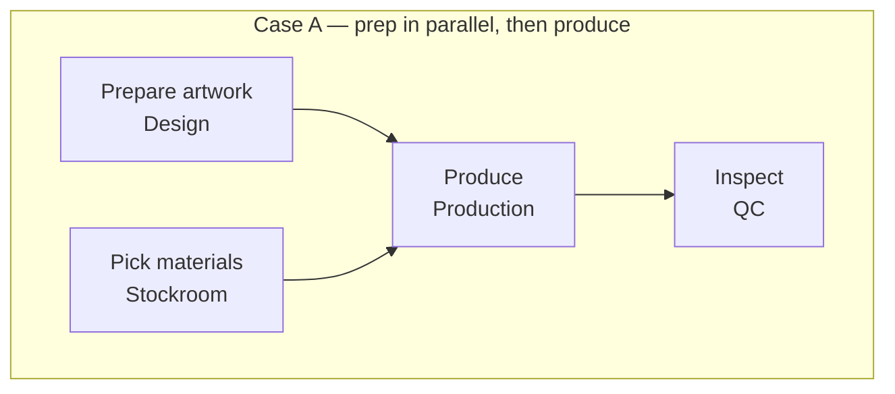
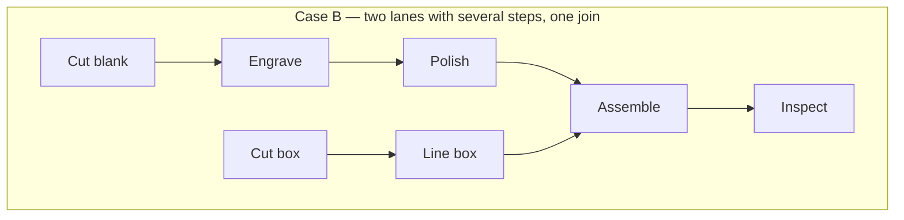
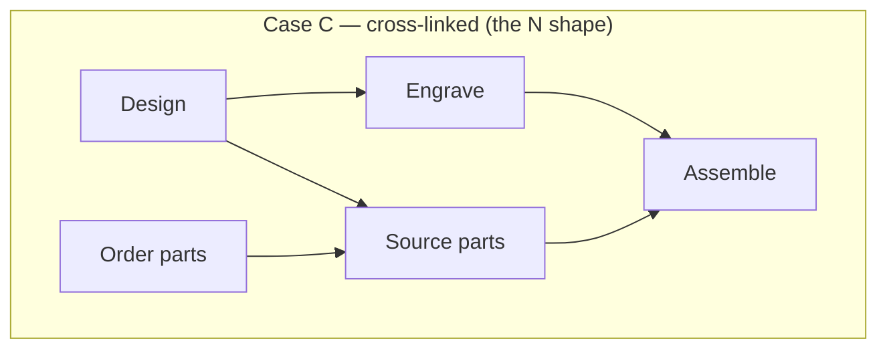
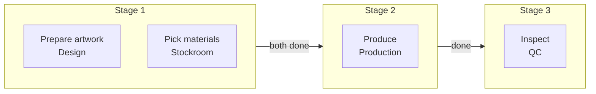
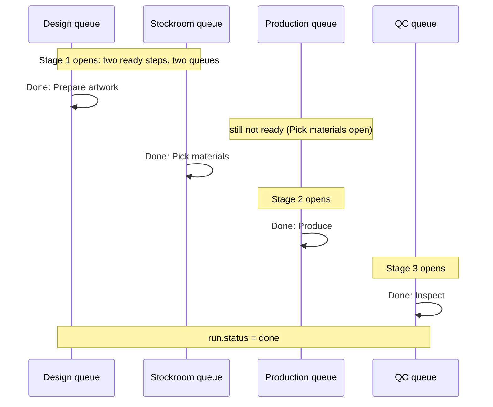
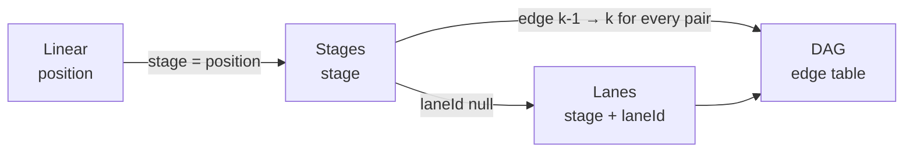
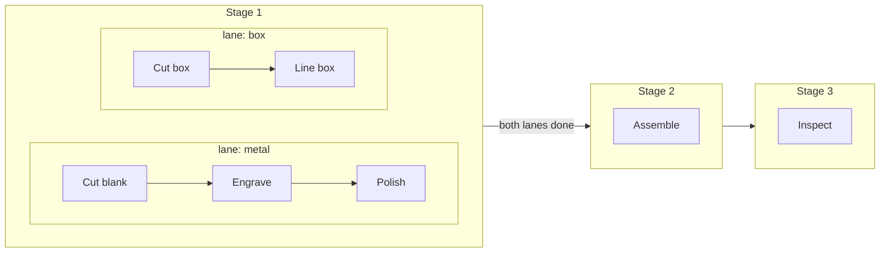

# Workflow step model — research

Research date: 2026-09-03. Research only, not a spec. Nothing here is decided; the last section lists the decisions this doc is asking for.

Scope: three questions that all land on `WorkflowStep`.

1. **Topology.** Steps run in one linear sequence today. What shape lets some steps run in parallel without becoming a graph editor: stages, lanes, a series-parallel tree, or a general DAG?
2. **Functionality.** What can a step _do_, beyond "mark complete"? Full catalog of Route to Ship's task features with a keep/adapt/defer/drop verdict on each.
3. **Boundaries.** Steps live on workflows and reference teams (Baton) versus tasks live on departments and pipelines compose departments (Route to Ship). Re-examined with the parallelism question in hand. Also: where a line-item workflow ends and whether an order-level workflow exists.

Builds on `workflow-definition-research.md` (definitions, decided), `workflow-instantiation-research.md` and `workflow-runs-spec.md` (runs, implemented in `901cc8d`), and `route-to-ship-departments-research.md` (competitor model). Live-app findings from a 2026-09-03 inspection of Route to Ship are folded into the catalog section and marked as such.

## Where Baton is today

```text
Workflow (tags)                        WorkflowRun (one per lineItem × workflow)
  └── WorkflowStep position 1..n         └── WorkflowRunStep position 1..n, completedAt, completedBy
        name, teamId                            name, teamId, teamName (snapshot)

current step  = lowest position with completedAt null          (WorkflowRunRepository.listQueue)
completeStep  = refuse unless no lower open position           (StepNotCurrentError)
run.status    = pending | active | done | cancelled, derived from steps
```

A step is exactly "a named unit of work a team marks done". No claim, no instructions, no notes, no kinds. That was the intended POC shape (`workflow-definition-research.md` → "Route to Ship features deliberately left out").

Two things about this shape matter for what follows:

- **Runs already copy their steps.** Any topology change lands twice: on the definition (editable) and on the run (frozen at creation). The run side is the one that must be stable, because it carries history and in-flight work. The definition side can evolve with the editor.
- **A line item can already have several runs at once.** Two workflows sharing a tag, or manual attach, give one line item two independent sequential runs. That is fork-with-no-join: parallel by accident, and the only "join" is that the order page shows both. Worth naming because it changes how urgent in-workflow parallelism is (see Topology → "What multiple runs already cover").

## Part 1 — Topology

### What the cases actually look like

The two motivating cases from the 2026-09-03 discussion, plus the case that usually gets named next:

```text
Case A — independent prep, then produce            Case B — parallel lanes with several steps, then join

  Prepare artwork  ─┐                                 Cut blank ─► Engrave ─► Polish ─┐
                    ├─► Produce ─► Inspect                                            ├─► Assemble ─► Inspect
  Pick materials   ─┘                                 Cut box   ─► Line box ──────────┘

Case C — fan-out / fan-in with cross-links (the "N" shape)

  Design ─┬─► Engrave ──┐
          │             ├─► Assemble
  Order   ┴─► Source ───┘
  parts

  i.e. Engrave needs Design only; Assemble needs Engrave and Source; Source needs Design and parts.
```

The same three cases as graphs. Every arrow means "cannot start until this is done".







Case A is a chain of AND-joins. Case B is two sequences running side by side with one join. Case C has an edge that crosses lanes, so no nesting of boxes can draw it; it needs real edges.

### Four candidate shapes

| Shape                         | Definition of "ready"                                           | Expresses         | Storage                                                        | Merchant-facing form                              |
| ----------------------------- | --------------------------------------------------------------- | ----------------- | -------------------------------------------------------------- | ------------------------------------------------- |
| **Linear** (today)            | all lower positions done                                        | sequence only     | `position`                                                     | numbered list                                     |
| **Stages** (parallel groups)  | all steps in lower stages done                                  | Case A            | `stage` integer; steps in the same stage run together          | numbered list where some rows share a number      |
| **Lanes** (one level of fork) | previous step in my lane done; join waits for every lane's last | Case A, Case B    | `laneId` nullable + `position` within lane + lane order        | list with an indented "side by side" block        |
| **DAG** (predecessor edges)   | every predecessor done                                          | A, B, C, anything | edge table `(stepId, dependsOnStepId)`; acyclic check on write | cannot be shown raw; needs a layered/derived view |

A fifth shape, the series-parallel tree (nested fork/join to any depth), sits between lanes and DAG. It is not listed separately because at ≤ 20 steps its only advantage over lanes is nesting depth, and nobody has produced a made-to-order example that needs depth two.

### The relational-store worry is smaller than it looks

The 2026-09-03 discussion flagged a DAG as "complex to implement in a relational database". At Baton's bounds (≤ 20 steps, `WorkflowLimits.maxSteps`) it is not:

- **Edges**: one table, `(runId, stepId, dependsOnStepId)`. Cycle detection is a DFS over ≤ 20 nodes, done in TypeScript on save, not in SQL.
- **Ready query**: `select s.* from WorkflowRunStep s where s.completedAt is null and not exists (select 1 from Dep d join WorkflowRunStep p on p.id = d.dependsOnStepId where d.stepId = s.id and p.completedAt is null)`. One `not exists`, same shape as today's "no lower open position".
- **Completion**: unchanged. `run.status` is still derived from "all steps done".

So the store is not the reason to avoid a DAG. The reasons are the editor and the merchant's mental model. A DAG cannot be presented to a no-code merchant, so the editor would restrict what edges can be drawn anyway; whatever it restricts to is the real model, and the edges are just its encoding.

### What multiple runs already cover

Because one line item can carry several runs, Case A without the join is already possible: an "Artwork" workflow and a "Materials" workflow both matching the product's tags run at once. What is missing is a step that waits for both. Two consequences:

- Urgency is lower than "sequential won't cut it" suggests. A merchant can fork today; they just cannot rejoin inside one workflow.
- Cross-workflow joins ("Produce" waits for the Artwork run and the Materials run) would be a worse design than in-workflow stages: two definitions coupled by a hidden rule, and the order page would have to explain it. Not pursued.

### Stages versus lanes: what the market shows

Route to Ship, the most complex competitor, does not have lanes. Its pipeline runs departments in order or all at once; inside a department, tasks run in order except for those sharing a Parallel Group ID (see `route-to-ship-departments-research.md` → Ordering and concurrency). Both of those are stages: "all at once" is a single stage, and a parallel group is a stage inside the department's own sequence. Nothing in Route to Ship expresses Case B, let alone Case C. Kanbanify, Maker's Production View, MakerBatch, and BenchCue have a single sequence or no sequence at all (`shopify-production-workflow-deep-dive.md` → Comparative matrix).

So stages meet or exceed the expressiveness of every shipped competitor's per-item workflow. That is the strongest available evidence for "how rich does it need to be", given that no one on the team has the domain knowledge to say from experience.

### Recommendation: stages, stored so that lanes or edges are additive later

Adopt **stages**. Concretely:

```text
WorkflowStep:     add  stage integer not null      invariant: stage values are 1..m, dense, non-decreasing with position
WorkflowRunStep:  add  stage integer not null      copied at run creation

ready(step)    = step.completedAt is null and no open step in the run has a lower stage
current steps  = all ready steps                  (plural; the queue may show two rows for one run)
completeStep   = refuse unless ready              (StepNotCurrentError keeps its meaning: "an earlier stage is still open")
run.status     = unchanged
```

Existing linear workflows are the case `stage = position`. In production that would be a lossless backfill; in the current prototype the column is simply added to `initializeSchema` and local state reset (decided 2026-09-03). A step's `position` stays the display order inside its stage and across stages.

How a run moves through stages. Each box is one step; a stage is a column; a column opens only when the column before it is fully done.



The same run over time, as the queues see it:



Stored rows for that workflow, definition side:

| position | stage | name            | team       |
| -------- | ----- | --------------- | ---------- |
| 1        | 1     | Prepare artwork | Design     |
| 2        | 1     | Pick materials  | Stockroom  |
| 3        | 2     | Produce         | Production |
| 4        | 3     | Inspect         | QC         |

Today's linear workflow is the special case where `stage = position` on every row.

Why this and not the others:

- **Not linear**: Case A is the first thing a shop with two prep teams asks for, and the multiple-runs workaround has no join.
- **Not lanes yet**: Case B has no competitor precedent and no merchant request. Lanes add a second ordering axis to the editor (which lane, where in the lane) and a second "ready" rule (join versus in-lane predecessor). If a real merchant needs Case B, lanes can be added by introducing `laneId` and treating a lane's internal order as stages that only gate that lane; existing stage rows remain valid with `laneId null`.
- **Not DAG**: the store is fine but the editor is the product. If edges are ever needed, `stage` expands mechanically to edges (every step in stage k depends on every step in stage k − 1), so nothing decided now is lost. The reverse direction, deriving stages from arbitrary edges, is lossy. Store the simplest structure that the editor can express, since it always expands upward.
- **No branching, no conditionals.** Rework ("send back to Engraving") and conditional paths are the next request after parallelism in enterprise tools. Both are branching. They are out of scope, and the stage model's `completedAt` per step keeps a future "reopen step" action possible without any topology change: reopening a step in stage 2 makes stage 3 steps not-ready again by the same rule.

### How stages relate to the other shapes



Every arrow is a lossless expansion: existing rows stay valid, new columns or tables are added. None of the arrows reverse without loss, which is why the recommendation is to store the leftmost shape the editor can express.

### Merchant-facing form

The editor stays a list. No canvas, no boxes-and-arrows. Two ways to expose stages, either works:

```text
Option 1 — "runs alongside previous" toggle on each row     Option 2 — explicit "Add a parallel step" under a step

 1  Prepare artwork      Design team                          1  Prepare artwork      Design team
 1  Pick materials       Stockroom      [x] same time as ↑        Pick materials     Stockroom          (+ parallel step)
 2  Produce              Production                          2  Produce              Production        (+ parallel step)
 3  Inspect              QC                                   3  Inspect              QC                (+ parallel step)
```

Option 1 stores one boolean per row and derives `stage`; Option 2 stores `stage` directly and renders a group. Either way the merchant sees numbered rows and learns one sentence: "steps with the same number happen at the same time; the next number waits for all of them." The run detail and the order page render the same numbers, and the queue card says "Step 1 of 3 (with: Pick materials)" so a worker knows someone else is on a sibling step.

Reorder rules for the editor, so `stage` stays dense and non-decreasing: moving a step up or down moves it within its stage or into the neighbouring stage; toggling "same time as previous" merges into or splits from the row above; removing the only step of a stage collapses that stage. All in one DO transaction, like `moveStep` today.

### Runtime consequences worth checking before a spec

- **Queue**: `listQueue` returns one row per ready step whose team is in the member's teams. A run in a two-step stage owned by two teams shows once in each team's queue. A run whose two parallel steps are owned by the _same_ team shows twice; render as one card with two checkboxes (the "consecutive same-team steps collapse" idea from `workflow-instantiation-research.md` → Route to Ship Comparison, applied to siblings).
- **`active` status**: currently "≥ 1 step done, not all". With parallel steps that is still correct. If a claim/start action is added (Part 2), `active` should also mean "≥ 1 step started".
- **Flags**: unchanged; they are run-level.
- **Order page progress**: "Step 2 of 4" becomes "Stage 2 of 3" or a per-step list. Decide in the spec.
- **Reconcile**: unaffected; it never touches steps.

## Part 2 — Step functionality

Route to Ship is the reference because it is the only competitor with a rich step model. The catalog below lists every task-level and department-level control it exposes, what problem each solves, and a verdict for Baton. Verdicts: **adopt** (v1 of this phase), **adapt** (same need, simpler mechanism), **defer** (real need, not yet), **drop** (does not fit Baton's model). Facts marked _(live 2026-09-03)_ come from the app inspection that accompanied this research; the rest from `route-to-ship-departments-research.md`.

### What the live app actually exposes on a task _(live 2026-09-03)_

Exactly five fields on a task, in both the creation wizard and the department detail dialog: order (drag handle), name, `Step Type`, `Must complete` (checked by default), and `Parallel Group ID`, which renders only when the type is `Parallel Work`. Step types, as labelled in the select: `Start/Stop Timer`, `Checklist`, `Auto Complete`, `Approval Required`, `Parallel Work`. **Nothing else**: no instructions field, no estimated time, no per-step print flag, no attachments, no approver picker. The Help page describes a configurable approver scope for approval steps; no such control renders, so that is documented-but-unshipped. Everything else a worker sees on a task comes from department-level toggles or shop-level settings.

Worker actions, from the Help "Accepting and completing tasks" page: **Accept** (claim, marks In Progress), **Done**, **Print** (when the department allows it), **Notes** (view or add step-specific notes via a menu), and **Escalate**. No Skip, Reject, Hold, or Reassign exists anywhere. Rework is one mechanism: a worker escalates (order flagged, task actions disabled), a line manager resolves by choosing a target department _and step_, and the order resumes there. Reassignment is a per-line-item pipeline selector on the order page.

### Catalog

| Route to Ship feature                                 | What it solves                                                                                                                                                                                                    | Baton verdict       | Reasoning                                                                                                                                                                                                                                                                                                                                                                                                                                                                     |
| ----------------------------------------------------- | ----------------------------------------------------------------------------------------------------------------------------------------------------------------------------------------------------------------- | ------------------- | ----------------------------------------------------------------------------------------------------------------------------------------------------------------------------------------------------------------------------------------------------------------------------------------------------------------------------------------------------------------------------------------------------------------------------------------------------------------------------- |
| **Start/Stop Timer** type: Accept then Done           | Who is on it right now, prevents two workers grabbing one item, gives elapsed time.                                                                                                                               | **adapt**           | Not a type. Every step gets an optional **Start** action (`startedAt`, `startedBy`) before Done. Done stays allowed without Start so quick steps are one tap. Timing falls out of the two timestamps for free.                                                                                                                                                                                                                                                                |
| **Checklist** type: Done with no Accept               | Quick verification steps where claiming is noise.                                                                                                                                                                 | **drop**            | Already covered by "Start is optional". Route to Ship needs the type only because its Start/Stop type makes Accept mandatory. Note: this is _not_ a list of tick-boxes inside a step; it is a one-tap step. Sub-item checklists do not exist in Route to Ship either, which softens the "are checklists useful" worry: nobody shipped them.                                                                                                                                   |
| **Auto Complete** type                                | Non-human hops ("notify next department").                                                                                                                                                                        | **drop**            | Baton has no non-human steps: no integrations, no notifications yet. A stage boundary already is the handoff. Revisit only if a notification feature wants a place to hang.                                                                                                                                                                                                                                                                                                   |
| **Approval Required** type                            | Sign-off before work moves on.                                                                                                                                                                                    | **adapt**           | A step owned by a "Managers" or "QC" team _is_ an approval gate in Baton's model; no type needed. What Route to Ship adds on top, approver scope, is not shipped in its own UI. The missing half is _reject_, which is rework (see Escalate). Defer that.                                                                                                                                                                                                                     |
| **Parallel Work** type + Parallel Group ID            | Tasks in one department that can happen at once.                                                                                                                                                                  | **adopt**           | As **stages** (Part 1). Same semantics, but a stage is a first-class property of every step instead of a type plus a free-text group id the merchant has to spell identically on each row.                                                                                                                                                                                                                                                                                    |
| **Must complete** per task                            | Optional steps that can be left undone.                                                                                                                                                                           | **defer**           | Route to Ship's semantics are muddled: the flag defaults on and the pipeline's `Require All Steps` (also defaults on) overrides it, so an optional step only exists when a merchant flips both. That is a sign the feature is rarely used. Baton alternative when needed: a **Skip** action on a ready step (`skippedAt`, reason) rather than a definition flag, so the decision is made per item by the person looking at it. Not now.                                       |
| **Require All Steps** per pipeline                    | Override every task to required.                                                                                                                                                                                  | **drop**            | Only exists to neutralise the per-task flag. Without optional steps there is nothing to override.                                                                                                                                                                                                                                                                                                                                                                             |
| **Notes** on a task (worker-entered)                  | "Left-handed engraving, customer confirmed by phone."                                                                                                                                                             | **adopt**           | `note` on `WorkflowRunStep`, latest wins; the order note stays the merchant's channel. Route to Ship caps notes at 4,000 chars and types them Manual / Escalation / Resolution; Baton needs one free-text field.                                                                                                                                                                                                                                                              |
| **Instructions** on a task                            | Standing SOP text for the step.                                                                                                                                                                                   | **adopt**           | Route to Ship does _not_ have this (verified absent), and `shopify-production-workflow-deep-dive.md` → Final synthesis flags work-instruction quality as Baton's clearest differentiation. `instructions` on `WorkflowStep`, copied to the run step. Cheap, high value, and the honest home for "checklist-ish" content as bullet text without tick state.                                                                                                                    |
| **Escalate** (worker) → **Resolve to step** (manager) | Blocked work, and rework to any earlier step.                                                                                                                                                                     | **defer**           | Two features in one. _Blocked_ is cheap: a human-set flag on the run (Baton already has `flag` set by reconcile; add a `blocked` value with a reason and who set it, cleared by dismiss). _Rewind to step_ is rework: reopening a completed step (`completedAt := null`) makes later stages not-ready again under the stage rule, so no topology change is needed, but the audit trail and who may do it are real design work. Blocked flag: candidate for v1. Rewind: later. |
| **Allow print** (department)                          | Job sheets and labels at Print, Picking, Dispatch.                                                                                                                                                                | **drop**            | Printing a run card is a UI feature on the queue and order pages, not a workflow property. Route to Ship's own help and tooltip disagree on whether print gates Done; no reason to inherit that.                                                                                                                                                                                                                                                                              |
| **Complete once per order** (department)              | Dispatch, QC, Picking work on the whole order.                                                                                                                                                                    | **defer**           | Per-order scope. See Part 3; Baton's cleaner shape is an order-level workflow, not a per-step flag.                                                                                                                                                                                                                                                                                                                                                                           |
| **Count units** (department, default on)              | Qty 5 line: worker records "3 of 5 done"; step stays queued part-finished; next step in the department cannot exceed the previous step's finished count.                                                          | **defer**           | Per-unit progress, `WorkflowRunStep.completedQuantity` hook already noted in `workflow-runs-spec.md`. Route to Ship's model is worth copying when the time comes: unit = `currentQuantity`, partial completion persists, monotonic across consecutive steps. Deferred because quantity change on an active run is already a flag, and the whole-line-marches-together decision was explicit (`workflow-instantiation-research.md` → Decisions 4).                             |
| **Confirm each unit** (department)                    | Hide the "Done, all 5" shortcut; force per-unit ticks.                                                                                                                                                            | **drop**            | A modifier of Count units. If per-unit progress ever lands, it is one boolean on top; not a separate concept.                                                                                                                                                                                                                                                                                                                                                                 |
| **Sub-departments**                                   | Same pipeline position, different people and tasks.                                                                                                                                                               | **drop**            | Exists to patch the department model (one department, one task list). Baton's steps already reference any team, so two steps in the same stage owned by different teams is the same outcome with no hierarchy.                                                                                                                                                                                                                                                                |
| **Per-line-item pipeline selector** (order page)      | Reassign a line item to another pipeline mid-flight.                                                                                                                                                              | **adopt** (already) | Baton's manual attach plus cancel covers this. Nothing new.                                                                                                                                                                                                                                                                                                                                                                                                                   |
| **Order Completion settings** (shop level)            | Whether "shipped" comes from Shopify fulfillment or from the last step; at-risk days; partial-shipping policy; which channels create work; `rts-no-production` product tag to suppress work for fee/service rows. | **defer**, but note | Not step features, yet they define where production ends. Route to Ship never writes fulfillments; "Ready to ship" means "production done, fulfil in Shopify". That is the same boundary Part 3 recommends. The `rts-no-production` escape hatch is a routing concern for `workflow-definition-research.md`, not this doc.                                                                                                                                                    |

### Two things Route to Ship does not have that the catalog suggests Baton should

- **Instructions on the definition.** Verified absent in Route to Ship. The single cheapest differentiator for a step model.
- **A blocked state that does not disable everything.** Route to Ship's escalate freezes the whole order's task actions. A per-run blocked flag with a reason, visible on the queue and order page, gives the same signal without the freeze.

### Baton's step after this phase (proposed)

```text
WorkflowStep                          WorkflowRunStep
  id, workflowId, position, stage       id, runId, position, stage
  name, teamId                          name, teamId, teamName
  instructions text null                instructions text null      (copied)
                                        startedAt, startedBy        (claim; optional action)
                                        completedAt, completedBy
                                        note text null              (worker-entered, latest wins)

WorkflowRun.flag gains a human-set value: blocked (with reason, setBy), cleared by dismiss like the reconcile flags.
```

Worker actions on a ready step: **Start** (optional: marks who is on it), **Done**, **Add note**, **Block** (run-level, with reason). Nothing else. Everything in the "defer" column can be added as a nullable column or a new action without changing this shape.

## Part 3 — Boundaries

### Corrections to `route-to-ship-departments-research.md` from the live inspection

Recorded here so the older doc can be amended rather than trusted as-is: approver scope is help text only, not a shipped control; `Require All Steps` is an override of per-task `Must complete`, both default on; a department cannot appear twice in one pipeline; `Count units` and `Confirm each unit` are fully specified by tooltips (unit = line-item quantity, partial completion persists, default on); the work-mode toggles live in a department detail dialog, not the edit wizard; print gating Done is asserted by help and contradicted by the tooltip; escalation is the rework mechanism; shop-level Order Completion settings exist. Still open: whether editing a department's tasks affects in-flight work, and how a "line manager" is identified.

### Steps on workflows versus tasks on departments, revisited

`route-to-ship-departments-research.md` already recommended keeping steps on the workflow and teams as people-only. The parallelism question was the one thing that might have tipped it, so re-check:

- Route to Ship's two concurrency axes (parallel departments, parallel task groups) exist _because_ tasks live on departments: a pipeline can only order whole departments, so a second mechanism was needed inside them. With steps on the workflow, one axis (stages) covers both. The department model creates the complexity it then needs a second feature to manage.
- The one thing the department model does better is **reuse of a station's sub-steps** across pipelines. Baton's answer, if merchants repeat the same three steps in many workflows, is a "copy steps from workflow X" action or an optional step-template library, copy-on-use. Not a team property.
- Queue ergonomics, the other department advantage, is a rendering problem: consecutive or sibling same-team steps collapse into one card.

Conclusion unchanged: **steps on workflows, teams as people.** Nothing in the stage model or the step catalog needs a department.

### Where a line-item workflow ends

A run is "one workflow applied to one line item" (`workflow-runs-spec.md` → Vocabulary). Its natural end is "this line item is made". Packing and shipping are per _order_, and Route to Ship's only per-order mechanism is `Complete once per order`, a department flag that groups all of an order's line items into one task. That flag is awkward for Baton because different line items on one order can be on different workflows, so "the step every run of the order reaches" is not well defined unless every workflow ends with an identically named per-order step.

Route to Ship's shop-level Order Completion settings _(live 2026-09-03)_ confirm the boundary from the other side: a shop chooses whether an order counts as shipped when fulfilled in Shopify or when the last production step completes, Route to Ship "never creates fulfilments", and its dashboard says "each item moves through the departments on its own". Dispatch is a department with `Complete once per order`, so packing does sit inside their pipeline, but only via that flag; the order-level rollup (`In Progress`, `Partial`) is computed, not a workflow.

Recommendation: **do not put packing or shipping steps in line-item workflows.** Merchant copy should say what a workflow is for: "the steps to make one item". Shopify already owns fulfillment; the order page already shows every run and its progress, so "all items made" is visible today without a step.

### An order-level workflow (idea from the 2026-09-03 discussion; not recommended for this phase)

The idea: one workflow that starts when every line-item run on an order is done, for whole-order QC, packing, shipping. Assessment:

- **It fits the model.** A run with `orderId` and no `lineItemId`, keyed `(orderId, workflowId)`, triggered inside reconcile when `every run on the order is done or cancelled and at least one is done`. Steps, stages, queue, and flags all work unchanged. The current unique index `(lineItemId, workflowId)` would need `lineItemId` nullable plus a partial unique index on `(orderId, workflowId) where lineItemId is null`, since SQLite treats nulls as distinct.
- **Selection is the design question.** Product tags cannot select it. Simplest: at most one order workflow per shop, on or off. Anything richer (by order tag, by shipping method) is routing work.
- **Late edits are the hard case.** A line item added after the order workflow started needs a flag (`item_added`), and the order workflow's "all made" premise is broken until the new run finishes.
- **Fulfilled-by-Shopify overlap.** A shop that ships from Shopify's fulfillment UI gets nothing from a "Ship" step; the real value is the QC and pack handoff to a specific team.

Verdict: leave a hook (`WorkflowRun.lineItemId` nullable is a one-line change; do it only when the feature is built), write nothing else now. Revisit after stages and instructions have been used by a real shop, because that is when "what happens after all items are made" becomes a concrete complaint rather than a hypothetical.

## Appendix — Lanes, if ever needed

Recorded so the expansion path is concrete. Not planned. The trigger is a real merchant whose process has a multi-step branch that stages force into lockstep (Case B), not anticipation.

### Model

A lane is a mini-sequence that lives inside one stage. The stage still opens and closes as a whole, so the join is inherited from stages rather than designed again.

```text
WorkflowStep:     + laneId text null        + lanePosition integer null
WorkflowRunStep:  same two columns, copied at run creation

ready(step) =
  step.completedAt is null
  and no open step in the run has a lower stage                         (stage rule, unchanged)
  and (step.laneId is null
       or every step with the same laneId and a lower lanePosition is done)   (lane rule)

Invariants: laneId is scoped to one stage; lanePosition is 1..k dense per lane; a lane has ≥ 2 steps
(a one-step lane is just a step). Existing rows have laneId null and are untouched.
```

Case B in this model:



| position | stage | laneId | lanePosition | name      |
| -------- | ----- | ------ | ------------ | --------- |
| 1        | 1     | metal  | 1            | Cut blank |
| 2        | 1     | metal  | 2            | Engrave   |
| 3        | 1     | metal  | 3            | Polish    |
| 4        | 1     | box    | 1            | Cut box   |
| 5        | 1     | box    | 2            | Line box  |
| 6        | 2     | null   | null         | Assemble  |
| 7        | 3     | null   | null         | Inspect   |

### Editor

The stage rows gain an indented sub-list per lane and one new action, "Turn into a branch", on a stage with two or more steps; each step in the stage becomes a lane of one, and "Add step to this branch" extends it.

```text
 1  ▸ metal branch
      Cut blank        Engraving    ↑ ↓
      Engrave          Engraving    ↑ ↓
      Polish           Finishing    ↑ ↓
      + Add step to this branch
    ▸ box branch
      Cut box          Boxes        ↑ ↓
      Line box         Boxes        ↑ ↓
      + Add step to this branch
    + Add a step that happens at the same time
 2  Assemble           Assembly
 3  Inspect            QC
```

Merchant sentence becomes two: "Steps with the same number happen at the same time. Inside a branch, steps happen in order." Reorder edge cases the editor must handle: moving a step out of a lane (lane may drop to one step and dissolve), moving a step into a lane (appends at the end), moving a whole lane between stages (not offered; remove and re-add), and a stage that mixes lanes with loose steps (allowed; loose steps are lanes of one).

### Cost relative to stages

| Piece             | Stages                      | Lanes on top                                                               |
| ----------------- | --------------------------- | -------------------------------------------------------------------------- |
| Schema            | 1 column × 2 tables         | 2 more columns × 2 tables                                                  |
| Ready rule        | one `not exists`            | second `not exists` joined by `and`                                        |
| Editor invariants | stage dense, non-decreasing | plus lane scoped to stage, lanePosition dense per lane, ≥ 2 steps per lane |
| Editor UI         | rows share a number         | indented sub-lists, branch actions, reorder within and across lane edges   |
| Queue / order UI  | "Step 2 of 3"               | "Branch metal, step 2 of 3"; run detail shows lanes as columns             |
| Tests             | two-stage fixture           | lane fixture, moves across lane edges, one-step lane dissolution           |

Roughly three to four times the work of stages, almost all in the editor and its invariants. The runtime change is small, and stage rows stay valid, so nothing built for stages is discarded.

### What lanes still cannot express

Case C (cross-links between branches). That needs edges. If it ever comes up, the expansion from stages plus lanes to an edge table is mechanical: consecutive stages produce complete bipartite edges, and a lane produces a chain. No competitor exposes anything at that level, and the editor for it does not exist in the no-code space.

## Decisions (2026-09-03, mw)

1. **Topology: stages.** `stage integer not null` on `WorkflowStep` and `WorkflowRunStep`. No migration and no backfill: the app is a prototype, so the column is added to `initializeSchema` and local DO state is reset. Lanes and edges deferred; see the appendix for the lanes expansion path.
2. **Editor form: Option 2.** An explicit "Add a step that happens at the same time" action under each stage; the merchant states intent once. No per-row toggle.
3. **Step functionality v1**: `instructions` on the definition, copied to the run step; **Start** (claim: `startedAt`, `startedBy`), **Done**, worker **note**, and a run-level **blocked** flag with reason, cleared by dismiss. Everything else per the catalog's defer/drop verdicts.
4. **Optional steps: not now.** Route to Ship's double default-on design shows the feature is rarely reached. A shop that sometimes skips a step makes a second workflow or leaves the step out. If ever needed, the form is a per-item Skip action on a ready step, not a definition flag.
5. **Approval: no feature, no manager role.** Teams stay without managers. "Someone else looks before it moves on" is a normal step owned by a QC or Inspection team, which already works. Reject-and-send-back is rework and stays deferred. The catalog's "adapt" verdict on Approval therefore means zero code.
6. **Line-item workflows end at "made".** No pack or ship steps. The order-level workflow is parked; do not add the `lineItemId` nullable hook until the feature is built.
7. **Steps on workflows, teams as people.** Reaffirmed.

## Next

A `workflow-stages-spec.md` covering the schema change in `initializeSchema`, `stage` invariants in `WorkflowRepository` (`addStep`, `moveStep`, `removeStep`, new `setStepParallel`), the ready rule in `WorkflowRunRepository.listQueue` and `completeStep`, `startStep` and `setStepNote`, `instructions` on both tables, editor changes in `app.workflows.$workflowId.tsx`, queue card changes in `shop.$shop.queue.tsx`, and the reconcile-matrix tests extended with a two-stage fixture.
