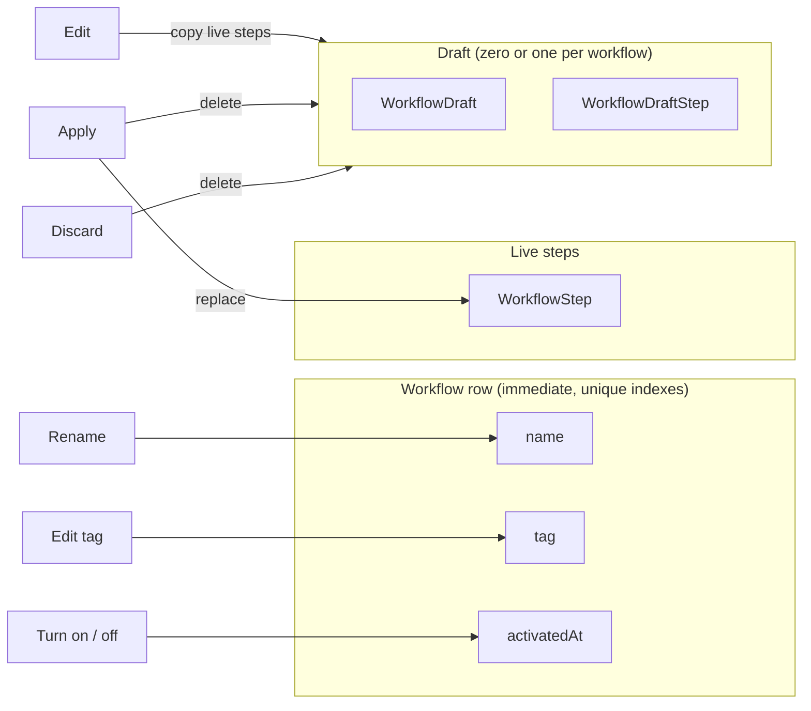

# The workflow tag as identity: one, required, unique

Status 2026-09-16: **implemented.** Research date: 2026-09-16. Scope: what a workflow's
tag is for, what rules it should carry, and how those rules land on create, duplicate,
edit, turn on, and cutover. Builds on
[workflow tags: concept, UX, and implementation spec](./workflow-tags-concept-and-ux-research.md)
(naming and placement) and
[how many workflows can one line item run](./workflow-per-item-cardinality-research.md)
(one run per item). Where this doc disagrees with either, this doc wins.

Revised twice the same day after review. The first draft kept uniqueness among active
workflows only, to preserve a "duplicate with the same tag, then swap" cutover; review
pointed out the silent gap and the jarring refusal at Turn on. The second draft moved to
uniqueness among all workflows but left the tag inside the draft; review asked how
drafts are stored and why Apply needed a race guard. Laying out the storage answered
it: the tag belongs on the workflow row, next to the name, and not in the draft at all.

## Conclusion

1. **The tag is the workflow's key, not a label.** It is the one string a product can
   carry that names a workflow. Structurally a handle: exactly one per workflow, present
   from birth, unique across the shop. Call it **Tag** in copy and nothing else.
2. **Exactly one tag, required at all times.** Replace the `tags` array with a single
   `tag`. Create asks for it and refuses blank. Every "no tag yet" branch in the UI and
   in the engine goes away because the state cannot exist.
3. **Unique among all workflows, on and off, enforced by one unique index** on
   `Workflow.tag`, the same as the name already has. The collision surfaces only where
   the merchant typed the tag: Create, Duplicate, and Edit tag. Turn on and Apply never
   mention tags.
4. **The tag lives on the workflow row, not in the draft.** It is edited like the name:
   immediately, from the detail page, in its own dialog. The draft is for steps. This
   removes the draft's tag column, the Apply-time tag check, and the race between saving
   a draft and applying it.
5. **Duplicate asks for a name and a tag**, prefilled, in a dialog, like Create. Shopify
   Flow's Duplicate asks for a name too. Keep Duplicate; it is "start a similar
   workflow", not "make a second version of this one".
6. **Versioning is the draft, not a second workflow.** Editing steps in place with Apply
   is atomic, runs in flight are unaffected, and there is no window. That is the cutover
   path, and it is the one the app already has.
7. **Changing which workflow a product goes to is a product edit.** Both workflows on,
   each with its own tag, retag the products. No gap: every order matches whichever tag
   the product carries at the time.
8. **Product-side ambiguity stays a merchant decision.** Two different workflows' tags on
   one product is invisible to Baton until an order arrives, and `multiple_workflows` /
   _Choose a workflow_ already handles it.

## How workflows and drafts are stored

Written against the future state (one `tag` column) so the rules can be read off the
schema. The differences from today are noted at the end of the section.

A workflow is **one row** in `Workflow`. That row is the envelope: it carries the
identity (`id`, `name`, `tag`) and the switch (`activatedAt`). Its steps are rows in
`WorkflowStep` keyed by `workflowId`. There is no draft flag and no second workflow row.

A draft is **one child row** in `WorkflowDraft` whose primary key is the parent's
`workflowId`, so a workflow has zero or one draft, never two. The draft's steps are rows
in `WorkflowDraftStep`. Edit creates the draft as a copy of the live steps; every change
in the editor writes to the draft rows; Apply copies the draft steps over the live steps
and deletes the draft; Discard deletes the draft. The live steps are never touched
between Apply calls, which is how an order arriving mid-edit sees a whole definition.

```sql
create table if not exists Workflow (
  id text primary key,
  name text not null check (name = trim(name) and length(name) > 0),
  tag text not null unique check (tag = trim(tag) and length(tag) > 0),
  activatedAt integer,
  createdAt integer not null,
  updatedAt integer not null
);
create unique index if not exists Workflow_name_uidx on Workflow (name collate nocase);

create table if not exists WorkflowStep (
  id text primary key,
  workflowId text not null references Workflow (id) on delete cascade,
  position integer not null,
  stage integer not null,
  name text not null,
  teamId text,
  instructions text,
  unique (workflowId, position)
);

create table if not exists WorkflowDraft (
  workflowId text primary key references Workflow (id) on delete cascade,
  createdAt integer not null,
  updatedAt integer not null
);

create table if not exists WorkflowDraftStep (
  id text primary key,
  workflowId text not null references WorkflowDraft (workflowId) on delete cascade,
  position integer not null,
  stage integer not null,
  name text not null,
  teamId text,
  instructions text,
  unique (workflowId, position)
);
```

`tag` has no `collate nocase` because `Domain.WorkflowTag` folds to lowercase at the
schema boundary, so the stored value is already canonical and plain equality is the
comparison everywhere, including `matchesLineItem`.

```mermaid
erDiagram
  Workflow ||--o{ WorkflowStep : "live steps"
  Workflow ||--o| WorkflowDraft : "at most one"
  WorkflowDraft ||--o{ WorkflowDraftStep : "draft steps"
  Workflow ||--o{ WorkflowRun : "starts"

  Workflow {
    text id PK
    text name "unique, nocase"
    text tag "unique, folded"
    integer activatedAt "null = Off"
  }
  WorkflowDraft {
    text workflowId PK_FK
  }
  WorkflowStep {
    text workflowId FK
    integer position
    integer stage
    text teamId
  }
  WorkflowDraftStep {
    text workflowId FK
    integer position
    integer stage
    text teamId
  }
  WorkflowRun {
    text lineItemId
    text workflowId FK
    text status
  }
```

What each verb touches:



Runs copy the workflow's name and steps at start (`WorkflowRun`, `WorkflowRunStep`)
and never read the workflow again, which is why Rename and Edit tag can be immediate
without disturbing work in flight.

**Differences from today.** `Workflow.tags` is a JSON array column and `WorkflowDraft`
has its own `tags` column; Apply copies the draft's array onto the workflow alongside
the steps. The draft therefore carries a second copy of the tag, and uniqueness has to
be checked at Apply because a draft can hold a tag that collides with another workflow
until the moment it is published. That is the race the second draft of this doc was
guarding: save a draft with tag `rush` (free at the time), someone creates a workflow
with tag `rush` (the draft table has no index, so Create succeeds), Apply fails. Moving
the tag out of the draft removes the second copy and the race with it.

### Two schema questions from review

**Column `unique` or a named index.** Either produces the same enforcement and the
same error text (`UNIQUE constraint failed: Workflow.tag`). A named index is needed
only when the constraint cannot be expressed on the column: a collation the column does
not have (`Workflow_name_uidx` uses `collate nocase`) or a partial predicate
(`WorkflowRun_live_item_uidx` has a `where`). The tag is stored folded and has no
predicate, so `tag text not null unique check (...)` on the column is the plainer
form and is what the DDL above should say. Keep the name's index as it is.

The question that matters more is detection. Today `insert or ignore ... returning`
yielding no row is the whole `NameTaken` check (`src/lib/WorkflowRepository.ts:1111`).
With two unique columns that pattern cannot say which one collided, and the message has
to. Two ways out: parse the constraint error for the column name, or select for each
collision before inserting. Recommend the select, and the owner agreed on review: two selects
inside the transaction are fine. The repository runs inside a Durable Object where
SQLite calls are synchronous and fast, so with no async work between the selects and
the write nothing can interleave, and the code reads as the two questions it asks: is
the name free, is the tag free. Nothing in the codebase parses SQLite error text today
and this is not a reason to start.

Implementation order of work is in
[`docs/workflow-tag-identity-implementation-plan.md`](./workflow-tag-identity-implementation-plan.md).

**Is `updatedAt` baggage.** Two different columns share the name:

- `ShopOrder.updatedAt` is Shopify's timestamp and is load-bearing: the upsert guard
  `where excluded.updatedAt >= ShopOrder.updatedAt` is what lets webhook, bulk, and
  manual sync interleave safely (`src/lib/OrderRepository.ts:413`). Keep.
- `Workflow`, `WorkflowDraft`, and `WorkflowRun` each have an `updatedAt` that Baton
  writes on every mutation and reads in exactly two places: the "Last updated on" line
  on the workflow detail page and the Updated column on the workflows index. Nothing
  orders by it, nothing guards on it, and `WorkflowRun.updatedAt` is never read at all.

Recommendation: keep `Workflow.updatedAt`, since it is displayed and the display is
worth having, and drop `WorkflowDraft.updatedAt` and `WorkflowRun.updatedAt`, which are
written in a dozen places for no reader. Not part of the tag change; a separate small
cleanup. If the Updated column ever goes from the index, `Workflow.updatedAt` goes with
it.

### Why the tag is envelope state, not draft state

The draft exists so that steps, which are edited over many interactions, land as one
unit. The tag is one field, edited in one dialog, in one write. Nothing about it needs
staging. The earlier argument for drafting it was that an order arriving between a tag
change and a step change could match the new tag and run the old steps. Two answers:

- The tag decides **which products**; steps decide **what happens**. A merchant
  changing the tag alone is re-pointing the workflow at a different product set and
  expects the current steps. A merchant who wants new steps to coincide with a new
  product set applies the steps first, then edits the tag. Both are what the immediate
  model does.
- The name is already envelope state and immediate, with the same "runs snapshot it"
  reasoning (`src/lib/WorkflowRepository.ts:269`). The tag is the name's sibling.

Uniqueness follows for free. One unique index on the row, one write path, one place a
collision can be reported: under the field the merchant is typing in.

## Why the current state is muddy

The confusion has one root: the app stores a set, shows a set, and names it after
Shopify's product tags, while the concept it needs is a single key. Every downstream
oddity follows from that mismatch.

- `Workflow.tags` is a JSON array capped at 20 (`src/lib/Domain.ts:399`,
  `:483-498`). The tag dialog has a primary single-field state and an expandable list
  state (`src/components/WorkflowTag.tsx`). The index cell renders `first +N`. Three
  surfaces each carry the escape hatch the concept doc kept "for renames and merges",
  and the escape hatch is what makes the concept look like a set.
- Nothing requires a tag. Create accepts a blank field and stores `[]`
  (`src/routes/app.workflows.index.tsx:144`). Turn on checks steps and team assignment
  but not the tag, so a tagless workflow can be Active and inert. The detail page and
  the trigger line each carry a copy string for "no tag, nothing reaches this"
  (`src/routes/app.workflows.$workflowId.tsx:59-60`). That is a state the product has
  to explain instead of prevent.
- Duplicate empties the tag on purpose (`src/lib/WorkflowRepository.ts:250-257`). The
  result is a workflow with a name, steps, and a hole where its identity should be.
- Uniqueness exists only among active workflows, checked at Apply and Turn on
  (`requireTagsFree`, `src/lib/WorkflowRepository.ts:865-897`). The check is late: the
  merchant typed the tag at Create or in the dialog and hears about the collision when
  flipping a switch, possibly days later, in a dialog about something else.
- The tag is drafted. It rides along with the steps through Apply, so it has two
  storage locations and a race between them (see the storage section).

One correction to the framing in the request: workflow names are already unique
(`Workflow_name_uidx collate nocase`), and Create returns `NameTaken`. So the workflow
already has two unique strings, and the tag should get the same treatment. They serve
different readers: the name is for people looking at Baton, the tag is for products in
Shopify. A rename must not retag the catalogue, so they cannot be one field. Prefilling
the tag from the name at create is how the merchant pays for the second key only once.

## The concept, from the merchant's side

What a merchant has to learn, in full:

> Each workflow has a tag. Put that tag on the products it should build.

Two nouns they already know, one relationship. No handle, no slug, no routing, no
trigger. The word "tag" is borrowed from Shopify deliberately because the second half of
the sentence happens in the Shopify product admin, in a field labelled Tags. Baton names
the string, the merchant carries it across.

The rules then read as consequences rather than constraints:

| Rule                             | How it reads to a merchant                                                             |
| -------------------------------- | -------------------------------------------------------------------------------------- |
| One tag per workflow             | "The tag for Engraving is `engraving`." Nobody expects a thing to have two names.      |
| Tag is required                  | A workflow without a tag cannot build anything, so the form does not let you make one. |
| Tag is unique                    | "`engraving` is already Engraving's tag." Same as the name, at the same moment.        |
| A product with two workflow tags | "Two workflows match this item. Choose one." Shipped as `multiple_workflows`.          |

What the merchant does **not** have to learn: that the tag is an array, that there is a
cap of 20, that a blank tag is valid but useless, that off workflows are allowed to
share a tag until one is turned on, that Turn on can fail for a reason unrelated to the
switch, or that a tag change waits for Apply.

Tag characters: whatever Shopify allows in a product tag. The fold is trim plus
lowercase and the limit is Shopify's 255. No slug rules of Baton's own.

### Why one, and not "one by default, many allowed"

The concept doc kept the array for three transitional cases: renaming a tag across the
catalogue, merging two product families onto one line, inheriting a vocabulary from a
previous app. Revisited:

- **Rename across the catalogue.** Change the tag in Baton and change it on the
  products in Shopify. Two systems, two edits, so an order placed between them can miss
  and shows as _No workflow_. Only a workflow carrying two tags at once avoids that, it
  is the same today under every option, and nobody renames a working tag.
- **Merge two families.** Retag the second family to the first's tag. Same shape.
- **Inherited vocabulary.** A shop adopting Baton is not arriving with a routing
  vocabulary. If one does, the merge path applies.

The array was a hedge and the hedge is the confusion.

### The draft is the versioning mechanism

This is the finding that decides the uniqueness scope. The first draft of this doc kept
uniqueness among active workflows so that a merchant could Duplicate a running workflow,
build v2 with the same tag while v1 kept running, then Turn v1 off and Turn v2 on. Three
things are wrong with that path:

- **The gap is real and silent.** Between the two clicks, orders match nothing. They are
  badged _No workflow_ on the index, and Turn on's reconcile picks them up if the
  coverage date covers them, but the merchant has to know both facts.
- **The refusal is jarring.** Turn v2 on before v1 is off and the switch says
  _"`engraving` already starts Engraving. Turn Engraving off first."_ The merchant is
  operating a switch and gets a lecture about a string they typed last week.
- **The app already has a better answer.** A draft is a private copy of the workflow's
  steps, edited over any span of time while the live definition keeps starting runs.
  Apply swaps the steps in one transaction. Runs in flight copied their steps at start
  and never look back. There is no window, no second workflow, no tag to juggle. That is
  exactly "develop v2 alongside v1 and cut over", and it is one Edit and one Apply.

With the draft doing versioning, the only thing "duplicate with the same tag" was buying
is gone. Every other thing a merchant does with a copy needs a different tag anyway.

## Each lifecycle moment

### Create

Name and Tag, side by side, tag prefilled from the name and editable. Both required. A
blank tag disables Create the same way a blank name does. `TagTaken` renders under the
tag field the way `NameTaken` renders under the name field. The insert hits both unique
indexes; the repository maps each constraint to its error.

### Duplicate

A dialog, not a one-click action, matching Shopify Flow's Duplicate, which asks for a
name (`refs/flow-manual/manage/manage.md:53-75`). Fields: Name, prefilled from
`copyName`; Tag, prefilled from the folded new name, so "Engraving copy" offers
`engraving copy`. Both editable, both required, both checked by the same insert. Steps
and stages are copied. The copy is off with no draft, as now.

This changes what Duplicate is for. It is not "make a second version of Engraving" (that
is Edit). It is "start Engraving Rush from Engraving's steps". The merchant already
knows the new workflow is a different thing, so asking for its name and tag is not a
burden, and there is no empty tag to discover later.

Keep Duplicate. It is one dialog, and the alternative for a similar workflow is retyping
every step.

### Edit the tag

On the detail page, next to Rename, a dialog with one field. Save writes `Workflow.tag`
immediately; the unique index reports `TagTaken` under the field. No draft is created,
the editor is not involved, and the `?tag=edit` deep link into the editor goes away.
The trigger card keeps the chip and the trigger line, and its button opens this dialog
rather than navigating.

Off or on makes no difference to the write. On an active workflow the next order to
arrive matches the new tag against the current steps, which is the re-pointing the
merchant asked for.

### Turn on

Checks: steps present, every step's team resolves. Nothing about tags. The Turn on
dialog's waiting-order count already tells the merchant whether the tag has caught
anything.

### Apply

Steps only. `ApplyResult.TagTaken` goes, along with `requireTagsFree`.

### Changing a workflow's definition

Edit, change steps, Apply. Runs in flight keep their copied steps. No gap. This is the
common case and the only versioning story the merchant needs.

### Moving products to a different workflow

Both workflows on, each with its own tag. Retag the products in Shopify. Each order
matches whichever tag the product carries when the order is placed, so there is no gap
and no ordering to get right. When the old workflow has no products left, Turn it off or
delete it.

How bad is the retag for a shop with many products per workflow? Shopify's bulk editor
and Flow both change tags across a product set in one operation, and the merchant put
the tags there the same way. For the segment, a workflow covers a product family, not a
long tail. This is also the only path that was ever available for "these products should
now go somewhere else", because Baton cannot write product tags (`read_products` only).

### A product carrying two workflow tags

Unpreventable and already handled. Baton never reads a product's tags outside an order,
so the collision is seen at reconcile and surfaces as `multiple_workflows` / _Choose a
workflow_. With one tag per workflow the message can name the tags precisely: _"This
item is tagged `engraving` and `rush`, and each starts a workflow. Choose one."_

## The alternative Baton is not taking: a product metafield

The request assumes Shopify offers no way to put a single-valued property on a product.
It does. An app-owned product metafield definition
(`refs/shopify-docs/docs/apps/build/metafields.md`) would give each product one
`workflow` value, shown on the product page, with no possibility of two values and no
collision with merchandising tags. A metaobject reference could render as a dropdown of
Baton workflows in the product admin.

Not recommended now:

- App-owned metafields are view-only in the admin by default; letting merchants set them
  from the product page needs either a merchant-owned definition (which any app can then
  write) or an admin UI extension on the product page. Both are new surfaces.
- Tags are what the segment already uses to sort products, what the bulk editor and Flow
  set trivially, and what Route to Ship trained the market on.
- `OrderSync` already fetches product tags by GraphQL (`src/lib/OrderSync.ts:163`), so
  the engine cost would be low. The cost is entirely merchant-facing.
- The one thing it would buy, preventing the two-tag product, is already handled as a
  visible decision.

Worth revisiting if merchants report the two-tag collision as a recurring problem, or if
Baton ships a product-page admin extension for another reason.

## Trade-offs, side by side

| Concern                           | Today: array, optional, drafted, unique among active     | Unique among all, drafted     | Recommended: unique among all, on the row |
| --------------------------------- | -------------------------------------------------------- | ----------------------------- | ----------------------------------------- |
| New concepts for the merchant     | Tag set, cap of 20, empty tag state, tag waits for Apply | Tag, tag waits for Apply      | Tag                                       |
| Tagless workflow can exist        | Yes, and can be on                                       | No                            | No                                        |
| Where a collision is reported     | Apply, Turn on                                           | The field, and again at Apply | The field                                 |
| Turn on can refuse on a tag       | Yes                                                      | No                            | No                                        |
| Apply can refuse on a tag         | Yes                                                      | Yes (race)                    | No                                        |
| Copies of the tag in storage      | Two (row and draft)                                      | Two                           | One                                       |
| Duplicate                         | Copy has no tag                                          | Dialog: name and tag          | Dialog: name and tag                      |
| Versioning a running workflow     | Draft                                                    | Draft                         | Draft                                     |
| Moving products between workflows | Retag products                                           | Retag products                | Retag products                            |
| Enforcement                       | Application, two call sites                              | Index plus a draft pre-check  | One unique index                          |

## Recommendation

Adopt the right-hand column. The invariant, in one sentence for the `Domain.ts`
vocabulary block: **every workflow has exactly one tag, no two workflows share one, and
the tag is edited like the name: immediately, never through the draft.**

What changes, at the level of an implementation plan's table of contents. Schema
changes are inline in the `ShopAgent` SQLite DDL, not a migration, since databases are
reset during prototyping.

1. `Domain.WorkflowTag` stays. `WorkflowTags` and `WorkflowLimits.maxTags` go.
   `Workflow`, `CreateWorkflowInput`, the list row, and the seed input carry
   `tag: WorkflowTag`. `WorkflowDraft` loses its tag entirely.
   `UpdateWorkflowTagsInput` becomes `UpdateWorkflowTagInput { workflowId, tag }` on the
   workflow, the sibling of the rename input. `OrderLineItem.productTags` is untouched;
   it really is a list.
2. DDL as in the storage section: `Workflow.tag text not null unique`; `WorkflowDraft`
   drops `tags`. Create, Duplicate, and Edit tag select for a taken name and a taken tag
   inside the transaction before writing, so each refusal names the right field.
3. `ActivateResult.TagTaken`, `ApplyResult.TagTaken`, and `requireTagsFree` go. Create,
   Duplicate, and the new `updateWorkflowTag` return `TagTaken` from the pre-select.
   Apply copies steps only.
4. `matchesLineItem` tests `productTags.includes(tag)`. Reconcile grouping and
   `multiple_workflows` are unchanged; the ambiguity message names the two tags.
5. Create dialog: tag required, prefill kept, blank disables Create, `TagTaken` under
   the field.
6. Duplicate becomes a dialog with Name and Tag, both prefilled, both required. The
   `duplicateWorkflow` input takes `name` and `tag`; `copyName` becomes the client
   prefill.
7. `WorkflowTag` component moves from the editor to the detail page, beside Rename, as a
   one-field immediate dialog. Remove `expanded`, `selection`, the add form, the chip
   list, the Enter listener, `defaultOpen`, and the editor's `?tag=edit` search param.
   The editor's tag card goes; the editor is about steps.
8. Detail page and `itemTriggerLine`: remove the empty branches. Index cell: one badge.
9. `tagTakenMessage` becomes _"`engraving` is already Engraving's tag."_
10. Tests: integration tests naming `WorkflowTags`, a test that Turn on and Apply ignore
    tags, tests that Create, Duplicate, and Edit tag refuse a taken tag,
    `e2e/fixture.ts` (already one tag each), `e2e/workflows.spec.ts` assertions on the
    add-tag textbox, the editor's tag card, and the Duplicate click.

## Decisions from implementation

Where the build departed from the plan in
`docs/workflow-tag-identity-implementation-plan.md`, and why. Nothing here changes the
Conclusion above.

- **`copyName` moved to `src/lib/workflowShared.ts`.** The Duplicate dialog needs it for
  its prefill, and importing it from `WorkflowRepository` would drag the Effect SQL
  layer into the client bundle. `MAX_NAME_LENGTH` went with it; the repository no longer
  mints copy names at all, since the merchant does.
- **Duplicate is on the detail page only.** The editor runs inside an `s-app-window`
  where a second modal is awkward, so its More actions menu lost Duplicate rather than
  growing a dialog.
- **A duplicate tag in a seed fixture is refused by name.** `replaceWorkflows` checks the
  fixture set before it writes, so a bad fixture fails as a `WorkflowRepositoryError`
  naming the workflow and the tag rather than as a bare unique-constraint `SqlError`.
- **The Duplicate dialog's name → tag mirror is four lines in the detail page**, not a
  shared hook: the two dialogs differ in where their state lives, and a hook over three
  `useState`s was more indirection than the duplication it removed.
- **The ambiguity sentence names the tags**, as the research doc promised:
  `Two workflows match this item: Engraving (“engraving”) and Rush
(“rush”). Choose one.` The order page already has the full `Workflow` rows,
  so no extra data was needed.
- **`useWorkflowEditorWindow.open` lost its `search` parameter.** Its only caller passing
  one was the `?tag=edit` deep link, which is gone.
- **`workflowResultMessage` gained `TagTaken`**, so Create, Duplicate, Rename, and Edit
  tag all share one message table; the pages route on `_tag` to pick the field.
- **Edit tag on an on workflow reconciles stored orders and publishes.** Found in
  review: the plan made `updateWorkflowTag` a bare write like Rename, but a tag change
  alters _how_ the workflow matches, which is the rule `ShopAgent.reconcileAllIfActive`
  states for Apply and the coverage date. Without it, a paid, unfulfilled order already
  in Baton whose product carries the new tag would wait for Shopify's next edit of that
  order. The callable now reconciles once and publishes, exactly as Apply does.

## Staleness to watch

- `docs/workflow-tags-concept-and-ux-research.md`: "Design the UI for one tag, keeping
  the array as an escape hatch", the expanded dialog state, `+N` on the index, "optional
  (a blank tag must not block Create)", and the whole placement argument that put tag
  editing in the editor behind the draft are superseded here. Its save-model reasoning
  ("a dialog writing straight through would re-route a live workflow mid-flight") is
  answered in the storage section.
- `docs/workflow-per-item-cardinality-research.md`: "one active workflow per tag,
  refused at Apply and Turn on", the off-workflow exemption, the case walk under
  "Definition side: refuse a shared tag", and the Duplicate paragraph under "The
  mechanics" are superseded by uniqueness among all workflows. The cap of one per line
  item and `multiple_workflows` stand.
- `src/lib/Domain.ts:564-570` states that `tags` and steps change only through Apply;
  reversed here for the tag.
- `src/lib/WorkflowRepository.ts:250-257` JSDoc argues for dropping tags on duplicate;
  reversed here.
- `src/lib/Domain.ts:898-904` JSDoc on `TagTaken` describes the active-only rule;
  reversed here.
